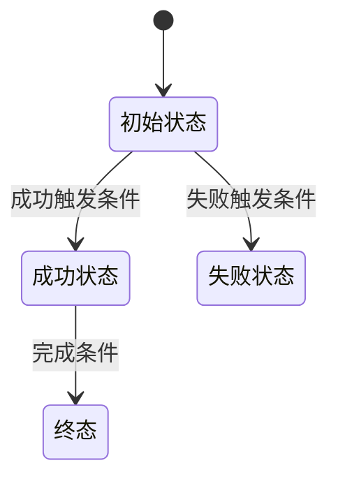

# 需求分析待澄清项测试视角重设计规范

## 背景

当前需求分析的“待澄清”输出容易退化成质量缺口问句：质量评估阶段发现缺口，澄清阶段把缺口包装成“请确认某功能的验收标准”或“缺少某类需求，需要定义什么指标”。这类问题通常没有说明具体不可测点，也没有告诉用户如果不确认会影响哪些接口、状态、数据、权限、异常路径或验收结论。

典型无效输出：

```text
请确认“某功能”的验收标准。
影响：验收标准不明确会影响测试设计、验收结论和交付范围判断。
```

这类输出的问题是：

- 没有指出具体不可测点。
- 没有绑定触发场景。
- 没有给出需要人类裁决的单一决策。
- 没有说明确认后应生成哪些验收用例。
- 容易把通用测试建议伪装成需求澄清。

本次重设计要把“待澄清”从“质量问题清单”升级为“测试裁决清单”。

## 目标

- 让待澄清项从测试、验收、接口契约、状态流转、数据一致性、权限边界、异常处理或上线风险出发。
- 每个待澄清项必须说明：当前如果按已有需求实现，会在哪里测不出来、测不过或无法下结论。
- 人类只需要回答具体裁决，不需要阅读泛泛开放问题。
- 澄清结果可以直接驱动验收用例、风险路径、状态流转和回归范围生成。
- 规范适用于任意业务项目，包括但不限于登录认证、交易支付、审批流、订单履约、内容发布、报表导出、配置管理、数据同步、消息通知、权限管理。

## 非目标

- 不重做需求上传、主需求选择、文档标准化或任务生命周期。
- 不改造前端整体 Tab 布局。
- 不引入新的数据库表。
- 不让后端基于业务经验编造最终答案。
- 不把通用安全、性能、兼容性清单机械套到所有需求。
- 不为某个具体业务域写死规则。

## 当前形态

当前链路：

```text
understand_node
  -> quality_node
  -> clarify_node
  -> enhance_node
```

关键代码边界：

- `apps/backend/app/agents/requirement_analysis/agent.py`
  - `QUALITY_ASSESSMENT_SYSTEM_PROMPT` 负责质量评估规则。
- `apps/backend/app/agents/requirement_analysis/nodes/clarify_node.py`
  - `_extract_questions_from_quality()` 把质量问题转成候选问题。
  - `_is_useful_clarification_question()` 做基础准入过滤。
  - `_create_clarification_item()` 生成 `ClarificationItem`。
- `apps/backend/app/agents/requirement_analysis/schemas.py`
  - `ClarificationItem` 当前字段主要是 `question / impact / severity / current_text / suggested_fix / recommended_options / evidence / resolution_status`。
- `apps/backend/app/agents/requirement_analysis/utils/report_generator.py`
  - `_generate_clarification_items()` 展示澄清项。

当前不足：

- `ClarificationItem` 不能表达风险路径和验收用例草案。
- `question` 仍可能是泛泛问题，而不是单一业务裁决。
- `impact` 过于抽象，无法指导测试设计。
- `recommended_options` 最多两个，但没有区分“可选裁决”和“建议修正文案”。
- 报告没有按阻塞项、风险项、验收项分层。
- 知识库 testing 产物容易退化为模块清单或占位文本。

## 设计原则

待澄清项不是“还有哪些需求要补”，而是“哪些业务裁决不确定会阻塞测试和验收”。

每个待澄清项必须同时满足：

1. 有主需求原文、模块事实、接口描述、流程描述、字段描述或规则描述作为来源。
2. 能被人直接回答或裁决。
3. 不回答会影响设计、开发、测试用例、接口契约、状态处理、权限边界、数据一致性、异常处理、验收结论或上线风险判断。
4. 至少包含一个具体触发场景。
5. 至少包含一个确认后可生成的验收用例草案。
6. 不使用“缺少某类需求，需要定义什么指标”这类模板问题。
7. 不基于通用经验生成最终答案；只能给推荐判断和理由，等待人类确认。

## 通用测试裁决维度

质量评估和澄清生成应优先从以下通用维度发现问题。不同业务只命中相关维度，不允许机械全量生成。

### 接口契约

适用场景：

- 需求出现接口、按钮动作、表单提交、文件上传、导入导出、第三方回调、异步任务、消息消费。

应检查：

- 输入字段是否必填、类型、格式、长度、枚举、默认值明确。
- 成功响应、失败响应、错误码、错误提示是否明确。
- 幂等规则是否明确。
- 重试、超时、取消、回滚行为是否明确。
- 请求与响应是否能被测试断言。

### 状态流转

适用场景：

- 需求出现订单、工单、审批、发布、任务、账号、文件、支付、发票、库存、通知、同步等有生命周期对象。

应检查：

- 初始状态、终态、失败态、取消态是否明确。
- 状态转换触发条件是否明确。
- 非法转换如何处理。
- 回退、重试、撤销、超时、人工干预是否明确。
- 状态变更是否有可观察结果。

### 数据一致性

适用场景：

- 需求出现创建、更新、删除、绑定、映射、迁移、同步、批处理、汇总、库存扣减、余额变化、权限分配。

应检查：

- 唯一性、关联关系、一对多/多对一关系是否明确。
- 重复提交或并发提交如何处理。
- 部分成功、部分失败如何处理。
- 数据回滚、补偿、重算、对账规则是否明确。
- 历史数据和新数据规则是否一致。

### 权限与安全

适用场景：

- 需求出现角色、组织、租户、登录、认证、授权、隐私数据、敏感操作、外部系统、下载导出、审计。

应检查：

- 谁能看、谁能改、谁能删除、谁能审批是否明确。
- 越权、跨租户、未登录、会话过期如何处理。
- 敏感字段展示、传输、存储、日志脱敏是否明确。
- 安全失败路径是否有可断言结果。

### 异常路径

适用场景：

- 任意用户操作、接口调用、异步任务、外部依赖、文件处理、支付或消息处理。

应检查：

- 输入非法、对象不存在、状态不允许、依赖失败、网络超时、重复操作、资源不足如何处理。
- 用户可见提示、系统错误码、日志、告警是否明确。
- 失败后系统状态是否明确。

### 非功能需求

适用场景：

- 原文存在响应时间、并发、吞吐、容量、批量数据、超时、可用性、兼容性、审计、合规、可访问性、稳定性相关场景。

应检查：

- 指标是否可度量。
- 测试条件是否明确。
- 失败阈值是否明确。

禁止因为标准清单中有某个 NFR 类别就生成问题。没有原文场景时不得生成。

### 可观测性

适用场景：

- 需求涉及失败路径、审计追踪、异步任务、跨系统调用、人工处理、合规留痕。

应检查：

- 是否需要操作日志、审计日志、任务日志、告警或 trace。
- 日志字段是否足够定位问题。
- 是否包含敏感信息以及如何脱敏。

## 目标分类

待澄清 Tab 应按三类输出。

### 阻塞项

不确认就不能开发、不能测试或不能验收。

判定条件：

- 影响接口契约，例如错误码、幂等规则、必填字段、签名规则。
- 影响状态机，例如初态、终态、失败态、回退路径。
- 影响数据一致性，例如唯一性、映射关系、余额/库存/额度变化、批量处理结果。
- 影响权限边界，例如越权、跨租户、未授权、敏感数据暴露。
- 影响迁移、历史数据处理、回滚或补偿。

### 风险项

可以继续开发，但必须进入测试计划和回归范围。

判定条件：

- 存在异常路径、并发路径、弱一致性路径、审计缺口或外部依赖缺口。
- 不确认不会立刻阻塞主流程，但会导致测试遗漏或上线风险。

### 验收项

已有需求基本明确，可以直接沉淀成 Given/When/Then。

判定条件：

- 原文有清楚业务规则。
- 不需要人类再裁决。
- 可直接生成验收用例或测试关注点。

## 输出契约

### Schema 调整

建议扩展 `ClarificationItem`：

```python
class ClarificationItem(BaseModel):
    item_id: str
    title: str
    issue_type: Literal["missing", "confirmation", "conflict", "ambiguous"]
    source: Literal["understanding", "completeness", "clarity", "testability", "consistency"]
    module_key: str
    module_name: str

    clarification_bucket: Literal["blocker", "risk", "acceptance"] = Field(
        description="测试视角分层：阻塞项、风险项、验收项"
    )
    decision_point: str = Field(
        description="需要裁决的业务点，如失败后是否回滚、重复提交是否幂等"
    )
    source_excerpt: str = Field(
        default="",
        description="主需求原文或模块事实。必须可追溯，不能使用推测文本。"
    )
    current_gap: str = Field(
        description="当前需求缺少什么具体规则，为什么导致不可测或高风险"
    )
    test_impact: str = Field(
        description="不确认会导致哪些测试无法设计、无法断言或无法验收"
    )
    risk_scenario: str = Field(
        description="Given/When/Then 风格的风险触发场景"
    )
    affected_surfaces: list[Literal[
        "api",
        "state_flow",
        "data_consistency",
        "permission",
        "security",
        "audit_log",
        "regression",
        "migration",
        "ui_feedback",
        "async_task",
        "external_dependency",
        "non_functional",
    ]] = Field(default_factory=list)
    decision_options: list[ClarificationOption] = Field(
        default_factory=list,
        max_length=3,
        description="供人类裁决的互斥选项。来自原文、辅助文档或明确推理。"
    )
    recommended_decision: str = Field(
        default="",
        description="推荐裁决及理由。必须标明是推理，不得伪装成已确认事实。"
    )
    human_question: str = Field(
        description="只问一个具体决策，不问开放式大问题。"
    )
    draft_acceptance_tests: list[str] = Field(
        default_factory=list,
        description="确认后应生成的验收用例草案"
    )

    question: str
    impact: str
    severity: Literal["blocker", "major", "minor"] = "major"
    current_text: str = ""
    suggested_fix: str = ""
    recommended_options: list[ClarificationOption] = Field(default_factory=list, max_length=2)
    evidence: list[EvidenceReference] = Field(default_factory=list)
    resolution_status: Literal["auto_resolved", "has_suggestions", "needs_manual"] = "needs_manual"
```

兼容策略：

- `question` 继续保留，值等同于 `human_question`。
- `impact` 继续保留，值优先使用 `test_impact`。
- `current_text` 继续保留，值优先使用 `source_excerpt`。
- `recommended_options` 继续保留，用于兼容前端；新逻辑优先使用 `decision_options`。

### Markdown 展示模板

每个待澄清项展示为：

```md
### CLR-001 重复提交是否幂等

- 分类：阻塞项
- 模块：订单创建
- 来源：用户提交订单后生成订单记录并扣减库存
- 当前缺口：需求未说明用户重复点击提交、网络重试或客户端重发时是否创建多笔订单。
- 测试影响：无法断言重复提交后订单数量、库存扣减次数和用户提示。
- 风险场景：
  Given 用户已提交一次有效订单请求
  When 同一请求因网络重试再次提交
  Then 系统应按已确认规则返回已有结果或拒绝重复创建
- 可选裁决：
  A. 幂等处理，返回首次创建的订单
  B. 拒绝重复提交，返回明确错误
  C. 允许重复创建，由用户自行取消
- 推荐判断：倾向 A 或 B。该判断来自数据一致性测试推理，需业务确认。
- 需要确认：重复提交同一业务请求时，系统应返回已有结果、拒绝重复提交，还是允许创建多条记录？
- 影响范围：api、data_consistency、regression
- 验收用例草案：
  1. 首次提交成功
  2. 相同请求重复提交不产生重复业务结果
  3. 重复提交返回可断言响应
  4. 重复提交后关联数据保持一致
```

## 生成规则

### 质量评估阶段

`QUALITY_ASSESSMENT_SYSTEM_PROMPT` 应强化：

- 不再为了 NFR 清单补齐而生成缺口。
- `AcceptanceCriteriaGap` 必须说明缺少的可观察结果。
- `TestCoverageGap` 必须绑定具体接口、字段、状态、角色、错误路径、数据关系或外部依赖。
- 每个 gap 应给出测试触发条件，而不是只写“缺少验收标准”。
- 不同业务按命中的通用测试裁决维度生成问题，不允许写死某个业务域。

有效测试缺口示例：

```text
模块：订单创建
gap_type：concurrency
description：需求未说明重复提交或并发提交时是否允许创建多笔订单。
impact：无法编写订单数量、库存扣减次数和重复请求响应的断言。
```

无效测试缺口示例：

```text
description：缺少性能指标。
impact：影响性能测试。
```

除非原文存在响应时间、并发、吞吐、超时、容量或批量处理场景，否则不得生成。

### 澄清阶段

`clarify_node` 应从质量事实生成测试裁决项：

1. 定位 `source_excerpt`。
2. 判断 `clarification_bucket`。
3. 生成 `decision_point`。
4. 生成 `current_gap`。
5. 生成 `test_impact`。
6. 生成 Given/When/Then 风险场景。
7. 生成最多 3 个互斥裁决选项。
8. 生成一个 `human_question`。
9. 生成验收用例草案。

准入过滤：

- 没有来源且不是明确模块事实的项丢弃。
- 不能形成具体测试影响的项丢弃。
- 不能形成单一人类问题的项丢弃。
- 只是“建议补充某类指标”的项丢弃。
- 只适用于某个业务域但当前项目未出现该业务事实的项丢弃。

### 推荐判断规则

允许给推荐判断，但必须区分事实和推理：

- 可以写：“推荐 A。原因是该选择更利于数据一致性和自动化断言。”
- 不可以写：“系统应采用 A。”除非辅助文档明确说明。
- 如果没有足够依据，`recommended_decision` 留空，只保留选项。

## 通用问题库

以下是通用问题模式。生成时必须结合当前项目原文裁剪，不能整库输出。

### 创建类需求

- 重复提交是否幂等。
- 创建失败是否回滚。
- 关联资源不存在时如何处理。
- 创建成功后的初始状态是什么。
- 创建成功是否需要日志或通知。

### 更新类需求

- 并发更新如何处理。
- 状态不允许时是否拒绝。
- 部分字段更新失败是否整体回滚。
- 更新后是否保留历史记录。
- 乐观锁、版本号或最后写入规则是否明确。

### 删除类需求

- 软删除还是硬删除。
- 已被引用的数据能否删除。
- 删除后是否可恢复。
- 删除是否影响关联数据。
- 删除权限和审计是否明确。

### 查询类需求

- 空结果、无权限、越权查询如何返回。
- 分页、排序、筛选默认值是否明确。
- 数据可见范围是否明确。
- 大数据量或慢查询是否有约束。

### 审批/流程类需求

- 每个状态的进入和退出条件是否明确。
- 驳回、撤回、超时、转交、加签如何处理。
- 同一节点多人处理时谁的动作生效。
- 历史记录和当前处理人如何展示。

### 文件/导入导出类需求

- 文件类型、大小、编码、模板版本是否明确。
- 部分成功如何反馈。
- 错误行如何定位。
- 导出权限、脱敏、异步任务和下载有效期是否明确。

### 支付/库存/额度类需求

- 扣减、冻结、释放、退款、补偿规则是否明确。
- 并发扣减如何避免超卖或余额为负。
- 外部依赖失败时如何回滚或对账。
- 幂等键和重复回调如何处理。

### 消息/异步任务类需求

- 消息重复、乱序、丢失如何处理。
- 任务失败、重试、取消、超时如何处理。
- 任务状态和用户可见反馈是否明确。
- 是否需要告警或人工补偿入口。

### 权限/租户类需求

- 未登录、无权限、跨租户、角色变更后如何处理。
- 敏感字段是否脱敏。
- 导出、删除、审批等高风险操作是否二次确认或审计。

## 报告边界

### 需求分析 Tab

不展示待澄清明细，只展示已理解的需求事实、业务规则、状态流转、依赖和 Mermaid 图。

### 质量保障 Tab

展示质量分数、测试覆盖缺口、阻塞问题、建议行动和覆盖风险摘要。

### 待澄清 Tab

展示测试裁决项，按顺序：

1. 阻塞项。
2. 风险项。
3. 验收项。

每类内部按：

1. `severity`。
2. `resolution_status`。
3. `affected_surfaces` 中是否包含 `data_consistency / state_flow / api / permission / security`。

## testing 目录产物

知识库 testing 目录不应再生成占位文本。

### `testing/test-focus.md`

目标格式：

```md
# 测试关注点

## 模块名

- 正常路径：该模块最核心的成功场景。
- 异常路径：输入非法、状态不允许、依赖失败、重复操作。
- 数据路径：创建、更新、删除、关联、回滚、补偿。
- 权限路径：无权限、越权、跨范围访问。
- 待确认：阻塞测试设计的具体裁决点。
```

### `testing/risk-paths.md`

目标格式：

```md
# 风险路径

## RISK-001 重复提交导致重复业务结果

- 来源模块：模块名
- 风险：同一业务请求被重复处理，导致数据重复或关联资源重复变更。
- 触发场景：
  Given 已提交一次有效请求
  When 相同请求再次提交
  Then 系统应按确认规则返回已有结果、拒绝重复请求或执行补偿
- 当前缺口：未定义重复提交预期结果。
- 关联澄清项：CLR-001
```

### `testing/state-flows.md`

目标格式：

````md
# 状态流转

## 业务对象



- 待确认：未明确的状态、触发条件、异常状态或回退路径。
````

## 实施步骤

1. 扩展 `ClarificationItem` schema，保持旧字段兼容。
2. 修改 `QUALITY_ASSESSMENT_SYSTEM_PROMPT`，让测试缺口输出具体触发条件和不可测原因。
3. 在 `clarify_node.py` 增加测试裁决项构建逻辑。
4. 调整 `_is_useful_clarification_question()`，过滤无测试影响、无裁决点、无来源项。
5. 调整 `report_generator.py`，按阻塞项、风险项、验收项分组展示。
6. 增加或更新单元测试，锁定 schema、过滤规则、报告格式。
7. 后续知识库构建使用澄清项生成 `testing/*.md`，禁止占位输出。

## 验收标准

### Schema 验收

- `ClarificationItem` 可以表达 `clarification_bucket / decision_point / current_gap / test_impact / risk_scenario / affected_surfaces / decision_options / recommended_decision / human_question / draft_acceptance_tests`。
- 旧前端仍能读取 `question / impact / current_text / recommended_options`。

### 过滤验收

- 输入“缺少 compatibility 需求，需要定义什么指标”且无原文兼容场景时，不生成待澄清项。
- 输入“用户提交订单后生成订单记录并扣减库存”时，可以生成重复提交、并发扣减、创建失败回滚等相关澄清项。
- 输入“审批通过后进入已通过状态”时，可以生成驳回、撤回、重复审批、非法状态流转等相关澄清项。
- 无来源、无测试影响、无法形成单一问题的项被过滤。
- 与当前项目业务域无关的问题不生成。

### 报告验收

- 待澄清报告包含“阻塞项 / 风险项 / 验收项”分组。
- 每个阻塞项至少包含当前缺口、测试影响、风险场景、需要确认、验收用例草案。
- 报告不出现“请确认某功能的验收标准”这类裸问题。
- 报告示例不依赖固定业务域。

### 通用性验收

用以下不同需求片段测试，均能生成对应领域的测试裁决项，且不混入无关业务规则：

- 创建订单并扣减库存。
- 审批单提交、通过、驳回。
- 文件批量导入并返回错误行。
- 用户导出报表。
- 异步任务执行并展示进度。
- 多角色、多租户数据访问。

## 测试建议

新增或更新：

- `apps/backend/tests/agents/requirement_analysis/test_schemas_v2.py`
  - 验证扩展字段和旧字段兼容。
- `apps/backend/tests/test_requirement_analysis_agent.py`
  - 验证澄清项准入过滤。
  - 验证不同业务域生成各自的测试裁决项，不混入无关业务规则。
- `apps/backend/tests/test_workflow_v3.py`
  - 验证端到端输出中待澄清报告按三类分组。
- `apps/frontend/tests/requirement-detail-analysis-contract.test.mjs`
  - 验证前端兼容旧字段，并可展示新增字段。

## 示例附录

以下示例只用于说明格式，不得作为默认生成规则。

### 订单示例

```md
### CLR-001 重复提交是否幂等

- 分类：阻塞项
- 模块：订单创建
- 当前缺口：未定义重复提交是否创建多笔订单。
- 测试影响：无法断言订单数量和库存扣减次数。
- 需要确认：重复提交同一业务请求时，系统应返回已有结果、拒绝重复提交，还是允许创建多条记录？
```

### 审批示例

```md
### CLR-002 已审批单据能否再次审批

- 分类：阻塞项
- 模块：审批流
- 当前缺口：未定义终态单据再次收到审批动作时的处理规则。
- 测试影响：无法断言重复点击、多人并发审批和非法状态转换结果。
- 需要确认：已通过或已驳回的单据再次审批时，应拒绝、忽略，还是生成新的审批轮次？
```

### 文件导入示例

```md
### CLR-003 批量导入部分失败如何处理

- 分类：阻塞项
- 模块：文件导入
- 当前缺口：未定义部分行成功、部分行失败时是否提交成功行。
- 测试影响：无法断言数据库写入结果、错误行反馈和重复导入行为。
- 需要确认：批量导入出现部分错误时，应全部回滚、提交成功行，还是进入人工确认？
```

## 反回归规则

后续不得恢复以下行为：

- 基于 NFR 清单机械生成待澄清项。
- 无辅助文档时编造两个候选答案。
- 把“缺少验收标准”直接作为最终问题。
- 无来源地推断性能、安全、兼容性指标。
- 生成没有 Given/When/Then 风险场景的阻塞项。
- 生成不能转化为验收用例的待澄清项。
- 在核心规范中写死某个业务域的规则。
