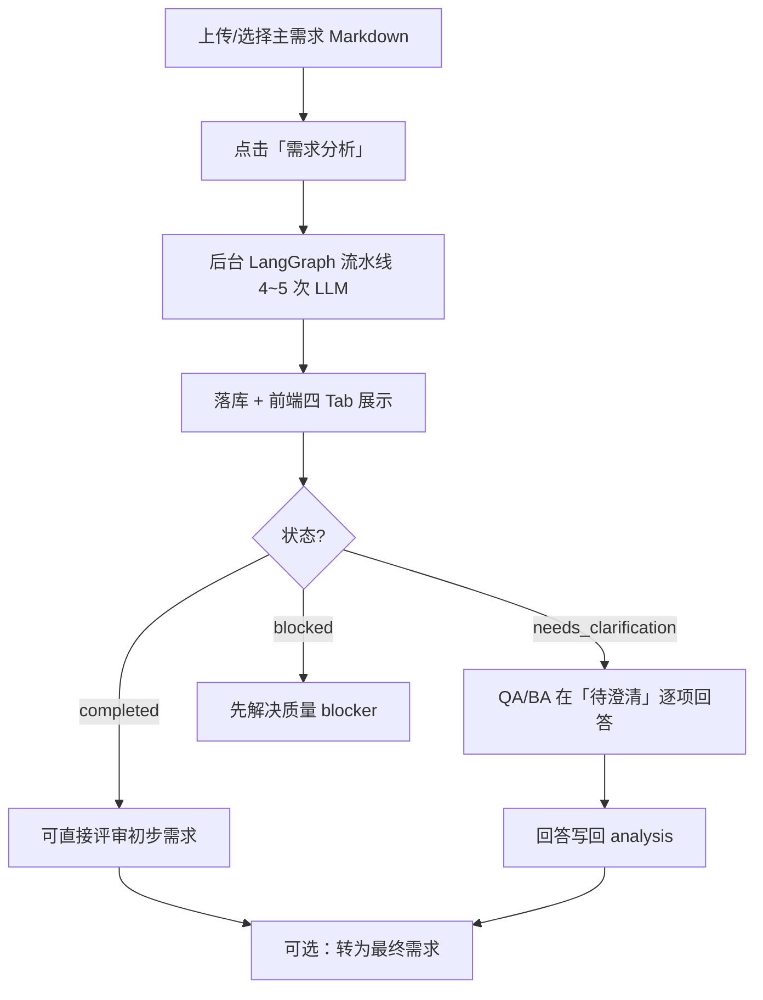

# 需求分析系统 — QA 视角讲解与优化清单

> 面向测试工程师：如何用这个系统快速理解需求、识别风险、参与澄清，以及当前实现的不足与优化方向。

---

## 1. 这个系统对 QA 解决什么问题

传统 PRD 评审里，QA 通常要手工做这些事：

1. **读懂需求**：模块、流程、状态、规则、依赖
2. **找缺口**：验收标准、边界、异常、权限、NFR
3. **列澄清项**：哪些点不确认就无法写用例
4. **判断能否开测**：有没有 blocker

本系统的目标是把上述工作 **半自动化**：

| QA 工作 | 系统对应能力 |
|---------|-------------|
| 读懂需求 | 「需求分析」Tab + Mermaid 图 |
| 找质量问题 | 「质量保障」Tab（四维检查） |
| 列待澄清项 | 「待澄清」Tab（测试驱动裁决清单） |
| 判断门禁 | `quality_gate` + 分析状态 `completed / needs_clarification / blocked` |
| 沉淀初步需求 | 「初步需求」Tab（含 auto_resolved 补充） |

**QA 的定位**：系统产出的是 **草案 + 问题清单**，不是最终真理。QA 负责裁决澄清项、校验 AI 结论、补充遗漏。

---

## 2. 端到端流程（QA 参与点）



### 触发入口

- 前端：需求文档页 → **需求分析** 按钮
- API：`start_requirement_review_run` → 后台 `execute_requirement_review_run`
- 核心：`review_primary_requirement_file` → `run_requirement_analysis`

### 运行时长与模型

- 每次完整分析：**4～5 次** LLM 调用（理解 3 + 质量 1 + 澄清 0~1）
- 超时：120 分钟
- 模型：后台「需求分析智能体」能力绑定的模型（`temperature=0`）

---

## 3. LangGraph 四阶段 — QA 怎么读产出

```text
understand → assess_quality → [clarify 或跳过] → enhance
```

### 阶段 1：需求理解（3 次 LLM）

**编排器** `DeepUnderstandingOrchestrator` 串行执行：

| 子步骤 | 产出 | QA 价值 |
|--------|------|---------|
| 业务分析 | 痛点、核心价值、关键流程、决策点 | 理解「为什么做」 |
| 领域建模 | 实体、状态机、关系 | 理解「有什么对象、怎么流转」 |
| 风险识别 | 测试风险、根因 | 提前知道高风险区域 |
| 讲解生成 | Markdown 讲解（无 LLM） | 给人读的摘要 |

**QA 在前端看到什么**：「需求分析」Tab 里的模块、业务对象、规则、状态流、依赖、风险、Mermaid 图。

**重要限制（见第 6 节）**：深度分析的很多字段 **没有完整映射** 到前端报告，Mermaid 可能偏空或不准。

### 阶段 2：质量评估（1 次 LLM + 规则后处理）

从四个维度 **只列问题、不打分**：

| 维度 | 检查什么 | QA 典型用法 |
|------|----------|-------------|
| **完整性** | 功能缺口、NFR 缺口、缺失细节 | 找「文档没写全」 |
| **清晰度** | 模糊词、歧义表述 | 找「写了但不可测」 |
| **可测试性** | 验收标准缺口、覆盖缺口（边界/异常/权限/并发） | **直接指导用例设计** |
| **一致性** | 冲突、术语不一致 | 找自相矛盾 |

**质量决策**（规则计算，非 LLM）：

| decision.result | 含义 | QA 动作 |
|-----------------|------|---------|
| `approved` | 无 blocker，major ≤ 3 | 可进入澄清/测试设计 |
| `conditional` | major > 3 | 建议先澄清 major |
| `rejected` | 有 blocker | **必须先处理阻塞项** |

前端映射：`approved→passed`，`conditional→warning`，`rejected→blocked`。

**QA 在前端看到什么**：「质量保障」Tab — 问题统计、四维明细、阻塞项、建议行动。

### 阶段 3：澄清（0 或 1 次 LLM）

**跳过条件**（同时满足）：

- 无 blocker
- major ≤ 3
- 总问题数 ≤ 5

跳过时生成 **空澄清清单**，不调用模型。

**澄清项设计哲学**（测试驱动）：不是问「请补充验收标准」，而是问 **单一业务裁决**：

| 字段 | QA 含义 |
|------|---------|
| `decision_point` | 需要人拍板的一句话 |
| `why_clarify` | 当前不确定什么 |
| `test_impact` | 不澄清会导致哪些测试做不了 |
| `risk_scenario` | Given-When-Then 风险场景 |
| `affected_surfaces` | 影响接口/状态/权限/并发等哪一层 |
| `test_cases` | 澄清后应写的代表性用例（含断言点） |
| `options` | 2～4 个互斥方案 + pros/cons |
| `resolution_status` | auto_resolved / has_options / needs_input / needs_research |

**分桶**（前端 Tab 内优先级）：

| clarification_bucket | 对应 priority | QA 处理顺序 |
|---------------------|---------------|-------------|
| blocker | P0 | 最先 |
| risk | P1、P2 | 其次 |
| acceptance | P3 | 可后置 |

**QA 在前端看到什么**：「待澄清」Tab — 标题、影响、问题正文、推荐选项（最多展示 2 个）、原文摘录、自定义回答。

### 阶段 4：增强（0 次 LLM）

- 生成 **需求分析报告** Markdown（理解为主）
- 把 `auto_resolved` 澄清项拼进 **初步需求**
- 判定最终状态：
  - `blocked`：质量 rejected
  - `needs_clarification`：有待人工输入/调研的澄清项
  - `completed`：否则

---

## 4. 前端四 Tab — QA 阅读顺序建议

```text
推荐顺序：质量保障 → 待澄清 → 需求分析 → 初步需求
```

| Tab | 先看什么 | 目的 |
|-----|----------|------|
| **质量保障** | `blocking_issues`、可测试性缺口 | 判断能不能开测 |
| **待澄清** | P0/P1 项的 `decision_point` + `test_impact` | 列出必须问 BA/产品的问题 |
| **需求分析** | Mermaid + 模块/状态流 | 建立业务心智模型 |
| **初步需求** | auto_resolved 补充块 | 看 AI 已从辅助文档推断出的内容 |

### 澄清回答后的流程

1. QA 在「待澄清」选择推荐选项或写自定义答案
2. 保存 → `clarification-answers` API
3. 全部处理完可 **转为最终需求**（finalize）

---

## 5. QA 快速上手检查清单

分析完成后，QA 可按此清单 15 分钟内完成首轮评审：

- [ ] **门禁**：`quality_gate.result` 是否为 `blocked`？若是，先处理阻塞项
- [ ] **统计**：`quality_summary.total_issues`、各维度问题数是否合理
- [ ] **可测试性**：`acceptance_criteria_gaps`、`test_coverage_gaps` 是否覆盖核心模块
- [ ] **澄清 P0**：每个 P0 是否有明确 `decision_point` 和可操作的 `options`
- [ ] **原文追溯**：点「查看原文」核对 `source_excerpt` 是否真实
- [ ] **Mermaid**：模块图/状态图是否与 PRD 一致；若为空，说明理解映射有问题
- [ ] **重复**：质量 Tab 的问题与待澄清项是否重复或矛盾
- [ ] **遗漏**：AI 未提但 QA 知道的关键场景（支付、并发、权限）是否被覆盖

---

## 6. 当前不合理 / 不足之处

### 6.1 高影响 — 影响 QA 信任度

| # | 问题 | 现象 | 对 QA 的影响 |
|---|------|------|-------------|
| H1 | **理解结果映射丢失** | `understand_node` 把深度分析压成 `RequirementUnderstandingOutput` 时：`business_rules=[]`、`dependencies=[]`、模块内 `state_flows=[]`；`capabilities` 误用实体 `key_attributes` | 「需求分析」Tab 缺规则/依赖/状态；Mermaid 业务流程图可能错乱 |
| H2 | **辅助文档未传入** | `review_primary_requirement_file` 构建输入时 **未加载** `auxiliary_documents` | `auto_resolved` 几乎不会触发；澄清选项缺证据 |
| H3 | **Agentic Search 未接入** | `services/search.py` 存在但澄清节点未调用 | 辅助文档搜索能力是死代码 |
| H4 | **前端未展示测试驱动字段** | 后端有 `risk_scenario`、`affected_surfaces`、`test_cases`、`options.pros/cons`，前端主要展示标题/影响/问题/前 2 个选项 | QA 看不到用例草案和测试表面，测试驱动设计价值打折 |
| H5 | **质量与澄清可能重复** | 质量阶段列问题，澄清阶段 LLM 重新生成清单，无强制去重/追溯 | 同一缺口可能出现两次，增加评审成本 |
| H6 | **testability_score 恒为 0** | 入库 `testability_score=0` | 无法做历史趋势或筛选 |

### 6.2 中影响 — 流程与一致性

| # | 问题 | 说明 |
|---|------|------|
| M1 | 跳过澄清条件与文档描述不一致 | 代码按 issue 统计跳过，注释曾写 overall≥95 |
| M2 | `metadata.deep_understanding` 丰富但前端不可见 | 业务洞察、完整领域模型只在 metadata，QA 看不到 |
| M3 | 未使用的分析器 | `test_scenario`、`testability` 分析器、`agents/understanding.py` 未进主流程 |
| M4 | 无需求 ID 追溯 | 澄清项、质量问题未绑定 RQ-xxx，难与用例/FSD 对齐 |
| M5 | 无原文定位 | 仅有 `source_excerpt` 片段，无章节/行号 |
| M6 | `conflicts` 输出恒为空数组 | 前端类型支持 conflict，但 `_output_from_analysis_result` 写死 `[]` |

### 6.3 低影响 — 体验与维护

| # | 问题 | 说明 |
|---|------|------|
| L1 | 每次节点重建 model 实例 | 4 个节点各 `build_agent_model`，无会话复用 |
| L2 | 澄清 prompt 很长 | 单次 token 高，大文档易触顶 |
| L3 | 初步需求增强较机械 | 仅拼接 auto_resolved 块，非智能改写全文 |

---

## 7. 优化建议（按优先级）

### P0 — 建议尽快做（直接提升 QA 可用性）

1. **修复理解映射**  
   从 `DeepUnderstandingResult` 正确填充 `business_rules`、`state_flows`、`dependencies`、`capabilities`，或直接把 `explanation_markdown` / `deep_understanding` 暴露到「需求分析」Tab。

2. **接入辅助文档**  
   `review_primary_requirement_file` 加载同文档下的补充 Markdown，传入 `RequirementAnalysisInputV2.auxiliary_documents`。

3. **前端展示测试驱动字段**  
   待澄清卡片增加：测试表面、风险场景、用例草案（可折叠）、选项 pros/cons。

4. **质量 ↔ 澄清去重**  
   澄清阶段输入质量 issue ID，输出 `related_quality_issue_ids`，前端合并展示。

### P1 — 中期增强

5. **接入 `search_for_answer`**  
   对 `needs_research` 项自动搜辅助文档，提升 `auto_resolved` 比例。

6. **启用专用分析器或合并**  
   将 `TestScenarioExtractor` / `TestabilityAssessor` 接入理解或质量阶段，补强测试场景清单。

7. **需求 ID 贯穿**  
   分析前先做 requirement map（RQ-xxx），澄清/质量问题挂 ID。

8. **计算真实 testability_score**  
   基于 `testability_issues` 和澄清阻塞数生成 0–100 分（规则即可，不必 LLM）。

### P2 — 长期

9. **分析后一键导出**：澄清项 → 测试条件 / 用例骨架（CSV 或 TestRail 格式）
10. **Diff 再分析**：需求变更后只重跑受影响模块
11. **QA 反馈闭环**：标记「AI 误报/漏报」用于 prompt 迭代

---

## 8. QA 与 AI 分工建议

| 事项 | AI 负责 | QA 负责 |
|------|---------|---------|
| 模块/流程初稿 | ✅ | 校验、补漏 |
| 质量问题枚举 | ✅ | 删误报、加漏报 |
| 澄清问题 formulation | ✅ | 确认是否真阻塞测试 |
| 用例设计 | 草案 | **正式用例、优先级、数据** |
| 能否开测 | 建议（gate） | **最终签字** |
| 需求变更影响 | 未来能力 | 回归范围 |

---

## 9. 模型调用一览（便于评估成本/耗时）

| 阶段 | 调用次数 | 说明 |
|------|----------|------|
| 业务分析 | 1 | BusinessAnalyzer |
| 领域建模 | 1 | DomainModeler |
| 风险识别 | 1 | RiskIdentifier |
| 质量评估 | 1 | quality_assessment_agent_v2 |
| 澄清 | 0～1 | 高质量可跳过 |
| 增强/报告 | 0 | 纯模板 |
| **合计** | **4～5** | 同上 |

---

## 10. 相关代码索引

| 用途 | 路径 |
|------|------|
| 工作流编排 | `apps/backend/app/agents/requirement_analysis/workflow/workflow.py` |
| 理解节点 | `workflow/nodes/understand.py` + `workflow/orchestrator.py` |
| 质量节点 | `workflow/nodes/quality.py` + `agents/quality.py` |
| 澄清节点 | `workflow/nodes/clarify.py` + `agents/clarification.py` |
| Schema | `core/schemas.py` |
| 报告生成 | `utils/report.py` |
| API 适配 | `utils/adapter.py` |
| 服务入口 | `apps/backend/app/services/document/service.py` |
| 前端页面 | `apps/frontend/src/app/(main)/projects/[projectId]/requirements/[documentId]/page.tsx` |

---

## 11. 总结

需求分析系统对 QA 的核心价值是：**把 PRD 变成可评审的结构化产物 + 测试裁决清单**，而不是替代 QA 判断。

当前最值得 QA 关注的是：

1. **先读质量保障 Tab** 判断 blocker  
2. **再读待澄清 Tab** 处理 P0/P1 裁决点（注意前端未展示全部测试字段，可查 API/raw JSON）  
3. **用需求分析 Tab 的 Mermaid 建立模型**（但对映射丢失保持警惕）  
4. **把 AI 输出当草稿**，结合业务经验做二次过滤  

技术上最拖累 QA 体验的三点是：**理解映射丢失、辅助文档未接入、前端未展示测试驱动详情**。优先修这三项，QA 收益最大。
