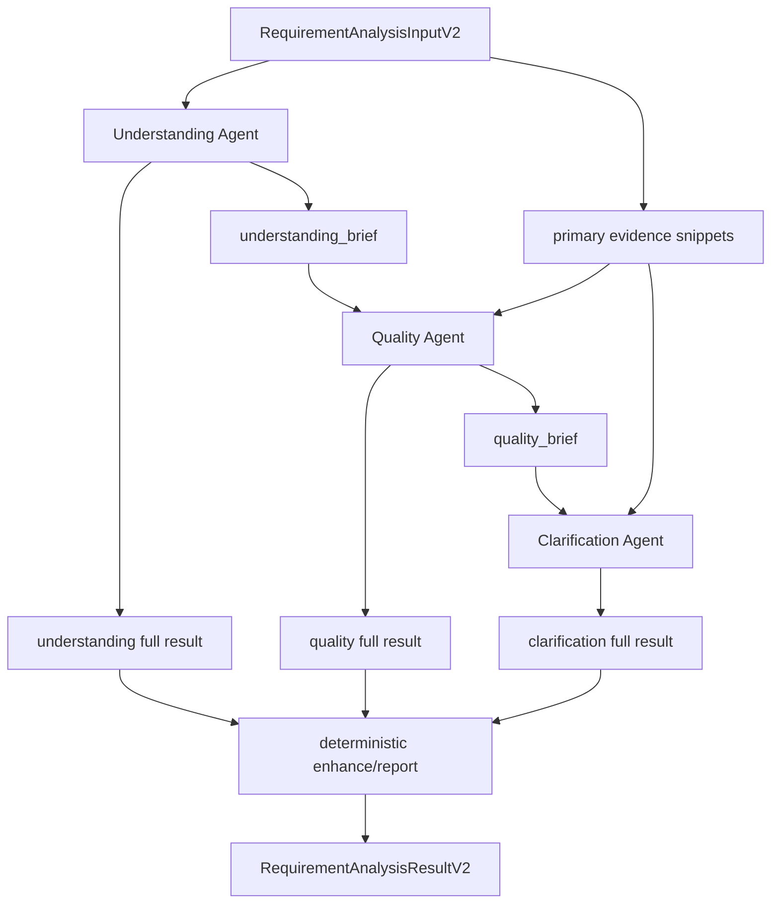

# 需求分析三 Agent 顺序编排改造规范

## 背景

当前需求分析目录已经存在三个实际 Agent：

```text
apps/backend/app/agents/requirement_analysis/agents/understanding.py
apps/backend/app/agents/requirement_analysis/agents/quality.py
apps/backend/app/agents/requirement_analysis/agents/clarification.py
```

当前运行入口仍通过 LangGraph workflow 串联：

```text
apps/backend/app/agents/requirement_analysis/workflow/workflow.py
```

实际图结构是线性的：

```text
understand -> assess_quality -> clarify -> enhance
```

目前没有使用 LangGraph 的条件分支、循环、checkpoint、人机中断、并行 fan-out 或持久化恢复能力。每个 node 只是包装一次 Agent 调用，并把结果写入 `RequirementAnalysisState`。

因此当前阶段没有必要强制使用 LangGraph。更合适的结构是：

```text
三个独立 Agent + 一个普通顺序 orchestrator
```

## 目标

- 在需求分析文件夹内形成三个清晰独立的 Agent 边界：
  - 需求理解 Agent
  - 质量评估 Agent
  - 待澄清 Agent
- 新增一个普通顺序编排器，按固定顺序调用三个 Agent。
- 移除运行时对 LangGraph StateGraph 的强依赖。
- 保持对外入口 `run_requirement_analysis(input_data)` 不变。
- 保持最终返回 `RequirementAnalysisResultV2` 不变。
- 同步解决节点间完整上下文传递问题：下游只消费 brief / evidence，而不是完整上游 JSON。

## 非目标

- 不把三个 Agent 合并成一个大 Agent。
- 不新增 DeepAgents 或新的 Skill Runtime。
- 不重做前端展示。
- 不改变需求分析服务入口的业务语义。
- 不删除历史测试可临时引用的旧 workflow 目录，除非迁移完成且引用清零。

## 推荐目录结构

保留并规范现有三个 Agent 文件：

```text
apps/backend/app/agents/requirement_analysis/
  agents/
    understanding.py      # 需求理解 Agent
    quality.py            # 质量评估 Agent
    clarification.py      # 待澄清 Agent
  orchestrator.py         # 新增：普通顺序编排入口
  core/
    schemas.py
  utils/
    report.py
    enhancer.py
    timing.py
```

不建议再创建第二套重复 Agent 文件，例如 `understanding_agent.py`、`quality_agent.py`。当前文件已经是独立 Agent，最佳方案是收敛职责和输入输出契约。

## 运行流程

目标流程：

```text
run_requirement_analysis(input_data)
  -> build model once
  -> run_understanding_agent()
  -> build_understanding_brief()
  -> run_quality_assessment_agent()
  -> build_quality_brief()
  -> build_evidence_snippets()
  -> run_clarification_agent()
  -> generate_analysis_report()
  -> generate_enhanced_requirement()
  -> RequirementAnalysisResultV2
```

Mermaid：



## Agent 职责

### 1. Understanding Agent

文件：

```text
apps/backend/app/agents/requirement_analysis/agents/understanding.py
```

职责：

- 读取主需求文档。
- 识别模块、业务对象、业务规则、状态流、依赖、风险和假设。
- 输出完整 `RequirementUnderstandingOutput`。
- 产出下游使用的 `RequirementUnderstandingBrief`。

不负责：

- 质量打分。
- 生成待澄清问题。
- 判断需求是否可进入测试。

### 2. Quality Agent

文件：

```text
apps/backend/app/agents/requirement_analysis/agents/quality.py
```

职责：

- 基于主需求关键证据和 `understanding_brief` 做质量检查。
- 输出完整 `QualityAssessmentOutput`。
- 输出下游使用的 `QualityAssessmentBrief`。
- 使用 QA 视角检查：
  - 完整性
  - 清晰度
  - 可测试性
  - 一致性
  - 可执行性
  - 实现风险
  - blocker / severity

不负责：

- 生成完整澄清卡片。
- 把所有问题都改写成用户问题。
- 重复输出需求理解报告。

### 3. Clarification Agent

文件：

```text
apps/backend/app/agents/requirement_analysis/agents/clarification.py
```

职责：

- 基于 `quality_brief` 和 evidence snippets 生成待澄清项。
- 每个澄清项必须能被人工回答或裁决。
- 输出完整 `ClarificationOutput`。

不负责：

- 重新做需求理解。
- 重新做完整质量评估。
- 读取所有辅助文档全文。

## Orchestrator 设计

新增文件：

```text
apps/backend/app/agents/requirement_analysis/orchestrator.py
```

公开入口：

```python
async def run_requirement_analysis(
    input_data: RequirementAnalysisInputV2,
) -> RequirementAnalysisResultV2:
    ...
```

核心要求：

- 只解析一次模型配置。
- 尽量只构建一次 model。
- 记录每一步耗时。
- 不使用 `StateGraph`。
- 不暴露内部 brief 到最终 API，除非放入 `metadata` 用于调试。
- 最终仍返回 `RequirementAnalysisResultV2`。

伪代码：

```python
async def run_requirement_analysis(input_data):
    start = time.time()
    metadata = {}
    model = build_agent_model(resolve_model_selection("requirement_analysis"))

    understanding, deep_understanding = await run_understanding_agent(
        model=model,
        primary_markdown_content=input_data.primary_markdown_content,
        run_id=input_data.run_id,
        metadata=metadata,
    )
    understanding_brief = build_understanding_brief(understanding)
    evidence_map = build_evidence_map(input_data.primary_markdown_content, input_data.auxiliary_documents)

    quality = await run_quality_assessment_agent(
        model=model,
        requirement_evidence=select_quality_evidence(evidence_map),
        understanding_brief=understanding_brief,
    )
    quality_brief = build_quality_brief(quality)

    clarification = await run_clarification_agent(
        model=model,
        quality_brief=quality_brief,
        evidence_snippets=select_clarification_evidence(evidence_map, quality_brief),
    )

    analysis_report = generate_analysis_report(understanding)
    enhanced_requirement = generate_enhanced_requirement(
        original_markdown=input_data.primary_markdown_content,
        auto_resolved_items=get_auto_resolved_items(clarification.items),
    )
    status = decide_status(quality, clarification)

    return RequirementAnalysisResultV2(...)
```

## 上下文传递规则

### 禁止

下游 Agent prompt 不允许直接注入：

- 完整 `understanding_result.model_dump_json(indent=2)`。
- 完整 `quality_assessment_result.model_dump_json(indent=2)`。
- 所有辅助文档全文。
- 主需求全文重复注入到每个 Agent。

### 允许

下游 Agent prompt 只允许注入：

- brief。
- evidence snippets。
- issue ids。
- source excerpts。
- 必要的统计摘要。

### 推荐新增结构

在 `core/schemas.py` 增加：

```python
class EvidenceSnippet(BaseModel):
    source: Literal["primary", "auxiliary"]
    ref: str
    filename: str = ""
    text: str

class RequirementUnderstandingBrief(BaseModel):
    business_goal: str = ""
    modules: list[str] = []
    actors: list[str] = []
    p0_flows: list[str] = []
    p1_flows: list[str] = []
    state_objects: list[str] = []
    external_dependencies: list[str] = []
    evidence_refs: list[str] = []

class QualityIssueBrief(BaseModel):
    issue_id: str
    severity: Literal["blocker", "major", "minor"]
    dimension: str
    summary: str
    impact: str
    evidence_refs: list[str] = []
    needs_human_decision: bool = True

class QualityAssessmentBrief(BaseModel):
    decision: Literal["approved", "conditional", "rejected"]
    blockers: list[str] = []
    top_issues: list[QualityIssueBrief] = []
```

## 兼容策略

### Package 入口

`apps/backend/app/agents/requirement_analysis/__init__.py` 改为懒加载新 orchestrator：

```python
from app.agents.requirement_analysis.orchestrator import run_requirement_analysis
```

### Service 入口

当前服务使用：

```python
from app.agents.requirement_analysis.workflow import run_requirement_analysis
```

迁移期有两种可接受方案：

1. 直接改 service import 到新 orchestrator。
2. 保留 `workflow/__init__.py` 和 `workflow/workflow.py` 为兼容 shim，内部转发到新 orchestrator。

推荐方案是第 2 种，减少服务层改动：

```python
from app.agents.requirement_analysis.orchestrator import run_requirement_analysis
```

旧 `build_requirement_analysis_workflow()` 不再作为主路径使用。

## 测试策略

### 单元测试

新增或改造：

```text
apps/backend/tests/agents/requirement_analysis/test_three_agent_orchestrator.py
```

覆盖：

- 三个 Agent 按顺序被调用。
- `run_requirement_analysis()` 返回 `RequirementAnalysisResultV2`。
- status 判定保持一致：
  - `rejected -> blocked`
  - 有 `needs_input / needs_research -> needs_clarification`
  - 否则 `completed`
- metadata 保留 step timings。

### Prompt 上下文测试

覆盖：

- Quality prompt 不包含完整 understanding JSON。
- Clarification prompt 不包含完整 quality JSON。
- Clarification prompt 不包含所有辅助文档全文。
- evidence snippets 能进入 Clarification prompt。

### 兼容测试

覆盖：

- `from app.agents.requirement_analysis import run_requirement_analysis` 可用。
- `from app.agents.requirement_analysis.workflow import run_requirement_analysis` 可用。
- `apps/backend/app/services/document/service.py` 现有入口不破。

## 实施顺序

1. 新增 brief / evidence schema。
2. 新增 brief / evidence 构建 helper。
3. 改造 `quality.py` 的运行函数输入，消费 `understanding_brief` 和 evidence。
4. 改造 `clarification.py` 的运行函数输入，消费 `quality_brief` 和 evidence snippets。
5. 新增 `orchestrator.py`，顺序调用三个 Agent 和 deterministic enhance。
6. 调整 `__init__.py` 和 `workflow` 兼容 shim。
7. 补单元测试和 prompt 上下文测试。
8. 用 backend venv 跑 focused tests。

## 验收标准

- 运行入口不需要 LangGraph 就能完成需求分析。
- 三个 Agent 独立存在，职责清晰。
- 三个 Agent 按固定顺序调用。
- 最终输出仍是 `RequirementAnalysisResultV2`。
- 下游 prompt 不再接收完整上游 JSON。
- 辅助文档不再全文进入澄清 prompt。
- 旧 service import 不被破坏。
- focused backend tests 通过。

## 推荐结论

当前最佳架构是：

```text
三 Agent 文件保留
LangGraph 主路径下线
新增普通 orchestrator 顺序编排
通过 brief / evidence 控制上下文
workflow 目录短期保留为兼容 shim
```

这比继续强制 LangGraph 更简单，也比合并成一个大 Agent 更稳。
