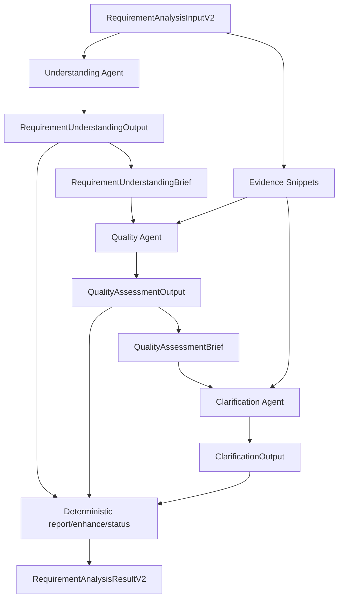

# 需求分析质疑能力并入质量评估设计

## 背景

当前需求分析链路已经出现四个智能体概念：

- `understanding`：需求理解。
- `questioning`：质疑驱动分析。
- `quality`：质量评估。
- `clarification`：待澄清项生成。

其中 `questioning` 的主要内容包括 9 宫格质疑、反向破坏场景、可执行性检查、可实现性检查、需求漏洞检查和风险熔断。这些能力本质上是质量评估的一组审查策略，而不是一个稳定独立的业务产物。

继续保留独立 `questioning` 会带来三个问题：

1. 与 `quality` 重复发现问题，后续必须额外做去重和归并。
2. 与 `clarification` 形成边界混淆，容易让澄清智能体重复做漏洞扫描。
3. 与“三 Agent”目标冲突，文档、测试命名和运行入口会持续不一致。

## 目标

- 下线独立 `Questioning Agent` 运行节点。
- 将质疑能力收敛为 `Quality Agent` 的审查策略。
- 保持需求分析主链路为三个智能体：
  - 需求理解智能体。
  - 质量评估智能体。
  - 待澄清智能体。
- 保持最终输出 `RequirementAnalysisResultV2` 的业务语义稳定。
- 减少下游 prompt 上下文，不把完整上游 JSON 继续传给后续智能体。

## 非目标

- 不重写需求理解智能体。
- 不把三个智能体合成一个大智能体。
- 不新增新的 Agent Runtime 或 LangGraph 编排。
- 不重做前端展示。
- 不要求本次立即删除所有历史兼容文件，删除必须以引用清零为前提。

## 推荐架构

目标链路：

```text
RequirementAnalysisInputV2
  -> Understanding Agent
  -> build_understanding_brief + build_evidence_snippets
  -> Quality Agent
       - basic quality assessment
       - questioning review strategy
       - risk breaker
  -> build_quality_brief
  -> Clarification Agent
  -> deterministic report / enhance / status
  -> RequirementAnalysisResultV2
```

Mermaid：



## Agent 职责

### Understanding Agent

职责：

- 读取主需求文档。
- 提取模块、业务对象、业务规则、状态流、依赖、风险和假设。
- 输出完整 `RequirementUnderstandingOutput`。
- 通过 deterministic helper 产出 `RequirementUnderstandingBrief`。

不负责：

- 质量打分。
- 质疑式漏洞扫描。
- 生成澄清项。
- 判断是否可以进入测试。

### Quality Agent

职责：

- 基于 `RequirementUnderstandingBrief` 和 evidence snippets 做质量评估。
- 吸收原 `Questioning Agent` 的审查策略：
  - 9 宫格质疑。
  - 反向破坏场景。
  - 可测试性检查。
  - 可实现性检查。
  - 需求漏洞检查。
  - risk breaker。
- 输出统一的 `QualityAssessmentOutput`。
- 给出 `approved / conditional / rejected` 决策。

不负责：

- 重新做完整需求理解。
- 生成最终澄清卡片。
- 直接修改需求文档。

### Clarification Agent

职责：

- 基于 `QualityAssessmentBrief` 和 evidence snippets 生成待澄清项。
- 将质量问题转换成可回答、可裁决、可落地的业务问题。
- 输出完整 `ClarificationOutput`。

不负责：

- 重新做质量评估。
- 重新运行 9 宫格或反向破坏分析。
- 消费完整 `QualityAssessmentOutput` JSON。

## Quality Agent 改造

### 保留能力

当前 `quality` 已经覆盖：

- completeness。
- clarity。
- testability。
- consistency。
- issue severity。
- quality decision。

### 并入能力

从 `questioning` 迁入以下能力，但不一定保留原始输出形态：

| 原 questioning 能力 | 新归属 | 输出建议 |
| --- | --- | --- |
| 9 宫格质疑 | Quality prompt 策略 | 转成 `QualityIssueFlat` 或 `QualityIssueBrief` |
| 反向破坏场景 | Quality prompt 策略 | 进入 issue `extra.adversarial_scenario` |
| 可执行性检查 | testability 维度 | 转成 testability issue |
| 可实现性检查 | implementation_risk 维度或 issue extra | 参与 decision/risk breaker |
| 需求漏洞检查 | completeness / consistency / testability | 转成统一 issue |
| risk breaker | Quality decision helper | 影响 rejected/conditional |

### Schema 建议

不要继续让最终结果暴露完整 `QuestioningOutput`。更推荐扩展质量评估的统一 issue 模型：

```python
class QualityIssueFlat(BaseModel):
    issue_id: str
    dimension: Literal[
        "completeness",
        "clarity",
        "testability",
        "consistency",
        "implementability",
        "adversarial",
    ]
    category: str
    severity: Literal["blocker", "major", "minor"]
    title: str
    description: str
    location: str = ""
    current_text: str = ""
    issue_reason: str = ""
    suggested_fix: str = ""
    impact: str = ""
    extra: dict = {}
```

`extra` 可以承载迁移期的质疑特征，例如：

```json
{
  "questioning_dimension": "WHAT_IF",
  "attack_vector": "concurrency",
  "risk_level": "high",
  "expected_defense": "基于幂等键去重"
}
```

这样既能保留质疑信息，又不会额外维护一套平行输出模型。

## Orchestrator 设计

目标主路径为顺序三 Agent：

```python
async def run_requirement_analysis(input_data):
    model = build_agent_model(resolve_model_selection("requirement_analysis"))

    understanding, deep_understanding = await run_understanding_agent(...)
    understanding_brief = build_understanding_brief(understanding)
    evidence_snippets = build_evidence_snippets(...)

    quality = await run_quality_assessment_agent(
        model=model,
        understanding_brief=understanding_brief,
        requirement_evidence=evidence_snippets,
    )
    quality_brief = build_quality_brief(quality)

    clarification = await run_clarification_agent(
        model=model,
        quality_brief=quality_brief,
        evidence_snippets=evidence_snippets,
    )

    status = decide_status(quality, clarification)
    return RequirementAnalysisResultV2(...)
```

要求：

- 不再调用 `run_questioning_agent()`。
- 不再向最终结果写入独立 `questioning` 字段，除非为了兼容临时保留空值或 metadata 摘要。
- `metadata.engine` 建议改为 `three_agent_quality_questioning_orchestrator` 或 `requirement_analysis_three_agent_orchestrator`。
- `step_timings` 保留 `understand / quality / clarify / enhance`。

## 状态判定

建议 deterministic 判定：

```text
quality.decision.result == "rejected"
  -> blocked

quality.risk_breaker == "halt"
  -> blocked

clarification 有 needs_input / needs_research
  -> needs_clarification

否则
  -> completed
```

如果 `risk_breaker` 暂不进入顶层 schema，可以先从 `quality.decision` 和 severity 统计推导。

## 兼容策略

### 第一阶段：软下线

- `questioning` 目录暂时保留。
- `orchestrator.py` 不再调用 `run_questioning_agent()`。
- `RequirementAnalysisResultV2.questioning` 如果当前 schema 必填，先改为可选或在兼容层填充 `None`。
- 测试不再断言 questioning 调用顺序。

### 第二阶段：迁移能力

- 把 `QUESTIONING_SYSTEM_PROMPT` 中有价值的检查清单迁入 `QUALITY_ASSESSMENT_SYSTEM_PROMPT`。
- 把 `RiskBreaker` 思路迁入 quality decision helper。
- 将 `QuestioningOutput` 里的结构化模型逐步删除或只作为内部参考。

### 第三阶段：删除独立节点

前置条件：

- `rg "run_questioning_agent|QuestioningOutput|questioning"` 没有运行时引用。
- 前端和 API 不再依赖 `questioning` 字段。
- focused backend tests 通过。

满足后删除：

```text
apps/backend/app/agents/requirement_analysis/questioning/
```

## 测试策略

### Orchestrator 测试

更新或新增：

```text
apps/backend/tests/agents/requirement_analysis/test_three_agent_orchestrator.py
```

覆盖：

- 只调用 understanding、quality、clarification 三个智能体。
- 调用顺序为 `understanding -> quality -> clarification`。
- 不再调用 `run_questioning_agent()`。
- metadata step timings 包含 `understand / quality / clarify / enhance`。

### Quality 测试

覆盖：

- Quality prompt 包含质疑式检查要求。
- Quality runner 输入只包含 `understanding_brief` 和 bounded evidence。
- 质疑式问题能归一为 quality issue。
- risk breaker 可以影响 quality decision。

### Clarification 测试

覆盖：

- Clarification 不消费完整 `QualityAssessmentOutput` JSON。
- Clarification 使用 `QualityAssessmentBrief` 和 evidence snippets。
- 澄清项来自 quality issues，而不是重新做质疑扫描。

### 删除引用测试

覆盖：

- `rg "run_questioning_agent"` 仅允许出现在历史文档或迁移说明中。
- package import 不暴露 questioning 运行入口。
- focused tests 通过。

## 实施顺序

1. 修改 `RequirementAnalysisResultV2`，让 `questioning` 字段可选或移入兼容 metadata。
2. 修改 orchestrator，移除 `run_questioning_agent()` 调用。
3. 修改 quality prompt，吸收 9 宫格、反向破坏、可执行性、可实现性、漏洞检查和 risk breaker。
4. 扩展 quality issue schema 或 `extra` 字段，承接质疑信息。
5. 新增 `build_quality_brief()`，让 clarification 只消费 brief。
6. 修改 clarification runner 输入，优先使用 `quality_brief + evidence_snippets`。
7. 更新 tests，删除四 Agent 并行/调用顺序预期。
8. 确认引用清零后删除 `questioning` 目录。
9. 运行 focused backend tests。

## 验收标准

- 需求分析运行时只有三个智能体节点。
- 质疑能力仍保留，但作为 Quality Agent 的审查策略存在。
- 不再维护独立 `QuestioningOutput` 业务结果。
- Quality 输出能覆盖原 questioning 的核心风险发现。
- Clarification 只负责把质量问题转换成可回答的澄清项。
- Orchestrator、schema、测试命名不再出现“四 Agent”误导。
- focused tests 通过。

## 推荐结论

独立 `Questioning Agent` 不作为长期架构保留。

最终定位：

```text
质疑不是一个 Agent。
质疑是 Quality Agent 的深度审查策略。
```

目标架构：

```text
Understanding Agent -> Quality Agent -> Clarification Agent
```

这个方案能减少重复分析、降低合并复杂度，并让需求分析链路回到稳定的三 Agent 边界。
