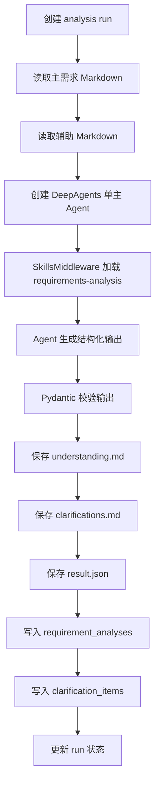

# 需求分析 DeepAgents 新架构 Spec

## 背景

当前需求分析实现围绕固定三段编排展开：

```text
understanding -> quality -> clarification
```

该结构已经不符合新的设计目标。新的需求分析能力应以 DeepAgents 为主架构，使用需求分析专属 skill 完成方法论加载，直接产出两个业务产物：

```text
需求理解文档
待澄清文档
```

本规范不兼容旧三代理框架，不保留旧质量门禁结构，不围绕旧前端字段做适配。前后端、服务、数据和测试均以新架构为准。

## 目标

1. 使用 DeepAgents 重构需求分析智能体。
2. 使用单主 Agent，不使用 subagents。
3. 将 `requirements-analysis` skill 移入需求分析智能体目录。
4. 使用 `SkillsMiddleware` 从需求分析私有 skill 目录加载 skill。
5. 需求分析只产出“需求理解文档”和“待澄清文档”。
6. 后端只保存新架构必需字段和产物，不保留旧输出兼容字段。
7. 前端只展示新架构产物，不继续展示质量保障、初步需求增强、旧质量门禁。
8. 所有输入、输出、配置和数据库字段必须有明确用途；没有消费方的参数不得保留。

## 非目标

- 不保留 `understanding/quality/clarification` 三个子 Agent 包。
- 不保留 `orchestrator.py` 固定编排。
- 不生成质量保障报告。
- 不生成 `quality_gate`、`quality_summary`、`quality_decision`。
- 不生成 `enhanced_requirement_markdown`。
- 不生成旧版 `analysis_report_markdown` 兼容字段。
- 不使用 subagents。
- 不让后端实现需求理解或澄清问题的业务判断。
- 不把全局 `.agents/skills` 作为运行时 skill 来源。
- 不为了旧前端保留无业务意义字段。

## 总体架构

```text
Frontend Requirement Analysis Page
  -> POST /projects/{project_id}/requirements/{document_id}/analysis-runs
  -> Backend RequirementAnalysisService
      -> load primary requirement markdown
      -> load auxiliary markdown documents
      -> create_deep_agent
          -> FilesystemBackend
          -> SkillsMiddleware
          -> requirements-analysis skill
      -> validate structured output
      -> persist artifacts
  -> GET /projects/{project_id}/requirements/{document_id}/analysis-runs/{run_id}
  -> Frontend renders understanding.md and clarifications.md
```

## 目录结构

```text
apps/backend/app/agents/requirement_analysis/
  __init__.py
  agent.py
  service.py
  schemas.py
  system_prompt.py
  skills/
    requirements-analysis/
      SKILL.md
      references/
        understanding.md
        clarification.md
```

### 文件职责

| 文件 | 职责 |
|---|---|
| `agent.py` | 创建 DeepAgents 单主 Agent |
| `service.py` | 读取输入、调用 Agent、校验输出、保存产物 |
| `schemas.py` | 定义新架构输入输出契约 |
| `system_prompt.py` | 定义主 Agent 系统提示词 |
| `skills/requirements-analysis` | 需求分析方法论和引用模板 |

删除旧结构：

```text
apps/backend/app/agents/requirement_analysis/orchestrator.py
apps/backend/app/agents/requirement_analysis/understanding/
apps/backend/app/agents/requirement_analysis/quality/
apps/backend/app/agents/requirement_analysis/clarification/
```

## Skill 设计

### Skill 位置

从：

```text
.agents/skills/requirements-analysis/
```

移动到：

```text
apps/backend/app/agents/requirement_analysis/skills/requirements-analysis/
```

### Skill 加载

`FilesystemBackend` 根目录固定为后端应用根：

```text
apps/backend
```

`SkillsMiddleware` 来源固定为：

```text
/app/agents/requirement_analysis/skills
```

示例：

```python
from deepagents import create_deep_agent
from deepagents.backends.filesystem import FilesystemBackend
from deepagents.middleware.skills import SkillsMiddleware


def create_requirement_analysis_agent(model):
    backend = FilesystemBackend(root_dir=BACKEND_ROOT)
    return create_deep_agent(
        model=model,
        backend=backend,
        tools=[],
        middleware=[
            SkillsMiddleware(
                backend=backend,
                sources=[
                    ("/app/agents/requirement_analysis/skills", "RequirementAnalysis"),
                ],
            )
        ],
        system_prompt=REQUIREMENT_ANALYSIS_SYSTEM_PROMPT,
    )
```

### Skill 规则

- Agent 必须使用 `requirements-analysis`。
- Agent 必须读取 `SKILL.md`。
- Agent 必须读取 `references/understanding.md`。
- Agent 必须读取 `references/clarification.md`。
- Agent 不得创造接口、字段、业务规则、状态和限制。
- Agent 对未说明内容必须写“原文未说明”，并进入待澄清内容。

## 输入契约

### Service 输入

服务入口只接收一个运行标识：

```python
class RequirementAnalysisRunInput(BaseModel):
    run_id: str
```

原因：

- `run_id` 可从数据库唯一定位项目、需求文档、主需求文件、执行人和运行状态。
- `project_id`、`document_id`、`primary_mapping_id` 不需要在 Agent 服务入口重复传递。
- 主需求和辅助文档由服务层读取，不由调用方传入，避免参数不一致。

### Agent 输入

Agent 实际收到的任务文本只包含必要内容：

```text
需求名称
主需求 Markdown
辅助需求 Markdown 列表
输出格式要求
```

辅助文档列表只包含：

| 字段 | 用途 |
|---|---|
| `filename` | 来源展示 |
| `markdown_content` | 分析内容 |

不传入：

- `project_id`
- `document_id`
- `mapping_id`
- `actor`
- `run status`
- 数据库行对象
- 前端展示状态

这些字段不参与需求分析语义判断。

## 输出契约

Agent 必须返回结构化 JSON。JSON 只包含以下字段：

```python
class RequirementClarificationItem(BaseModel):
    id: str
    priority: Literal["P0", "P1", "P2", "P3"]
    module: str
    question: str
    impact: str


class RequirementAnalysisAgentOutput(BaseModel):
    status: Literal["completed", "needs_clarification"]
    understanding_markdown: str
    clarification_markdown: str
    clarification_items: list[RequirementClarificationItem]
```

字段说明：

| 字段 | 用途 |
|---|---|
| `status` | 前端和任务中心展示运行结果 |
| `understanding_markdown` | 需求理解文档 |
| `clarification_markdown` | 待澄清文档 |
| `clarification_items` | 前端待澄清问题列表 |

状态规则：

```text
clarification_items 为空 -> completed
clarification_items 非空 -> needs_clarification
```

Agent 不输出 `blocked`。结构化输出解析失败、主需求缺失、文件读取失败属于服务运行失败，状态进入 `failed`，不伪装成业务分析结果。

## 产物设计

每次运行产物目录：

```text
data/projects/{project_id}/requirements/{document_id}/analysis_runs/{run_id}/
  understanding.md
  clarifications.md
  result.json
```

### understanding.md

内容为 `understanding_markdown`，固定包含：

```markdown
## 需求理解

### 1. 需求背景
### 2. 目标与价值
### 3. 用户角色与使用场景
### 4. 功能范围
### 5. 业务流程
### 6. 状态流转
### 7. 业务规则
### 8. 页面与交互
### 9. 数据与系统交互
```

### clarifications.md

内容为 `clarification_markdown`，固定包含：

```markdown
## 待澄清内容

| 优先级 | 模块/对象 | 澄清问题 | 影响 |
|---|---|---|---|
```

### result.json

内容为完整结构化输出：

```json
{
  "status": "needs_clarification",
  "understanding_markdown": "...",
  "clarification_markdown": "...",
  "clarification_items": []
}
```

## 数据模型

### requirement_analysis_runs

保留运行表，但收敛字段语义。

必要字段：

| 字段 | 用途 |
|---|---|
| `id` | 运行 ID |
| `project_id` | 项目隔离 |
| `document_id` | 需求文档归属 |
| `primary_mapping_id` | 本次分析使用的主需求文件 |
| `status` | 运行状态 |
| `summary` | 任务中心摘要 |
| `failure_reason` | 失败原因 |
| `created_by` | 审计 |
| `created_at` | 审计 |
| `updated_at` | 任务状态 |

状态枚举：

```text
queued
running
stopping
cancelled
completed
needs_clarification
failed
```

删除状态：

```text
blocked
```

原因：新架构中业务问题进入待澄清；系统失败进入 failed；不再使用质量门禁阻塞状态。

### requirement_analyses

新结构只保存当前运行结果。

必要字段：

| 字段 | 用途 |
|---|---|
| `id` | 分析结果 ID |
| `run_id` | 关联运行 |
| `project_id` | 项目隔离 |
| `document_id` | 需求文档归属 |
| `status` | 分析结果状态 |
| `understanding_path` | 需求理解文档路径 |
| `clarification_path` | 待澄清文档路径 |
| `result_json_path` | 结构化结果路径 |
| `created_at` | 审计 |

不保存大段 Markdown 到数据库。Markdown 以文件为事实源，数据库只保存路径和状态索引。

### requirement_clarification_items

待澄清问题独立保存，便于前端列表和后续答复。

字段：

| 字段 | 用途 |
|---|---|
| `id` | 问题 ID |
| `analysis_id` | 分析结果归属 |
| `priority` | P0/P1/P2/P3 |
| `module` | 模块或业务对象 |
| `question` | 澄清问题 |
| `impact` | 影响 |
| `status` | open/resolved/deferred |
| `answer_markdown` | 人工答复 |
| `created_at` | 审计 |
| `updated_at` | 审计 |

不保存推荐选项。原因：`requirements-analysis` skill 只要求提出澄清问题，不要求替业务生成可选答案。

## API 设计

### 创建运行

```text
POST /projects/{project_id}/requirements/{document_id}/analysis-runs
```

请求体为空：

```json
{}
```

后端根据当前主需求文件创建运行。

响应：

```json
{
  "id": "reqrun-xxx",
  "status": "queued",
  "summary": "需求分析已提交"
}
```

### 查询运行

```text
GET /projects/{project_id}/requirements/{document_id}/analysis-runs/{run_id}
```

响应：

```json
{
  "id": "reqrun-xxx",
  "status": "needs_clarification",
  "summary": "发现 3 个待澄清问题",
  "analysis": {
    "id": "analysis-xxx",
    "understanding_markdown": "...",
    "clarification_markdown": "...",
    "clarification_items": [
      {
        "id": "clar-001",
        "priority": "P0",
        "module": "登录",
        "question": "未登录、账号冻结时是否允许验证码登录？",
        "impact": "影响权限规则和异常流程实现。",
        "status": "open",
        "answer_markdown": ""
      }
    ]
  }
}
```

### 停止运行

```text
POST /projects/{project_id}/requirements/{document_id}/analysis-runs/{run_id}/stop
```

请求体为空：

```json
{}
```

响应：

```json
{
  "id": "reqrun-xxx",
  "status": "cancelled",
  "summary": "需求分析已取消"
}
```

### 答复澄清问题

```text
PUT /projects/{project_id}/requirements/{document_id}/analysis-runs/{run_id}/clarification-items/{item_id}
```

请求：

```json
{
  "answer_markdown": "业务确认：账号冻结时不允许登录。"
}
```

响应：

```json
{
  "id": "clar-001",
  "status": "resolved",
  "answer_markdown": "业务确认：账号冻结时不允许登录。"
}
```

不提供 `answer_type`、`selected_option_id`、`custom_answer`。这些字段属于旧交互模型。

## 前端设计

需求详情页保留“需求分析”入口，但分析结果区域只保留两个页签：

```text
需求理解 / 待澄清
```

删除页签：

```text
质量保障
初步需求
```

### 需求理解页签

展示 `understanding_markdown`。

空状态：

```text
尚未生成需求理解，请先执行需求分析。
```

### 待澄清页签

展示 `clarification_items` 列表。

每个问题展示：

- 优先级
- 模块/对象
- 澄清问题
- 影响
- 答复输入框
- 保存答复按钮

当列表为空：

```text
暂无待澄清问题。
```

### 任务状态

前端只识别：

```text
queued
running
stopping
cancelled
completed
needs_clarification
failed
```

不再识别 `blocked`。

## 后端执行流程



失败规则：

| 失败点 | 结果 |
|---|---|
| 主需求文件不存在 | run -> failed |
| Skill 目录不存在 | run -> failed |
| Agent 调用异常 | run -> failed |
| JSON 解析失败 | run -> failed |
| 必填 Markdown 为空 | run -> failed |
| 保存产物失败 | run -> failed |

不做 fallback，不生成伪结果。

## Agent Prompt 约束

主提示词必须表达以下规则：

```text
你是需求分析智能体。
你必须使用 requirements-analysis skill。
你只产出需求理解和待澄清内容。
你不得输出质量保障、测试策略、验收标准、发布检查、监控要求。
你不得创造原文未说明的业务规则、字段、接口、状态、限制。
如果原文未说明，写“原文未说明”，并生成待澄清问题。
你必须返回符合 RequirementAnalysisAgentOutput 的 JSON。
```

## 测试要求

### 架构测试

- `requirement_analysis/orchestrator.py` 不存在。
- `requirement_analysis/understanding` 不存在。
- `requirement_analysis/quality` 不存在。
- `requirement_analysis/clarification` 不存在。
- `requirement_analysis/agent.py` 存在。
- `requirement_analysis/skills/requirements-analysis/SKILL.md` 存在。
- DeepAgents 创建逻辑包含 `SkillsMiddleware`。
- `subagents` 不出现在需求分析 Agent 配置中。

### 契约测试

- 创建运行请求体为空也能创建 run。
- Service 入口只接收 `run_id`。
- Agent 输出缺少 `understanding_markdown` 时失败。
- Agent 输出缺少 `clarification_markdown` 时失败。
- `clarification_items=[]` 时 run 状态为 `completed`。
- `clarification_items` 非空时 run 状态为 `needs_clarification`。
- 不产生 `quality_gate`、`quality_summary`、`quality_decision`。

### 产物测试

- 成功运行后生成 `understanding.md`。
- 成功运行后生成 `clarifications.md`。
- 成功运行后生成 `result.json`。
- 数据库只保存产物路径，不保存大段 Markdown。

### 前端测试

- 需求分析结果只显示“需求理解”和“待澄清”。
- 不显示“质量保障”。
- 不显示“初步需求”。
- 待澄清问题可保存答复。
- `failed` 状态展示失败原因。

## 迁移策略

本规范不迁移旧数据。

实施时允许：

- 删除旧需求分析代码。
- 删除旧需求分析测试。
- 删除旧前端质量保障和初步需求展示。
- 删除旧输出字段。

旧运行记录如果存在，详情页可显示：

```text
该需求分析记录由旧架构生成，请重新执行需求分析。
```

不做旧数据结构适配。

## 验收标准

1. 新需求分析运行只通过 DeepAgents 单主 Agent 执行。
2. 运行时 skill 来源只来自 `requirement_analysis/skills`。
3. 不存在需求分析 subagents。
4. 成功运行后只生成两个用户文档：需求理解、待澄清。
5. 前端只展示两个结果页签：需求理解、待澄清。
6. 后端不再返回旧质量门禁字段。
7. 任一运行失败必须明确进入 `failed`，不得 fallback。
8. 测试能证明旧三代理框架已退出主路径。
