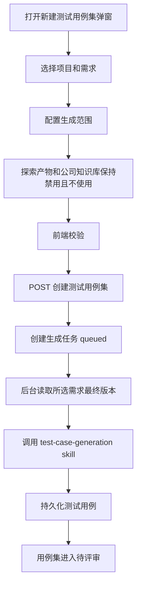

# 测试用例集基于需求生成 Spec

## 背景

当前仓库已经存在一版测试用例集生成链路：

- 后端 Agent：`apps/backend/app/agents/test_case_generation/`
- 后端服务：`apps/backend/app/services/test_case_service.py`
- 后端 API：`apps/backend/app/api/v1/test_cases.py`
- 前端页面：`apps/frontend/src/app/(main)/test-cases/page.tsx`
- 前端契约测试：`apps/frontend/tests/test-case-set-dialog-contract.test.mjs`
- 后端服务测试：`apps/backend/tests/test_test_case_set_service.py`

现有实现支持创建测试用例集并触发生成任务，但仍暴露并默认使用探索产物；公司知识库也作为可选生成参考存在。现在这两个能力都先不接入生成流程：探索产物链路还有问题，知识库辅助设计也暂不做。

本轮只完成最小可用闭环：用户在测试用例页面新建测试用例集，选择一个需求，后端读取该需求的最终版本内容，调用测试用例生成 Agent，生成出的测试用例归属该测试用例集。

## 目标

- 在测试用例模块保留 `新建测试用例集` 入口。
- 创建测试用例集时必须选择一个需求文档。
- 后端只基于所选需求的最终版本内容生成测试用例。
- 前端保留“使用探索产物”和“使用公司知识库”配置项，但都固定为不使用且不可选择。
- 后端不调用探索产物。
- 后端不调用知识库问答接口或知识库 Agent。
- 保留生成范围：`全部需求内容` / `指定范围`。
- 指定范围模式下必须填写范围说明。
- 提交后创建测试用例集和后台生成任务。
- 生成结果归属测试用例集，并进入待评审状态。
- 生成任务出现在任务中心，支持生成中轮询和失败展示。
- 测试用例生成 Agent 继续使用独立 `test-case-generation` skill，并参考需求分析目录结构补强 references。

## 非目标

- 不接入探索产物。
- 不读取探索报告、页面快照、元素定位或页面状态树。
- 不调用公司知识库。
- 不调用现有知识库聊天接口。
- 不调用 `app.agents.knowledge.service.run_knowledge_agent()`。
- 不把知识库内容注入测试用例生成 Agent。
- 不生成 UI 自动化代码。
- 不执行自动化测试。
- 不改 UI 自动化模块的测试集管理。
- 不做多需求合并生成。

## 命名边界

### 测试用例集

测试用例模块内的业务测试用例生成容器。它记录一次生成所依赖的项目、需求、生成范围、备注、生成任务和生成结果。

### 探索产物

站点探索或页面探索模块生成的页面事实、路径、元素、状态树等产物。本轮不接入测试用例集生成流程。

### 公司知识库

公司级通用知识来源。本轮只在前端保留禁用配置项，不参与生成。

## 推荐目录结构

沿用现有 `test_case_generation` Agent 目录，不新增并行 Agent：

```text
apps/backend/app/agents/test_case_generation/
  __init__.py
  agent.py
  middleware.py
  schemas.py
  service.py
  skills/
    test-case-generation/
      SKILL.md
      references/
        generation-principles.md
        testcase-format.md
```

目录职责：

| 路径 | 职责 |
| --- | --- |
| `agent.py` | 创建 LangChain Agent，绑定模型、SkillMiddleware 和结构化输出 |
| `middleware.py` | 动态加载 `SKILL.md` 与 references，注入 system prompt |
| `schemas.py` | 定义模型输入与结构化输出 |
| `service.py` | 组装模型输入、选择模型、调用 Agent、解析结构化输出 |
| `skills/test-case-generation/SKILL.md` | 主 skill，描述角色、事实边界、工作流和输出要求 |
| `references/generation-principles.md` | 测试设计方法、覆盖维度和优先级规则 |
| `references/testcase-format.md` | 测试用例字段、标题、步骤、预期结果规范 |

不推荐新增：

```text
apps/backend/app/agents/test_case_set_generation/
```

原因：现有 `test_case_generation` 的 capability、模型配置、service 和测试已经对齐“根据需求生成测试用例”。新建并行目录会制造两套入口，增加维护成本。

## 后端设计

### Schema

`TestCaseSetCreateIn` 第一版真实输入：

```python
class TestCaseSetCreateIn(BaseModel):
    name: str
    requirement_doc_id: str
    use_exploration_artifacts: bool = False
    include_company_knowledge: bool = False
    generation_scope_type: Literal["all", "specified"] = "all"
    generation_scope_text: str = ""
    notes: str = ""
```

处理规则：

- `name`、`requirement_doc_id`、`generation_scope_text`、`notes` 继续 trim。
- `generation_scope_type == "specified"` 时，`generation_scope_text` 必填。
- `use_exploration_artifacts` 固定只接受 `False`；如果传 `True`，后端应拒绝或强制归一为 `False`，推荐拒绝并返回清晰错误。
- `include_company_knowledge` 固定只接受 `False`；如果传 `True`，后端应拒绝或强制归一为 `False`，推荐拒绝并返回清晰错误。
- 不暴露 `exploration_run_id`。

建议错误文案：

```text
探索产物暂未接入测试用例生成。
公司知识库暂未接入测试用例生成。
```

### Service

`create_test_case_set()` 保留：

- 校验项目可见性。
- 校验当前项目下存在所选需求。
- 创建测试用例集。
- 创建测试用例生成任务。
- 返回序列化后的测试用例集。

需要移除或绕开：

- `_resolve_exploration_run_id()` 在创建流程中的调用。
- 根据需求自动查找最新关联探索的行为。
- 任何知识库查询行为。
- `input_snapshot` 中的 `exploration_run_id`、`use_exploration_artifacts=True`、`include_company_knowledge=True` 等启用语义。

`input_snapshot` 推荐：

```json
{
  "project_id": "project-1",
  "project_name": "测试项目",
  "requirement_doc_id": "doc-1",
  "requirement_doc_title": "登录需求",
  "use_exploration_artifacts": false,
  "include_company_knowledge": false,
  "generation_scope_type": "all",
  "generation_scope_text": "",
  "notes": ""
}
```

### Agent Input

`TestCaseGenerationInput` 第一版保持：

```python
class TestCaseGenerationInput(BaseModel):
    requirement_name: str
    requirement_content: str
    generation_scope: str = ""
```

如果为了兼容现有字段暂时保留 `include_company_knowledge`，服务层必须固定传 `False`，并且 Agent prompt 不应加入“结合公司知识库”提示。

服务层组装 prompt 时必须明确：

- 所选需求的最终版本内容是唯一业务事实来源。
- 当前没有探索产物上下文。
- 当前没有公司知识库上下文。
- 对无法确认的业务规则，生成用例时必须标记待确认，不能编造确定结论。

### 输出与持久化

保持当前结构化输出：

- `summary`
- `total_count`
- `modules`
- `modules[].test_cases`

持久化时：

- `source_requirement_refs` 写入当前需求 ID。
- `source_exploration_refs` 固定为空数组。
- 测试用例集生成成功后状态为 `ready_for_review`。
- 失败时测试用例集状态为 `failed`，生成任务记录错误信息。

## Skill 设计

### 主 SKILL.md

主 skill 只放核心行为：

- 角色：测试用例生成专家。
- 输入：最终需求文档、可选生成范围。
- 事实边界：需求是唯一业务事实来源。
- 待确认规则：需求未明确时标记待确认，不编造业务结论。
- 工作流：阅读需求、识别模块、生成场景、处理不确定项、输出结构化 JSON。
- 输出：符合 `TestCaseGenerationResult` schema。

### references/generation-principles.md

内容包括：

- 功能测试、异常测试、边界测试、安全测试、性能测试、兼容测试的适用条件。
- 六维扫描法。
- 等价类、边界值、状态迁移、因果组合等方法。
- 优先级规则：P0/P1/P2/P3。
- 高风险场景自动升级规则。

### references/testcase-format.md

内容包括：

- 标题使用动宾结构。
- 步骤每步一个动作。
- 预期结果必须可验证。
- 测试数据只在需要时填写。
- `total_count` 必须等于实际用例数量。
- ID 必须连续：`tc-001`、`tc-002`。

## 前端设计

页面：`/test-cases`

保留：

- `新建测试用例集` 按钮。
- 用例集名称。
- 项目。
- 需求。
- 使用探索产物。
- 使用公司知识库。
- 生成范围。
- 指定范围说明。
- 备注。
- 列表、批量删除、任务轮询、生成中状态。

“使用探索产物”字段：

- 默认值：`不使用探索产物`。
- 不可选择。
- 不提交启用值。
- payload 中 `use_exploration_artifacts` 固定为 `false`。

“使用公司知识库”字段：

- 默认值：`不使用公司知识库`。
- 不可选择。
- 不提交启用值。
- payload 中 `include_company_knowledge` 固定为 `false`。

弹窗描述建议：

```text
选择一个需求，配置生成范围后生成测试用例。
```

两个禁用字段说明建议：

```text
暂未接入，后续开放。
```

列表展示：

- 第一版不展示“关联探索”列。
- 搜索 placeholder 不包含“探索”。
- 列表仍展示用例集名称、需求、生成范围、状态、用例数量、更新时间和操作。

## API 契约

### 创建测试用例集

```http
POST /api/v1/projects/{project_id}/test-case-sets
```

请求：

```json
{
  "name": "登录需求测试用例集",
  "requirement_doc_id": "doc-001",
  "use_exploration_artifacts": false,
  "include_company_knowledge": false,
  "generation_scope_type": "specified",
  "generation_scope_text": "这个需求中登录部分的测试用例",
  "notes": ""
}
```

响应保持 `TestCaseSetOut`。如果短期仍保留 `exploration_run_id` 和 `exploration_run_title` 输出，值必须为空。

### 查询测试用例集

```http
GET /api/v1/projects/{project_id}/test-case-sets
GET /api/v1/projects/{project_id}/test-case-sets/{set_id}
```

响应中应能展示：

- 用例集名称。
- 需求名称。
- 生成范围。
- 生成状态。
- 用例数量。
- 更新时间。
- 最近一次生成任务。

## 数据流



## 测试策略

### 后端

更新 `apps/backend/tests/test_test_case_set_service.py`：

- 创建测试用例集默认不使用探索产物。
- 创建测试用例集默认不使用公司知识库。
- 传入 `use_exploration_artifacts=True` 时拒绝或归一为 `False`，按最终实现断言。
- 传入 `include_company_knowledge=True` 时拒绝或归一为 `False`，按最终实现断言。
- `input_snapshot` 中两个开关均为 `false`。
- `source_exploration_refs` 持久化为空数组。
- 指定范围为空时仍报错。
- 需求不属于当前项目仍报错。
- 生成任务成功后持久化测试用例并进入 `ready_for_review`。
- Agent 失败后状态为 `failed`。

更新 `apps/backend/tests/test_test_case_generation_agent.py`：

- 继续验证结构化输出与模型调用。
- 增加 prompt 断言：不包含“结合公司知识库”。
- 增加 prompt 断言：不包含探索产物上下文。

### 前端

更新 `apps/frontend/tests/test-case-set-dialog-contract.test.mjs`：

- 断言存在 `新建测试用例集`。
- 断言存在需求选择、使用探索产物、使用公司知识库、生成范围、指定范围。
- 断言 `不使用探索产物` 存在。
- 断言 `不使用公司知识库` 存在。
- 断言探索产物字段不可选择。
- 断言公司知识库字段不可选择。
- 断言 payload 包含 `use_exploration_artifacts: false`。
- 断言 payload 包含 `include_company_knowledge: false`。
- 断言不存在启用文案或启用提交逻辑。
- 断言搜索 placeholder 不包含“探索”。

### 轻量验证命令

后端使用项目虚拟环境执行：

```powershell
cd apps/backend
uv run pytest tests/test_test_case_set_service.py tests/test_test_case_generation_agent.py -q
```

前端契约测试：

```powershell
cd apps/frontend
node --test tests/test-case-set-dialog-contract.test.mjs
```

## 验收标准

1. 测试用例页显示 `新建测试用例集`。
2. 弹窗中显示项目、需求、使用探索产物、使用公司知识库、生成范围、备注。
3. “使用探索产物”默认显示 `不使用探索产物`。
4. “使用探索产物”不可选择。
5. “使用公司知识库”默认显示 `不使用公司知识库`。
6. “使用公司知识库”不可选择。
7. 需求只能选择一个。
8. 生成范围默认 `全部需求内容`。
9. 选择 `指定范围` 后显示范围输入框。
10. 指定范围为空时不能提交。
11. 创建请求固定提交 `use_exploration_artifacts: false`。
12. 创建请求固定提交 `include_company_knowledge: false`。
13. 后端创建测试用例集时不自动查找关联探索。
14. 后端生成测试用例时不调用知识库接口或知识库 Agent。
15. 生成任务 input snapshot 中两个开关均为 `false`。
16. 生成出的测试用例只引用需求来源，探索来源为空。
17. 生成成功后测试用例集进入待评审状态。
18. 生成失败后页面可看到失败状态和错误信息。

## 风险与处理

### 风险：旧实现仍自动使用探索产物

处理：

- 后端创建流程删除 `_resolve_exploration_run_id()` 调用。
- 前端固定提交 `use_exploration_artifacts: false`。
- 测试断言 `source_exploration_refs` 为空数组。

### 风险：旧实现仍调用知识库

处理：

- 服务层固定传 `include_company_knowledge=False`。
- 测试生成 Agent prompt 不加入知识库提示。
- 不调用 `query_project_knowledge()`。
- 不调用 `run_knowledge_agent()`。

### 风险：禁用控件让用户误以为可配置

处理：

- 文案显示 `暂未接入，后续开放。`
- 控件 disabled。
- 提交 payload 固定为 false。

### 风险：目录重构扩大范围

处理：

- 保留现有 `test_case_generation` 目录。
- 只拆分 skill references，不迁移 capability 或 API。
- 不新建并行 agent。

### 风险：响应 schema 仍保留探索字段造成困惑

处理：

- 第一阶段可保留空值以降低 API 破坏面。
- 前端不展示探索列。
- 后续如果全链路无依赖，再单独清理输出 schema 和数据库字段。

## 实施顺序

1. 后端 schema 固定探索产物和公司知识库开关为不启用。
2. 后端 service 禁用探索产物解析和自动关联。
3. 后端 service 禁止知识库调用和知识库提示注入。
4. 后端测试更新为“仅需求最终版本”边界。
5. 前端类型保留两个开关字段，但提交固定 false。
6. 前端弹窗保留两个禁用控件。
7. 前端列表删除探索列和搜索中的探索文案。
8. 前端契约测试更新。
9. 补强 `test-case-generation` skill 的 `generation-principles.md` 与 `testcase-format.md`。
10. 运行后端和前端轻量验证。
