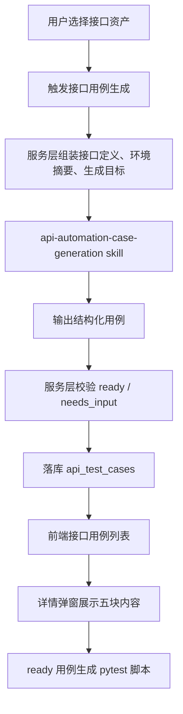

# 接口自动化用例结构增强 Spec

## 背景

当前接口自动化已经具备接口资产、接口环境、接口用例、测试脚本、运行记录和场景编排的基本链路。接口用例详情目前主要展示：

- 请求信息
- 预期结果
- 断言

这种结构对最简单的接口连通性检查足够，但不足以支撑 QA 审阅、补齐 `needs_input`、生成稳定脚本和后续报告追溯。典型问题是：

- 用例标题和优先级存在，但没有形成清晰的“基础信息”分区。
- 前置条件缺失，无法判断环境、鉴权、角色、依赖数据是否满足。
- 请求信息只展示 JSON，不区分 path、query、headers、body 和变量占位。
- 测试数据没有独立表达，缺少字段值来源、是否必填、是否待补充。
- 预期结果只有状态码时过薄，无法表达响应结构、业务字段和错误码。
- 断言和测试数据来源没有在前端可读化展示，用户难以判断 AI 是否凭空生成。

本轮目标是把接口自动化用例从“请求 + 状态码断言”的薄结构，升级为可审阅、可补齐、可生成脚本的结构化测试用例。

## 目标

- 接口自动化用例详情按 QA 视角展示五块核心内容：基础信息、前置条件、请求信息、测试数据、预期结果。
- 保留断言列表作为预期结果的可执行校验部分。
- 后端用例契约新增一等字段，避免把前置条件和测试数据塞进 `notes`、`variables` 或 `request.body`。
- Agent skill 明确输出新结构，并继续遵守不编造接口、字段、业务值和敏感值的边界。
- 前端详情弹窗按结构化信息展示，不再只把整段 JSON 原样堆出来。
- `needs_input` 的缺失项必须能从测试数据或前置条件中看出来。
- 脚本生成继续只消费 `ready` 状态用例。

## 非目标

- 不重新设计接口自动化总架构。
- 不改接口资产、接口环境、运行记录、场景编排的核心流程。
- 不引入新的前端状态管理库、代码编辑器或表单框架。
- 不做复杂的用例在线编辑器；本轮先支持结构化展示和后端契约。
- 不做压测、并发、Mock、Postman Collection 或抓包导入。
- 不把 UI 测试用例字段直接照搬为接口测试字段。

## 术语

### 基础信息

用于识别和管理用例的元数据，包括标题、优先级、覆盖类型、标签、来源、状态、关联接口和备注。

### 前置条件

执行该接口用例前必须满足的条件，包括环境、鉴权、角色、依赖资源、上游接口输出和业务状态。

### 请求信息

实际 HTTP 请求定义，包括 method、path、path 参数、query 参数、headers 覆盖、body、content type 和变量占位。

### 测试数据

请求和断言中使用的数据说明。它描述数据值、来源、是否必填、是否敏感、是否需要人工补充，而不是直接替代请求 payload。

### 预期结果

接口调用后应该得到的结果，包括状态码、响应结构、关键字段、业务结果、错误码和副作用说明。

### 断言

预期结果中可由自动化脚本执行的校验规则，例如 `status_code`、`jsonpath_exists`、`jsonpath_equals`、`schema_contains`。

## 当前项目边界

当前相关文件：

```text
apps/backend/app/agents/api_automation/schemas.py
apps/backend/app/agents/api_automation/skills/api-automation-case-generation/SKILL.md
apps/backend/app/agents/api_automation/skills/api-automation-case-generation/references/
apps/backend/app/schemas/api_automation.py
apps/backend/app/repositories/api_automation_repo.py
apps/backend/app/services/api_automation/service.py
apps/backend/app/services/api_automation/script_generator.py
apps/frontend/src/lib/api-client.ts
apps/frontend/src/app/(main)/projects/[projectId]/automation/api/page.tsx
apps/frontend/tests/api-automation-interface-set-copy-contract.test.mjs
apps/backend/tests/test_api_automation_generation_agent.py
apps/backend/tests/test_api_automation_schema_repo.py
```

现有 `api_test_cases` 已经有：

- `title`
- `priority`
- `source`
- `status`
- `tags_json`
- `request_json`
- `expected_json`
- `assertions_json`
- `variables_json`
- `data_origin_json`
- `notes`

本轮在此基础上增量补齐：

- `coverage`
- `preconditions_json`
- `test_data_json`

同时将已有 `data_origin_json` 作为响应字段返回给前端。

## 推荐方案

### 总体判断

只改 skill 和前端不够。最佳方案是同时改三处：

1. **后端契约**：新增结构化字段并落库。
2. **Agent skill**：要求 AI 生成新结构，缺数据时标记 `needs_input`。
3. **前端展示**：把详情弹窗改为 QA 可审阅的五块内容。

原因：

- 只改前端：仍然只能包装旧 JSON，缺少真实字段。
- 只改 skill：Agent 输出的字段无法稳定落库和展示。
- 不改后端：脚本生成、用例更新、测试和前端类型都会继续停留在薄结构。

## 数据契约

### Agent 输出

`ApiGeneratedCase` 推荐结构：

```python
class ApiGeneratedCase(BaseModel):
    title: str
    priority: str = "P2"
    endpoint_id: str
    tags: list[str] = Field(default_factory=list)
    coverage: Literal["positive", "negative", "boundary", "security", "scenario"] = "positive"
    source: Literal["ai_generated", "manual", "approved_test_case"] = "ai_generated"
    preconditions: list[str] = Field(default_factory=list)
    request: dict[str, Any]
    test_data: dict[str, Any] = Field(default_factory=dict)
    expected: dict[str, Any]
    assertions: list[dict[str, Any] | ApiAssertion]
    variables: dict[str, Any] = Field(default_factory=dict)
    data_origin: dict[str, Any] = Field(default_factory=dict)
    status: Literal["draft", "ready", "needs_input"] = "draft"
    notes: str = ""
```

### API 输出

`ApiTestCaseOut` 推荐增加：

```python
coverage: str
preconditions: list[str]
test_data: dict[str, Any]
data_origin: dict[str, Any]
```

保留：

```python
request: dict[str, Any]
expected: dict[str, Any]
assertions: list[dict[str, Any]]
variables: dict[str, Any]
notes: str
```

### API 更新

`ApiTestCaseUpdateIn` 推荐增加：

```python
coverage: str | None = None
preconditions: list[str] | None = None
test_data: dict[str, Any] | None = None
data_origin: dict[str, Any] | None = None
```

本轮可以先不做完整编辑 UI，但后端更新契约应同步补齐，避免后续编辑只能改旧字段。

### 数据库

新增字段：

```sql
ALTER TABLE api_test_cases ADD COLUMN coverage TEXT NOT NULL DEFAULT 'positive';
ALTER TABLE api_test_cases ADD COLUMN preconditions_json TEXT NOT NULL DEFAULT '[]';
ALTER TABLE api_test_cases ADD COLUMN test_data_json TEXT NOT NULL DEFAULT '{}';
```

当前项目没有独立迁移系统时，需在 schema 初始化时加入字段，并在启动或测试初始化路径中兼容已有 sqlite 数据库。已有 `data_origin_json` 不新增，只补序列化输出。

### 示例

```json
{
  "title": "智能体数据分析 - 正常创建分析任务",
  "priority": "P1",
  "endpoint_id": "apiend-analysis-create",
  "tags": ["agent", "analysis"],
  "coverage": "positive",
  "source": "ai_generated",
  "status": "needs_input",
  "preconditions": [
    "已配置可用接口环境",
    "当前用户具备创建智能体分析任务权限",
    "存在可访问的智能体 ID"
  ],
  "request": {
    "method": "POST",
    "path": "/openapi/v1/agent/analysis/",
    "path_params": {},
    "query": {},
    "headers": {},
    "body": {}
  },
  "test_data": {
    "agent_id": {
      "value": "${agent_id}",
      "source": "environment_variable",
      "required": true,
      "sensitive": false,
      "status": "missing",
      "note": "OpenAPI 未提供可用样例，需要用户在接口环境变量中补充 agent_id"
    }
  },
  "expected": {
    "status_code": 200,
    "business_result": "创建分析任务成功"
  },
  "assertions": [
    {
      "type": "status_code",
      "expected": 200
    }
  ],
  "variables": {},
  "data_origin": {
    "request.method": "openapi",
    "request.path": "openapi",
    "test_data.agent_id": "needs_input",
    "expected.status_code": "openapi"
  },
  "notes": "缺少 agent_id 样例，补齐后可转为 ready。"
}
```

## Skill 改造

### 主 Skill

文件：

```text
apps/backend/app/agents/api_automation/skills/api-automation-case-generation/SKILL.md
```

需要补充：

- 输出必须包含 `preconditions` 和 `test_data`。
- 每条用例必须表达基础信息、前置条件、请求信息、测试数据、预期结果、断言。
- `ready` 用例必须满足：
  - path 参数都有具体值或变量占位。
  - required query/body 字段都有值、样例、默认值、枚举或环境变量引用。
  - 鉴权由环境提供或明确不需要鉴权。
  - 至少有 `status_code` 断言。
- `needs_input` 用例必须满足：
  - 在 `test_data` 中写明缺失字段。
  - 在 `preconditions` 或 `notes` 中写明缺失环境、鉴权、角色或依赖数据。
  - 不生成伪造业务值。
- 不输出敏感明文。token、cookie、password 只能以变量引用或环境引用表达。

### references

建议新增或扩展：

```text
apps/backend/app/agents/api_automation/skills/api-automation-case-generation/references/case-structure.md
apps/backend/app/agents/api_automation/skills/api-automation-case-generation/references/request-data-rules.md
apps/backend/app/agents/api_automation/skills/api-automation-case-generation/references/assertion-guidelines.md
```

`case-structure.md` 内容：

- 基础信息字段说明。
- 前置条件写法。
- 测试数据对象格式。
- `ready` 与 `needs_input` 判定。
- 不确定信息如何表达。

`request-data-rules.md` 保留现有“不编造业务值”规则，并新增：

- required 字段没有样例时写入 `test_data.<field>.status = "missing"`。
- 环境变量引用统一使用 `${variable_name}`。
- 敏感值只写变量引用，不写明文。

`assertion-guidelines.md` 保留现有断言规则，并新增：

- 断言来源必须能在 `data_origin` 中说明。
- 只有文档明确字段值时才使用 `jsonpath_equals`。
- 对 ID、时间戳、token 等动态字段只能使用存在性或结构断言。

## 后端改造

### Agent Schema

改造 `apps/backend/app/agents/api_automation/schemas.py`：

- `ApiGeneratedCase` 新增 `preconditions`、`test_data`。
- 保留 `coverage`，并确保 service 落库。
- 保留 `data_origin`，并确保 API 输出可见。

### API Schema

改造 `apps/backend/app/schemas/api_automation.py`：

- `ApiTestCaseOut` 新增 `coverage`、`preconditions`、`test_data`、`data_origin`。
- `ApiTestCaseUpdateIn` 新增对应可选字段。
- 前端不需要编辑时也应返回完整字段。

### Repository

改造 `apps/backend/app/repositories/api_automation_repo.py`：

- `create_api_test_case()` 增加 `coverage`、`preconditions`、`test_data`。
- `update_api_test_case()` 的 `json_fields` 增加：
  - `preconditions -> preconditions_json`
  - `test_data -> test_data_json`
  - `data_origin -> data_origin_json`
- 查询列表时返回新字段列。

### Service

改造 `apps/backend/app/services/api_automation/service.py`：

- 生成任务持久化时保存 `generated_case.coverage`、`preconditions`、`test_data`、`data_origin`。
- `_serialize_api_test_case()` 返回新字段。
- 生成脚本前继续拒绝非 `ready` 用例。
- 可选增加轻量校验：
  - `ready` 用例缺少 `status_code` 断言时降级为 `needs_input` 或报错。
  - `needs_input` 用例必须有 `notes`、缺失 `test_data` 或前置说明之一。

### Script Generator

`script_generator.py` 第一阶段不需要大改。

规则：

- 执行数据仍从 `request`、`expected`、`assertions` 读取。
- `test_data` 主要用于审阅、补齐和解释来源，不直接替代请求执行 payload。
- 后续做参数化数据集时，再把 `test_data` 转换为 `data/*.json` 中的描述性元数据。

## 前端改造

### API 类型

改造 `apps/frontend/src/lib/api-client.ts`：

```ts
export type ApiAutomationTestCase = {
  id: string;
  project_id: string;
  endpoint_id: string | null;
  title: string;
  priority: string;
  coverage: string;
  source: string;
  status: string;
  tags: string[];
  preconditions: string[];
  request: Record<string, unknown>;
  test_data: Record<string, unknown>;
  expected: Record<string, unknown>;
  assertions: Record<string, unknown>[];
  variables: Record<string, unknown>;
  data_origin: Record<string, unknown>;
  notes: string;
  created_at: string;
  updated_at: string;
};
```

### 详情弹窗

改造位置：

```text
apps/frontend/src/app/(main)/projects/[projectId]/automation/api/page.tsx
```

当前详情区从三块：

```text
请求信息
预期结果
断言
```

改为六块：

```text
基础信息
前置条件
请求信息
测试数据
预期结果
断言
```

推荐展示：

- 基础信息：标题、优先级、覆盖类型、状态、来源、标签、更新时间。
- 前置条件：列表展示；为空时显示“无额外前置条件”。
- 请求信息：method/path 放在首行，query、headers、body 分块展示。
- 测试数据：按字段展示 value/source/required/status/note；`missing` 高亮。
- 预期结果：状态码、业务结果、响应结构、错误码分块展示。
- 断言：按断言类型、JSONPath、期望值展示；保留 JSON fallback。

不要在详情里加入说明性教学文案。页面只展示用例事实和可操作信息。

### 列表

接口用例列表可小幅增强：

- 保留用例名称、优先级、更新时间。
- 覆盖类型或状态列不在本轮新增。当前契约测试要求保持列表精简，本轮只改详情弹窗。
- `needs_input` 可在详情弹窗里体现，避免列表改动扩大范围。

## 数据流



## 状态规则

### ready

满足：

- 请求 method/path 与接口定义一致。
- path/query/body 中 required 字段已有可执行值或变量引用。
- 鉴权要求已有接口环境支持。
- 至少有 `status_code` 断言。
- 不包含缺失的必填测试数据。

### needs_input

任一情况成立：

- 缺少 path 参数、required query 或 required body 样例。
- 缺少接口环境、鉴权配置或必要变量。
- 依赖上游资源 ID，但输入没有提供。
- OpenAPI 只有 schema，没有业务可用值。
- 预期业务结果无法从文档、用户目标或历史用例判断。

`needs_input` 必须在 `test_data` 或 `preconditions` 中说明缺什么。

### draft

人工编辑或生成中间态使用。第一版 Agent 可以少用 `draft`，优先输出 `ready` 或 `needs_input`。

## 测试策略

### 后端

更新或新增：

```text
apps/backend/tests/test_api_automation_generation_agent.py
apps/backend/tests/test_api_automation_schema_repo.py
apps/backend/tests/test_api_automation_scenarios_tasks.py
```

覆盖：

- Agent 结构化输出包含 `preconditions`、`test_data`、`data_origin`。
- `ready` 用例保存后 API 输出完整字段。
- `needs_input` 用例保存缺失测试数据说明。
- repository 创建和更新能处理新增 JSON 字段。
- 旧数据缺少新增字段时序列化返回默认值。
- 非 `ready` 用例仍不能生成脚本。

轻量验证：

```powershell
cd apps/backend
uv run pytest tests/test_api_automation_generation_agent.py tests/test_api_automation_schema_repo.py -q
```

### 前端

更新：

```text
apps/frontend/tests/api-automation-interface-set-copy-contract.test.mjs
```

覆盖：

- 详情弹窗包含 `基础信息`、`前置条件`、`请求信息`、`测试数据`、`预期结果`、`断言`。
- 前端类型包含 `preconditions`、`test_data`、`data_origin`、`coverage`。
- 请求信息仍展示 method/path/query/headers/body。
- `needs_input` 或缺失测试数据在详情中有可见标记。

轻量验证：

```powershell
cd apps/frontend
node --test tests/api-automation-interface-set-copy-contract.test.mjs
```

## 验收标准

1. 接口用例详情不再只有请求、预期和断言三块。
2. 详情弹窗显示基础信息。
3. 详情弹窗显示前置条件。
4. 详情弹窗显示请求信息。
5. 详情弹窗显示测试数据。
6. 详情弹窗显示预期结果。
7. 详情弹窗显示断言。
8. Agent 输出的接口用例包含 `preconditions`。
9. Agent 输出的接口用例包含 `test_data`。
10. 后端 API 返回 `preconditions`、`test_data`、`data_origin`、`coverage`。
11. 缺少必填业务数据时，用例状态为 `needs_input`。
12. `needs_input` 用例能说明缺失项。
13. `ready` 用例至少包含 `status_code` 断言。
14. 脚本生成仍只消费 `ready` 用例。
15. 前端契约测试覆盖新增详情分区。
16. 后端测试覆盖新增字段保存和序列化。

## 风险与处理

### 风险：字段增加后旧数据库缺列

处理：

- schema 初始化加入新列。
- 若当前项目没有正式迁移系统，实现轻量补列逻辑或在测试数据库初始化中确保新列存在。
- 序列化时对空值提供默认 `[]` 或 `{}`。

### 风险：AI 把测试数据和值重复写入 request 和 test_data

处理：

- `request` 是执行数据。
- `test_data` 是数据说明和来源。
- Skill 中明确二者职责。

### 风险：前端详情过度 JSON 化

处理：

- method/path、前置条件、测试数据字段使用结构化 UI。
- 对复杂 body、expected、assertions 保留 JSON block fallback。

### 风险：范围扩大到完整编辑器

处理：

- 本轮只做结构化生成、落库、展示。
- 编辑能力只补后端契约，不强制做完整前端编辑表单。

### 风险：断言仍然过薄

处理：

- 本轮至少要求 `status_code`。
- 根据 OpenAPI response schema 自动补 `schema_contains` 或 `jsonpath_exists`。
- 只有文档明确字段值时才生成 `jsonpath_equals`。

## 实施顺序

1. 更新后端 seed schema 和已有 sqlite 补列路径。
2. 更新 `ApiGeneratedCase`、`ApiTestCaseOut`、`ApiTestCaseUpdateIn`。
3. 更新 repository 创建、更新和查询字段。
4. 更新 service 保存生成结果和序列化输出。
5. 更新 `api-automation-case-generation` skill 和 references。
6. 更新前端 `ApiAutomationTestCase` 类型。
7. 更新接口用例详情弹窗为六块展示。
8. 更新后端测试。
9. 更新前端契约测试。
10. 运行后端和前端轻量验证。
