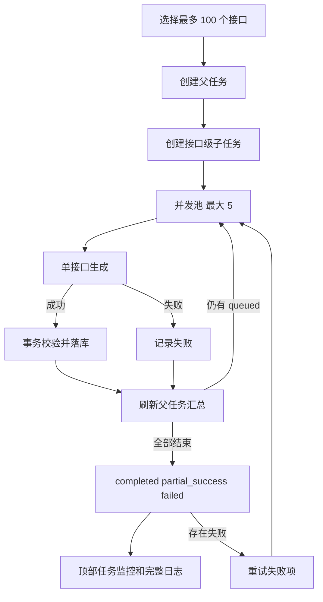

# 接口自动化批量用例生成设计

## 背景

当前接口自动化生成任务会把所选接口一次性交给单个 Agent。一个接口生成 16 条用例时，模型输出已达到 8192 token 上限，导致结构化 JSON 被截断；一次选择 100 个接口会进一步放大输出超限、失败回滚和任务不可恢复的问题。

本设计把一次批量生成拆成一个父任务和多个接口级子任务。每个接口独立生成、校验和落库，允许部分成功，并提供失败项人工重试。

## 目标

- 一次支持选择 100 个接口生成用例。
- 同时最多执行 5 个接口子任务。
- 子任务失败后不自动重试。
- 每个接口生成成功后立即事务落库，不等待其他接口。
- 所有接口进入终态后，父任务显示成功、失败和总数。
- 日志展示全部接口的执行结果。
- 用户可以仅重试失败接口，成功接口不重复生成。

## 非目标

- 不引入外部任务队列或新的基础设施。
- 不实现自动重试、动态并发或优先级调度。
- 不把多个接口合并到同一次模型调用。
- 不回滚已经成功落库的接口用例。

## 核心方案

### 任务模型

一次批量生成创建一个父任务 `api_generation_runs`，并为每个接口创建一个子任务 `api_generation_items`。

父任务状态：

- `queued`：已创建，尚未调度。
- `running`：至少一个子任务正在执行或等待执行。
- `completed`：全部子任务成功。
- `partial_success`：全部子任务已结束，且同时存在成功和失败。
- `failed`：全部子任务失败。

子任务状态：

- `queued`
- `running`
- `completed`
- `failed`

父任务只有在全部子任务进入 `completed` 或 `failed` 后才进入终态。这里的“完成”表示处理结束，不等于全部生成成功。

### 并发调度

- 接口用例生成模块全局最多同时运行 5 个子任务；多个父任务共享同一个执行池。
- 每个子任务只包含一个接口定义、环境摘要、生成目标和相关历史用例。
- 子任务失败后立即记录失败，不自动重试。
- 调度器在任一子任务结束后补充下一个 `queued` 子任务，直到全部结束。
- 第一版使用进程内共享的 `asyncio.Semaphore(5)`，不新增 Celery、Redis 或消息队列。

### 即时落库

每个子任务成功后，在独立数据库事务中：

1. 校验模型返回的接口 ID、请求方法、路径和结构化用例。
2. 写入该接口生成的全部 `api_test_cases`。
3. 将子任务更新为 `completed`，记录用例数量和耗时。
4. 刷新父任务的成功数、失败数和完成数。

事务失败时，该接口本次生成的用例不部分落库，子任务记为 `failed`。其他接口已成功落库的数据不受影响。

### 幂等约束

同一子任务的一次尝试必须具备稳定的 `attempt_id`。生成用例写入时关联：

- `generation_run_id`
- `generation_item_id`
- `attempt_id`

同一 `generation_item_id + attempt_id` 不得重复落库。失败项重试使用新的 `attempt_id`，成功子任务不会重新入队。

## 失败项重试

父任务详情在存在失败子任务时显示“重试失败项”。

点击后：

1. 只选择当前状态为 `failed` 的子任务。
2. 为这些子任务创建新的尝试记录并重置为 `queued`。
3. 父任务重新进入 `running`。
4. 仍按最大并发 5 执行。
5. 原成功子任务及其用例保持不变。
6. 新尝试成功后正常落库并更新汇总；再次失败则保留最新错误。

重试不创建新的父任务，避免同一批接口在任务中心产生多条难以关联的记录。日志按尝试保留历史。

## 数据结构

新增 `api_generation_items`：

| 字段 | 说明 |
| --- | --- |
| `id` | 子任务 ID |
| `generation_run_id` | 父任务 ID |
| `endpoint_id` | 接口 ID |
| `status` | 子任务状态 |
| `attempt_count` | 已尝试次数 |
| `generated_case_count` | 最新成功尝试生成的用例数 |
| `error_message` | 最新失败原因 |
| `started_at` | 最新尝试开始时间 |
| `finished_at` | 最新尝试结束时间 |
| `created_at` | 创建时间 |
| `updated_at` | 更新时间 |

新增 `api_generation_item_attempts` 保存每次尝试：

| 字段 | 说明 |
| --- | --- |
| `id` | `attempt_id` |
| `generation_item_id` | 子任务 ID |
| `attempt_no` | 尝试序号 |
| `status` | 尝试状态 |
| `generated_case_count` | 生成用例数 |
| `error_message` | 失败原因 |
| `started_at` | 开始时间 |
| `finished_at` | 结束时间 |

父任务汇总值从子任务状态实时计算，不额外维护容易漂移的计数字段。

## API 契约

父任务详情增加：

```json
{
  "id": "apigen-...",
  "status": "partial_success",
  "total_count": 100,
  "completed_count": 100,
  "success_count": 93,
  "failed_count": 7,
  "generated_case_count": 1264,
  "items": []
}
```

失败项重试：

```text
POST /api/v1/projects/{project_id}/api-automation/generation-runs/{run_id}/retry-failed
```

仅当父任务存在失败子任务且当前没有运行中的子任务时允许调用。重复点击返回冲突错误，不重复排队。

## 日志与任务监控

### 顶部任务监控

运行中显示：

```text
接口用例生成中：已完成 48/100，成功 45，失败 3
```

终态显示：

```text
接口用例生成已完成：成功 93，失败 7，共 100
```

只有 `success_count == total_count` 时才显示“全部生成成功”。

### 任务日志

日志按接口展示：

- 接口方法和路径。
- 子任务状态。
- 尝试次数。
- 生成用例数。
- 开始时间、结束时间和耗时。
- 失败错误。

父任务结束时追加汇总日志，列出总数、成功数、失败数、用例总数和总耗时。失败项重试追加新的尝试日志，不覆盖历史。

## 错误处理

- 模型输出 `finish_reason=length`：子任务失败，错误显示“模型输出超出长度限制”。
- 结构化输出非法：子任务失败，不携带残缺 tool call 自动重试。
- 模型 API 超时或限流：子任务失败，不自动重试，可由用户点击“重试失败项”。
- 数据库事务失败：回滚当前接口用例并标记子任务失败。
- 服务重启：启动时将遗留 `running` 子任务恢复为 `failed`，由用户决定是否重试。

## 数据流



## 测试策略

最小必要测试：

1. 单个或多个父任务同时存在时，全局最多执行 5 个接口子任务。
2. 一个接口成功后立即落库，不等待其他接口。
3. 部分接口失败时父任务为 `partial_success`，成功数据保留。
4. 全部成功时父任务为 `completed`。
5. 全部失败时父任务为 `failed`。
6. 失败子任务不自动重试。
7. “重试失败项”只重新排队失败接口。
8. 重复点击重试不会重复排队或重复落库。
9. 日志包含全部接口结果和每次尝试。
10. 顶部监控展示完成数、成功数、失败数和总数。

## 验收标准

1. 一次可提交 100 个接口。
2. 单个或多个批量任务的全局实际并发不超过 5。
3. 成功接口用例即时落库。
4. 单个接口失败不影响其他接口。
5. 系统不自动重试失败接口。
6. 父任务准确显示 `completed`、`partial_success` 或 `failed`。
7. 顶部任务监控不把“处理完成”误报为“全部成功”。
8. 日志可查看 100 个接口的全部结果。
9. 用户可仅重试失败项。
10. 重试不会重复生成已成功接口的用例。

## 实施边界

第一版只增加接口级子任务、5 并发、即时落库、汇总展示和失败项重试。外部队列、自动重试、动态限流和跨实例调度在出现实际吞吐或多实例需求后再引入。
