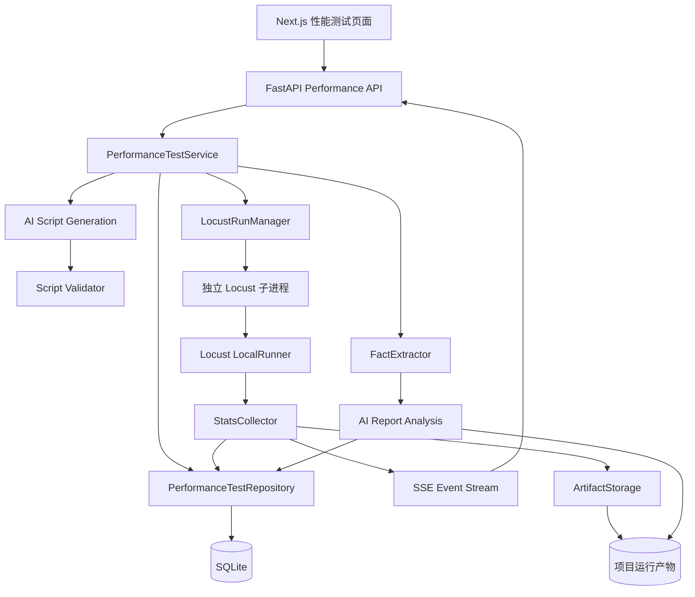
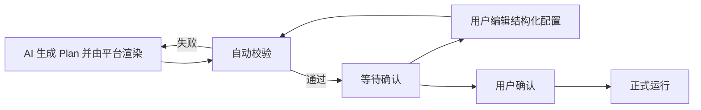
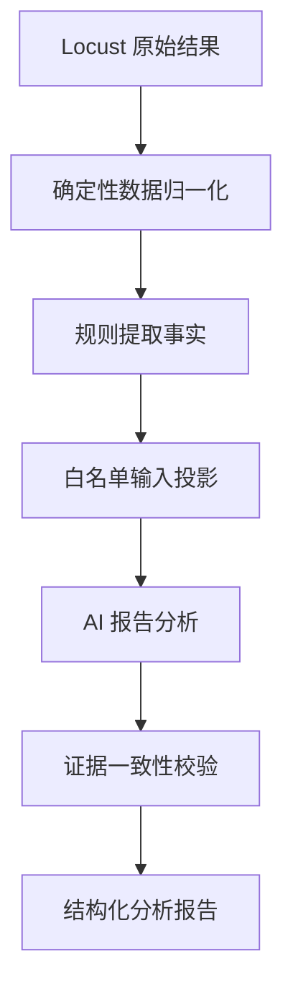

# Locust 性能测试模块设计 Spec

**日期：** 2026-07-13  
**最后更新：** 2026-07-14
**状态：** 第一期核心闭环已实现，待全量前端构建验收
**适用项目：** AI 测试系统  
**目标版本：** 性能测试第一期  

## 1. 背景

当前系统已经具备接口自动化能力，包括 OpenAPI 导入、接口定义管理、API 环境、认证配置、请求数据、接口调试、测试用例、pytest + requests 脚本生成、运行记录和报告能力。

项目导航已经预留项目级“性能测试”入口：

```text
/projects/:projectId/performance-tests
```

性能测试模块使用 Locust 作为执行和统计内核。系统不重写压测调度器、请求统计、百分位计算和失败聚合，而是在现有项目中重新实现 Locust 风格的页面，并增加项目隔离、接口复用、任务管理、脚本审核、产物归档和 AI 提效能力。

## 2. 设计目标

第一期完成以下闭环：

1. 用户从当前项目的接口自动化资产中选择一个接口。
2. 用户选择 API 环境并确认请求数据。
3. 用户配置并发用户数、启动速率、正式测量时长、等待时间和请求超时。
4. AI 根据最小化接口上下文生成结构化 `LocustScriptPlan`，无 AI 时平台也可以生成默认 Plan。
5. 平台使用受控模板确定性渲染完整 Locust 脚本，并执行结构、语法、导入和可选冒烟校验。
6. 用户预览脚本，编辑请求、数据模板和成功规则后确认脚本版本。
7. 后端在独立子进程中使用 Locust LocalRunner 执行压测。
8. 项目原生页面实时展示 Locust 统计、图表、失败和异常。
9. 系统保存完整运行快照、统计结果和下载产物。
10. 压测结束后，后端先确定性提取事实，再由 AI 生成性能结果分析报告。

## 3. 核心原则

### 3.1 Locust 是唯一性能执行内核

- 用户调度使用 Locust Runner。
- HTTP 请求使用 Locust `HttpUser` 和 `self.client`。
- 请求统计、响应时间、百分位、RPS、失败和异常使用 Locust 原生能力。
- 平台不得实现另一套与 Locust 并行的统计口径。
- 平台扩展只负责配置、权限、任务、快照、报告和 AI 分析。

### 3.2 页面重做，执行逻辑不重写

- 不使用 iframe 嵌入 Locust Web UI。
- 不要求用户跳转到 Locust 原生页面。
- Next.js 页面参考 Locust 的信息架构和交互逻辑。
- 页面样式、权限、项目切换和路由遵循当前系统规范。

### 3.3 AI 不参与实时调度

- AI 负责生成 Locust 脚本。
- AI 负责压测完成后的结果分析。
- AI 不自动调整用户数、启动速率或运行时长。
- AI 不自动停止压测。
- Locust 的运行过程必须保持确定性和可复现。

### 3.4 模型输入使用白名单

- 只显式构造模型需要的输入对象。
- 禁止把完整数据库实体直接序列化给模型。
- 新增数据库字段不得自动进入模型输入。
- Secret、认证值、真实请求数据和无关字段不得进入模型上下文。

### 3.5 配置、脚本和运行相互分离

- 性能测试配置可以重复使用。
- AI 生成脚本需要独立版本管理。
- 每次运行引用不可变的脚本版本。
- 每次运行保存接口、环境、负载和目标快照。

### 3.6 AI 不直接提供任意可执行代码

- AI 输出结构化 `LocustScriptPlan`，不得输出任意导入、文件操作或进程操作。
- 平台拥有并测试 Locust 脚本模板，后端根据 Plan 确定性渲染完整 `locustfile.py`。
- 模型不可用时仍可根据接口定义和用户配置生成基础脚本。
- 第一期代码预览只读；用户通过结构化表单编辑请求配置、数据模板和成功规则。
- 后续如开放任意 Python 编辑，必须使用容器级隔离，不能只依赖 AST 黑名单。

## 4. 第一期范围

### 4.1 包含范围

- 单项目性能测试。
- 单机 Locust LocalRunner。
- 一次任务只选择一个接口。
- 从接口自动化模块读取接口和环境。
- 支持覆盖 Headers、Path、Query 和 Body 请求数据。
- 基础负载参数可配置。
- 可选性能目标。
- AI 辅助生成结构化脚本计划。
- 平台模板渲染完整 Locust 脚本。
- 用户预览脚本，编辑结构化配置并确认脚本。
- 脚本安全校验和版本管理。
- Locust 风格实时统计页面。
- CSV、JSON 和 HTML 结果产物。
- AI 性能结果报告分析。
- 任务停止、取消和异常恢复。
- 任务中心和操作日志集成。

### 4.2 不包含范围

- 一次任务选择多个独立接口。
- 接口权重和随机流量比例。
- 接口编排和接口间参数关联。
- 业务场景压测。
- 阶梯加压和自定义 LoadShape。
- 用户直接编写 Locust Shape 代码。
- 分布式 master/worker。
- 远程 Runner 节点管理。
- AI 自动配置压测任务。
- AI 实时调整压测参数。
- AI 自动停止压测。
- CPU、内存、数据库、Redis 和链路追踪的根因诊断。
- 自动修复性能问题。

## 5. 后续扩展边界

多接口只能通过后续“接口编排/业务场景”能力进入性能测试，不在单接口模式中增加多接口权重。

目标类型预留：

```text
endpoint
scenario
```

第一期只允许：

```json
{
  "target_type": "endpoint"
}
```

后续场景压测可以增加：

```json
{
  "target_type": "scenario",
  "scenario_id": "api-scenario-123"
}
```

## 6. 用户流程


## 7. 性能测试配置

### 7.1 基础信息

- 任务名称。
- 任务描述，可选。
- 所属项目。
- 目标类型，第一期固定为 `endpoint`。
- 接口 ID。
- API 环境 ID。

### 7.2 请求配置

默认读取接口自动化中的：

- Method。
- Path。
- OpenAPI 参数定义。
- 用户明确指定的接口自动化测试用例请求数据，可选。
- 公共 Headers。
- API 环境 Base URL。
- 认证配置引用。

允许用户在性能任务中覆盖：

- Path 参数。
- Query 参数。
- 非敏感 Headers。
- Request Body。
- 请求超时。

禁止自动使用“最近一次接口调试”作为数据源。创建任务时生成可见、可编辑的请求配置，用户确认后才可生成脚本。

请求数据合并优先级：

```text
性能任务覆盖值
    >
用户指定的接口自动化测试用例
    >
OpenAPI 示例或默认值
    >
类型安全的占位值
```

第一期支持以下受控变量模板，由平台运行时辅助函数解析：

```text
${uuid}
${sequence}
${timestamp}
${random_int:1:10000}
${user_index}
```

运行快照保存随机种子。AI 不得自行生成随机数据执行代码。

### 7.3 负载配置

第一期支持以下基础参数：

| 字段 | 含义 | 约束 |
| --- | --- | --- |
| users | 并发用户数 | 大于 0，受系统上限约束 |
| spawn_rate | 每秒启动用户数 | 大于 0 |
| measurement_duration_seconds | 达到目标用户数后的正式测量时长 | 大于 0，受系统上限约束 |
| wait_time_min_seconds | 最小请求等待时间 | 大于等于 0.1 |
| wait_time_max_seconds | 最大请求等待时间 | 不小于最小等待时间 |
| request_timeout_seconds | 单请求超时 | 大于 0 |

第一期负载模型固定为闭合并发用户模型。Runner 先按 `spawn_rate` 达到目标用户数，再开始正式测量计时。爬升阶段可以展示实时图表，但不进入性能目标判定。用户数、启动速率和测量时长由平台 Runner 控制，不允许生成脚本自行覆盖。

### 7.4 性能目标

性能目标为可选配置。默认采用 Locust 原生统计模式，只展示结果，不强制设定统一门槛。

用户开启性能目标后，可以配置：

- 最大失败率。
- 最大平均响应时间。
- 最大 P95 响应时间。
- 最低平均 RPS。

判定在任务结束后执行，第一期不因阈值不达标提前终止压测。

运行状态和目标状态必须分离：

```text
run.status = completed
goal_result.status = failed
```

`completed` 表示 Locust 正常执行结束，不代表性能目标通过。

## 8. 总体架构



## 9. 后端目录结构

```text
apps/backend/app/
├── api/v1/
│   └── performance_tests.py
├── schemas/
│   └── performance_test.py
├── repositories/
│   └── performance_test_repo.py
├── services/
│   └── performance_testing/
│       ├── __init__.py
│       ├── service.py
│       ├── runner.py
│       ├── runtime.py
│       ├── stats_collector.py
│       ├── reporting.py
│       └── artifact_storage.py
└── agents/
    └── performance_testing/
        ├── __init__.py
        ├── script_generation/
        │   ├── __init__.py
        │   ├── agent.py
        │   ├── service.py
        │   ├── schemas.py
        │   ├── input_projector.py
        │   ├── validator.py
        │   └── skills/
        │       └── locust-script-generation/
        │           ├── SKILL.md
        │           └── references/
        │               ├── locust-patterns.md
        │               ├── security-rules.md
        │               └── output-contract.md
        └── report_analysis/
            ├── __init__.py
            ├── agent.py
            ├── service.py
            ├── schemas.py
            ├── input_projector.py
            ├── fact_extractor.py
            └── skills/
                └── performance-report-analysis/
                    ├── SKILL.md
                    └── references/
                        ├── analysis-rules.md
                        ├── evidence-rules.md
                        └── output-contract.md
```

## 10. 后端分层职责

### 10.1 API 层

`performance_tests.py` 只负责：

- 项目和用户权限校验。
- 请求参数解析。
- 调用 Service。
- 返回 Pydantic Schema。
- SSE 事件响应。
- 报告和产物下载。

API 层不得直接启动 Locust、读写运行文件或计算性能统计。

### 10.2 Service 层

`service.py` 负责业务编排：

- 创建和修改性能测试配置。
- 校验接口和环境属于当前项目。
- 构造脚本生成输入。
- 调用脚本生成 Agent。
- 调用脚本校验器。
- 创建脚本版本。
- 用户确认脚本。
- 创建不可变运行快照。
- 启动或停止 Runner。
- 固化最终结果。
- 触发性能目标判定。
- 触发 AI 报告分析。

### 10.3 Repository 层

`performance_test_repo.py` 负责 SQLite 持久化：

- 性能测试定义。
- 脚本版本。
- 运行记录。
- 性能目标判定。
- AI 分析任务和结果。
- 最终统计摘要。

### 10.4 Runner 层

`runner.py` 只管理进程生命周期：

```python
class LocustRunManager:
    def start(self, run_id: str) -> None: ...
    def stop(self, run_id: str) -> None: ...
    def recover_interrupted_runs(self) -> None: ...
    def get_process_status(self, run_id: str) -> str: ...
```

### 10.5 Runtime 层

`runtime.py` 是独立 Locust 子进程入口：

```python
def execute_locust_run(run_id: str, runtime_config_path: Path) -> int:
    ...
```

职责：

1. 读取不可变运行快照。
2. 加载已确认的 `locustfile.py`。
3. 注入运行时环境和 Secret 引用。
4. 创建 Locust `Environment`。
5. 创建 `LocalRunner`。
6. 注册统计和异常监听器。
7. 使用平台负载参数启动 Runner。
8. 接收停止信号。
9. 到达时长后优雅停止。
10. 写入最终结果和退出状态。

## 11. 为什么使用独立 Locust 子进程

- 避免 Locust 占用 FastAPI 主进程资源。
- 避免压测异常拖垮 API 服务。
- 支持独立停止和超时终止。
- 便于识别后端重启造成的中断任务。
- 便于后续迁移到 master/worker 或远程 Runner。
- 便于隔离平台渲染脚本的运行权限。

第一期不启动 Locust 原生 Web UI。

## 12. AI 脚本生成

### 12.1 输入白名单

`script_generation/input_projector.py` 从完整业务对象中投影以下字段：

```python
class LocustScriptGenerationInput:
    method: str
    path: str
    request_name: str
    path_parameters: list[RequestParameter]
    query_parameters: list[RequestParameter]
    required_headers: list[RequestParameter]
    body_schema: dict | None
    request_example: dict | list | str | None
    authentication_type: str | None
    request_timeout_seconds: float
    wait_time_min_seconds: float
    wait_time_max_seconds: float
```

只允许传入：

- Method。
- Path 模板。
- 稳定请求名称。
- Path、Query 和必需 Header 的 Schema。
- Body Schema。
- 已脱敏的请求示例。
- 认证类型，不包含认证值。
- 请求超时和等待时间。

不得传入：

- 项目完整信息。
- 数据库完整实体。
- 创建人和审计字段。
- Base URL 真实值。
- Token、Cookie、API Key、用户名和密码。
- 完整接口文档原文。
- 无关接口。
- 历史任务和历史报告。
- Locust 统计字段。
- 前端展示字段。

### 12.2 Base URL 和认证

模型统一生成：

```python
self.host = os.environ["PERFORMANCE_BASE_URL"]
```

性能模块不创建第二套认证配置，只保存 `api_environment_id`。运行进入 `preparing` 时调用接口自动化现有环境解析器，统一解析 Base URL、公共 Header、Bearer、Cookie、静态 Header 和其他已支持的认证类型。

- 非敏感环境配置进入运行快照。
- Secret 只写入临时运行文件并注入子进程。
- 运行开始后的环境修改不影响当前运行。
- 重新运行使用接口自动化环境中的最新认证配置。
- 第一期认证流量不进入目标接口的 Locust 统计。

### 12.3 模型输出

模型必须返回结构化结果：

```python
class LocustScriptGenerationResult:
    plan: LocustScriptPlan
    assumptions: list[str]
    required_runtime_variables: list[str]
```

- `plan` 为结构化脚本计划。
- `assumptions` 展示 AI 对数据和接口行为的假设。
- `required_runtime_variables` 只包含变量名，不包含变量值。

平台校验 Plan 后，使用版本化模板渲染完整单文件 `locustfile.py`。模型不生成 Shell 命令、依赖安装命令、导入语句或额外 Python 包。

### 12.4 允许的脚本能力

- `HttpUser`。
- `@task`。
- `between`。
- `self.client.request`。
- `catch_response`。
- 安全的 Python 标准库。
- 项目提供的受控运行时辅助函数。

### 12.5 稳定统计名称

请求统计名称必须使用 Method 和 Path 模板：

```text
GET /api/users/{user_id}
```

禁止使用解析后的动态值：

```text
GET /api/users/10001
GET /api/users/10002
```

否则同一接口会被拆成多个 Locust 统计条目。

## 13. 脚本校验

### 13.1 输出契约校验

- 必须是完整 Python 文件。
- 必须存在一个 `HttpUser` 子类。
- 必须至少存在一个 `@task`。
- 必须设置等待时间。
- 不允许 Markdown 代码围栏。
- 不允许依赖安装命令。

### 13.2 Plan 与模板安全校验

Plan 禁止表达：

```text
subprocess
os.system
eval
exec
compile
__import__
socket
shutil.rmtree
pathlib.Path.unlink
任意文件写入
任意进程启动
动态模块加载
```

平台模板允许使用：

```text
os.environ
json
random
uuid
datetime
time
locust
```

`os` 只能读取允许的环境变量。AST 校验作为渲染后防御措施保留，但不作为任意 Python 的安全沙箱。

### 13.3 Locust 结构校验

- 只能存在一个入口 `HttpUser`。
- Host 必须来自 `PERFORMANCE_BASE_URL`。
- 请求必须通过 `self.client` 发起。
- 请求名称必须稳定。
- 请求必须使用任务配置的超时。
- 不允许硬编码真实域名和认证凭证。
- 不允许脚本控制 users、spawn rate 和 duration。
- 不允许导入未批准的第三方依赖。

### 13.4 语法与隔离导入校验

执行：

```text
python -m py_compile locustfile.py
```

然后在受限子进程中加载模块，检查：

- 模块可以导入。
- 可以发现 `HttpUser`。
- 导入阶段不会发送请求。
- 导入阶段不会访问文件、启动进程或进入死循环。

### 13.5 分级冒烟校验

默认参数：

```text
1 个用户
1 用户/秒
最多 1 次请求
最多运行 10 秒
```

校验分为：

1. Plan Schema 校验，必须通过。
2. 生成代码编译和受限导入，必须通过。
3. 无网络请求构造预检，必须通过。
4. 真实冒烟请求，根据环境和接口风险执行。

真实冒烟校验验证：

- 脚本可以启动。
- 请求可以构造。
- Locust 可以产生统计。
- 停止机制正常。

生产环境默认禁止真实冒烟。对于创建、删除、支付、发送消息等有副作用的接口，必须由用户明确允许真实冒烟请求。真实冒烟失败默认阻止确认；拥有确认权限的用户可以填写原因后跳过，脚本标记为“未通过真实冒烟”，并写入操作日志。前三层校验不得跳过。

## 14. 脚本预览、编辑和确认

脚本状态：

```text
generating
validation_failed
pending_confirmation
confirmed
superseded
```

流程：



规则：

- 校验通过后不能自动启动正式压测。
- 用户必须预览并确认脚本。
- 用户编辑请求配置、数据模板或成功规则后创建新版本并重新渲染脚本。
- 编辑后必须重新执行全部校验。
- 已确认版本不可原地覆盖。
- 每次运行引用固定脚本版本。

## 15. Locust 请求成功与失败

第一期所有请求统一使用 `catch_response=True`，并遵循以下成功规则：

- 网络异常记为失败。
- 允许的 HTTP 状态码为必选规则，默认读取 OpenAPI 中声明的 2xx。
- 3xx 默认不视为业务成功，用户明确配置时除外。
- 可选配置 JSONPath 字段存在或等值判断，以支持 `code == 0` 等业务成功语义。
- 未满足状态码或业务规则时调用 `response.failure()`。
- 不直接把接口自动化中的全部 pytest 断言搬入压测脚本。

复杂业务断言和接口编排属于后续场景压测范围。

## 16. 数据模型

### 16.1 `performance_tests`

保存可重复执行的性能测试定义：

```text
id
project_id
name
description
target_type
endpoint_id
api_environment_id
source_api_test_case_id
request_config_json
load_config_json
performance_goal_json
success_rules_json
created_by
created_at
updated_at
```

### 16.2 `performance_test_scripts`

保存 AI Plan 或用户结构化编辑后由平台渲染的脚本版本：

```text
id
performance_test_id
project_id
version
generation_source
model_id
prompt_version
input_hash
code
assumptions_json
required_runtime_variables_json
validation_status
validation_result_json
confirmed_by
confirmed_at
created_at
```

`generation_source`：

```text
ai
user_edited
```

### 16.3 `performance_test_runs`

保存每次执行：

```text
id
performance_test_id
script_id
project_id
task_id
status
runner_mode
process_id
started_by
config_snapshot_json
endpoint_snapshot_json
environment_snapshot_json
result_summary_json
goal_result_json
error_message
started_at
finished_at
created_at
```

运行状态：

```text
queued
preparing
running
stopping
completed
failed
cancelled
interrupted
```

### 16.4 `performance_analysis_runs`

保存 AI 报告分析任务：

```text
id
performance_test_run_id
project_id
status
model_id
prompt_version
input_hash
facts_json
analysis_json
error_message
created_by
created_at
updated_at
```

分析状态：

```text
queued
running
completed
failed
```

## 17. 运行快照

正式运行前必须保存不可变快照：

- 已确认脚本版本。
- 接口 Method 和 Path。
- 请求配置。
- 环境配置引用。
- 负载参数。
- 性能目标。
- 当前用户和项目。
- 模型和 Prompt 版本。

运行过程中不得持续读取可变的接口配置。接口或环境后来发生修改，不得改变历史任务结果。

## 18. Secret 与运行时注入

脚本文件不得包含真实 Secret。

运行时允许使用：

```text
PERFORMANCE_BASE_URL
PERFORMANCE_REQUEST_DATA_PATH
PERFORMANCE_REQUEST_TIMEOUT
PERFORMANCE_AUTH_DATA_PATH
PERFORMANCE_RANDOM_SEED
```

Secret 规则：

- Secret 只在运行开始时解析。
- Secret 文件只允许 Locust 子进程读取。
- Secret 不进入数据库结果。
- Secret 不进入 AI 输入。
- Secret 不进入报告和日志。
- 任务结束后删除临时 Secret 文件。
- stdout 和 stderr 写入前执行脱敏。

## 19. 实时统计

`stats_collector.py` 读取 Locust 原生统计对象和事件，不自行重新测量响应时间。

### 19.1 实时汇总

```json
{
  "run_id": "perf-run-123",
  "state": "running",
  "user_count": 100,
  "current_rps": 238.4,
  "current_failures_per_second": 2.1,
  "total_requests": 12450,
  "total_failures": 83,
  "fail_ratio": 0.0067,
  "average_response_time": 326,
  "median_response_time": 241,
  "p95_response_time": 780,
  "p99_response_time": 1260
}
```

### 19.2 历史采样

```json
{
  "timestamp": "2026-07-13T16:30:10+08:00",
  "user_count": 100,
  "rps": 238.4,
  "failures_per_second": 2.1,
  "median_response_time": 241,
  "p95_response_time": 780,
  "p99_response_time": 1260
}
```

建议策略：

- SSE 每秒推送一次。
- 曲线历史每秒写入 NDJSON 或 CSV。
- SQLite 每 5 秒批量更新汇总，或仅保存最终汇总。
- 任务结束时强制写入最终统计。

## 20. 子进程通信

第一期不引入 Redis 或 Celery，使用项目运行产物目录完成进程间数据交换。

```text
apps/backend/data/projects/{project_id}/performance_testing/runs/{run_id}/
├── script/
│   ├── locustfile.py
│   ├── script-metadata.json
│   └── validation-result.json
├── runtime/
│   ├── config.json
│   ├── request-data.json
│   ├── auth-data.json
│   ├── process.json
│   └── stop.signal
├── live/
│   ├── latest.json
│   └── history.ndjson
├── results/
│   ├── summary.json
│   ├── statistics.csv
│   ├── history.csv
│   ├── failures.csv
│   ├── exceptions.csv
│   └── report.html
├── ai/
│   └── report-analysis/
│       ├── facts.json
│       ├── model-input.json
│       └── analysis.json
├── stdout.txt
└── stderr.txt
```

通信规则：

- 子进程通过原子替换更新 `live/latest.json`。
- FastAPI SSE 读取最新快照并推送。
- `stop.signal` 用于优雅停止。
- 优雅停止超时后才允许终止进程。
- 任务结束后结果固化到数据库和结果文件。

## 21. 性能目标判定

`reporting.py` 根据最终 Locust 统计执行确定性判断：

```python
class PerformanceGoalResult:
    status: Literal["not_configured", "not_evaluated", "passed", "failed"]
    checks: list[PerformanceGoalCheck]
```

示例：

```json
{
  "status": "failed",
  "checks": [
    {
      "metric": "fail_ratio",
      "operator": "<=",
      "expected": 0.01,
      "actual": 0.0067,
      "passed": true
    },
    {
      "metric": "p95_response_time",
      "operator": "<=",
      "expected": 500,
      "actual": 780,
      "passed": false
    }
  ]
}
```

AI 不参与目标判定。只有运行状态为 `completed`、正式测量窗口完整结束且请求数大于 0 时才执行目标判定；手动停止、运行失败、中断和零请求统一为 `not_evaluated`。平均 RPS、响应时间和百分位均只使用正式测量窗口数据。

## 22. AI 性能报告分析

### 22.1 分析流程



### 22.2 确定性事实提取

`fact_extractor.py` 计算：

- 总请求数。
- 总失败数和失败率。
- 平均、峰值 RPS。
- 平均响应时间。
- P50、P90、P95、P99。
- 性能目标判定。
- 失败和异常聚合。
- 响应时间恶化趋势。
- RPS 下降趋势。
- 失败率突增趋势。
- 可选历史基线差异。

AI 不负责计算这些指标。

### 22.3 报告分析输入白名单

```python
class PerformanceReportAnalysisInput:
    test_name: str
    endpoint_name: str
    method: str
    path: str
    load_summary: LoadSummary
    result_summary: ResultSummary
    percentile_summary: PercentileSummary
    goal_checks: list[GoalCheck]
    failure_summary: list[FailureSummary]
    exception_summary: list[ExceptionSummary]
    trend_facts: list[TrendFact]
    baseline_comparison: BaselineComparison | None
```

允许传入：

- 接口 Method 和 Path。
- 用户数、启动速率和运行时长。
- 总请求数和失败数。
- RPS。
- 平均值、中位数、P90、P95 和 P99。
- 脱敏后的错误类型和错误摘要。
- 性能目标和确定性判定。
- 后端计算的趋势事实。
- 可选历史基线差异。

禁止传入：

- 原始 CSV 全量内容。
- 每秒完整采样明细。
- Request Body 和 Response Body。
- Headers。
- Query 和 Path 参数实际值。
- Base URL。
- Token、Cookie 和 API Key。
- 项目成员和创建人。
- 完整数据库实体。
- Locust 内部无关字段。
- 模型配置 Secret。
- stdout 和 stderr 全量日志。

### 22.4 错误聚合与脱敏

相同错误先聚合：

```json
{
  "method": "POST",
  "path": "/api/orders",
  "error_type": "HTTP 429",
  "count": 312,
  "first_seen_second": 95,
  "last_seen_second": 300,
  "sanitized_message": "Too Many Requests"
}
```

必须脱敏：

```text
Authorization: Bearer ***
Cookie: ***
token=***
password=***
手机号、邮箱和业务标识按规则脱敏
```

### 22.5 AI 输出

```python
class PerformanceReportAnalysisResult:
    executive_summary: str
    confirmed_findings: list[ConfirmedFinding]
    possible_causes: list[PossibleCause]
    recommendations: list[Recommendation]
    retest_plan: list[RetestStep]
    limitations: list[str]
```

要求：

- 每个确定结论必须引用具体指标证据。
- AI 不得生成输入中不存在的指标。
- “已确认问题”和“可能原因”必须分开。
- 可能原因必须明确标记为推测。
- 没有服务端监控数据时，不得断言数据库、CPU 或缓存是根因。
- 建议必须与已确认事实相关。
- 后端必须校验证据引用是否存在。

### 22.6 AI 分析失败降级

- 原始 Locust 报告仍然可用。
- AI 分析状态独立记录。
- 用户可以重新生成 AI 分析。
- 重新生成不得修改原始结果。
- 保存模型 ID、Prompt 版本和输入哈希。
- 保存已裁剪、已脱敏的 `model-input.json` 用于审计。

## 23. API 设计

### 23.1 性能测试定义

```text
POST   /projects/{project_id}/performance-tests
GET    /projects/{project_id}/performance-tests
GET    /projects/{project_id}/performance-tests/{test_id}
PATCH  /projects/{project_id}/performance-tests/{test_id}
DELETE /projects/{project_id}/performance-tests/{test_id}
```

### 23.2 脚本生成与确认

```text
POST   /projects/{project_id}/performance-tests/{test_id}/scripts/generate
GET    /projects/{project_id}/performance-tests/{test_id}/scripts
GET    /projects/{project_id}/performance-test-scripts/{script_id}
POST   /projects/{project_id}/performance-test-scripts/{script_id}/validate
POST   /projects/{project_id}/performance-test-scripts/{script_id}/edit
POST   /projects/{project_id}/performance-test-scripts/{script_id}/confirm
```

### 23.3 运行管理

```text
POST   /projects/{project_id}/performance-tests/{test_id}/runs
GET    /projects/{project_id}/performance-test-runs/{run_id}
POST   /projects/{project_id}/performance-test-runs/{run_id}/stop
GET    /projects/{project_id}/performance-test-runs/{run_id}/events
```

### 23.4 统计与报告

```text
GET    /projects/{project_id}/performance-test-runs/{run_id}/statistics
GET    /projects/{project_id}/performance-test-runs/{run_id}/history
GET    /projects/{project_id}/performance-test-runs/{run_id}/failures
GET    /projects/{project_id}/performance-test-runs/{run_id}/exceptions
GET    /projects/{project_id}/performance-test-runs/{run_id}/artifacts
GET    /projects/{project_id}/performance-test-runs/{run_id}/artifacts/{artifact_id}
```

### 23.5 AI 分析

```text
POST   /projects/{project_id}/performance-test-runs/{run_id}/ai-analysis
GET    /projects/{project_id}/performance-test-runs/{run_id}/ai-analysis
POST   /projects/{project_id}/performance-test-runs/{run_id}/ai-analysis/regenerate
```

## 24. 前端信息架构

### 24.1 路由

```text
/projects/:projectId/performance-tests
/projects/:projectId/performance-tests/new
/projects/:projectId/performance-tests/:testId
/projects/:projectId/performance-tests/:testId/scripts/:scriptId
/projects/:projectId/performance-test-runs/:runId
```

### 24.2 性能任务列表

展示：

- 名称。
- 接口。
- 环境。
- 最近运行状态。
- 最近目标判定。
- 最近运行时间。
- 创建人。
- 操作入口。

### 24.3 创建任务页面

步骤：

1. 选择接口。
2. 选择 API 环境。
3. 确认请求数据。
4. 配置负载参数。
5. 配置可选性能目标。
6. 生成 Locust 脚本。

### 24.4 脚本确认页面

展示：

- 只读代码查看器和结构化配置编辑器。
- AI 假设。
- 运行时变量。
- 校验状态。
- 安全扫描结果。
- 冒烟结果。
- 版本历史。
- “重新生成”“保存并校验”“确认脚本”操作。

### 24.5 Locust 风格运行页面

Tab：

- Overview。
- Statistics。
- Charts。
- Failures。
- Exceptions。
- Logs。
- Download。
- AI Analysis。

Overview 展示：

- 状态。
- 当前用户数。
- 当前 RPS。
- 当前失败率。
- 平均响应时间。
- P95。
- 已运行时间。
- 剩余时间。
- 停止任务操作。

Charts 展示：

- 总 RPS。
- 失败每秒。
- 用户数。
- 中位响应时间。
- P95 和 P99。

AI Analysis 只在任务结束后生成；运行中可以展示“等待任务完成”。

## 25. SSE 事件

事件建议：

```text
run_status_updated
stats_updated
history_sampled
failure_recorded
exception_recorded
goal_evaluated
run_completed
run_failed
ai_analysis_status_updated
```

前端断线重连后必须先通过查询 API 获取完整当前状态，再继续订阅 SSE，避免依赖事件补齐状态。

## 26. 任务中心和日志集成

任务标识：

```text
task_id = performance_test_run:{run_id}
task_type = performance_test
```

任务中心支持：

- 查看 queued、running、stopping、failed 和 interrupted 任务。
- 跳转到性能运行详情。
- 在权限允许时停止任务。

操作日志记录：

- 创建和修改性能测试。
- 生成脚本。
- 编辑结构化脚本配置和确认脚本版本。
- 启动和停止任务。
- 下载报告。
- 生成或重新生成 AI 分析。

日志不得记录 Secret、完整请求数据或完整脚本输入上下文。

## 27. 权限

建议动作权限：

```text
performance_test.view
performance_test.create
performance_test.update
performance_test.delete
performance_script.generate
performance_script.edit
performance_script.confirm
performance_run.start
performance_run.stop
performance_report.download
performance_analysis.generate
```

所有资源必须校验 `project_id`，禁止通过 ID 越权访问其他项目的接口、脚本、运行结果和产物。

## 28. 安全限制

- 单机最大并发用户数由系统设置限制。
- 单任务最大运行时长由系统设置限制。
- 同一实例最大并行任务数由系统设置限制。
- 仅允许压测已配置且已授权的环境。
- 可配置生产环境禁用策略。
- 有副作用接口必须显示风险提示。
- 运行子进程使用低权限身份，并限制工作目录、CPU、内存、文件句柄和运行时长。
- 运行进程只允许访问所选环境的网络目标，不继承模型和数据库 Secret。
- 用户必须确认 AI 脚本后才能执行。
- 用户编辑结构化脚本配置后必须重新渲染并校验。
- 运行目录必须限制访问权限。
- 下载脚本和报告前必须校验项目权限。
- 运行日志必须脱敏。

## 29. 异常与恢复

### 29.1 后端启动恢复

后端启动时扫描 `running` 和 `stopping` 任务：

- 子进程仍存在：恢复状态监控。
- 子进程不存在但存在完整结果：固化为 `completed` 或 `failed`。
- 子进程不存在且结果不完整：标记 `interrupted`。

### 29.2 停止策略

1. 写入 `stop.signal`。
2. 请求 Locust Runner 优雅停止。
3. 等待配置的停止超时时间。
4. 超时后终止子进程。
5. 保存已产生的统计和日志。

### 29.3 脚本错误

- 生成失败：脚本状态为 `validation_failed` 或生成任务失败。
- 导入失败：禁止确认。
- 冒烟失败：展示失败原因，禁止确认或允许有权限用户明确跳过，具体策略在实施计划中固定。
- 正式运行异常：运行状态为 `failed`，保存可用的部分统计。

## 30. 性能和容量约束

第一期为单机模式，系统必须提供可配置上限：

- 最大 users。
- 最大 spawn rate。
- 最大 duration。
- 最大并行 Locust 任务数。
- 最大历史采样文件大小。
- 运行产物保留时间。

默认值不在本 Spec 中硬编码，由系统设置和部署资源决定。

## 31. 测试策略

### 31.1 单元测试

- 请求数据合并优先级。
- 模型输入白名单。
- Secret 不进入模型输入。
- AST 安全规则。
- Locust 结构校验。
- 目标判定。
- 统计事实提取。
- 错误聚合和脱敏。
- AI 输出证据校验。
- 状态机转换。

### 31.2 集成测试

- 接口自动化 Endpoint 到脚本生成输入。
- AI 结构化输出到脚本文件。
- 脚本编译和隔离导入。
- 1 用户短时 Locust 运行。
- 子进程启动、停止和异常退出。
- SSE 实时统计。
- 运行结果固化。
- AI 分析失败降级。

### 31.3 API 测试

- 项目权限隔离。
- 脚本未确认时禁止启动。
- 用户编辑后旧确认状态失效。
- 运行中禁止删除关联测试。
- 停止任务幂等。
- 下载产物权限。
- AI 分析重复生成规则。

### 31.4 前端测试

- 创建任务流程。
- 脚本预览和结构化配置编辑。
- 校验失败提示。
- 用户确认脚本。
- 实时统计更新和断线重连。
- 停止任务确认。
- 原始报告和 AI 报告切换。

## 32. 第一阶段验收标准

### 32.1 接口复用

- 用户只能选择当前项目接口自动化中的接口。
- 一次性能任务只能选择一个接口。
- 环境和认证引用来自当前项目。
- 运行快照不会被后续接口修改影响。

### 32.2 脚本生成

- AI 可以生成结构化 Plan，平台可以渲染完整可保存的 `locustfile.py`。
- 模型输入不包含真实 Secret 和无关业务字段。
- 生成脚本通过安全、语法和结构校验后才可确认。
- 用户可以查看脚本并编辑请求、数据模板和成功规则。
- 用户编辑结构化配置后必须重新渲染并校验。
- 未确认脚本不能启动正式压测。

### 32.3 Locust 运行

- 后端在独立进程中启动 Locust LocalRunner。
- 支持 users、spawn rate、duration、wait time 和 timeout。
- 用户可以停止任务。
- 后端重启后能够识别 interrupted 任务。
- 统计口径来自 Locust。

### 32.4 页面

- 页面使用项目原生组件。
- 页面提供 Locust 风格的 Statistics、Charts、Failures 和 Exceptions。
- 实时指标通过 SSE 更新。
- 用户可以下载 CSV、JSON 和 HTML 产物。

### 32.5 性能目标

- 用户不配置目标时只展示统计。
- 用户配置目标时由后端确定性判定。
- Locust 运行状态和目标状态分开显示。

### 32.6 AI 报告

- AI 只读取白名单统计事实。
- AI 不读取完整 CSV、请求体、响应体、Headers、Base URL 和 Secret。
- 每个已确认问题包含具体指标证据。
- 可能原因与确认事实分开。
- AI 失败不影响原始报告。
- 支持重新生成分析且不修改原始结果。

## 33. 分阶段交付建议

### 阶段一：基础模型与接口复用

- 数据表和 Schema。
- 性能测试 CRUD。
- 接口和环境选择。
- 请求数据合并和运行快照。

### 阶段二：AI 脚本生成与校验

- `script_generation` Agent。
- 输入白名单。
- 脚本版本管理。
- AST、安全、导入和冒烟校验。
- 脚本预览、结构化配置编辑和确认页面。

### 阶段三：Locust 执行内核

- 独立子进程。
- LocalRunner。
- 停止和异常恢复。
- 实时统计采集。
- 运行产物。

### 阶段四：Locust 风格 UI

- 任务列表。
- 创建流程。
- Overview、Statistics、Charts、Failures、Exceptions 和 Download。
- SSE 重连。

### 阶段五：目标判定与 AI 报告

- 确定性目标判定。
- `report_analysis` Agent。
- 事实提取和输入白名单。
- 证据校验。
- AI Analysis 页面。

### 阶段六：系统集成与验收

- 任务中心。
- 操作日志。
- 权限。
- 系统上限。
- 清理策略。
- 后端、前端和端到端测试。

## 34. 参考资料

- 用户提供的 Locust 最佳实践 Skill：`https://www.skills.sh/rcampos09/performance-testing-skills/locust-best-practices`
- Locust 官方文档：`https://docs.locust.io/`
- Locust 程序化运行、Runner、事件、统计、CSV 和扩展机制以实施时锁定的 Locust 版本官方文档为准。

## 35. 已确认决策

| 决策项 | 结论 |
| --- | --- |
| 执行规模 | 第一期单机 LocalRunner |
| 压测目标 | 第一期只支持一个接口 |
| 多接口 | 仅后续接口编排/场景压测支持 |
| UI | 项目原生页面，逻辑和信息架构参考 Locust |
| 负载模型 | 基础参数可配置，不支持多阶段 Shape |
| 认证 | 完全复用接口自动化环境，运行时解析并临时注入 Secret |
| 请求数据 | 指定测试用例 > OpenAPI 示例/默认值 > 类型占位值，允许任务覆盖 |
| 性能目标 | Locust 原生统计 + 可选平台目标 |
| AI 脚本 | AI 生成结构化 Plan，平台模板渲染完整 Locust 脚本 |
| 脚本执行 | 用户预览确认后才可执行 |
| 代码编辑 | 第一期只编辑结构化配置，生成代码只读 |
| 测量窗口 | 达到目标用户数后开始正式测量，目标只使用测量窗口数据 |
| AI 报告 | 确定性事实提取 + AI 分析 |
| Agent 结构 | `script_generation` 和 `report_analysis` 两个目录 |
| 模型输入 | 严格字段白名单，不传无用字段和 Secret |

## 36. 前后端可编码级设计

### 36.1 第一期纵向交付切片

按可以独立联调和验收的纵向切片交付，不按“先写完全部后端、再补前端”的方式拆分：

1. 性能测试定义：请求预览、CRUD、列表和创建页面。
2. 脚本版本：Plan、模板渲染、校验、确认和代码预览页面。
3. 运行内核：运行快照、LocalRunner、停止、恢复和实时统计页面。
4. 结果闭环：目标判定、产物下载、事实提取和 AI Analysis 页面。

每个切片必须同时包含 Schema、Repository、Service、API、前端类型、页面状态、错误反馈和自动化测试。

### 36.2 后端模块边界

```text
api/v1/performance_tests.py
    只做认证依赖、参数解析和响应模型
        ↓
services/performance_testing/service.py
    项目权限、接口/环境归属、请求预览和 CRUD 编排
        ↓
repositories/performance_test_repo.py
    SQL 与 JSON 字段序列化
        ↓
SQLite performance_* tables
```

后续脚本和运行模块继续拆分为：

```text
plan_builder.py       OpenAPI/用例到默认 Plan
script_renderer.py    受控模板渲染完整 locustfile.py
validator.py          Plan、编译、导入和冒烟校验
runner.py             子进程生命周期
runtime.py            LocalRunner 子进程入口
stats_collector.py    Locust 原生统计投影
reporting.py          目标判定和事实提取
```

API 层不得直接访问 Repository。Runner 不得读取可变业务表，只读取 Service 创建的运行快照。

### 36.3 请求配置预览契约

创建页面不能在浏览器中解析 OpenAPI，必须调用后端预览接口：

```text
POST /projects/{project_id}/performance-tests/request-preview
```

请求：

```json
{
  "endpoint_id": "apiend-1",
  "source_api_test_case_id": "apitc-1"
}
```

响应：

```json
{
  "endpoint": {
    "id": "apiend-1",
    "method": "POST",
    "path": "/api/orders/{order_id}",
    "name": "查询订单"
  },
  "request_config": {
    "path_parameters": {"order_id": "${sequence}"},
    "query_parameters": {},
    "headers": {},
    "body": null,
    "random_seed": null
  },
  "success_rules": [
    {"kind": "status_code", "status_codes": [200]}
  ],
  "provenance": {
    "path_parameters.order_id": "openapi_schema",
    "success_rules": "openapi_response"
  },
  "warnings": []
}
```

预览合并规则由后端唯一实现。创建接口必须重新校验引用和敏感 Header，不能信任浏览器回传的预览结果。

### 36.4 OpenAPI 占位值规则

参数取值优先级：参数 `example` > Schema `example` > Schema `default` > 类型占位值。

类型占位值：

| Schema | 占位值 |
| --- | --- |
| string + uuid | `${uuid}` |
| string + date | `2026-01-01` |
| string + date-time | `${timestamp}` |
| 其他 string | `string` |
| integer / number | `1` |
| boolean | `true` |
| array | `[]`，有 items 时生成一个元素 |
| object | 按 properties 递归生成必填字段 |

Body 优先读取 `application/json`，不存在时读取第一个声明的 Media Type。敏感 Header 不进入预览结果。

### 36.5 性能测试定义 DTO

`PerformanceTestCreateIn` 和 `PerformanceTestUpdateIn` 使用嵌套强类型对象：

- `PerformanceRequestConfig`：Path、Query、非敏感 Header、Body、随机种子。
- `PerformanceLoadConfig`：users、spawn rate、测量时长、wait time 和 timeout。
- `PerformanceGoal`：失败率、平均响应时间、P95 和平均 RPS 目标。
- `PerformanceSuccessRule`：状态码、JSONPath 存在、JSONPath 等值。

列表响应同时返回 Endpoint/Environment 展示字段和最近运行摘要，避免前端逐行请求：

```text
latest_run_status
latest_goal_status
latest_run_at
```

### 36.6 前端路由与组件

```text
projects/[projectId]/performance-tests/page.tsx
    任务列表、搜索、状态摘要和创建入口

projects/[projectId]/performance-tests/new/page.tsx
    接口/环境 → 请求数据 → 负载与目标 → 确认创建

projects/[projectId]/performance-tests/[testId]/page.tsx
    配置详情、脚本版本和运行历史

projects/[projectId]/performance-tests/[testId]/scripts/[scriptId]/page.tsx
    只读代码、结构化配置、校验和确认

projects/[projectId]/performance-test-runs/[runId]/page.tsx
    Overview、Statistics、Charts、Failures、Exceptions、Logs、Download、AI Analysis
```

共享组件放在：

```text
components/ai-testing/performance-testing/
├── performance-test-list.tsx
├── performance-test-form.tsx
├── load-profile-rail.tsx
├── request-config-editor.tsx
├── success-rules-editor.tsx
├── script-review.tsx
└── run-workspace.tsx
```

页面文件只读取路由参数和组合组件，不承载数据转换规则。

### 36.7 创建页面状态

创建页面使用单一表单状态，避免多个步骤之间产生影子数据：

```typescript
type PerformanceTestDraft = {
  name: string;
  description: string;
  endpointId: string;
  environmentId: string;
  sourceApiTestCaseId: string | null;
  requestConfig: PerformanceRequestConfig;
  loadConfig: PerformanceLoadConfig;
  performanceGoal: PerformanceGoal;
  successRules: PerformanceSuccessRule[];
};
```

交互规则：

- 修改接口时清空来源用例并重新请求 Preview。
- 修改来源用例时重新请求 Preview，但不自动覆盖用户已经手动修改的字段；必须提示用户确认重置。
- 环境只影响认证、Base URL 和默认 timeout，不把 Secret 放入前端状态。
- 创建成功后跳转任务详情；创建失败保留所有用户输入。
- 保存按钮在请求进行中禁用，重复点击不得产生重复任务。

### 36.8 列表页面信息层级

列表为高频操作页，不使用卡片瀑布流。使用一个汇总条和一张表：

```text
性能测试 / 总数 / 已配置目标 / 最近失败
-------------------------------------------------------------
名称 | 接口 | 环境 | 负载 | 最近运行 | 目标结果 | 更新时间 | 操作
```

空状态直接提供“新建性能测试”操作。状态颜色只表达语义：运行中为蓝色、通过为绿色、失败为红色、未运行和未配置为中性灰色。

### 36.9 前端错误与权限

- API 错误统一使用 `ApiRequestError`，展示后端 message 和 trace ID。
- 401 沿用全局登录失效处理。
- 403 禁用写操作并保留只读页面。
- Endpoint 或 Environment 被删除后，任务显示“引用已失效”，禁止生成脚本和启动运行。
- 删除已有运行记录的任务时展示后端 `PERFORMANCE_TEST_HAS_RUNS` 错误，不在前端伪造可删除状态。

### 36.10 测试边界

后端至少覆盖：

- Preview 的 OpenAPI 示例、默认值和类型占位值。
- 指定接口用例后的覆盖优先级。
- 敏感 Header 过滤。
- Endpoint、Environment、来源用例的项目隔离。
- 列表最近运行摘要。
- JSON 配置往返和状态约束。

前端至少覆盖：

- 路由和侧栏入口可访问。
- 创建页复用接口自动化 Endpoint/Environment API。
- 接口变化触发 Preview。
- wait time、测量时长和目标输入映射正确。
- 保存请求不包含 Secret。
- 列表显示引用失效、未运行和目标状态。
