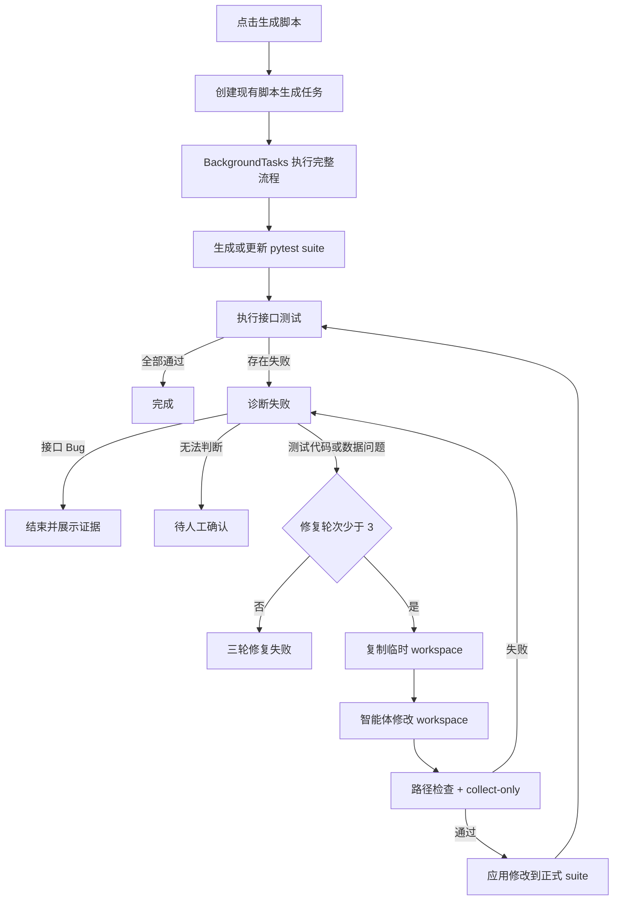

# 接口自动化生成、执行与自修复设计

**项目**: AI Testing System  
**创建日期**: 2026-07-21  
**版本**: 1.1  
**状态**: 已废弃，由 `2026-07-23-api-automation-ai-repair-design.md` 取代  
**方案**: 复用现有脚本生成任务 + FastAPI BackgroundTasks + 最多三轮自修复

> 本文保留用于历史追溯，不再作为实施依据。2026-07-23 确认的新方案改为：失败运行手动触发、独立修复会话、完整回归后人工审批、支持人工补充信息和连续多轮修复。

---

## 1. 目标

用户点击现有“生成脚本”按钮后，后台自动完成：

1. 生成或更新项目 `pytest_requests` suite。
2. 执行真实接口测试。
3. 全部通过时结束。
4. 失败时由智能体判断是测试代码问题、测试数据问题、接口 Bug 或无法判断。
5. 测试代码或测试数据问题自动修复并重新执行。
6. 最多修复三轮。
7. 接口 Bug 立即结束，不重试。
8. 前端展示首次执行和最多三轮修复信息。

---

## 2. 已确认规则

- 沿用现有“生成脚本”按钮，不新增弹窗。
- 生成脚本后默认自动执行。
- 首次执行不算修复轮次。
- 最多进行三轮自动修复。
- 修复范围限定为当前项目的 `api_automation/pytest_requests` 目录。
- 允许修改该目录中的测试代码、配置、公共工具和接口数据文件。
- 当前 suite 使用 `cases.yaml`，同时兼容 `cases.json`。
- 允许修改请求数据和预期结果。
- 判断为接口 Bug 时不修改文件、不重新执行。
- 无法明确判断时结束为“待人工确认”。

---

## 3. 精简原则

本期不新增以下能力：

- 不新增独立 Pipeline 表。
- 不新增通用后台 Worker。
- 不新增任务租约、心跳和抢占。
- 不新增 LangGraph。
- 不新增 Celery、Redis 或其他任务队列。
- 不新增独立 Pipeline API 模块。
- 不新增独立 Pipeline 详情页。
- 不保存完整 baseline、before、after 三套快照。
- 不支持服务重启后从中间阶段恢复。
- 不支持多进程之间的项目锁。
- 不支持取消、暂停、人工审批后继续或指定轮次重跑。

未来只有在明确需要服务重启恢复、多进程部署或大量并发任务时，才增加持久化 Worker 和租约机制。

---

## 4. 整体流程



---

## 5. 复用现有脚本生成任务

现有接口保持不变：

```http
POST /projects/{project_id}/api-automation/scripts/generate
GET  /projects/{project_id}/api-automation/scripts/generation-runs/{run_id}
```

现有路由继续创建 `api_script_generation_runs`，并通过 `BackgroundTasks` 调用：

```python
execute_script_generation_run(run_id)
```

该函数由“只生成脚本”扩展为完整流程：

```python
def execute_script_generation_run(run_id: str) -> None:
    generate_scripts(run_id)
    execute_generated_scripts(run_id)

    while latest_execution_failed(run_id):
        diagnosis = diagnose_latest_failure(run_id)

        if diagnosis.classification == "interface_bug":
            finish_run(run_id, outcome="interface_bug")
            return

        if diagnosis.classification == "unknown":
            finish_run(run_id, outcome="needs_review")
            return

        if repair_round(run_id) >= 3:
            finish_run(run_id, outcome="repair_exhausted")
            return

        repair_and_apply(run_id, diagnosis)
        execute_generated_scripts(run_id)

    finish_run(run_id, outcome="passed")
```

完整流程在现有 `project_workspace_lock(project_id)` 中执行，避免同一应用进程内两个任务同时修改同一个 suite。

---

## 6. 数据库调整

不新增 Pipeline 表，只扩展现有 `api_script_generation_runs`：

```text
current_stage               TEXT NOT NULL DEFAULT 'queued'
outcome                     TEXT NOT NULL DEFAULT ''
repair_round                INTEGER NOT NULL DEFAULT 0
api_run_ids_json            TEXT NOT NULL DEFAULT '[]'
repair_attempts_json        TEXT NOT NULL DEFAULT '[]'
```

### 6.1 `status`

继续复用现有状态：

```text
queued
running
completed
failed
cancelled
interrupted
```

### 6.2 `current_stage`

```text
queued
generating
executing
diagnosing
repairing
validating
completed
```

### 6.3 `outcome`

```text
passed
interface_bug
needs_review
repair_exhausted
system_failed
```

业务流程正常结束，包括发现接口 Bug或三轮失败，统一使用：

```text
status = completed
```

只有平台异常、磁盘异常、数据库异常或智能体服务不可用等无法完成流程的情况使用：

```text
status = failed
outcome = system_failed
```

### 6.4 `repair_attempts_json`

修复最多三轮，不需要独立查询、分页或跨任务统计，因此直接保存在当前任务 JSON 中：

```json
[
  {
    "round_no": 1,
    "status": "execution_failed",
    "diagnosis_type": "pytest_code_issue",
    "diagnosis_confidence": 0.93,
    "diagnosis_summary": "请求体被错误地作为 query 参数发送",
    "changed_files": [
      "testcases/openapi/users/create/post/test_api.py"
    ],
    "diff_path": "api_automation/repairs/apiscriptgen-xxx/round-1/changes.diff",
    "collection": {
      "status": "passed",
      "collected": 35
    },
    "api_run_id": "apirun-xxx",
    "execution": {
      "status": "failed",
      "passed": 34,
      "failed": 1
    },
    "error_message": "",
    "started_at": "...",
    "finished_at": "..."
  }
]
```

---

## 7. 失败诊断

### 7.1 诊断输入

确定性程序从现有 pytest JSON report、stdout、stderr、测试文件、数据文件和 OpenAPI 契约中构造脱敏证据：

```json
{
  "stage": "executing",
  "repair_round": 0,
  "failed_tests": [
    {
      "case_id": "case-001",
      "endpoint_id": "endpoint-001",
      "method": "POST",
      "path": "/users",
      "request": {},
      "expected": {
        "status_code": 201
      },
      "actual": {
        "status_code": 500
      },
      "traceback": "...",
      "test_file": "testcases/openapi/users/create/post/test_api.py",
      "data_file": "testcases/openapi/users/create/post/cases.yaml"
    }
  ],
  "openapi_contract": {}
}
```

必须移除 Token、Cookie、Authorization、密码和 API Key。

### 7.2 诊断输出

```json
{
  "classification": "pytest_code_issue",
  "confidence": 0.93,
  "summary": "请求体发送方式错误",
  "root_cause": "测试代码使用 params 而不是 json",
  "evidence": [],
  "repair_plan": [
    "修改请求调用参数"
  ]
}
```

固定分类：

```text
pytest_code_issue
test_case_issue
interface_bug
unknown
```

规则：

- `pytest_code_issue` 和 `test_case_issue` 进入修复。
- `interface_bug` 立即结束，不修复、不重试。
- `unknown` 结束为待人工确认。
- 输出不符合 Schema 或 `confidence < 0.80` 时强制转换为 `unknown`。

接口 Bug 必须同时提供请求、预期、实际结果和契约依据。

---

## 8. 自动修复

### 8.1 最少文件模型

每轮只保存一个 workspace、诊断和 diff：

```text
api_automation/repairs/<generation_run_id>/
├── round-1/
│   ├── workspace/
│   ├── diagnosis.json
│   ├── agent-output.json
│   └── changes.diff
├── round-2/
└── round-3/
```

不保存单独的 baseline、before 和 after 目录：

- 正式 suite 是修改前版本。
- workspace 是候选修改后版本。
- `changes.diff` 保存完整差异。
- collection 失败时不应用 workspace，正式 suite 保持不变。

### 8.2 修复流程

```text
复制正式 suite 到 workspace
→ 智能体修改 workspace
→ 检查路径和敏感信息
→ workspace 执行 pytest --collect-only
→ 生成 diff
→ collection 通过后应用修改
→ 执行真实接口测试
```

### 8.3 修改范围

修复智能体允许修改 workspace 中的全部普通文件，包括：

- Python 测试代码。
- pytest 配置。
- 公共客户端和断言工具。
- `cases.yaml`。
- `cases.json`。

禁止：

- 写入 workspace 外。
- 修改平台代码或数据库。
- 写入明文凭据。
- 使用 `../`、符号链接、Junction 或 reparse point 逃逸。

### 8.4 应用条件

只有同时满足以下条件才应用修改：

1. 至少存在一个真实文件变化。
2. 所有变化位于 workspace。
3. 数据文件能够按 YAML 或 JSON 正常解析。
4. Python 文件能够解析。
5. 没有新增明文凭据。
6. workspace 的 `pytest --collect-only` 通过。

应用正式 suite 时继续复用现有 `project_workspace_lock(project_id)` 和原子文件写入。

### 8.5 轮次计数

以下情况都计为一轮：

- 修复并执行后仍失败。
- 智能体没有生成有效修改。
- 修改越界或包含凭据。
- workspace collection 失败。
- 智能体输出不符合 Schema。

第三轮失败后结束为：

```text
status = completed
outcome = repair_exhausted
```

---

## 9. 后端目录结构

```text
D:/project/test_project/apps/backend/
├── app/
│   ├── repositories/
│   │   └── api_automation_repo.py               [修改]
│   ├── seed/
│   │   └── schema.py                            [修改]
│   ├── services/
│   │   └── api_automation/
│   │       ├── service.py                       [修改：接入自动执行与三轮修复]
│   │       ├── runner.py                        [复用：collection 和真实执行]
│   │       ├── reporting.py                     [复用：pytest 报告解析]
│   │       ├── artifact_storage.py              [复用：项目锁和路径检查]
│   │       └── self_healing.py                  [新增：证据、workspace、diff、编排]
│   └── agents/
│       └── api_automation/
│           ├── pytest_requests/
│           │   ├── agent.py                     [复用：脚本生成]
│           │   ├── collection.py                [复用：collect-only 工具]
│           │   └── suite.py                     [复用：suite 文件约定]
│           └── self_healing/                    [新增：自动诊断和修复]
│               ├── __init__.py
│               ├── schemas.py                   [结构化输入输出]
│               ├── diagnosis_agent.py           [只读诊断智能体]
│               ├── repair_agent.py              [受限写入修复智能体]
│               └── skills/
│                   ├── api-failure-diagnosis/
│                   │   └── SKILL.md
│                   └── pytest-suite-repair/
│                       └── SKILL.md
├── tests/
│   ├── test_api_automation_self_healing.py      [新增：主流程和三轮边界]
│   └── test_api_automation_repair_safety.py     [新增：路径和应用安全]
└── data/projects/<project_id>/api_automation/
    ├── pytest_requests/                         [现有：正式 suite]
    ├── runs/                                   [现有：pytest 运行报告]
    └── repairs/                                [新增：修复产物]
        └── <generation_run_id>/
            ├── round-1/
            │   ├── workspace/
            │   ├── diagnosis.json
            │   ├── agent-output.json
            │   └── changes.diff
            ├── round-2/
            └── round-3/
```

现有 API 路由和请求模型不新增文件：

```text
D:/project/test_project/apps/backend/app/api/v1/api_automation.py
D:/project/test_project/apps/backend/app/schemas/api_automation.py
```

继续复用现有脚本生成和 generation run 查询接口，只扩展查询结果中的 `current_stage`、`outcome` 和 `repair_attempts`。

本期新增的后端业务文件为：

```text
D:/project/test_project/apps/backend/app/services/api_automation/self_healing.py
D:/project/test_project/apps/backend/app/agents/api_automation/self_healing/__init__.py
D:/project/test_project/apps/backend/app/agents/api_automation/self_healing/schemas.py
D:/project/test_project/apps/backend/app/agents/api_automation/self_healing/diagnosis_agent.py
D:/project/test_project/apps/backend/app/agents/api_automation/self_healing/repair_agent.py
D:/project/test_project/apps/backend/app/agents/api_automation/self_healing/skills/api-failure-diagnosis/SKILL.md
D:/project/test_project/apps/backend/app/agents/api_automation/self_healing/skills/pytest-suite-repair/SKILL.md
```

本期修改的现有后端文件只有：

```text
D:/project/test_project/apps/backend/app/services/api_automation/service.py
D:/project/test_project/apps/backend/app/repositories/api_automation_repo.py
D:/project/test_project/apps/backend/app/seed/schema.py
```

---

## 10. 前端调整

不新增独立 Pipeline 页面。

修改现有接口自动化页面：

```text
apps/frontend/src/app/(main)/projects/[projectId]/automation/api/page.tsx
apps/frontend/src/lib/api-client.ts
```

行为：

1. 点击生成按钮后创建现有脚本生成任务。
2. 创建成功后提示任务已在后台执行。
3. 不在按钮事件中循环等待任务结束。
4. 页面轮询现有 generation run 查询接口。
5. 展示 `current_stage`、`outcome` 和 `repair_attempts`。

阶段提示：

```text
正在生成脚本
正在执行接口测试
正在分析失败原因
正在进行第 1/3 轮修复
正在验证第 1/3 轮修复
```

每轮展示：

- 问题分类和诊断摘要。
- 修改文件。
- Diff。
- collection 结果。
- API run 执行结果。

接口 Bug 展示请求、预期、实际结果和契约依据，不显示继续自动修复操作。

---

## 11. 服务重启和并发限制

本期接受以下限制：

- 使用 FastAPI `BackgroundTasks`。
- 应用服务重启时，正在运行的任务标记为 `interrupted`。
- 用户重新点击生成按钮即可重新开始。
- 使用现有进程内 `project_workspace_lock`。
- 当前方案适用于单应用进程部署。

出现以下任一需求时再升级为持久化 Worker：

- 必须从中断阶段自动恢复。
- Uvicorn 使用多个 Worker 进程。
- 同时有大量项目执行任务。
- 需要任务取消、暂停或抢占。
- 需要跨服务器执行。

---

## 12. 验收标准

### 后台流程

- [ ] 点击现有按钮后立即创建后台任务。
- [ ] 生成脚本后自动执行接口测试。
- [ ] 前端不需要第二次点击执行。

### 自动修复

- [ ] 测试代码问题可以自动修改测试代码。
- [ ] 测试数据问题可以修改 `cases.yaml` 或 `cases.json`。
- [ ] 修复只发生在临时 workspace。
- [ ] collection 失败时正式 suite 不变。
- [ ] 最多修复三轮。
- [ ] 第三轮失败后不会继续循环。

### 接口 Bug

- [ ] 接口 Bug 立即结束。
- [ ] 接口 Bug 不修改任何文件。
- [ ] 接口 Bug 不重新执行。
- [ ] 前端展示请求、预期、实际结果和契约依据。

### 前端

- [ ] 展示当前阶段。
- [ ] 展示首次执行结果。
- [ ] 展示最多三轮修复记录。
- [ ] 每轮可以查看诊断、修改文件、Diff 和执行结果。

### 安全

- [ ] 智能体不能写入 suite 外。
- [ ] 凭据不会出现在诊断、Diff 或生成代码中。
- [ ] 同一进程内同一项目不会并发修改 suite。

---

## 13. 实施顺序

1. 扩展 `api_script_generation_runs` 字段和序列化结果。
2. 将生成任务扩展为“生成后自动执行”。
3. 增加失败诊断和分类。
4. 增加 workspace 修复、collection 和 diff。
5. 增加最多三轮循环。
6. 在现有页面展示阶段和修复记录。
7. 补充三组聚焦测试。

---

## 设计结论

本期不建设通用任务平台，只在现有接口脚本生成任务上增加自动执行和最多三轮自修复。现有 `BackgroundTasks`、项目锁、脚本生成 Agent、pytest Runner、Repository、Schema、任务查询接口和前端页面全部复用。

最小安全底线不删除：修复必须在临时 workspace 中进行，只有路径检查、凭据检查和 `pytest --collect-only` 全部通过后，才能更新正式 `pytest_requests` suite。
