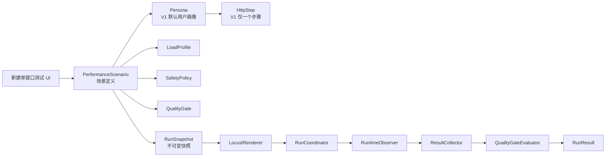

# 托管式单接口性能测试规格

**日期**：2026-07-22  
**状态**：实施中（场景定义、执行预览、不可变运行快照与质量门禁基础已完成；托管执行器和新前端待完成）
**范围**：性能测试 V1（单接口、托管 Locust 脚本、可信质量结论）

## 1. 背景与决策

现有性能测试已具备单接口请求、Locust 脚本生成、无头执行、CSV/HTML 报告和运行事件等基础能力，但存在以下可信度问题：

- 固定负载的并发、爬升速率和时长在创建页写死，无法表达真实测试意图。
- 阶段负载的总时长可能大于运行器传入 Locust 的 `--run-time`，导致测试被提前停止。
- 安全熔断配置被保存但没有在运行时执行。
- 性能目标没有形成独立、可审计的通过/失败结论。
- 当前实体直接围绕单个 `endpoint_id` 建模，后续扩展业务链路会造成模型重构。

本规格采用“**单接口体验 + 场景化内核**”方案：V1 在 UI 中只允许创建一个接口压测，但底层以场景、用户画像和步骤建模。未来新增多接口流程、用户比例和变量关联时，只增加模型能力，不迁移 V1 数据。

历史性能测试数据已删除，因此本次采用全新模型和接口契约，**不提供数据迁移、旧字段兼容或双写逻辑**。

## 2. 目标与非目标

### 2.1 目标

1. 让用户能够创建、运行和追溯一个 API 接口的性能测试。
2. 让每次运行产生可信、可复现、可审计的质量结论。
3. 将预热流量与测量流量分离，只有测量窗口参与质量门禁。
4. 实现真实的失败率熔断，防止异常测试持续冲击目标环境。
5. 固化运行快照，保证测试定义后续修改不会改变历史运行的解释。
6. 为后续多接口业务链路压测保留稳定的领域边界。

### 2.2 非目标

V1 不实现以下能力：

- 多接口顺序、随机或权重编排。
- 响应提取、变量传递、Token 刷新和条件分支。
- 多用户画像、`weight`、`fixed_count` 和独立登录/退出生命周期。
- Worker 集群、Kubernetes 调度和跨机器分布式压测。
- APM/Prometheus 深度关联、自动回归基线和生产审批流。
- 可作为质量准入的任意 Python 脚本编辑。

## 3. 领域模型



### 3.1 `PerformanceScenario`

场景定义是测试的根实体，包含项目、名称、说明、定义版本、用户画像、负载、数据源、质量门禁和安全策略。

V1 约束：

- 必须且只能包含一个 `Persona`。
- `Persona` 必须且只能包含一个 `HttpStep`。
- 不允许使用非 HTTP 类型步骤。

### 3.2 `Persona`

V1 的默认用户画像：

```json
{
  "id": "default",
  "name": "默认用户",
  "wait_time": {
    "min_seconds": 1,
    "max_seconds": 3
  },
  "steps": []
}
```

后续可增加权重、固定用户数、独立生命周期和多个步骤，而不改变场景根结构。

### 3.3 `HttpStep`

V1 的唯一步骤保存：接口资产引用、HTTP 方法、路径、请求参数、Header、Body、超时和断言规则。请求配置支持变量模板，但 V1 仅支持内置变量和数据行变量：

- `${sequence}`
- `${uuid}`
- `${timestamp}`
- `${random_int}`
- `${data_column}`

### 3.4 `LoadProfile`

负载计划分为 `fixed` 与 `staged` 两类，二者互斥。

- `fixed`：目标用户数、爬升速率、预热秒数、测量秒数、停止超时。
- `staged`：顺序阶段列表，每阶段包含目标用户数、爬升速率、保持秒数和 `record_metrics`。

### 3.5 `QualityGate`

质量门禁由可选规则组成：

- `max_fail_ratio`
- `max_average_response_time_ms`
- `max_p95_response_time_ms`
- `min_average_rps`
- `min_request_count`

每项规则必须记录阈值、实际值、比较符、状态和不可评估原因。

### 3.6 `SafetyPolicy`

安全策略包括：

- 是否启用失败率熔断。
- 熔断窗口长度。
- 窗口最大失败率。
- 连续超标窗口数。
- 环境级最大并发和最大运行时长。

### 3.7 `RunSnapshot`

每次创建运行时生成不可变快照，至少包含：

- 规范化场景定义。
- 计算后的负载计划和总运行时长。
- 环境快照和凭据引用（不得包含密钥明文）。
- 数据集版本或内容 Hash。
- 托管脚本代码 Hash、模板版本和 Locust 版本。
- 质量门禁、安全策略和环境限额。

运行过程必须只读取 `RunSnapshot`，不得读取可编辑的场景定义。

## 4. 新建页规格

### 4.1 基本信息

字段：名称、说明、项目、环境、接口。

- 项目、环境、接口、名称必填。
- 环境和接口必须属于项目。
- 切换接口时必须确认是否丢弃已编辑请求配置。

### 4.2 请求配置

字段：Path 参数、Query 参数、Header、JSON Body、请求超时。

- 初始值由接口资产和 OpenAPI 示例预填。
- 敏感 Header 不可直接输入，必须由环境凭据注入。
- V1 仅支持 JSON Body；表单、Raw Body、Multipart 在后续版本加入。

### 4.3 响应校验

支持以下规则：

| 规则 | 必填字段 | 说明 |
|---|---|---|
| 状态码 | 允许状态码集合 | 默认从 OpenAPI 成功响应推导 |
| JSONPath 存在 | JSONPath | 响应 JSON 必须包含指定路径 |
| JSONPath 等于 | JSONPath、期望值 | 指定路径必须等于期望值 |

运行时必须使用标准 JSONPath 实现；不得将仅支持对象点路径的简化函数称为 JSONPath。

### 4.4 测试数据

支持：固定数据、JSON 数据行、CSV 文件；策略为顺序循环或随机选择。

- CSV 必须在后端使用标准 CSV 解析器读取和验证。
- 数据集创建后计算 Hash 并写入运行快照。
- V1 不提供全局唯一领取和跨 Worker 数据协调。

### 4.5 负载计划

固定负载字段：目标用户数、爬升速率、预热秒数、测量秒数、停止超时。

阶段负载字段：阶段名称、目标用户数、爬升速率、保持秒数、是否计入指标。

提交前服务端返回执行预览：预计峰值用户、各阶段爬升耗时、总运行时长、测量窗口和环境限额校验结果。

### 4.6 质量门禁与安全策略

- 用户可配置失败率、平均响应、P95、最低 RPS 和最少请求数。
- 启用“准入模式”时，至少必须配置失败率、平均响应或 P95 中的一项。
- 熔断默认关闭；启用时必须配置窗口、失败率和连续窗口数。

## 5. 时间模型与 Locust 执行

### 5.1 固定负载

```text
ramp_seconds = ceil(target_users / spawn_rate)
total_run_seconds = ramp_seconds + warmup_seconds + measurement_seconds
```

流程：

1. Locust 启动并按配置爬升用户。
2. 完成爬升后进入预热阶段。
3. 预热结束时重置 Locust 统计并记录 `measurement_started` 事件。
4. 在测量窗口采集指标、执行熔断和保存实时样本。
5. 测量结束后请求优雅停止，等待时间受 `stop_timeout_seconds` 限制。

### 5.2 阶段负载

单阶段耗时：

```text
stage_seconds = ceil(abs(target_users - previous_target_users) / spawn_rate) + hold_seconds
```

总运行时长为全部阶段耗时之和，并且是唯一传递给 Locust `--run-time` 的时长来源。

- `record_metrics=false` 的阶段为预热，不参与质量门禁。
- 从第一个 `record_metrics=true` 阶段开始重置统计。
- 至少存在一个计入指标的阶段。
- 前端不得填写独立、可与阶段总时长冲突的运行时长。

## 6. API 契约

资源路径采用全新契约：

```text
POST   /projects/{project_id}/performance-scenarios
GET    /projects/{project_id}/performance-scenarios
GET    /projects/{project_id}/performance-scenarios/{scenario_id}
PATCH  /projects/{project_id}/performance-scenarios/{scenario_id}
DELETE /projects/{project_id}/performance-scenarios/{scenario_id}

POST   /projects/{project_id}/performance-scenarios/{scenario_id}/runs
POST   /projects/{project_id}/performance-runs/{run_id}/start
POST   /projects/{project_id}/performance-runs/{run_id}/stop
GET    /projects/{project_id}/performance-runs/{run_id}
GET    /projects/{project_id}/performance-runs/{run_id}/stats
GET    /projects/{project_id}/performance-runs/{run_id}/stream
GET    /projects/{project_id}/performance-runs/{run_id}/reports
```

### 6.1 创建/更新场景

创建和更新接口接收完整、规范化场景定义。服务端执行单 Persona、单 HTTP Step 约束、接口和环境归属校验、敏感 Header 校验、阶段时长校验和环境限额预校验。

### 6.2 创建运行

创建运行接口执行以下步骤：

1. 校验场景处于可执行状态。
2. 校验托管脚本可生成且通过验证。
3. 加载环境及凭据引用，进行脱敏。
4. 计算执行时长并校验环境限额。
5. 生成并持久化 `RunSnapshot`。
6. 返回运行 ID、计算预览和可启动状态。

### 6.3 启动运行

启动接口不接受 `users`、`spawn_rate`、`run_time` 或 Host 等任意覆盖参数。正式运行的配置只能来自已持久化的 `RunSnapshot`。

临时试跑必须通过创建新的派生运行实现，而不是在 `start` 请求中覆盖参数。

## 7. 运行状态、熔断与质量判定

### 7.1 状态模型

过程状态：

```text
created -> validating -> starting -> warming_up -> measuring -> stopping -> finished
```

停止原因：

```text
completed | circuit_breaker | manual_stop | engine_error | validation_error | timeout
```

质量结论：

```text
passed | failed | not_configured | not_evaluated
```

过程状态、停止原因和质量结论必须分列存储和展示。

### 7.2 熔断算法

每 `window_seconds` 读取 Locust 累计统计增量：

```text
window_request_count = current_requests - previous_requests
window_failure_count = current_failures - previous_failures
window_failure_ratio = window_failure_count / window_request_count
```

- 若窗口请求数为零，不计入连续超标次数。
- 若失败率超过阈值，连续超标次数加一；否则归零。
- 连续次数达到配置值时，调用 `environment.runner.quit()`。
- 熔断时必须记录指标快照、结构化事件和 `stop_reason=circuit_breaker`。

### 7.3 质量门禁

只对测量窗口内的聚合统计判定：

| 指标 | 规则 |
|---|---|
| 失败率 | `actual <= max_fail_ratio` |
| 平均响应时间 | `actual <= max_average_response_time_ms` |
| P95 | `actual <= max_p95_response_time_ms` |
| 平均 RPS | `actual >= min_average_rps` |
| 总请求数 | `actual >= min_request_count` |

若测量窗口请求数为零，所有已配置的响应时间和失败率规则均为 `not_evaluated`，最终质量结论不得为通过。

若运行被熔断、引擎异常或人工停止，已采集指标可以展示，但最终质量结论为 `not_evaluated`。

### 7.4 退出码

| 退出码 | 含义 |
|---|---|
| `0` | 正常完成且门禁通过，或明确标记为非准入运行 |
| `10` | 正常完成但质量门禁失败 |
| `11` | 触发安全熔断 |
| `12` | 脚本、数据、Locust 或基础设施异常 |
| `13` | 人工停止 |

Locust 进程启用 `--exit-code-on-error`，但平台由协调器根据停止原因和质量结论归一化最终退出码。

## 8. 托管脚本策略

V1 只允许 `managed` 脚本参与质量门禁：

- 脚本由平台从 `RunSnapshot` 生成。
- 统一注入请求命名、响应断言、事件采集、统计重置和熔断逻辑。
- 代码 Hash 与模板版本记录在运行快照中。

自定义 Python 脚本可作为未来“高级实验模式”保留，但必须标记为 `advanced`，其运行结果默认不能作为质量准入结论。

## 9. 数据存储

### 9.1 场景表

`performance_scenarios` 至少包含：

- `id`、`project_id`、`name`、`description`、`status`、`definition_version`
- `scenario_definition_json`
- `load_profile_json`
- `data_source_json`
- `quality_gate_json`
- `safety_policy_json`
- `created_by`、`created_at`、`updated_at`

### 9.2 运行表

`performance_runs` 至少包含：

- `id`、`project_id`、`scenario_id`
- `run_snapshot_json`
- `process_status`、`stop_reason`、`quality_status`
- `script_hash`、`locust_version`
- `started_at`、`measurement_started_at`、`finished_at`
- `exit_code`、`error_code`、`error_message`

### 9.3 质量规则结果表

`performance_run_gate_results` 至少包含：

- `id`、`run_id`、`metric`、`operator`
- `threshold`、`actual`、`status`、`reason`、`evaluated_at`

### 9.4 事件与报告

运行事件记录：`warmup_completed`、`measurement_started`、`circuit_breaker_triggered`、`quality_evaluated`、`manual_stop`。

报告保留 Locust HTML、统计 CSV、历史 CSV、失败 CSV、异常 CSV 和平台汇总 JSON。

## 10. 安全、审计与可观测性

- 运行快照不保存 Token、Cookie、密码等密钥明文，只保存凭据引用和脱敏展示值。
- 环境配置可设置 Host 白名单、最大并发、最大运行时长等不可突破限额。
- 审计记录场景创建/修改、运行创建、启动、停止、熔断和质量结论。
- 报告页展示场景版本、脚本 Hash、数据 Hash、环境版本、Locust 版本、运行参数和停止原因。
- 所有日志、统计、失败、异常和报告通过 `run_id` 关联。

## 11. 验收标准

### 11.1 单元测试

- 固定与阶段负载的总时长计算正确；短于理论时长的配置被拒绝。
- 场景只能创建一个 Persona 和一个 HTTP Step。
- 场景、环境、数据或断言改变时，生成的新运行快照 Hash 改变。
- 预热结束后统计被重置，预热样本不会进入 SLA。
- 熔断在连续超标窗口后停止；零请求窗口不会误触发。
- 每条质量规则可得到 `passed`、`failed` 或 `not_evaluated`。
- 零请求、脚本错误、熔断和人工停止均不能得到通过结论。

### 11.2 API 集成测试

- 创建运行后修改场景定义，既有运行的 Snapshot 保持不变。
- 启动接口拒绝覆盖并发、爬升、时长和 Host。
- 响应为 2xx 但业务 JSON 断言失败时，Locust 失败统计和质量门禁结论一致。
- 环境限额、Host 白名单和敏感 Header 保护由后端强制执行。
- 统计、事件、质量规则和报告可通过同一运行 ID 一致查询。

### 11.3 端到端测试

- 固定负载可配置并发、爬升、预热、测量和停止超时，并展示后端计算总时长。
- 阶段负载展示每阶段爬升/保持时间、测量窗口和总时长。
- 运行页清晰区分质量门禁失败、熔断停止、引擎错误和人工停止。
- 下载的 Locust 报告与平台聚合指标及质量结论一致。

## 12. 实施里程碑

### 里程碑 1：可信运行基础

- 建立新场景、运行快照、质量规则结果的数据模型。
- 实现固定/阶段负载总时长计算及预执行校验。
- 实现预热统计重置、真实熔断、质量门禁和标准退出码。

### 里程碑 2：单接口准入体验

- 完成新建页的请求、断言、数据、负载、质量门禁与安全策略配置。
- 完成后端 CSV 解析、数据 Hash 和 Snapshot 固化。
- 完成运行页、规则明细、执行预览、报告和审计展示。

### 里程碑 3：回归与扩展准备

- 增加基线比较、CI 输出和环境限额治理。
- 建立托管脚本与高级实验脚本的隔离机制。
- 为多步骤、变量提取和多 Persona 补齐内部接口，但不在 V1 UI 暴露。

## 13. 后续多接口扩展路径

V2 仅放宽 V1 的约束：

1. `steps.length` 从 `1` 放宽为 `>= 1`，增加 `order`、`weight`、`enabled` 和 `tags`。
2. 新增响应提取器、Persona 上下文和后续请求模板变量。
3. `personas.length` 从 `1` 放宽为 `>= 1`，增加 `weight`、`fixed_count` 和独立生命周期。
4. Renderer 将单个 HTTP 请求扩展为多个 Locust task 或 `TaskSet`，继续复用 RuntimeObserver、RunSnapshot 和 QualityGateEvaluator。
5. 质量规则扩展到场景、Persona 和 Step 三个层级。

因此，V1 单接口压测是“只有一个 HTTP Step 的场景”，可以无迁移地演进为业务链路压测。
