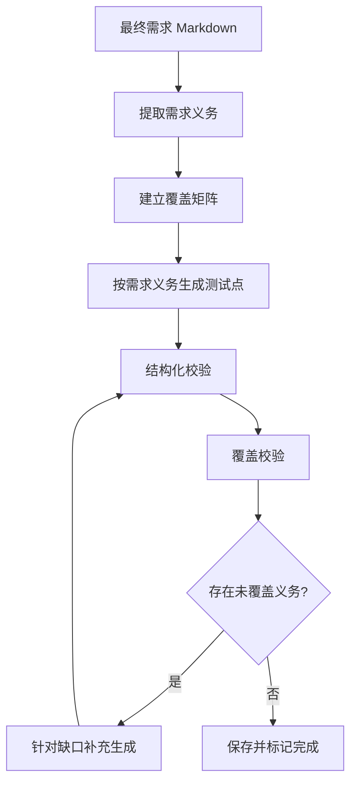

# 最终需求测试点完整覆盖设计

## 目标

确保测试点生成完整覆盖当前最终需求中所有明确、可验证的需求内容，不依赖模型自由发挥，不遗漏已明确的模块、规则、阈值、兼容性和页面要求，同时不引入初始需求分析中的待明确内容，也不凭空扩展最终需求未描述的通用质量场景。

## 范围与边界

### 输入来源

测试点生成只读取当前最终需求版本：

- `requirement_version_id`
- `requirement_name`
- 当前最终需求 Markdown 内容

不读取初始需求、历史版本、原始上传文件、分析待澄清项或其他文档内容。

### 覆盖规则

必须覆盖：

- 最终需求明确描述的业务规则；
- 最终需求明确列出的模块、节点、角色、页面和处理链路；
- 最终需求明确给出的数值阈值和限制；
- 最终需求明确描述的兼容性、展示、日志、性能、权限、安全和异常要求；
- 从明确规则可以直接推导的边界场景。

不生成：

- 最终需求未提及的权限、异常、并发、安全、性能或日志场景；
- 初始需求分析中的待明确内容；
- 由模型依据行业常识补充的业务规则；
- 最终需求未定义处理结果的猜测性预期。

## 核心设计

采用“需求义务清单 + 测试点生成 + 覆盖校验 + 自动补齐”的闭环，不再直接从整份 PRD 一次性自由生成测试点。



系统只有在所有必须覆盖的需求义务均被测试点覆盖后，才允许生成任务进入 `completed`。

## 需求义务模型

需求义务是从最终需求中提取出的最小可验证要求。每条义务至少包含：

```json
{
  "obligation_key": "REQ-001",
  "source_section": "改造方案一",
  "statement": "输出文本超过10000字符时，完整文本存入数据库",
  "obligation_type": "business_rule",
  "modules": ["输出节点"],
  "thresholds": ["10000"],
  "explicit": true,
  "test_required": true
}
```

### 提取要求

- 每条义务必须能够回指最终需求章节或段落；
- `explicit=true` 表示最终需求明确写出；
- 直接推导的阈值边界可以生成，但预期结果不能超出最终需求定义；
- 无法形成明确验证结果的内容标记为不可验证，不由模型猜测补全；
- 义务 ID 在当前最终需求版本内唯一且稳定。

### 示例

对于以下最终需求：

```text
当节点输出字段文本长度超过10000字符时：
1. 将完整文本内容存入数据库；
2. 运行态中只携带轻量级 chunk 引用信息；
3. 下游节点真正消费变量时读取完整内容；
4. 超长文本展示按 chunk 分区。
```

至少提取：

- `REQ-001`：超长文本完整内容存入数据库；
- `REQ-002`：运行态只携带 chunk 引用；
- `REQ-003`：真正消费时读取完整内容；
- `REQ-004`：展示按 chunk 分区。

## 测试点模型扩展

测试点必须关联一个或多个需求义务：

```json
{
  "point_key": "longtext.storage.over_threshold",
  "title": "输出文本超过10000字符时完整内容外置存储",
  "requirement_obligation_keys": ["REQ-001"],
  "category": "功能",
  "priority": "P0"
}
```

数据库新增关系表：

```text
test_point_obligations
├── test_point_id
└── obligation_key
```

关系表用于查询：

- 未覆盖的需求义务；
- 每条义务对应的测试点；
- 一个测试点覆盖的义务；
- 测试点修改或删除后的覆盖缺口。

## 生成流程

### 阶段一：提取需求义务

模型只负责从最终需求中提取可验证义务，不生成测试点，不处理待澄清内容，不补充 PRD 外规则。

### 阶段二：按义务生成测试点

模型输入：

- 最终需求内容；
- 需求义务清单；
- 义务对应的模块和阈值；
- 已生成测试点；
- 当前未覆盖义务；
- 已覆盖边界。

模型输出：

- 测试点结构化数据；
- 每个测试点的 `requirement_obligation_keys`；
- 操作和预期结果；
- 来源章节。

### 阶段三：结构化校验

校验：

- `point_key` 唯一；
- 类别和优先级合法；
- 每个测试点至少一个验证点；
- 义务 ID 存在；
- 来源章节存在；
- 预期结果没有引用最终需求外的规则。

### 阶段四：覆盖校验

至少校验：

- 每条 `test_required=true` 的义务至少关联一个测试点；
- 最终需求明确列出的模块、节点和页面均有覆盖；
- 最终需求中的阈值包含直接可推导的边界；
- 一个测试点没有用笼统描述替代多个独立模块的覆盖；
- 测试点包含可执行操作和可观察预期结果。

### 阶段五：缺口补齐

如果存在未覆盖义务：

1. 生成缺口清单；
2. 只针对缺口调用补充生成；
3. 去重并合并测试点；
4. 重新执行结构化和覆盖校验；
5. 最多执行 3 轮补齐；
6. 仍不完整则任务标记失败，并返回具体缺口。

## 阈值边界规则

如果最终需求明确给出阈值，例如 `10000` 字符：

- 生成阈值以下场景；
- 生成阈值本身场景；
- 生成阈值以上场景；
- 预期结果必须使用最终需求明确的规则。

例如：

- `10000` 字符：保持普通结构；
- `10001` 字符：触发外置存储和 chunk 引用；
- `20000` 字段上限：验证最终需求明确的限制；
- 超过 `20000` 字符的具体处理：最终需求未说明时不猜测报错、截断或放行结果。

## 任务状态与错误处理

当前生成任务不能仅依据模型调用成功判断完成。

建议增加：

- `coverage_status`：`pending`、`complete`、`incomplete`、`invalid`；
- `obligation_count`；
- `covered_obligation_count`；
- `missing_obligations_json`；
- `unsupported_assumptions_json`；
- `supplement_round`。

任务完成条件：

```text
模型调用成功
AND 结构化校验通过
AND 所有必须义务已覆盖
AND 不存在未处理的 PRD 外推断
```

任务失败时必须返回：

- 总义务数；
- 已覆盖义务数；
- 缺失义务 ID；
- 缺失模块或页面；
- 需要人工确认的不可验证条目。

## 前端展示

测试点页面增加覆盖摘要：

```text
需求义务：12 条
已覆盖：12 条
未覆盖：0 条
PRD 外推断：0 条
测试点总数：18 条
```

生成未完成时展示缺口：

```text
当前测试点未生成完成

已覆盖：7 / 12
缺失：
- REQ-004 超长文本展示按 chunk 分区
- REQ-006 短文本保持原结构
- REQ-009 文件解析节点
```

覆盖完整后才显示“生成完成”。

## 实施阶段

### 第一阶段：生成完成门禁

- 增加覆盖状态和缺口字段；
- 模型返回 1 条但义务未覆盖完整时禁止完成；
- 保存当前结果并展示缺口；
- 不删除未选中的已有测试点。

### 第二阶段：需求义务抽取

- 新增需求义务 schema；
- 新增义务抽取 Agent；
- 持久化当前最终需求版本的义务清单；
- 建立义务与测试点关系。

### 第三阶段：自动补齐

- 实现缺口识别；
- 针对缺口补充生成；
- 去重；
- 过滤 PRD 外推断；
- 限制补齐轮次；
- 不完整时返回可诊断失败。

### 第四阶段：覆盖视图

- 展示覆盖率；
- 展示需求义务到测试点的映射；
- 展示未覆盖义务；
- 测试点编辑和删除后重新计算覆盖状态。

## 验收标准

1. 只输入最终需求时，生成流程不读取初始需求分析待澄清内容。
2. 最终需求每条必须覆盖的明确义务至少关联一个测试点。
3. 最终需求明确列出的模块、节点和页面均能在覆盖矩阵中找到对应测试点。
4. 最终需求明确的数值阈值会生成直接可推导边界，且不猜测未定义处理结果。
5. 模型只返回 1 条且覆盖不完整时，任务不能标记为 `completed`。
6. 缺口能够被自动补齐；补齐失败时返回具体义务 ID 和来源章节。
7. 最终需求未提及的权限、异常、并发、安全、性能和日志场景不会被自动加入。
8. 测试点可回溯到最终需求章节和需求义务 ID。
9. 测试点删除或编辑后，覆盖摘要会重新计算。
10. 现有测试点列表、详情、编辑、删除和下游测试用例生成流程保持兼容。

## 风险与控制

### 模型抽取不稳定

控制：使用结构化输出、来源章节、唯一义务 ID 和重复义务合并校验。

### 过度推导

控制：义务必须回指最终需求；无法定位来源的义务不进入必须覆盖集合。

### 补齐循环

控制：最多 3 轮，记录每轮缺口和新增测试点，仍不完整则失败。

### 旧数据没有义务映射

控制：旧测试点进入兼容状态，覆盖摘要标记为“待建立映射”，不直接伪造覆盖关系；重新生成当前版本时建立新映射。

### 需求版本变化

控制：义务清单绑定 `requirement_version_id`，最终需求版本变化时重新抽取和校验。
