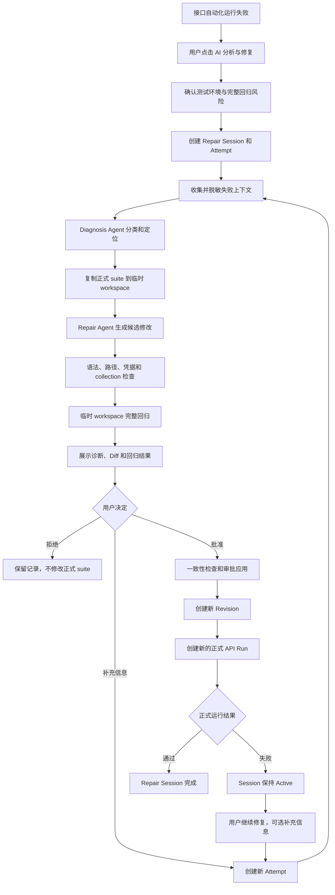

# 接口自动化 AI 分析与修复设计

**项目**: AI Testing System  
**创建日期**: 2026-07-23  
**版本**: 1.0  
**状态**: 设计已确认，待实施计划  
**方案**: 失败运行手动触发 + 独立修复会话 + 临时完整回归 + 人工审批应用

---

## 1. 背景

现有接口自动化运行能够保存 pytest stdout、stderr 和 JSON 报告，但运行失败后主要依赖测试人员人工阅读日志、定位测试代码或数据问题、修改 suite 并重新执行。

本功能在现有运行详情中增加“AI 分析与修复”，让 AI 基于失败报告、测试项目、接口契约、历史修复记录和人工补充信息完成诊断，在临时副本中生成候选修改并执行完整回归。候选修改只有经过人工审批后才能应用到正式 `pytest_requests` suite。

2026-07-21 的旧设计采用生成脚本后自动执行、最多三轮自动修复，不符合本次确认的人工控制与连续修复要求，已不再作为实施依据。

---

## 2. 已确认需求

- 只在接口自动化运行失败后，由用户手动点击“AI 分析与修复”。
- AI 自动完成问题诊断、候选修改和临时完整回归。
- AI 不得直接修改正式 suite，必须等待人工审批。
- AI 可以分析和修改整个 `pytest_requests` 测试项目，包括测试代码、用例数据、公共工具和配置。
- AI 可以判断预期结果不合理并提出修改，不要求必须存在正式契约依据，但必须展示判断依据和风险。
- AI 判断为被测接口代码缺陷时，只输出缺陷报告和定位建议，不修改业务系统代码。
- 修复后仍失败时，用户可以继续修复。
- 用户可以补充业务规则、正确状态码、有效测试数据或其他信息，也可以不补充直接继续。
- 后续轮次必须携带此前诊断、修改、临时回归、正式运行和人工反馈摘要。
- 某轮修改导致失败增多时仍保留修改，允许基于当前版本继续修复。
- 系统必须保留每轮版本，并允许人工回退到任意已应用版本。
- 审批前在临时副本中执行完整接口自动化回归。
- 修复轮数不设置固定上限，但每轮必须有资源限制，并对连续无改善进行提醒。

---

## 3. 设计原则

### 3.1 人工控制

- AI 负责诊断、提出修改和验证候选方案。
- 用户负责是否将候选方案应用到正式 suite。
- 未审批方案不得改变正式测试代码、测试用例数据库或正式运行配置。

### 3.2 诊断优先

- Diagnosis Agent 只分析，不修改文件。
- Repair Agent 只能在本轮临时 workspace 中修改。
- Agent 不直接操作数据库、正式 suite 或业务系统代码。

### 3.3 复用现有能力

- 复用现有 `api_runs`、pytest Runner、JSON 报告、项目 workspace 锁、模型配置、operation log 和运行详情页。
- 不新增通用 Pipeline 平台、Celery、Redis、LangGraph 或通用任务 Repository。
- 后台执行继续沿用当前应用内后台任务模式；持久化 Worker 不属于本期范围。

### 3.4 数据源一致性

当前 `cases.yaml` 或 `cases.json` 是后端测试用例数据库的运行快照。AI 可以在临时副本中修改数据文件验证效果，但审批应用时必须把结构化用例修改同步到数据库，再由后端重新生成正式数据文件，不能只覆盖 YAML 或 JSON。

---

## 4. 整体流程



---

## 5. 问题分类

每个失败用例必须归入以下分类之一，并提供置信度、证据、根因和建议：

```text
test_code_issue
test_data_issue
environment_issue
interface_bug
contract_ambiguity
unknown
```

同一个运行允许包含多种问题，不能强制将全部失败归为同一根因。

### 5.1 测试代码问题

典型证据：

- ImportError、SyntaxError、NameError。
- fixture 不存在或参数化错误。
- 请求构造、数据加载、JSONPath 或公共断言实现错误。
- 多个接口因同一公共工具变化同时失败。

### 5.2 测试数据问题

典型证据：

- 请求字段和值与测试目的不匹配。
- 测试依赖数据已失效。
- 边界值构造错误。
- 预期状态码或业务码仅来自 AI 推断。
- 用户补充的业务规则与当前用例不一致。

### 5.3 环境问题

典型证据：

- DNS、连接拒绝、TLS 或超时。
- Token 失效、缺少认证配置或 Base URL 错误。
- 依赖服务不可用。
- 大量接口同时返回网关错误。

环境问题默认不修改 suite，除非根因来自测试项目读取环境配置的代码。

### 5.4 接口缺陷

典型证据：

- 请求符合明确契约，但接口返回 5xx。
- 返回结构违反明确 Schema。
- 数据写入成功但读取结果不一致。
- 权限边界被绕过。
- 行为与用户确认的业务规则冲突。

接口缺陷只生成缺陷报告和业务代码定位建议，不生成或应用业务代码补丁。

### 5.5 契约歧义

典型证据：

- OpenAPI 与接口文档互相冲突。
- 文档没有定义异常响应。
- 测试预期只来自 HTTP 常见约定。
- 实际响应稳定，但无法证明是否符合业务规则。

AI 可以提出候选修改，但必须明确标记缺少正式契约依据。

---

## 6. 证据优先级

AI 按以下顺序使用证据：

1. 用户本轮补充并确认的业务规则。
2. 已人工审批的测试用例和预期结果。
3. OpenAPI 或正式接口文档中的明确约束。
4. 当前请求、响应和运行日志。
5. 历史稳定通过记录。
6. AI 生成用例中的生成说明。
7. HTTP 常见约定和模型推断。

低优先级证据不能静默覆盖高优先级证据。AI 修改预期结果时必须展示修改前后值、判断依据、置信度和契约风险。

---

## 7. 数据模型

### 7.1 `api_repair_sessions`

```text
id                  TEXT PRIMARY KEY
project_id          TEXT NOT NULL
source_run_id       TEXT NOT NULL
current_run_id      TEXT NOT NULL
status              TEXT NOT NULL
current_revision    INTEGER NOT NULL DEFAULT 0
created_by          TEXT NOT NULL
created_at          DATETIME
updated_at          DATETIME
```

状态：

```text
active
passed
closed
failed
```

同一失败运行只能存在一个活动会话。同一项目同一时间只能有一个会话修改正式 suite。

### 7.2 `api_repair_attempts`

```text
id                  TEXT PRIMARY KEY
session_id          TEXT NOT NULL
attempt_number      INTEGER NOT NULL
base_run_id         TEXT NOT NULL
base_revision       INTEGER NOT NULL
status              TEXT NOT NULL
user_context        TEXT NOT NULL DEFAULT ''
diagnosis_json      TEXT NOT NULL DEFAULT '{}'
validation_json     TEXT NOT NULL DEFAULT '{}'
decision            TEXT NOT NULL DEFAULT ''
applied_run_id      TEXT
error_message       TEXT NOT NULL DEFAULT ''
created_at          DATETIME
updated_at          DATETIME
```

Attempt 状态：

```text
queued
collecting_context
diagnosing
generating_patch
validating
waiting_approval
applying
rerunning
completed
rejected
superseded
failed
```

验证结果变差不属于系统失败，仍进入 `waiting_approval`。

### 7.3 扩展 `api_automation_runs`

```text
parent_run_id             TEXT
source_repair_attempt_id  TEXT
```

- `parent_run_id` 构建正式运行链路。
- `source_repair_attempt_id` 标识哪次审批修复创建了该运行。
- Repair Session 可通过 Attempt 关联获得，不重复保存。

---

## 8. 版本与产物存储

```text
api_automation/
└── repairs/
    └── repair-{session_id}/
        ├── revisions/
        │   ├── rev-0000/
        │   ├── rev-0001/
        │   └── rev-0002/
        └── attempts/
            └── attempt-0001/
                ├── workspace/
                ├── input.json
                ├── diagnosis.json
                ├── result.json
                ├── changes.diff
                ├── stdout.txt
                ├── stderr.txt
                └── report.json
```

规则：

- `rev-0000` 保存会话开始时的正式 suite。
- 每次审批应用或人工回退创建一个新 Revision。
- 未审批方案只保存在 Attempt workspace，不创建 Revision。
- 每个 Revision 保存文件 manifest 和 SHA-256。
- 日志、Diff、报告和 Agent 原始输出不放数据库。
- 回退到历史版本时创建新 Revision，不删除已有历史。

例如当前 `rev-0003` 回退到 `rev-0001`，结果保存为 `rev-0004`。

---

## 9. Agent 目录结构

```text
apps/backend/app/
├── agents/
│   └── api_automation/
│       └── self_healing/
│           ├── __init__.py
│           ├── schemas.py
│           ├── context.py
│           ├── diagnosis_agent.py
│           ├── repair_agent.py
│           ├── validation.py
│           └── skills/
│               ├── api-failure-diagnosis/
│               │   ├── SKILL.md
│               │   └── references/
│               │       ├── classification-rules.md
│               │       └── evidence-priority.md
│               └── pytest-suite-repair/
│                   ├── SKILL.md
│                   └── references/
│                       ├── repair-boundaries.md
│                       ├── case-data-updates.md
│                       └── validation-rules.md
├── services/
│   └── api_automation/
│       └── self_healing.py
├── repositories/
│   └── api_automation_repo.py
└── schemas/
    └── api_automation.py
```

不新增通用 Agent 注册表、Pipeline Service 或独立 Repair Repository。

---

## 10. Agent 职责

### 10.1 `schemas.py`

定义 Agent 严格输出结构：

```python
class FailureIssue(BaseModel):
    failure_ids: list[str]
    classification: Literal[
        "test_code_issue",
        "test_data_issue",
        "environment_issue",
        "interface_bug",
        "contract_ambiguity",
        "unknown",
    ]
    confidence: float
    evidence: list[str]
    root_cause: str
    recommendation: str
    repairable: bool


class FailureDiagnosis(BaseModel):
    summary: str
    issues: list[FailureIssue]
    risks: list[str]
    needs_user_input: bool
    suggested_questions: list[str]


class CaseUpdate(BaseModel):
    case_id: str
    changes: dict[str, Any]
    reason: str


class RepairResult(BaseModel):
    summary: str
    case_updates: list[CaseUpdate]
    changed_source_files: list[str]
    unresolved_failure_ids: list[str]
    warnings: list[str]
```

最终文件清单和 Diff 必须由后端比较 workspace 得出，不能信任 Agent 自报。

### 10.2 `context.py`

负责：

- 解析 `report.json`、stdout 和 stderr。
- 提取失败 nodeid、阶段、堆栈、请求、响应和断言。
- 关联测试用例 `case_id`。
- 读取相关测试文件和公共工具。
- 加载 OpenAPI、接口元数据和历史稳定结果。
- 加载历史 Attempt 摘要。
- 合并用户补充信息。
- 对认证信息和敏感业务数据进行脱敏。

该模块不调用模型，不修改文件。

### 10.3 `diagnosis_agent.py`

- 使用结构化输出 Agent。
- 不配置 FilesystemBackend 写权限。
- 按根因合并相关失败。
- 输出问题分类、置信度、证据、建议和是否可修复。
- 判断是否需要用户补充信息。

### 10.4 `repair_agent.py`

- 复用 DeepAgents 和 `FilesystemBackend`。
- FilesystemBackend 根目录固定为本轮 Attempt workspace。
- 根据 Diagnosis、当前 suite、历史摘要和用户补充生成修改。
- 可以修改测试代码、配置、公共工具和临时用例数据。
- 通过受控验证工具执行 collection 和完整回归。
- 不能直接访问数据库、正式 suite 或业务代码目录。

### 10.5 `validation.py`

只向 Repair Agent 暴露受控工具：

```text
run_collection
run_full_regression
```

工具不接受任意 Shell 命令。完整验证顺序：

1. 路径安全检查。
2. 敏感信息扫描。
3. Python 编译检查。
4. `pytest --collect-only`。
5. 完整 pytest 回归。

返回结构至少包含：

```json
{
  "collection_passed": true,
  "execution_completed": true,
  "summary": {
    "passed": 10,
    "failed": 8,
    "errors": 0
  },
  "resolved_failures": [],
  "remaining_failures": [],
  "new_failures": []
}
```

### 10.6 `services/api_automation/self_healing.py`

确定性编排层负责：

- 创建 Session 和 Attempt。
- 创建 suite 临时副本。
- 构建脱敏上下文。
- 调用 Diagnosis Agent 和 Repair Agent。
- 计算真实 Diff。
- 校验 `case_updates` 与临时数据文件变更一致。
- 保存验证产物。
- 处理审批、拒绝、重新生成和回退。
- 更新数据库测试用例并重新生成正式数据文件。
- 创建 Revision 和新的正式 API Run。

Agent 不参与权限、事务、文件提交或数据库写入决策。

---

## 11. 用例数据应用规则

临时验证阶段允许 Repair Agent 修改临时 `cases.yaml` 或 `cases.json`。

审批应用阶段：

```text
RepairResult.case_updates
  → 校验 case_id 和允许字段
  → 调用现有测试用例 Service 更新数据库
  → 从数据库重新生成正式 cases.yaml 或 cases.json
```

允许修改：

- query、header、body 和文件请求数据。
- 测试数据。
- 断言和预期状态码。
- 用例说明。

禁止修改：

- `case_id`。
- `endpoint_id`。
- 项目归属、创建人和创建时间。
- 数据库主键。
- 接口方法和路径归属。

---

## 12. 历史上下文

每轮 Agent 输入包含：

- 当前失败的完整证据。
- 当前 suite 文件。
- 最近一轮 Diff 和临时、正式回归结果。
- 更早轮次的结构化摘要。
- 用户本轮补充信息。

不重复发送所有历史完整日志。历史摘要示例：

```json
{
  "attempt": 2,
  "diagnosis": "预期状态码可能错误",
  "changes": ["更新 4 个用例的状态码断言"],
  "result": {
    "before_failed": 16,
    "after_failed": 12,
    "resolved": 6,
    "new_failures": 2
  },
  "user_context": "参数错误时应返回 200 和业务错误码"
}
```

被拒绝方案和拒绝原因也进入后续摘要，避免 AI 重复提出相同修改。

---

## 13. 后端 API

### 创建修复会话

```http
POST /projects/{project_id}/api-runs/{run_id}/repair-session
```

请求：

```json
{"user_context": ""}
```

接口立即返回 Session 和 Attempt，后台执行诊断、修改和完整回归。

### 查询修复会话

```http
GET /projects/{project_id}/api-repair-sessions/{session_id}
```

响应包含 Session、Attempt 摘要和后端计算的 `available_actions`。前端不自行推断状态组合。

### 创建下一轮修复

```http
POST /projects/{project_id}/api-repair-sessions/{session_id}/attempts
```

`user_context` 可为空。同一 Session 已有活动 Attempt 时返回 `409`。

### 查询 Attempt

```http
GET /projects/{project_id}/api-repair-attempts/{attempt_id}
GET /projects/{project_id}/api-repair-attempts/{attempt_id}/diff
GET /projects/{project_id}/api-repair-attempts/{attempt_id}/logs
GET /projects/{project_id}/api-repair-attempts/{attempt_id}/report
```

Diff 接口支持 `path` 参数，只返回单个文件的 Diff。

### 审批和拒绝

```http
POST /projects/{project_id}/api-repair-attempts/{attempt_id}/approve
POST /projects/{project_id}/api-repair-attempts/{attempt_id}/reject
```

审批成功后创建新的正式 API Run。拒绝保留全部诊断、Diff 和验证结果。

### 回退

```http
POST /projects/{project_id}/api-repair-sessions/{session_id}/rollback
```

回退创建新 Revision，并自动创建新的正式 API Run 验证结果。

---

## 14. 权限和审计

- 查看 Session、Attempt、Diff、日志和报告：有项目访问权限的用户。
- 创建、继续、审批、拒绝、回退和关闭：管理员。
- 所有操作写入现有 operation log。

建议动作名：

```text
api_repair_session_created
api_repair_attempt_created
api_repair_attempt_approved
api_repair_attempt_rejected
api_repair_revision_rolled_back
api_repair_session_closed
```

---

## 15. 审批应用事务

文件系统与 SQLite 采用“准备、提交、补偿”流程。

### 15.1 准备

1. 获取项目 workspace 写锁。
2. 确认 Attempt 为 `waiting_approval`。
3. 确认 Session 当前 Revision 等于 Attempt 的 `base_revision`。
4. 比较正式 suite 与基线 Revision manifest。
5. 基线变化时返回 `409 REPAIR_BASE_CHANGED`，Attempt 标记为 `superseded`。
6. 从正式 suite 创建下一 Revision staging。
7. 应用非用例数据文件 Diff。
8. 将 `case_updates` 应用到候选用例对象。
9. 在 staging 中重新生成数据文件。
10. 执行 `pytest --collect-only`。

### 15.2 提交

1. 创建 `apply-state.json` 操作日志。
2. 开启数据库事务。
3. 通过现有 Service 更新测试用例数据库。
4. 将正式 suite 原子重命名为备份目录。
5. 将 staging 原子重命名为正式 suite。
6. 创建新 Revision 和 manifest。
7. 更新 Session 和 Attempt。
8. 提交数据库事务。
9. 清理临时备份并完成操作日志。

### 15.3 补偿

提交失败时：

- 回滚数据库事务。
- 恢复正式 suite 备份。
- 不创建新 API Run。
- Attempt 标记为 `failed`。
- 保留 staging、Diff 和错误信息。

应用启动时检查未完成的 `apply-state.json`，恢复中断的文件提交。

---

## 16. 正式重新执行

- 使用原运行的接口环境。
- 默认执行原运行选择的脚本范围。
- 新 Run 的 `parent_run_id` 指向 Attempt 的 `base_run_id`。
- `source_repair_attempt_id` 指向审批 Attempt。
- 正式运行仍失败时，Attempt 视为已成功应用，Session 回到 `active`。
- 系统启动失败时不重复应用修改，只提供按当前版本重新执行。

---

## 17. 前端交互

修改现有运行详情：

```text
apps/frontend/src/components/ai-testing/api-automation/api-run-detail.tsx
```

失败运行按钮区：

```text
[AI 分析与修复] [按原配置重新执行]
```

### 17.1 启动确认

点击 AI 分析与修复后显示：

- 环境名称和 Base URL。
- 执行用例数量。
- 本次会在临时副本中执行完整接口回归。
- 可能调用新增、修改和删除类接口。
- AI 不直接修改正式 suite，完整回归后仍需人工审批。

用户确认后才创建 Session。

### 17.2 修复面板

在现有运行详情内增加 AI 修复区域，不新增独立页面。

阶段展示：

```text
读取失败报告
关联失败用例
分析问题原因
生成候选修改
执行完整回归
等待人工审批
应用正式版本
执行正式回归
```

不展示模型内部思维过程。

### 17.3 待审批内容

顶部摘要：

```text
修复前通过/失败
候选方案通过/失败
已解决失败
仍存在失败
新增失败
```

页面分为：

```text
诊断结果 | 修改内容 | 回归结果 | 修复历史
```

操作：

```text
[拒绝方案] [补充信息并重新生成] [批准并应用]
```

验证结果变差时仍允许审批，但必须显示明显风险提示。

### 17.4 继续修复

正式运行仍失败时显示“继续修复”。用户可以填写补充信息，也可以留空直接继续。后续轮次基于当前已应用版本和完整历史摘要继续。

### 17.5 修复历史

时间线展示初始运行、每轮诊断、用户输入、Diff、临时回归、审批信息、正式运行和 Revision。

---

## 18. 禁止投机性修复

AI 不得：

- 删除失败用例。
- 添加 `pytest.skip` 或 `xfail`。
- 捕获并吞掉异常。
- 删除关键断言。
- 将断言改为永远成立。
- 接受所有状态码。
- 硬编码实际响应值。
- 将失败目录移出 pytest 收集范围。
- 修改 pytest 配置以排除失败测试。
- 用与测试目的无关的请求替换原请求。

需要删除、跳过或停用用例时，只能输出人工建议，不能生成可审批补丁。

---

## 19. 安全限制

### 文件安全

- FilesystemBackend 根目录固定为 Attempt workspace。
- 禁止绝对路径、`..`、符号链接和 Junction 越界。
- 禁止修改 `.git`、运行产物目录和隐藏凭据文件。
- 禁止创建可执行二进制文件和超大文件。
- 后端扫描整个 workspace 与基线 manifest，不信任 Agent 自报修改范围。

### 命令安全

- 不向 Repair Agent 提供通用 Shell 工具。
- 只允许调用后端封装的 collection 和完整回归工具。
- AI 不能传入管道、重定向、自定义可执行程序或任意 pytest 参数。

### 凭据安全

- 模型输入、日志、报告和 Diff 统一脱敏 Authorization、Cookie、Token、API Key、密码和 Secret。
- AI 生成内容出现原始凭据或疑似硬编码密钥时，候选方案直接失败。
- 正式执行继续通过现有环境注入真实凭据。

### 环境风险

- 完整回归前明确展示测试环境和写操作风险。
- 环境类型未知时要求用户主动确认。
- 明确标记为生产环境时，建议禁止 AI 临时完整回归，仅允许普通人工执行流程。

---

## 20. 资源限制和无改善提醒

每轮限制：

- Agent 工具调用次数。
- Agent 总执行时间。
- 单次 pytest 超时。
- 最大修改文件数和 Diff 行数。
- 最大历史上下文长度。
- 同一项目同时只能运行一个 Repair Agent。
- 同一 Session 同时只能存在一个活动 Attempt。

以下情况提示人工接管，但不强制关闭会话：

- 连续两轮失败数没有减少。
- 连续两轮判断出相同根因。
- 新增失败持续多于已解决失败。
- 同一文件或预期值被反复来回修改。
- 连续出现低置信度诊断。

---

## 21. 异常处理

- AI 调用失败：Attempt 标记 `failed`，正式 suite 不变，可重试本轮。
- 临时回归超时：保存日志，默认不允许审批。
- suite 基线变化：返回 `409 REPAIR_BASE_CHANGED`，重新基于最新版本分析。
- 数据库同步失败：回滚数据库和正式 suite，不创建新 Run。
- 正式 pytest 失败：修改视为已应用，Session 保持 `active`，可继续修复。
- 正式运行启动失败：不重复应用修改，提供按当前版本重新执行。

---

## 22. 验收标准

### 诊断

- [ ] Python 导入和语法错误识别为测试代码问题。
- [ ] 推断型预期不会被直接判为接口 Bug。
- [ ] Token、网络和依赖服务问题识别为环境问题。
- [ ] 明确契约下的接口异常可以形成接口缺陷报告。
- [ ] 同一运行可分别归类多种根因。
- [ ] 证据不足时返回契约歧义或未知。

### 修复

- [ ] AI 可以修改临时测试代码、公共工具、配置和用例数据。
- [ ] 用例数据修改生成结构化 `case_updates`。
- [ ] AI 不能修改业务系统代码。
- [ ] AI 不能删除、跳过或弱化失败用例。
- [ ] AI 不能写出 workspace 或执行任意 Shell。

### 验证和审批

- [ ] 审批前执行完整 pytest 回归。
- [ ] 展示修复前后通过、失败、已解决和新增失败。
- [ ] 验证结果变差时仍保留候选方案。
- [ ] 未审批时正式 suite 和数据库不变。
- [ ] 审批时检测基线漂移。
- [ ] 审批后数据库用例与正式数据文件一致。
- [ ] 应用失败时恢复原 suite。
- [ ] 审批成功后创建新的正式 API Run。

### 连续修复

- [ ] 新运行失败后可以继续修复。
- [ ] 用户可以补充信息，也可以留空继续。
- [ ] 后续轮次携带历史诊断、修改和结果摘要。
- [ ] 被拒绝方案和拒绝原因进入历史上下文。
- [ ] 修复轮数不固定。
- [ ] 连续无改善时提示人工接管。

### 版本与回退

- [ ] 每次审批应用创建 Revision。
- [ ] 可以查看和回退任意已应用 Revision。
- [ ] 回退创建新 Revision，不删除历史。
- [ ] 回退后自动执行接口测试。

### 安全

- [ ] 模型输入、日志和 Diff 不出现真实凭据。
- [ ] 路径穿越和链接越界被拒绝。
- [ ] `skip`、`xfail` 和弱化断言方案被拒绝。
- [ ] 完整回归前明确展示环境与数据风险。
- [ ] 同一项目并发审批不会互相覆盖。

---

## 23. 实施边界

本期不包含：

- 自动修改被测业务代码。
- 无人审批自动应用修复。
- 固定三轮自动修复。
- 通用任务编排平台。
- 服务重启后自动恢复 Agent 推理过程。
- 多服务器分布式 Repair Worker。
- 自动生成业务系统 Pull Request。

---

## 24. 设计结论

本功能采用运行记录驱动的独立 Repair Session 和 Attempt 模型。用户从失败运行手动发起 AI 分析，Diagnosis Agent 负责结构化定位，Repair Agent 只在临时 workspace 中修改并执行完整回归。用户查看诊断、真实 Diff 和回归结果后决定是否应用。

审批应用由确定性 Service 完成，通过项目锁、Revision、manifest、数据库事务和文件补偿保证正式 suite 与测试用例数据库一致。修复后仍失败时，用户可以选择补充信息或直接继续，后续 Agent 携带历史摘要在当前已应用版本上迭代。

该方案保留 AI 修复效率，同时确保正式测试资产、业务系统代码、凭据和执行环境始终处于可审计、可审批和可回退的控制之下。
