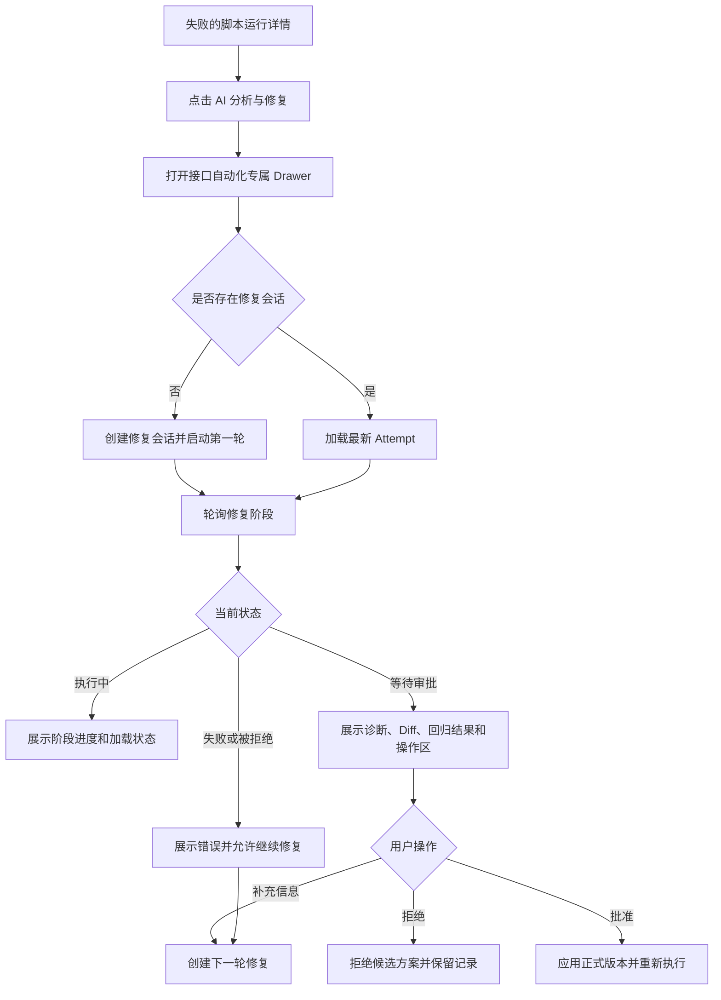

# 接口自动化运行详情 AI 分析与修复 Drawer Spec

**项目**：AI Testing System  
**创建日期**：2026-07-23  
**版本**：1.0  
**状态**：需求已确认，待实施  
**关联设计**：`docs/superpowers/specs/2026-07-23-api-automation-ai-repair-design.md`  
**实施策略**：完全独立实现，复制性能测试 AI 分析的视觉与交互模式，不共享前端组件、不合并业务代码

---

## 1. 背景

当前接口自动化失败运行详情中的 AI 修复功能以内嵌 Panel 展示，和性能测试的 AI 分析 Drawer 在容器、信息层级、进度表达和底部操作区上不一致。

接口自动化的业务流程比性能测试更复杂，包含临时副本修复、完整接口回归、人工审批、Diff、应用正式版本和后续重跑。因此本次不合并两套业务逻辑，也不抽取共享组件，而是在接口自动化模块中独立实现一套与性能测试一致的右侧 Drawer 体验。

本 Spec 只定义接口自动化运行详情的前端展示与交互调整。现有后端修复会话、Attempt、审批、Diff、Revision 和重跑能力继续沿用，不在本次重新设计。

---

## 2. 已确认决策

- 接口自动化 AI 分析与修复使用右侧 Drawer。
- Drawer 的视觉结构、信息顺序和操作节奏参考性能测试 AI 分析。
- 接口自动化单独实现 Drawer、进度、结果、Diff 和操作区域组件。
- 不从性能测试目录导入组件、类型、Hook 或业务函数。
- 不修改性能测试 AI 分析现有实现。
- 不合并性能测试和接口自动化的状态机。
- 不修改现有接口自动化后端 API 契约。
- 仅失败的脚本类型接口自动化运行显示入口；场景运行继续遵循现有不支持限制。
- AI 生成的候选修改必须在人工审批前保持在临时副本中。
- 关闭 Drawer 不终止后台修复任务；再次打开时恢复当前会话状态。
- 后端返回的 `available_actions` 是按钮可用性的最终依据，前端不得自行推断越权操作。

---

## 3. 目标

### 3.1 Must

- 将接口自动化 AI 修复从运行详情内嵌 Panel 改为右侧 Drawer。
- 保持现有创建会话、轮询、继续修复、查看 Diff、拒绝、批准并应用和正式重跑能力。
- 复制性能测试 AI 分析的窗口尺寸、Header、内容滚动区、Footer 和主要视觉样式。
- 在 Drawer 中清晰展示修复轮次、当前阶段、诊断摘要、验证统计和人工操作。
- 在 `waiting_approval` 状态提供查看 Diff、拒绝方案、补充信息并重新生成、批准并应用四类操作。
- 在修复任务执行期间展示明确的阶段进度，而不是只展示笼统的处理中提示。
- 关闭并重新打开 Drawer 后能够恢复当前修复会话。

### 3.2 Should

- 在验证结果变差时展示明显风险提示，但仍允许用户审批。
- 在通过/失败统计中同时显示修复前结果和候选方案结果。
- 展示当前 Attempt 的修复历史入口或摘要。
- 统一按钮的图标、文案、禁用态、Loading 态和错误反馈。
- 对 Diff 使用接口自动化专属 Dialog，不直接复用性能测试配置 Diff。

### 3.3 Could

- 在 Drawer Header 中展示运行环境名称和运行 ID。
- 展示失败用例数量、候选修改文件数和回归耗时。
- 在修复历史中展示每一轮的用户补充信息摘要。

### 3.4 Won't

- 不抽取跨业务共享的 AI Drawer 基础组件。
- 不修改性能测试 AI 分析 Drawer。
- 不新增通用 AI Pipeline、通用状态机或通用 Diff 框架。
- 不在本次新增后端状态、数据库表或 API 路由。
- 不展示模型内部思维过程。
- 不增加自动批准、自动应用或跳过人工审批的路径。

---

## 4. 用户与使用前提

### 4.1 用户角色

- 接口自动化测试人员：查看失败运行、启动 AI 修复、补充业务信息和审核候选修改。
- 项目管理员：在具备现有项目权限的前提下执行批准、应用、回滚等操作。

### 4.2 使用前提

- 用户已进入接口自动化运行详情。
- 当前运行状态为失败。
- 当前运行目标类型为脚本。
- 用户具备现有接口自动化运行和修复会话权限。

---

## 5. 整体用户流程

---

## 6. 功能需求

### FR-1 失败运行入口

**优先级**：Must

运行详情在满足以下条件时展示“AI 分析与修复”入口：

- 运行状态为失败。
- 运行目标类型为脚本。
- 用户具有当前项目的运行详情访问权限。

以下情况不展示或禁用入口：

- 运行正在排队、执行中或已通过。
- 运行目标类型为场景。
- 当前已有不可重复创建的活跃修复轮次。

入口保留现有运行详情中的失败上下文，不另建独立页面。

### FR-2 Drawer 打开与恢复

**优先级**：Must

点击入口后，系统打开右侧 Drawer，不离开当前运行详情。

Drawer 必须满足：

- 桌面端采用右侧滑出布局。
- 使用与性能测试 AI 分析一致的宽度、边框、内边距和底部操作区布局。
- 中间内容区域独立滚动。
- Header 和 Footer 在滚动时保持稳定可用。
- 关闭 Drawer 不取消后台任务。
- 再次打开时加载该运行最新的修复会话和 Attempt。

### FR-3 Drawer Header

**优先级**：Must

Header 展示：

- AI 图标。
- 标题“接口自动化 AI 分析与修复”。
- 当前修复轮次。
- 当前阶段的人类可读状态。
- 当前运行标识或运行摘要。

Header 不展示后端内部状态枚举作为唯一信息，也不展示模型内部推理过程。

### FR-4 修复进度

**优先级**：Must

接口自动化 Drawer 使用独立的阶段进度组件。阶段至少覆盖：

1. 收集失败上下文。
2. 分析接口契约与失败原因。
3. 生成临时修复方案。
4. 执行完整接口回归。
5. 等待人工审批。
6. 应用正式版本。
7. 执行正式回归。

每个阶段必须支持以下显示状态：

- 未开始：灰色圆点。
- 执行中：加载图标和高亮文案。
- 已完成：绿色勾选。
- 失败：红色错误图标和错误说明。

后端状态与用户文案的映射只属于接口自动化模块，不与性能测试共享。

### FR-5 诊断结果

**优先级**：Must

Drawer 在阶段完成后展示：

- 诊断摘要。
- 主要失败原因。
- 问题分类。
- 诊断依据或证据摘要。
- 被判断为接口缺陷、测试代码缺陷、测试数据问题、环境问题或证据不足时的说明。

如果后端没有可展示诊断结果，页面展示当前阶段、空状态或错误信息，不使用前端猜测内容填充。

### FR-6 验证结果

**优先级**：Must

在候选方案完成临时回归后，Drawer 展示验证统计：

- 修复前通过数量。
- 修复前失败数量。
- 候选方案通过数量。
- 候选方案失败数量。
- 已解决失败数量。
- 仍存在失败数量。
- 新增失败数量。

通过和失败统计使用性能测试 AI 分析中已确认的浅绿色和浅红色信息块风格，但具体字段使用接口自动化数据模型。

当候选方案失败数量高于修复前，必须展示风险提示：

“本轮候选方案引入了新的失败或使验证结果变差，请谨慎审批。”

风险提示不替代后端权限和可用操作判断。

### FR-7 补充信息

**优先级**：Must

在需要用户补充信息或用户准备继续修复时，Drawer 展示多行输入区域。

输入提示为：

“可选：补充业务规则、正确状态码或有效测试数据；不填写也可以继续修复。”

输入内容：

- 可为空。
- 用于下一轮修复或拒绝说明。
- 提交成功后清空。
- Drawer 关闭后再次打开时，不要求恢复未提交输入。

### FR-8 审批操作

**优先级**：Must

当当前 Attempt 为 `waiting_approval` 且后端允许对应操作时，底部操作区展示：

- 查看 Diff。
- 拒绝方案。
- 补充信息并重新生成。
- 批准并应用。

操作行为：

- 查看 Diff：打开接口自动化专属 Diff Dialog。
- 拒绝方案：提交拒绝动作和可选反馈，保留当前 Attempt 记录。
- 补充信息并重新生成：创建下一轮 Attempt，不应用当前候选修改。
- 批准并应用：应用正式版本，随后按现有后端流程重新执行接口自动化测试。

按钮的显示、禁用和可用性以后端 `available_actions` 为准。

### FR-9 继续修复

**优先级**：Must

当当前修复失败、被拒绝或正式回归仍失败，且后端允许继续修复时，展示“继续修复”。

用户可以：

- 填写补充信息后继续。
- 不填写补充信息直接继续。

下一轮必须沿用现有后端会话历史、当前版本和前序人工反馈，前端只负责提交用户输入和刷新会话。

### FR-10 Diff 查看

**优先级**：Must

接口自动化使用独立 Diff Dialog 展示候选修改。

Dialog 至少包含：

- 修改文件列表。
- 文件路径。
- 新增、删除和修改内容。
- Diff 加载状态。
- Diff 加载失败状态。
- 无修改内容状态。

Diff 查看失败不能导致 Drawer 会话状态丢失。

### FR-11 轮询与错误反馈

**优先级**：Must

当当前 Attempt 处于后端定义的活跃状态时，前端继续轮询会话详情。

轮询要求：

- 使用现有两秒轮询节奏。
- Drawer 关闭后不要求停止后台任务；再次打开重新读取服务端状态。
- 组件卸载后不得继续更新已销毁组件。
- 单次轮询失败不覆盖已展示的有效状态。
- 创建、审批、拒绝、继续修复和 Diff 操作失败时展示用户可理解的错误消息。

### FR-12 运行详情刷新

**优先级**：Must

批准并应用完成后，继续沿用现有 `onRunChanged` 机制刷新运行详情。

如果正式重跑生成新的运行记录：

- Toast 明确提示正式修复已应用并开始重新执行。
- 当前运行详情刷新或跳转行为遵循现有接口自动化运行详情逻辑。
- 不在本次新增第二套运行跳转规则。

---

## 7. 用户界面要求

### 7.1 视觉基准

接口自动化 Drawer 以以下性能测试组件为视觉参考：

`apps/frontend/src/components/ai-testing/performance-testing/performance-ai-analysis-drawer.tsx`

需要复制的视觉基准包括：

- 右侧 Drawer 容器。
- 顶部 Header 边框和内边距。
- AI 图标与标题的排列。
- 轮次 Badge。
- 内容区垂直间距。
- 结果信息块颜色。
- 底部 Footer 边框和按钮排列。
- Loading、空状态和错误状态。

视觉复制不等于代码复用。实现文件必须位于接口自动化目录，使用接口自动化自己的业务类型和处理函数。

### 7.2 响应式要求

- 桌面端使用右侧 Drawer。
- 小屏幕允许占满可用宽度。
- Footer 按钮在窄屏下允许换行。
- 长错误信息、长诊断文本和 Diff 内容必须可滚动。
- 所有关键操作保持键盘可访问。

### 7.3 文案要求

- 面向用户展示中文业务状态，不展示内部英文枚举作为主文案。
- “批准并应用”必须明确表示会修改正式测试套件。
- “补充信息并重新生成”必须明确表示不会直接应用当前方案。
- 风险提示必须说明验证结果变差或出现新增失败。
- 错误消息必须说明下一步可执行动作。

---

## 8. 系统状态与操作矩阵

| 当前状态 | 用户可见内容 | 允许操作 |
|---|---|---|
| `queued` | 等待执行、阶段进度 | 关闭 Drawer |
| `collecting_context` | 收集失败上下文 | 关闭 Drawer |
| `diagnosing` | 诊断进度 | 关闭 Drawer |
| `generating_patch` | 临时修复进度 | 关闭 Drawer |
| `validating` | 完整接口回归进度 | 关闭 Drawer |
| `waiting_approval` | 诊断、Diff、验证统计、风险 | 以后端动作列表为准 |
| `applying` | 正式版本应用进度 | 关闭 Drawer |
| `rerunning` | 正式接口测试进度 | 关闭 Drawer |
| `completed` | 最终结果和运行关联 | 继续修复或关闭 Drawer |
| `rejected` | 拒绝原因和修复历史 | 继续修复或关闭 Drawer |
| `failed` | 错误原因和已完成信息 | 继续修复或关闭 Drawer |

---

## 9. 非功能需求

### NFR-1 业务隔离

接口自动化 Drawer 不得依赖性能测试业务组件、性能分析类型、性能分析 API 或性能测试状态映射。

### NFR-2 向后兼容

现有接口自动化后端路由、请求参数、响应字段和会话状态含义保持不变。

### NFR-3 可靠性

关闭和重新打开 Drawer 不得创建重复活跃会话，也不得丢失服务端已持久化的 Attempt。

### NFR-4 可访问性

- Drawer、Dialog、按钮和输入框可通过键盘操作。
- Loading 状态不能只通过颜色表达。
- 错误状态有文本说明。
- 关闭 Drawer 后焦点回到触发按钮。

### NFR-5 安全性

前端不得在日志、Toast、Diff 或诊断摘要中主动展示未经后端脱敏的 Token、Cookie、密码、API Key 或其他凭据。

### NFR-6 可维护性

接口自动化的 UI 文件、状态映射和测试保持在 `api-automation` 目录内，不为追求样式一致新增跨业务抽象层。

---

## 10. 验收标准

### AC-1 入口

- 失败脚本运行详情展示“AI 分析与修复”。
- 通过、执行中和场景运行不出现错误的可用入口。
- 点击入口打开右侧 Drawer，不跳转页面。

### AC-2 样式

- Drawer 的 Header、内容滚动区、Footer、按钮组和 Badge 风格与性能测试 AI 分析一致。
- 接口自动化代码不导入性能测试组件或性能测试类型。
- 窄屏下按钮和长文本不溢出。

### AC-3 进度

- 能展示接口自动化各阶段的当前状态。
- 执行中显示加载状态。
- 完成显示勾选状态。
- 失败显示错误状态和错误信息。
- 页面不展示模型内部思维过程。

### AC-4 审批

- `waiting_approval` 时展示查看 Diff、拒绝方案、补充信息并重新生成、批准并应用。
- 按钮是否展示和是否可用遵循后端返回的动作列表。
- 点击批准并应用后显示成功反馈，并刷新运行详情。
- 点击拒绝后保留会话和 Attempt 历史。

### AC-5 轮次

- 第一轮创建后能自动轮询。
- 继续修复可以在有无补充信息两种情况下启动。
- 关闭 Drawer 后再次打开能恢复最新轮次。
- 不会因打开 Drawer 或轮询重复创建活跃会话。

### AC-6 验证结果

- 展示修复前和候选方案的通过/失败统计。
- 验证结果变差时展示风险提示。
- 失败统计为零或结果缺失时展示合理空状态，不显示 `undefined`、`NaN` 或错误数字。

### AC-7 Diff

- 能打开接口自动化专属 Diff Dialog。
- Diff 加载中、加载失败、无 Diff 和正常 Diff 均有明确状态。
- 关闭 Diff 后 Drawer 会话状态保持不变。

---

## 11. 测试范围

### 11.1 前端契约测试

更新或新增以下测试：

- `apps/frontend/tests/api-automation-ai-repair-contract.test.mjs`
- `apps/frontend/tests/api-automation-run-detail-contract.test.mjs`

测试至少验证：

- 入口文案和失败脚本条件。
- Drawer 组件存在。
- 进度阶段文案存在。
- `waiting_approval` 操作存在。
- 补充信息文案存在。
- Diff 操作存在。
- 现有 API Client 函数仍被调用。
- 不导入性能测试组件。
- 不使用浏览器原生确认框替代现有 UI。

### 11.2 手动验证

- 失败脚本运行打开 Drawer。
- 首轮从创建到等待审批完整展示。
- 补充信息为空和非空时分别继续修复。
- Diff 正常、为空和加载失败时展示正确状态。
- 拒绝方案后重新打开会话仍能看到历史。
- 批准并应用后运行详情刷新。
- Drawer 关闭和重新打开不重复创建会话。
- 性能测试 AI 分析页面现有行为未发生变化。

---

## 12. 实施边界

### 本次需要修改

- 接口自动化运行详情的 AI 修复入口。
- 接口自动化专属 Drawer。
- 接口自动化专属进度展示。
- 接口自动化专属验证结果展示。
- 接口自动化专属 Diff Dialog。
- 接口自动化前端契约测试。

### 本次不需要修改

- 性能测试 AI 分析组件。
- 性能测试后端分析服务。
- 接口自动化后端修复状态机。
- 接口自动化修复会话和 Attempt 数据模型。
- 接口自动化 API 路由和请求协议。
- Agent Prompt、模型选择和临时 workspace 执行逻辑。

---

## 13. 风险与应对

| 风险 | 应对 |
|---|---|
| 复制样式后两套 Drawer 未来发生视觉漂移 | 通过契约测试和验收清单约束关键结构，不引入共享组件 |
| 接口自动化状态多于性能测试 | 使用接口自动化独立状态映射和阶段列表，不复用性能状态机 |
| 审批按钮前端判断错误 | 以服务端 `available_actions` 为准，前端只负责展示和触发 |
| 长 Diff 或日志导致 Drawer 难以阅读 | 内容区独立滚动，Diff 使用独立 Dialog |
| 关闭 Drawer 后重复创建会话 | 打开时优先查询已有会话，创建动作继续由后端幂等/冲突规则保护 |
| 验证结果变差但用户误批 | 使用高风险提示，并保持 Diff、统计和回归结果在审批前可见 |

---

## 14. 完成定义

满足以下条件后，本 Spec 对应工作视为完成：

- 接口自动化 AI 修复已从内嵌 Panel 改为独立右侧 Drawer。
- UI 结构和样式与性能测试 AI 分析保持一致。
- 两套前端代码没有业务组件、类型或状态机共享。
- 现有后端修复流程和 API 契约未被破坏。
- 所有 Must 级验收标准通过。
- 前端契约测试通过。
- 完成一次失败运行、审批、Diff 和继续修复的手动回归。

