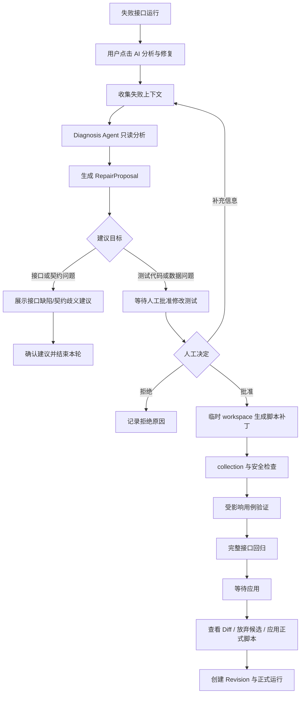

# 接口自动化 AI 修复建议审批闸门设计

**日期**：2026-07-23  
**状态**：已获用户确认，待实施计划  
**范围**：前端、后端、持久化状态、契约测试

## 1. 目标

将接口自动化 AI 修复流程调整为“先诊断并提出建议，人工批准后才修改测试脚本”的闭环，避免 AI 在无法确认正确状态码时通过降低断言或修改用例来制造通过。

本次设计只允许 AI 修改 pytest + requests 测试套件，不允许 AI 修改被测业务系统代码。接口缺陷、契约歧义和证据不足的结论只形成诊断建议，不产生测试脚本补丁。

## 2. 当前问题

现有实现将 `generating_patch`、候选 workspace 验证和 `waiting_approval` 串在同一轮中。用户看到的是已经生成的 Diff，而不是“应该修改什么、为什么修改、是否应该修改测试”的决策材料。`approve` 目前承担了“批准并应用”的职责，无法表达“批准建议但尚未开始修复”。

典型错误场景：负向用例期望 `400/401`，接口统一返回 `200`。AI 不应直接把期望值改为 `200`；应展示实际状态码、失败用例、证据和风险，并优先建议检查接口参数校验或鉴权中间件。

## 3. 核心原则

1. **诊断只读**：收集上下文、分析失败和生成建议阶段不得写入正式测试套件、用例数据库或正式运行配置。
2. **建议先于补丁**：审批前只能生成结构化 `RepairProposal`，不得生成或展示“可应用 Diff”作为既定修复结果。
3. **人工批准触发修复**：只有用户批准“修改测试脚本”的建议后，后端才创建临时 workspace 并启动脚本修复。
4. **接口缺陷不改测试**：`interface_bug`、`contract_ambiguity`、`unknown` 默认不允许进入测试脚本修复。
5. **验证与应用分离**：候选脚本通过验证后进入 `ready_to_apply`，用户再次点击应用才替换正式套件。
6. **正式资产可回退**：正式套件、用例数据库和运行记录必须保持一致，并保留每个已应用版本。

## 4. 端到端流程



## 5. 状态模型

### 5.1 Attempt 状态

```text
queued
collecting_context
diagnosing
proposal_ready
waiting_approval
proposal_rejected
candidate_generating
candidate_validating
ready_to_apply
applying
rerunning
completed
failed
superseded
```

状态含义：

- `proposal_ready`：已生成结构化建议，尚未允许脚本修复。
- `waiting_approval`：建议目标是测试代码或测试数据，等待人工批准。
- `proposal_rejected`：用户拒绝建议或确认不修改测试。
- `candidate_generating`：已批准，AI 正在临时 workspace 生成候选脚本。
- `candidate_validating`：正在执行 collection、受影响用例和完整回归。
- `ready_to_apply`：候选脚本验证完成，可以查看 Diff 并应用。
- `applying`：正在以基线校验、锁和补偿机制替换正式套件。
- `rerunning`：已应用候选版本，正在执行正式运行。

### 5.2 Session 状态

```text
active
passed
closed
failed
```

Session 仍用于承载多轮 Attempt；后一轮必须引用当前正式 revision 和上一轮摘要。

## 6. 结构化建议契约

新增 `RepairProposal`，作为诊断阶段唯一允许输出的修复计划：

```json
{
  "target": "test_script|test_data|interface|contract|unknown",
  "action": "modify_assertion|modify_request_data|modify_fixture|inspect_interface|confirm_contract|no_change",
  "title": "参数校验负向用例与接口实际行为不一致",
  "summary": "16 个负向用例期望 400/401，但实际全部返回 200。",
  "confidence": 0.86,
  "evidence": [
    "13 个参数校验用例实际返回 200，期望 400",
    "3 个鉴权用例实际返回 200，期望 401",
    "2 个正向用例期望 200 且通过"
  ],
  "observed_status_codes": [200],
  "expected_status_codes": [400, 401],
  "affected_cases": ["case-1", "case-2"],
  "proposed_changes": [],
  "risks": ["将断言改为 200 会掩盖接口校验缺失"],
  "questions": ["请确认接口是否应拒绝缺失字段或无效凭据"],
  "requires_user_confirmation": true,
  "script_repair_allowed": false
}
```

约束：

- `script_repair_allowed` 只有 `test_script` 或 `test_data` 且证据足够时才可为 `true`。
- `interface`、`contract`、`unknown` 强制为 `false`。
- 建议必须包含实际和期望状态码（若失败与状态码有关）。
- 不允许以删除用例、跳过用例、`xfail`、吞异常或放宽断言作为默认修复建议。
- `proposed_changes` 在建议阶段只能是计划描述，不能是已经写入 workspace 的文件 Diff。

## 7. 后端接口行为

保留现有会话和 Attempt 查询接口，但调整动作语义：

- `POST /api-runs/{run_id}/repair-session`：创建或恢复分析会话，只启动上下文收集和诊断。
- `GET /api-repair-sessions/{session_id}`：返回 proposal、状态和基于状态计算的 `available_actions`。
- `POST /api-repair-sessions/{session_id}/attempts`：携带补充信息重新分析，不直接生成脚本补丁。
- `POST /api-repair-attempts/{attempt_id}/approve`：只接受 `waiting_approval`，将 Attempt 转为 `candidate_generating` 并异步启动候选脚本修复。
- `POST /api-repair-attempts/{attempt_id}/reject`：记录意见并转为 `proposal_rejected`，正式资产不变。
- `GET /api-repair-attempts/{attempt_id}/diff`：只允许 `ready_to_apply` 或已有候选 workspace 的状态调用。
- 新增 `POST /api-repair-attempts/{attempt_id}/apply`：只允许 `ready_to_apply`，完成正式套件和用例数据库的一致性应用。
- 新增 `POST /api-repair-attempts/{attempt_id}/discard`：放弃候选 workspace，正式资产不变。

`approve` 不得直接替换正式套件，也不得直接创建正式 API Run。正式 Run 只能由 `apply` 成功后创建。

## 8. 应用与一致性

应用阶段必须：

1. 检查正式 suite manifest 与 `base_revision` 一致。
2. 获取现有项目 workspace 锁。
3. 对候选 workspace 执行 collection 检查。
4. 在数据库事务中同步结构化 `case_updates`。
5. 以 staging + backup 方式替换正式 suite。
6. 创建新的 revision snapshot。
7. 创建带 `parent_run_id` 和 `source_repair_attempt_id` 的正式 API Run。
8. 任一步失败时恢复 suite 和数据库，不创建半成品正式 Run。

## 9. 前端交互

进度条改为：

```text
收集失败上下文
分析失败原因
生成修复建议
等待人工审批
生成候选测试脚本
验证受影响用例
执行完整回归
等待应用
```

建议阶段主卡片包含：诊断结论、失败证据、实际/期望状态码、建议目标、修改范围、风险、置信度和待确认问题。

按钮规则：

- `waiting_approval + script_repair_allowed=true`：`查看建议`、`拒绝建议`、`补充信息并重新分析`、`批准并开始修复`。
- `waiting_approval + script_repair_allowed=false`：`确认建议并结束`、`补充信息并重新分析`；不显示“批准并应用”。
- `ready_to_apply`：`查看 Diff`、`放弃候选修复`、`应用通过的测试脚本`。
- 活动状态：只显示进度和刷新，不显示应用按钮。

## 10. 安全与资源边界

- Diagnosis Agent 不拥有文件写权限。
- Repair Agent 只能写临时 workspace，不提供任意 Shell。
- 所有输入、日志、proposal 和 Diff 脱敏 Authorization、Cookie、Token、API Key、密码和 Secret。
- 每轮限制 Agent 调用次数、总耗时、pytest 超时、最大修改文件数、Diff 行数和历史上下文长度。
- 同一项目同时只允许一个活动 Attempt。
- 基线变化、候选 collection 失败、回归超时和安全扫描失败时禁止应用。

## 11. 测试验收

后端必须覆盖：

- 状态转换合法性和非法状态拒绝。
- 诊断阶段不创建候选 workspace，不修改正式 suite。
- `interface_bug`、`contract_ambiguity`、`unknown` 不允许脚本修复审批。
- `approve` 只启动候选修复，不替换正式 suite。
- `apply` 只允许 `ready_to_apply`，且基线变化时返回 409。
- 应用过程中数据库或文件失败时补偿回滚。
- 正式 Run 具备父子运行链路。

前端必须覆盖：

- 建议阶段不展示“批准并应用”。
- 接口缺陷建议展示“不修改测试脚本”的明确结论。
- 批准后展示候选修复和回归阶段。
- 只有 `ready_to_apply` 展示正式应用按钮。
- 保留 Diff、补充信息、拒绝和连续修复入口。

## 12. 非目标

- 自动修改被测业务代码。
- 未经人工批准自动修改正式测试套件。
- 将不确定的状态码推断成确定契约。
- 为了通过而删除、跳过或弱化测试。
- 引入新的通用任务编排或分布式 Worker 平台。
