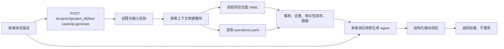

# 手工测试用例 AI 生成设计 Spec

## 1. 背景

当前 `/test-cases` 页面支持两种创建方式：

- 手工新建单条测试用例。
- 根据需求生成测试用例集。

手工新建测试用例时，用户需要逐项填写用例名称、前置条件、操作步骤和每一步预期结果。项目的页面探索模块已经沉淀页面 YAML、元素信息和 `operations.yaml` 等结构化探索产物，但手工创建流程尚未利用这些信息。

本次在“新建测试用例”模式中增加 AI 生成功能。用户提供一段自然语言测试意图，并决定是否关联当前项目的全部探索产物。系统据此生成一条完整、可编辑的手工测试用例并填入现有表单。

本设计只覆盖单条手工测试用例生成，不改变现有测试用例集生成流程。

## 2. 已确认决策

- AI 生成仅在 `新建测试用例` 模式可用。
- `新建测试用例集` 模式不展示 AI 生成入口。
- AI 生成按钮位于顶部“新建测试用例”创建方式卡片的右侧。
- 点击 AI 生成后，用户输入一段自然语言测试描述。
- 用例名称下方新增“是否关联探索产物”字段。
- 选择关联后，系统自动使用当前项目下的全部可用探索产物，不提供逐个产物选择器。
- AI 生成用例名称、前置条件、测试步骤和每一步预期结果。
- 备注字段不由 AI 生成，也不被 AI 覆盖。
- 如果目标表单字段为空，生成成功后直接应用。
- 如果目标表单字段已有内容，生成成功后提示用户确认是否覆盖。
- 用户取消覆盖时，保留原表单内容和本次 AI 结果，允许再次应用。

## 3. 目标

- 让用户通过一段自然语言快速得到一条结构完整的测试用例。
- 使用项目探索产物中的真实页面、元素和操作信息提高生成准确性。
- 将生成结果直接映射到现有手工测试用例表单，不引入新的保存模型。
- 复用现有模型选择、LangChain Agent、`SkillMiddleware` 和结构化输出机制。
- 隐藏探索产物读取、筛选、去重、压缩和 Prompt 组装复杂度。
- 在上下文缺失、部分产物损坏或产物规模过大时保持可用，并向用户说明降级情况。

## 4. 非目标

- 不生成测试用例集。
- 不创建或执行 UI 自动化代码。
- 不自动保存 AI 结果；用户仍需点击“创建测试用例”。
- 不逐个选择探索任务、页面或产物。
- 不上传额外附件作为本次生成输入。
- 不让 Agent 直接访问数据库、文件系统或浏览器工具。
- 不让 AI 生成备注、创建人、状态、审核信息或数据库 ID。
- 不新增异步生成任务、轮询和任务中心记录；单条用例采用同步请求。
- 不把模型推断伪装为已确认的产品事实。

## 5. 核心原则

生成过程中遵循以下证据职责：

```text
用户描述决定“测试什么”
探索产物决定“页面上如何操作”
探索产物中的已验证信息决定“哪些名称和路径可作为事实”
模型推断只能补充表达，不能编造未确认业务规则
```

证据优先级：

1. 用户本次输入的测试目标和明确规则。
2. 项目探索操作中的已验证步骤与预期。
3. 项目页面 YAML 中的页面、元素、路径和结构信息。
4. 模型基于常见测试方法做出的合理推断。

低优先级信息不得覆盖高优先级信息。无法由用户描述或探索产物证明的业务规则必须记录在 `generation_notes` 中。

## 6. 前端交互设计

### 6.1 AI 生成入口

页面：`/test-cases`

现有创建方式区域调整为：

```text
创建方式

┌──────────────────────────────────────┐  ┌──────────────────────────────────────┐
│ ● 新建测试用例          [AI 生成]    │  │ ○ 新建测试用例集                     │
└──────────────────────────────────────┘  └──────────────────────────────────────┘
```

规则：

- `createMode === "case"` 时展示并启用 `AI 生成`。
- `createMode === "set"` 时不展示 AI 生成按钮。
- 未选择项目时允许打开 AI 输入弹窗，但提交生成时必须提示选择项目。
- AI 请求执行期间按钮展示加载状态并禁止重复提交。
- AI 生成按钮不得触发创建方式卡片的切换事件。

### 6.2 是否关联探索产物

在“用例名称”下方新增：

```text
是否关联探索产物
○ 否    ● 是
已自动关联当前项目的全部可用探索产物
```

规则：

- 默认值：`是`。
- 选择“是”仅表达生成时允许后端读取当前项目全部可用探索产物。
- 前端不加载产物列表，不传产物 ID。
- 项目切换后保留开关值，但下一次生成必须使用新项目的产物。
- 当前没有选择项目时，辅助文案为：`选择项目后将自动关联该项目的全部可用探索产物。`
- 选择“否”时，辅助文案为：`本次仅根据你的描述生成。`

### 6.3 AI 输入弹窗

点击 `AI 生成` 后打开小型弹窗：

```text
AI 生成测试用例
描述你希望验证的业务场景，AI 将生成用例名称、前置条件和测试步骤。

测试描述 *
[例如：验证用户连续输入错误密码达到限制次数后，账号会被锁定。]

生成依据
用户描述 + 当前项目全部探索产物

[取消] [生成并填入]
```

字段规则：

- 测试描述必填。
- 去除首尾空格后长度至少 2 个字符。
- 建议最大长度 4000 字符，超过时前端阻止提交。
- 弹窗中的生成依据根据关联开关动态显示。
- 请求失败时弹窗保持打开，保留用户输入。
- 请求成功后关闭 AI 输入弹窗。

### 6.4 生成结果应用规则

AI 生成成功后，前端检查生成目标字段的当前值。

以下情况视为“表单已有内容”：

- 用例名称去除空格后不为空。
- 前置条件去除空格后不为空。
- 任一步骤的 `action` 或 `expected_result` 去除空格后不为空。

以下情况不视为已有内容：

- 默认初始化的一行空步骤。
- 备注字段存在内容。
- 项目字段已选择。
- 是否关联探索产物已有选择。

无已有内容：

- 直接将 AI 结果填入用例名称、前置条件和测试步骤。
- 显示成功提示：`AI 已生成测试用例，请检查后创建。`

存在已有内容：

```text
当前表单已有内容

应用 AI 生成结果将覆盖已有的用例名称、前置条件和测试步骤，是否继续？

[取消] [覆盖并应用]
```

- 点击“覆盖并应用”后覆盖目标字段。
- 点击“取消”后保留原表单。
- 取消后保留本次生成结果，AI 按钮附近或弹窗中提供 `应用上次生成结果`。
- 备注始终保留，不参与覆盖。

### 6.5 并发编辑保护

AI 请求可能持续数秒，用户在请求期间仍可能修改表单。因此覆盖判断必须基于“生成成功时的当前表单”，不能只基于发起请求时的快照。

流程：

```text
发起生成
  ↓
用户可能继续编辑表单
  ↓
生成成功
  ↓
检查此刻表单内容
  ├─ 空：直接应用
  └─ 非空：请求覆盖确认
```

## 7. 总体后端架构

采用“单条测试用例生成 Agent + 探索上下文构建模块”的单一方案：



后端模块职责：

| 模块 | 职责 |
| --- | --- |
| `api/v1/test_cases.py` | HTTP 路由、认证、参数校验和错误映射 |
| `services/manual_test_case_generation/` | 编排项目校验、上下文构建、Agent 调用和结果返回 |
| `services/manual_test_case_generation/exploration_context_builder.py` | 读取、解析、筛选、去重和压缩探索产物 |
| `agents/manual_test_case_generation/` | 单条用例结构化生成 Agent |
| `agents/manual_test_case_generation/skills/` | 生成规范、证据规则和输出质量要求 |

## 8. 为什么不直接复用测试用例集输出

现有 `apps/backend/app/agents/test_case_generation/` 面向需求文档批量生成，输出结构包含：

- 测试用例集概述。
- 总用例数。
- 模块列表。
- 多条测试用例。
- 优先级、测试类型、测试数据和汇总预期等字段。

本功能只需要单条手工用例，并且必须直接映射到现有手工表单。强行使用用例集输出会产生以下问题：

- 需要在接口层选择第一条用例，行为不稳定。
- Agent 可能生成多条用例，浪费模型成本。
- 输出包含当前表单不需要的字段。
- 单条场景规则会污染批量生成 Prompt。

因此新增单条用例 Agent，但复用以下基础设施：

- `resolve_model_selection`
- `build_agent_model`
- `thinking_disabled_extra_body`
- `SkillMiddleware`
- LangChain `create_agent`
- `ToolStrategy` 结构化输出

## 9. 接口契约

### 9.1 路由

```http
POST /projects/{project_id}/test-cases/ai-generate
```

权限：与手工创建测试用例保持一致，使用管理员权限校验。

接口是生成预览，不创建数据库记录。

### 9.2 请求模型

```python
class ManualTestCaseAiGenerateIn(BaseModel):
    description: str = Field(..., min_length=2, max_length=4000)
    include_exploration_artifacts: bool = True
```

请求示例：

```json
{
  "description": "验证用户连续输入错误密码达到限制次数后，账号会被锁定",
  "include_exploration_artifacts": true
}
```

前端不得传递：

- 页面 ID。
- 产物 ID。
- 文件路径。
- Prompt。
- 模型名称。
- 是否覆盖表单。

### 9.3 响应模型

```python
class ManualTestCaseAiStepOut(BaseModel):
    action: str = Field(..., min_length=1)
    expected_result: str = Field(..., min_length=1)


class ManualTestCaseAiSourceSummaryOut(BaseModel):
    description_used: bool = True
    exploration_artifacts_requested: bool
    exploration_artifacts_used: bool
    page_count: int = 0
    operation_count: int = 0
    truncated: bool = False


class ManualTestCaseAiGenerateOut(BaseModel):
    title: str = Field(..., min_length=1)
    preconditions: str = ""
    steps: list[ManualTestCaseAiStepOut] = Field(..., min_length=1)
    generation_notes: list[str] = Field(default_factory=list)
    source_summary: ManualTestCaseAiSourceSummaryOut
```

响应示例：

```json
{
  "title": "连续输错密码后账号锁定验证",
  "preconditions": "用户账号已注册；用户处于登录页面；账号当前未被锁定",
  "steps": [
    {
      "action": "在用户名输入框中输入有效账号",
      "expected_result": "用户名输入框展示已输入的账号"
    },
    {
      "action": "在密码输入框中输入错误密码并点击登录",
      "expected_result": "页面提示用户名或密码错误，登录失败"
    },
    {
      "action": "重复输入错误密码，直到达到系统限制次数",
      "expected_result": "系统提示账号已被锁定，用户无法继续登录"
    }
  ],
  "generation_notes": [
    "登录页面和输入元素来自项目探索产物。",
    "账号锁定次数未在探索产物中明确记录，请人工确认。"
  ],
  "source_summary": {
    "description_used": true,
    "exploration_artifacts_requested": true,
    "exploration_artifacts_used": true,
    "page_count": 4,
    "operation_count": 12,
    "truncated": false
  }
}
```

## 10. Agent 数据模型

### 10.1 生成输入

```python
class ManualTestCaseGenerationInput(BaseModel):
    description: str
    exploration_context: ExplorationContext | None = None
```

### 10.2 探索上下文

```python
class ExplorationContext(BaseModel):
    pages: list[ExplorationPageContext] = Field(default_factory=list)
    operations: list[ExplorationOperationContext] = Field(default_factory=list)
    source_count: int = 0
    truncated: bool = False
    warnings: list[str] = Field(default_factory=list)
```

页面上下文：

```python
class ExplorationPageContext(BaseModel):
    page_id: str
    title: str
    display_name: str
    breadcrumb: list[str] = Field(default_factory=list)
    entry_path: str = ""
    structure_summary: str = ""
    elements: list[ExplorationElementContext] = Field(default_factory=list)
```

元素上下文：

```python
class ExplorationElementContext(BaseModel):
    element_key: str = ""
    name: str = ""
    text: str = ""
    role: str = ""
    action_type: str = ""
    context_hint: str = ""
```

操作上下文：

```python
class ExplorationOperationContext(BaseModel):
    operation_key: str
    page_path: str = ""
    steps: list[ExplorationOperationStepContext] = Field(default_factory=list)
```

```python
class ExplorationOperationStepContext(BaseModel):
    action: str
    element_key: str = ""
    element_name: str = ""
    value: str = ""
    expected: list[str] = Field(default_factory=list)
```

### 10.3 Agent 输出

Agent 输出与 HTTP 响应主体保持接近，但 `source_summary` 由后端根据实际上下文构建结果填充，不交给模型猜测。

```python
class ManualTestCaseGenerationStep(BaseModel):
    action: str = Field(..., min_length=1)
    expected_result: str = Field(..., min_length=1)


class ManualTestCaseGenerationResult(BaseModel):
    title: str = Field(..., min_length=1)
    preconditions: str = ""
    steps: list[ManualTestCaseGenerationStep] = Field(..., min_length=1)
    generation_notes: list[str] = Field(default_factory=list)
```

字符串字段在 Pydantic 校验器中统一去除首尾空格。空操作或空预期必须导致结构化输出校验失败。

## 11. 探索上下文构建模块

### 11.1 外部接口

模块只暴露一个主要接口：

```python
def build_exploration_context(
    actor,
    project_id: str,
    description: str,
    include_exploration_artifacts: bool,
) -> ExplorationContext | None:
    ...
```

调用者不需要知道：

- 探索产物文件路径。
- 页面 YAML 格式。
- `operations.yaml` 格式。
- 如何提取元素。
- 如何计算相关性。
- 如何截断上下文。
- 某个产物解析失败后如何降级。

### 11.2 数据来源

选择关联探索产物时，读取当前项目的：

1. 项目级页面 YAML。
2. 项目级 `operations.yaml`。

页面 YAML 提取：

- `page_id`
- `title`
- `display_name`
- `breadcrumb`
- `normalized_path` 或等价入口路径
- `structure_summary`
- 元素 `element_key`
- 元素名称和文本
- 元素角色
- 元素支持的动作类型
- 元素上下文提示

`operations.yaml` 提取：

- 操作 `key`
- `page_path`
- 操作步骤顺序
- `navigate`、`click`、`fill`、`press`、`wait`、`go_back`
- `element_key`
- 输入值或值引用
- 已记录的步骤预期

默认不读取或发送：

- 截图二进制。
- Trace 文件。
- 完整运行日志。
- Accessibility 原始树全文。
- Cookie、Token、密码或认证状态文件。
- 与测试生成无关的调试产物。

### 11.3 “关联全部产物”的语义

产品语义中的“全部产物”指：

- 当前项目下全部可用页面和操作产物都参与索引与相关性判断。
- 不要求将所有产物原文逐字发送给模型。

模型上下文由全部产物经过结构化提取、去重、相关性排序和限额后得到。

### 11.4 相关性排序

第一版不引入向量数据库。使用确定性的轻量相关性评分：

- 对用户描述进行规范化和关键词切分。
- 页面标题、展示名称、面包屑和路径命中获得较高权重。
- 元素名称、文本和 `element_key` 命中获得次高权重。
- 操作名称、步骤元素和已记录预期命中获得较高权重。
- 最近探索时间只作为同分排序依据，不改变业务相关性。

建议评分示意：

```text
页面标题或展示名称命中：+10
面包屑或页面路径命中：+7
操作名称命中：+9
操作步骤元素命中：+7
元素名称或文本命中：+5
结构摘要命中：+3
```

具体分值属于实现细节，但必须保持确定性并可通过单元测试验证。

### 11.5 上下文保留策略

- 所有页面至少保留页面名称和路径摘要。
- 高相关页面保留完整的限额内元素信息。
- 低相关页面只保留标题、路径和结构摘要。
- 高相关操作保留完整步骤。
- 低相关操作只保留操作名称和页面路径。
- 重复元素按照 `element_key` 优先去重，无 key 时使用规范化后的页面、名称、角色和动作组合去重。
- 空名称、空文本且没有动作能力的元素不进入 Agent 上下文。

### 11.6 规模限制

初始建议限额：

```python
MAX_PAGES = 100
MAX_FULL_PAGES = 20
MAX_ELEMENTS_PER_FULL_PAGE = 80
MAX_OPERATIONS = 100
MAX_FULL_OPERATIONS = 30
MAX_CONTEXT_CHARS = 80_000
```

规则：

- 先排序，后按优先级装入上下文。
- 达到字符上限后停止加入低优先级详情。
- 不截断单个字符串到不可理解的半句话；按字段或对象粒度移除。
- 发生限额裁剪时设置 `truncated = true`。
- 限额作为模块内部常量，不暴露给前端。

## 12. 敏感信息处理

探索产物可能包含用户输入值、URL 参数或认证信息。上下文构建模块在发送模型前必须执行脱敏。

至少处理：

- `password`、`passwd`、`pwd` 对应值替换为 `<redacted-password>`。
- `token`、`access_token`、`refresh_token`、`authorization` 替换为 `<redacted-token>`。
- Cookie 值替换为 `<redacted-cookie>`。
- 常见密钥字段替换为 `<redacted-secret>`。
- URL 查询参数中的敏感字段替换后再发送。

不得因为用户描述要求“输出密码”而绕过脱敏。

## 13. Agent 设计

### 13.1 目录

```text
apps/backend/app/agents/manual_test_case_generation/
├── __init__.py
├── agent.py
├── schemas.py
├── service.py
└── skills/
    └── manual-test-case-generation/
        ├── SKILL.md
        └── references/
            ├── manual-case-format.md
            └── exploration-context-rules.md
```

### 13.2 Agent 结构

- 单 Agent。
- 无外部工具。
- 使用 `SkillMiddleware` 加载生成规则。
- 使用 `ToolStrategy(ManualTestCaseGenerationResult)` 强制结构化输出。
- 使用新的能力标识 `manual_test_case_generation`。
- 模型配置继续由现有能力模型分配机制管理。

不采用多 Agent，原因：

- 单条用例生成是一次输入到一次结构化输出的短链路。
- 探索信息整理由确定性代码完成，不需要额外 Agent。
- 多 Agent 会增加耗时、成本和失败点，没有足够收益。

### 13.3 Skill 核心规则

Skill 必须约束：

- 只生成一条测试用例。
- 标题简洁描述测试目标，不使用“测试用例”作为无意义后缀。
- 前置条件只包含执行前必须成立的状态。
- 每一步只描述一个主要用户动作。
- 每一步必须有对应、可观察、可验证的预期结果。
- 步骤按照真实用户操作顺序排列。
- 优先使用探索产物中的真实页面和元素名称。
- 不输出选择器、XPath、CSS Locator 等实现细节到手工测试步骤。
- 不编造探索产物未记录且用户未说明的业务阈值、权限规则或状态变化。
- 必须推断时使用不带虚假精确值的表达，并写入 `generation_notes`。
- 探索产物与用户描述冲突时，以用户描述作为测试目标，以探索产物作为当前页面事实，并在说明中标注冲突。
- 不输出 Markdown、代码块或额外解释。

### 13.4 Prompt 结构

后端生成的用户消息按固定区块组织：

```text
【测试目标】
{description}

【探索上下文状态】
是否请求关联：是/否
是否实际使用：是/否
是否发生裁剪：是/否

【项目页面】
...

【已验证操作】
...

【生成要求】
生成一条手工测试用例，只返回结构化结果。
```

如果未关联探索产物，不添加空的页面和操作区块。

Prompt 中不得放入 HTTP 响应字段说明、数据库 ID 生成规则或前端覆盖逻辑。

## 14. 应用模块编排

建议新增：

```text
apps/backend/app/services/manual_test_case_generation/
├── __init__.py
├── service.py
└── exploration_context_builder.py
```

对路由暴露：

```python
async def generate_manual_test_case_preview(
    actor,
    project_id: str,
    payload: ManualTestCaseAiGenerateIn,
) -> ManualTestCaseAiGenerateOut:
    ...
```

执行顺序：

1. 校验项目存在且用户有权访问。
2. 规范化用户描述。
3. 根据开关构建探索上下文。
4. 调用单条测试用例 Agent。
5. 校验结构化结果。
6. 合并上下文构建产生的 warnings。
7. 由后端填充 `source_summary`。
8. 返回生成预览，不写数据库。

路由层不得直接读取 YAML、拼接 Prompt 或调用模型。

## 15. 降级与错误处理

| 场景 | HTTP | 行为 |
| --- | ---: | --- |
| 描述为空或过长 | 422 | 不调用 Agent，返回参数错误 |
| 项目不存在 | 404 | 返回项目不存在 |
| 用户无项目权限 | 403 | 拒绝读取产物和调用 Agent |
| 选择关联但无探索产物 | 200 | 仅根据描述生成，并在 notes 中说明 |
| 部分页面 YAML 解析失败 | 200 | 跳过损坏页面，使用其余产物并记录 warning |
| `operations.yaml` 不存在 | 200 | 使用页面产物继续生成 |
| `operations.yaml` 解析失败 | 200 | 使用页面产物继续生成并记录 warning |
| 所有探索产物均不可用 | 200 | 仅根据描述生成 |
| 模型调用失败 | 502 | 返回统一 AI 生成失败错误 |
| 模型输出无法通过结构校验 | 502 | 返回 AI 输出格式错误 |
| 模型调用超时 | 504 | 返回 AI 生成超时 |

探索产物降级不得让整个生成接口失败，除非发生项目权限或路径安全问题。

错误信息接入现有错误反馈和操作日志机制，不在响应中暴露模型密钥、文件绝对路径、Prompt 全文或内部堆栈。

## 16. 超时与重试

- 单次 Agent 调用建议超时 60 秒。
- 接口内部不自动重试模型调用，避免重复成本和用户无法判断请求状态。
- 前端失败后允许用户手动重试。
- 同一浏览器会话中生成请求进行时禁止重复点击。
- 后端不以用户描述作为幂等键；每次请求都是独立预览生成。

## 17. 观测性

每次请求记录一条操作日志或结构化应用日志，至少包含：

- `project_id`
- 用户 ID
- 能力标识 `manual_test_case_generation`
- 是否请求关联探索产物
- 是否实际使用探索产物
- 页面数量
- 操作数量
- 是否裁剪
- 跳过的损坏产物数量
- 模型标识
- 总耗时
- 成功或失败状态
- 失败阶段：校验、上下文构建、模型调用或结构解析

不得记录：

- 完整用户描述。
- 完整 Prompt。
- 敏感输入值。
- 页面 YAML 全文。

可以记录描述长度和不可逆摘要用于问题关联。

## 18. 数据存储

本功能不新增数据库表。

AI 生成接口只返回预览结果。用户确认表单内容后，继续调用现有：

```http
POST /projects/{project_id}/test-cases
```

保存后的用例仍属于手工测试用例模型，不新增 `source` 字段。本次不追踪某条手工用例是否由 AI 起草。

如未来需要审计 AI 来源，应单独设计，不在本次范围内提前扩展数据库。

## 19. 前端状态建议

在现有 `/test-cases` 页面中新增最少状态：

```typescript
const [aiDialogOpen, setAiDialogOpen] = useState(false);
const [aiDescription, setAiDescription] = useState("");
const [includeExplorationArtifacts, setIncludeExplorationArtifacts] = useState(true);
const [aiGenerating, setAiGenerating] = useState(false);
const [pendingAiResult, setPendingAiResult] = useState<ApiManualTestCaseAiGenerateResult | null>(null);
const [overwriteDialogOpen, setOverwriteDialogOpen] = useState(false);
```

应用结果时生成新的步骤 ID：

```typescript
steps: result.steps.map((step) => ({
  id: createId("step"),
  action: step.action,
  expected_result: step.expected_result,
}))
```

不得使用数组下标作为持久 React key。

切换到“新建测试用例集”模式时：

- 关闭 AI 输入弹窗和覆盖确认弹窗。
- 可以保留 `pendingAiResult`，但不得自动应用到用例集表单。

关闭整个新建弹窗时清空：

- AI 输入内容。
- 待应用生成结果。
- AI 请求错误状态。

## 20. 测试策略

### 20.1 后端单元测试

上下文构建模块：

- `include_exploration_artifacts=false` 时不访问探索产物。
- 页面 YAML 和操作文件能够转换为规范化上下文。
- 重复元素能够正确去重。
- 相关页面和操作优先于无关内容。
- 超过限额时设置 `truncated=true`。
- 单个损坏页面不会中断其余页面处理。
- 敏感字段在发送模型前被脱敏。
- 路径解析不能越过项目探索产物目录。

Agent Schema：

- 标题为空时校验失败。
- 步骤为空时校验失败。
- 任一步骤动作为空时校验失败。
- 任一步骤预期为空时校验失败。
- 字符串首尾空格被清理。

应用模块：

- 未关联探索时只根据描述生成。
- 请求关联但无产物时成功降级。
- `source_summary` 来自实际构建结果，不来自 Agent。
- 模型异常映射为统一服务错误。
- 不产生手工测试用例数据库记录。

### 20.2 后端接口测试

- 管理员可以调用生成接口。
- 未登录用户被拒绝。
- 无项目权限用户不能读取探索上下文。
- 空描述返回 422。
- 正常生成返回完整标题、前置条件和步骤。
- 无探索产物时仍返回 200。
- Agent 输出不合法时返回 502。

### 20.3 前端契约测试

- `新建测试用例` 卡片右侧存在 AI 生成按钮。
- `新建测试用例集` 模式不展示 AI 生成按钮。
- 用例名称下方存在是否关联探索产物选项。
- 关联探索默认开启。
- 生成请求携带当前项目 ID、描述和关联开关。
- 空表单时直接应用生成结果。
- 默认空步骤不触发覆盖确认。
- 任一目标字段有内容时展示覆盖确认。
- 取消覆盖后原表单保持不变。
- 覆盖后备注保持不变。
- AI 请求失败后输入描述保持不变。

### 20.4 手工验收

场景一：不关联探索产物。

1. 选择新建测试用例。
2. 关闭关联探索产物。
3. 输入测试描述并生成。
4. 确认接口未使用项目探索文件。
5. 确认结果直接填入空表单。

场景二：关联探索产物。

1. 选择存在页面和操作产物的项目。
2. 保持关联探索开启。
3. 输入包含真实页面业务词的描述。
4. 确认生成步骤使用探索产物中的页面和元素名称。
5. 确认未输出 Locator 等自动化实现细节。

场景三：已有内容覆盖。

1. 手工填写用例名称或任一步骤。
2. 发起 AI 生成。
3. 确认生成完成后出现覆盖提示。
4. 取消后确认原内容不变。
5. 再次应用上次结果并确认目标字段被覆盖、备注未改变。

场景四：生成期间编辑。

1. 在空表单发起生成。
2. 等待期间手工填写前置条件。
3. 生成成功后确认系统仍弹出覆盖提示。

场景五：无探索产物降级。

1. 选择没有探索产物的项目。
2. 保持关联探索开启并生成。
3. 确认仍生成完整用例。
4. 确认说明中提示本次未实际使用探索产物。

## 21. 验收标准

- AI 入口仅出现在新建单条测试用例模式。
- 用户可以输入一段自然语言生成一条测试用例。
- 用户可以选择是否关联当前项目全部探索产物。
- 关联时无需选择具体产物，后端自动读取项目页面与操作产物。
- AI 返回用例名称、前置条件、至少一个步骤和每步预期结果。
- 探索上下文经过结构化提取、相关性排序、限额和脱敏。
- 无探索产物或部分产物损坏时能够降级生成。
- 空表单直接应用，非空表单确认后覆盖。
- 生成期间新增的人工内容不会被静默覆盖。
- 备注字段不被 AI 修改。
- 生成接口不创建数据库记录。
- 现有测试用例集生成流程行为不变。

## 22. 实施范围

预计涉及：

```text
apps/frontend/src/app/(main)/test-cases/page.tsx
apps/frontend/src/lib/api-client.ts
apps/frontend/tests/test-case-set-dialog-contract.test.mjs

apps/backend/app/api/v1/test_cases.py
apps/backend/app/schemas/test_case.py
apps/backend/app/services/manual_test_case_generation/
apps/backend/app/agents/manual_test_case_generation/
apps/backend/tests/
```

具体测试文件位置在实施阶段遵循现有后端测试目录结构，不为本功能引入新的测试框架。

## 23. 后续扩展

以下能力不属于本次实施，但当前结构可支持后续扩展：

- 根据当前用例重新生成全部内容。
- 只优化前置条件。
- 只扩展或重写某一步。
- 根据当前用例补充异常和边界场景。
- 展示生成时实际使用的页面与操作来源。
- 保存 AI 生成来源和版本审计。

这些扩展必须单独确认交互和数据边界，不能在本次实现中提前加入。
