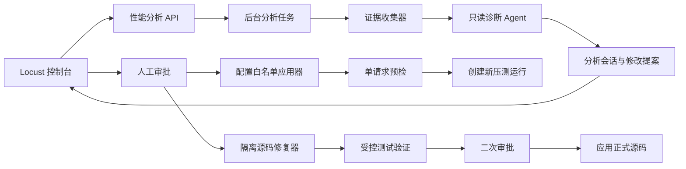
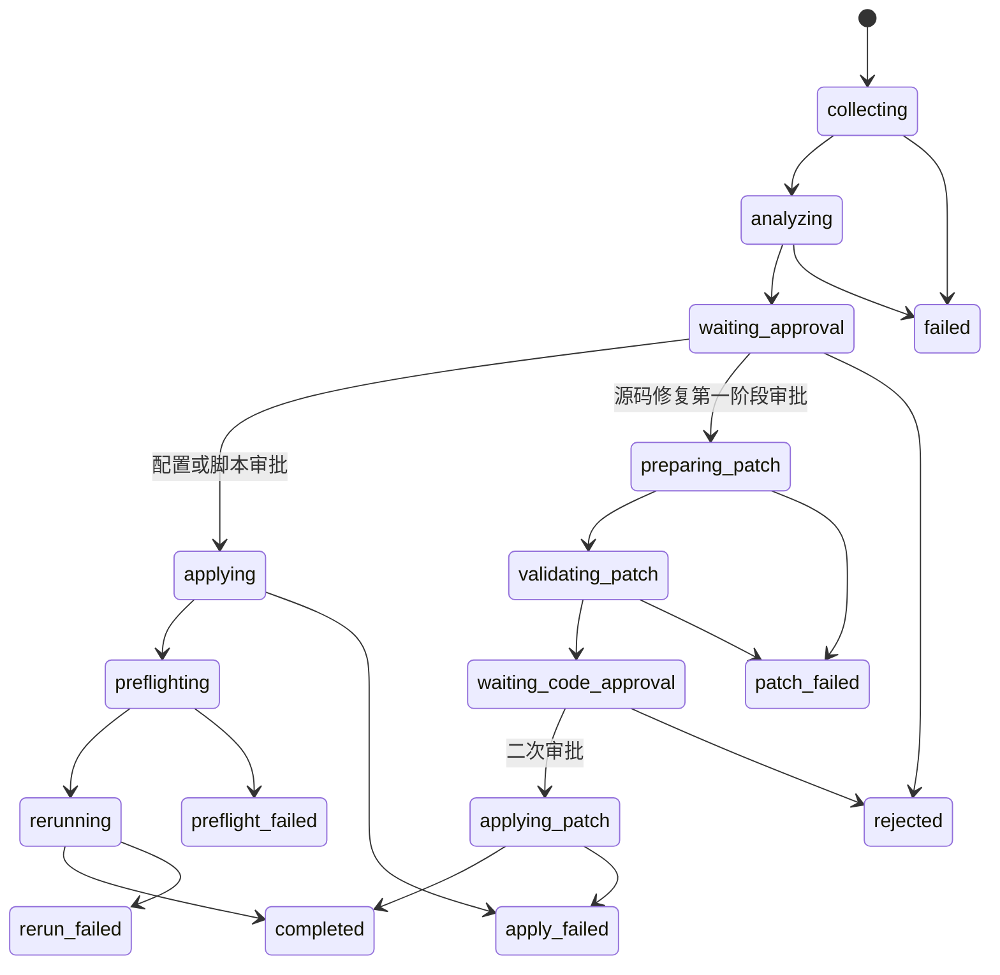

# 性能压测 AI 分析与审批修复设计

## 1. 背景

当前 Locust 控制台可以展示运行状态、统计数据、趋势、失败请求、异常和下载文件，并支持重新压测和重置统计。

当压测失败时，用户仍需要人工关联以下信息才能判断根因：

- Locust 统计和失败事件；
- 实际请求 URL、请求参数和运行时环境；
- OpenAPI 接口定义；
- 性能测试配置和生成脚本；
- 相邻历史运行；
- 平台代码和目标服务状态。

本功能在“重新压测”旁增加手动触发的“AI 分析”入口，形成以下闭环：

```text
收集证据 → AI 诊断 → 生成修改提案 → 人工审批 → 应用修改 → 预检 → 重新压测
```

修改采用分级处理：

- 性能配置或 Locust 脚本问题：用户确认后应用，并在单请求预检成功后自动重新压测；
- 平台源码问题：第一阶段只生成隔离补丁和测试报告，必须二次审批后才能修改正式源码；
- 外部服务问题：只提供证据和排查建议，不自动修改本地资产。

## 2. 目标

1. 在 Locust 控制台中提供不离开当前页面的 AI 根因分析能力。
2. 明确区分已证实事实、合理推断和缺失证据。
3. 对性能配置、Locust 脚本、平台源码和外部服务实施不同审批策略。
4. 配置修复后必须先执行单请求预检，禁止直接升压。
5. 源码修复必须隔离生成、受控验证、二次审批和可回滚。
6. 保存分析、审批、修改和重跑的完整审计链路。

## 3. 非目标

1. 不允许 AI 无审批修改性能测试、Locust 脚本或平台源码。
2. 不允许 AI 直接修改目标业务服务或外部网关。
3. 不允许 Agent 获取认证密钥明文或在输出中展示敏感信息。
4. 第一版不支持源码 Diff 的逐行勾选和部分应用。
5. 第一版不自动在每次失败后调用模型，分析只由用户手动触发。
6. 不将 AI 分析逻辑耦合进 Locust 运行进程。

## 4. 用户交互

### 4.1 入口

Locust 控制台顶部操作区调整为：

```text
[AI 分析] [重新压测] [重置统计]
```

“AI 分析”按钮规则：

- 运行中禁用，提示“请等待本轮压测结束”；
- 已停止且存在请求或异常数据时可用；
- 即使没有失败，只要性能目标未通过，仍可分析慢请求、吞吐和延迟；
- 同一运行存在执行中的分析任务时禁止重复创建；
- 同一运行已有完成结果时直接打开最新结果，并提供“重新分析”；
- 没有可分析证据时返回明确提示，不创建空分析任务。

### 4.2 展示容器

分析结果使用右侧抽屉：

- 桌面端宽度约 560–720px；
- 移动端使用底部全屏抽屉；
- 关闭抽屉不终止后台分析；
- 再次打开时恢复当前状态或历史结果。

### 4.3 抽屉内容

抽屉依次展示：

1. 分析进度；
2. 诊断摘要；
3. 证据列表；
4. 影响范围；
5. 修改方案和 Diff；
6. 风险提示；
7. 可执行操作。

分析进度示例：

```text
✓ 收集运行证据
✓ 对照接口定义
● 分析失败模式
○ 生成修改方案
```

诊断摘要必须分别展示：

- 已证实的直接原因；
- 根因判断；
- 置信度；
- 推断依据；
- 缺失证据；
- 是否可以自动处理。

### 4.4 操作按钮

性能配置或 Locust 脚本问题：

```text
[驳回] [应用并重新压测]
```

平台源码问题第一阶段：

```text
[驳回] [生成修复补丁]
```

补丁生成并验证完成后：

```text
[返回分析] [驳回补丁] [确认修改源码]
```

外部服务或证据不足：

```text
[关闭] [重新分析]
```

## 5. 总体架构

采用异步分析任务和持久化审批方案。



AI 分析模块独立于 Locust Runner：

- Runner 负责压测执行和原始证据生产；
- Analysis 负责证据读取、诊断、提案和审批；
- Preflight 负责修复后的单请求验证；
- Code Repair 负责隔离源码补丁和受控测试。

## 6. 问题分类与处理策略

### 6.1 `performance_config`

包括：

- 请求体、Path、Query 和普通 Header；
- 成功状态码；
- 业务成功断言；
- 数据参数化；
- 超时和负载配置。

处理方式：

- 输出字段级结构化变更；
- 用户可取消某项建议；
- 后端重新进行完整 Schema 校验；
- 应用后生成新脚本版本；
- 预检通过后自动重新压测。

### 6.2 `locust_script`

包括：

- 脚本渲染错误；
- 请求构造错误；
- 成功规则实现错误；
- 运行时事件采集缺陷。

处理方式：

- 优先修改结构化脚本计划或模板配置；
- 必须创建新的脚本版本，不覆盖历史版本；
- 预检和脚本编译检查通过后自动重新压测。

### 6.3 `platform_code`

包括性能测试平台前后端源码缺陷。

处理方式：

- 第一阶段只生成补丁；
- 补丁在隔离工作区产生；
- 执行受控格式、编译、定向测试和相关回归；
- 展示文件级 Unified Diff 和测试结果；
- 二次审批后才能应用到正式工作区；
- 不自动启动新的压测，源码应用完成后由用户决定是否重跑。

### 6.4 `external_service`

包括：

- 目标服务路由不可达；
- API 网关异常；
- 外部认证服务异常；
- 目标服务限流、熔断或部署状态异常。

处理方式：

- 只展示证据、时间线和排查建议；
- 禁止生成本地自动修改操作；
- 可以建议补充响应体、网关日志或目标服务日志。

### 6.5 `insufficient_evidence`

无法基于现有证据判断根因时必须使用该分类，禁止 Agent 猜测确定性结论。

## 7. 数据模型

### 7.1 `performance_analysis_sessions`

建议字段：

```text
id                    TEXT PRIMARY KEY
project_id            TEXT NOT NULL
run_id                TEXT NOT NULL
status                TEXT NOT NULL
analysis_version      INTEGER NOT NULL
category              TEXT NOT NULL DEFAULT ''
summary               TEXT NOT NULL DEFAULT ''
direct_cause          TEXT NOT NULL DEFAULT ''
root_cause            TEXT NOT NULL DEFAULT ''
confidence            REAL NOT NULL DEFAULT 0
evidence_json         TEXT NOT NULL DEFAULT '[]'
missing_evidence_json TEXT NOT NULL DEFAULT '[]'
proposal_json         TEXT NOT NULL DEFAULT '{}'
model_name            TEXT NOT NULL DEFAULT ''
error_message         TEXT NOT NULL DEFAULT ''
created_by            TEXT NOT NULL
created_at            TEXT NOT NULL DEFAULT CURRENT_TIMESTAMP
finished_at           TEXT
updated_at            TEXT NOT NULL DEFAULT CURRENT_TIMESTAMP
```

同一运行允许保存多次分析，但同一时间最多只能有一个活动分析任务。

### 7.2 `performance_code_repair_attempts`

建议字段：

```text
id                    TEXT PRIMARY KEY
analysis_id           TEXT NOT NULL
project_id            TEXT NOT NULL
run_id                TEXT NOT NULL
status                TEXT NOT NULL
base_commit           TEXT NOT NULL DEFAULT ''
base_manifest_json    TEXT NOT NULL DEFAULT '{}'
allowed_files_json    TEXT NOT NULL DEFAULT '[]'
changed_files_json    TEXT NOT NULL DEFAULT '[]'
diff_path             TEXT NOT NULL DEFAULT ''
validation_json       TEXT NOT NULL DEFAULT '{}'
error_message         TEXT NOT NULL DEFAULT ''
reviewed_by           TEXT NOT NULL DEFAULT ''
review_comment        TEXT NOT NULL DEFAULT ''
created_by            TEXT NOT NULL
created_at            TEXT NOT NULL DEFAULT CURRENT_TIMESTAMP
reviewed_at           TEXT
updated_at            TEXT NOT NULL DEFAULT CURRENT_TIMESTAMP
```

### 7.3 运行链路扩展

为性能运行增加：

```text
parent_run_id          TEXT
source_analysis_id     TEXT
```

用于表达“原失败运行 → AI 分析 → 配置修复 → 新运行”的关系。

## 8. 状态机



活动状态：

```text
collecting
analyzing
applying
preflighting
rerunning
preparing_patch
validating_patch
applying_patch
```

终态：

```text
completed
failed
rejected
apply_failed
preflight_failed
rerun_failed
patch_failed
superseded
```

后端必须返回 `available_actions`，前端不得自行根据状态组合推断按钮。

## 9. 后端 API

### 9.1 创建分析

```http
POST /projects/{project_id}/performance-runs/{run_id}/ai-analysis
```

响应使用 `202 Accepted`，返回分析会话 ID 和初始状态。

约束：

- 运行必须属于当前项目；
- 运行不能处于活动状态；
- 必须存在可分析数据；
- 同一运行存在活动分析时返回 `409`。

### 9.2 查询分析

```http
GET /projects/{project_id}/performance-analysis/{analysis_id}
```

响应包含：

- 状态和阶段进度；
- 根因、置信度和证据；
- 修改提案；
- 缺失证据；
- 历史分析版本；
- `available_actions`。

### 9.3 重新分析

```http
POST /projects/{project_id}/performance-runs/{run_id}/ai-analysis
```

使用同一入口创建新版本，不覆盖历史分析。

### 9.4 驳回提案

```http
POST /projects/{project_id}/performance-analysis/{analysis_id}/reject
```

请求允许携带审批意见。

### 9.5 应用配置并重新压测

```http
POST /projects/{project_id}/performance-analysis/{analysis_id}/apply-and-rerun
```

请求携带用户最终确认的变更项 ID，不接受任意 JSON Patch。

执行顺序：

1. 校验分析仍为 `waiting_approval`；
2. 比较性能测试当前配置与分析基线摘要；
3. 基线变化时标记为 `superseded`；
4. 通过白名单应用器生成候选配置；
5. 执行 Pydantic Schema 校验；
6. 保存原配置快照；
7. 创建新脚本版本；
8. 执行单请求预检；
9. 预检成功后创建新运行；
10. 写入父子运行和分析来源关系。

### 9.6 生成源码补丁

```http
POST /projects/{project_id}/performance-analysis/{analysis_id}/prepare-code-patch
```

该接口只创建隔离修复任务，不修改正式源码。

### 9.7 查询源码修复

```http
GET /projects/{project_id}/performance-code-repairs/{attempt_id}
GET /projects/{project_id}/performance-code-repairs/{attempt_id}/diff
GET /projects/{project_id}/performance-code-repairs/{attempt_id}/logs
```

### 9.8 二次审批

```http
POST /projects/{project_id}/performance-code-repairs/{attempt_id}/approve
POST /projects/{project_id}/performance-code-repairs/{attempt_id}/reject
```

审批前必须重新检查正式工作区基线和测试结果有效期。

## 10. 证据收集

### 10.1 运行证据

- 最新统计快照；
- 统计历史；
- 失败请求；
- 用户异常；
- Locust 事件日志；
- 生成脚本；
- 有效脚本；
- 运行时配置的脱敏版本；
- 运行状态和时间线。

### 10.2 配置证据

- 性能测试原始请求配置；
- 负载配置；
- 数据源配置；
- 成功规则；
- 当前脚本版本；
- 接口自动化环境的非敏感摘要。

### 10.3 接口证据

- OpenAPI Method 和 Path；
- 参数定义；
- Request Body Schema、Example 和 Required；
- 成功响应 Schema 和 Example；
- 文档声明的状态码。

### 10.4 对比证据

- 同一性能测试最近的成功和失败运行；
- 同一接口普通 API 自动化的近期结果；
- 相关配置或代码的近期 Git 历史；
- 必要时执行的只读单请求探测结果。

所有证据必须记录来源。UI 必须区分：

- `observed`：直接观测；
- `derived`：通过确定性程序计算；
- `inferred`：Agent 推断。

## 11. Agent 设计

### 11.1 诊断 Agent

诊断 Agent 只读，不配置文件系统写权限，不直接访问数据库连接，不直接调用 Shell。

输入为后端整理和脱敏后的结构化证据包。

结构化输出：

```python
class DiagnosisEvidence(BaseModel):
    source: str
    level: Literal["observed", "derived", "inferred"]
    title: str
    detail: str
    reference: str = ""


class ProposedChange(BaseModel):
    id: str
    target_type: Literal["performance_config", "locust_script", "platform_code"]
    target: str
    before: Any = None
    after: Any = None
    reason: str
    risk_level: Literal["low", "medium", "high"]


class PerformanceDiagnosis(BaseModel):
    category: Literal[
        "performance_config",
        "locust_script",
        "platform_code",
        "external_service",
        "insufficient_evidence",
    ]
    confidence: float
    direct_cause: str
    root_cause: str
    evidence: list[DiagnosisEvidence]
    proposed_changes: list[ProposedChange]
    missing_evidence: list[str]
    requires_second_approval: bool
    can_auto_rerun: bool
```

后端必须再次校验：

- `confidence` 范围；
- 分类和操作能力的一致性；
- 修改目标是否在白名单；
- 外部服务和证据不足分类不得包含可应用修改；
- 源码分类必须要求二次审批；
- 配置分类才允许自动重跑。

### 11.2 源码修复 Agent

只有用户批准“生成修复补丁”后才创建源码修复 Agent。

输入：

- 已批准的 Diagnosis；
- 白名单文件；
- 相关源码和测试；
- 当前基线摘要；
- 受控验证工具说明。

输出：

- 文件级修改；
- Unified Diff；
- 修改说明；
- 测试建议；
- 风险和未解决问题。

Agent 只能在 Attempt 的隔离工作区中写文件。

## 12. 配置白名单应用器

模型不得提交任意 JSON Patch。后端只允许修改以下路径：

```text
request_config.path_parameters
request_config.query_parameters
request_config.headers
request_config.body
request_config.random_seed
load_config.request_timeout_seconds
load_config.wait_time_min_seconds
load_config.wait_time_max_seconds
data_config
success_rules
```

敏感 Header 永远不允许从 AI 提案写入，必须继续由接口环境注入。

每项提案包含稳定的 `change_id`。用户审批请求只提交 `change_id` 列表，服务端从已保存的提案中取值并应用。

## 13. 单请求预检

配置和脚本变更后必须先执行预检：

1. 使用候选配置生成候选脚本；
2. 执行 Python 编译检查；
3. 注入正式环境认证信息；
4. 使用一个用户发送一个请求；
5. 校验 HTTP 成功规则；
6. 校验业务成功规则；
7. 保存脱敏后的最终 URL、请求摘要和响应摘要；
8. 成功后创建正式压测运行；
9. 失败时停在 `preflight_failed`，不产生并发流量。

预检不能以“HTTP 200”替代业务成功规则。接口存在业务码时，必须同时校验业务成功字段。

## 14. 失败证据增强

当前 Locust 失败事件只保存状态码和原因，不足以区分网关错误、应用错误和业务错误。

建议扩展失败事件，保存：

- 最终请求 URL；
- 脱敏后的请求 Header 名称；
- 请求体摘要；
- 响应 Content-Type；
- 截断后的响应体；
- 响应中的请求追踪 ID；
- HTTP 状态码和 Reason；
- 业务成功规则失败详情。

限制：

- 请求体和响应体均设置长度上限；
- 敏感 Header 值不落盘；
- 对 token、password、secret、key 等字段递归脱敏；
- 二进制响应只保存类型和长度。

## 15. 源码修复安全机制

### 15.1 目录

```text
performance_testing/
└── ai_repairs/
    └── repair-{attempt_id}/
        ├── workspace/
        ├── input.json
        ├── diagnosis.json
        ├── proposal.json
        ├── changes.diff
        ├── validation.json
        ├── stdout.txt
        └── stderr.txt
```

### 15.2 文件边界

- 只允许修改提案明确列出的源码和测试文件；
- 禁止修改 `.env`、认证配置、数据库文件和项目数据目录；
- 禁止新增可执行脚本，除非提案和审批明确允许；
- 禁止修改与根因无关的文件；
- 正式工作区同文件存在未提交变更时禁止自动应用。

### 15.3 执行边界

源码修复 Agent 不获得任意 Shell，只能调用预定义工具，例如：

```text
compile_python_files
run_backend_test
run_frontend_contract_test
run_formatter_check
```

每个工具固定命令模板、工作目录、超时和输出上限。

### 15.4 基线检查

生成补丁时保存：

- Git Commit；
- 白名单文件哈希；
- 相关未提交状态摘要。

二次审批应用时再次比较。基线变化时将 Attempt 标记为 `superseded`，要求重新分析或重新生成补丁。

### 15.5 应用与回滚

1. 创建正式文件备份；
2. 应用补丁到 staging；
3. 再次执行编译和定向测试；
4. 原子替换正式文件；
5. 执行快速验证；
6. 失败时恢复备份；
7. 记录操作日志和最终文件哈希。

## 16. 前端实现拆分

建议新增：

```text
apps/frontend/src/components/ai-testing/performance-testing/
├── performance-ai-analysis-drawer.tsx
├── performance-ai-analysis-progress.tsx
├── performance-ai-evidence-list.tsx
├── performance-ai-config-diff.tsx
├── performance-ai-code-diff.tsx
└── performance-ai-approval-dialog.tsx
```

在现有 `locust-console.tsx` 中只负责：

- 渲染“AI 分析”入口；
- 管理抽屉打开状态；
- 传入 `projectId` 和 `runId`；
- 在重跑创建成功后跳转或刷新运行详情。

轮询规则：

- 活动状态每 2 秒查询一次；
- 终态立即停止；
- 抽屉关闭后可以降频或停止，重新打开时立即刷新；
- 页面卸载时清理定时器；
- 网络错误采用有限退避，不重复创建分析任务。

## 17. 权限与审计

- 查看分析：与查看性能运行权限一致；
- 创建分析：登录用户可执行；
- 应用配置并重跑：管理员权限；
- 生成源码补丁：管理员权限；
- 二次审批源码：管理员权限，并记录审批人；
- 所有创建、驳回、应用、重跑和补丁审批写入操作日志。

审计信息包括：

- 原运行 ID；
- 分析 ID；
- 修改提案；
- 用户最终选择的修改项；
- 修改前后摘要；
- 预检结果；
- 新运行 ID；
- 源码 Attempt 和审批意见。

## 18. 错误处理

需要定义稳定错误码：

```text
PERFORMANCE_ANALYSIS_RUN_ACTIVE
PERFORMANCE_ANALYSIS_NO_EVIDENCE
PERFORMANCE_ANALYSIS_ALREADY_RUNNING
PERFORMANCE_ANALYSIS_NOT_FOUND
PERFORMANCE_ANALYSIS_INVALID_OUTPUT
PERFORMANCE_ANALYSIS_BASE_CHANGED
PERFORMANCE_ANALYSIS_APPLY_FAILED
PERFORMANCE_ANALYSIS_PREFLIGHT_FAILED
PERFORMANCE_CODE_REPAIR_NOT_FOUND
PERFORMANCE_CODE_REPAIR_BASE_CHANGED
PERFORMANCE_CODE_REPAIR_VALIDATION_FAILED
PERFORMANCE_CODE_REPAIR_APPLY_FAILED
```

前端优先展示后端业务错误信息和 trace ID，不统一降级为“请求失败，请稍后重试”。

## 19. 测试策略

### 19.1 后端

- 没有运行证据时拒绝创建分析；
- 活动运行禁止分析；
- 同一运行禁止并发分析；
- 同一运行可以创建多个历史版本；
- 运行时认证信息正确脱敏；
- Agent 输出必须通过结构化校验；
- 外部服务分类不能产生自动修复动作；
- 配置修改只能使用保存的 `change_id`；
- 敏感 Header 不能被 AI 写入；
- 基线变化时拒绝应用；
- 预检失败不创建正式运行；
- 预检成功后建立父子运行关系；
- 源码修复必须经过二次审批；
- 源码补丁只能修改白名单文件；
- 正式文件存在冲突时拒绝应用；
- 补丁应用失败能够回滚。

### 19.2 前端

- 不同运行状态下 AI 分析按钮正确启用或禁用；
- 活动分析正确轮询并停止；
- 已证实、推断和缺失证据分区展示；
- 不同分类对应正确的操作按钮；
- 配置字段 Diff 展示正确；
- 源码文件 Diff 展示正确；
- 预检失败时不跳转新运行；
- 二次审批弹窗展示文件、测试和基线风险；
- API 错误展示业务信息和 trace ID。

### 19.3 集成验证

至少覆盖以下场景：

1. 请求体为空，AI 提议补充 Body 和业务断言，预检成功后重跑；
2. 目标服务持续 404，AI 分类为外部服务且不提供自动修改；
3. Locust 事件日志缺少响应体，AI 提议平台代码补丁，二次审批后应用；
4. 分析完成后性能测试配置被人工修改，应用时返回基线冲突；
5. 源码补丁生成后正式文件变化，审批时 Attempt 变为 `superseded`。

## 20. 实施顺序

建议分四期实现：

### 第一期：只读诊断闭环

- 分析数据表；
- 创建和查询分析 API；
- 证据收集；
- 结构化诊断 Agent；
- 右侧抽屉和历史分析；
- 不提供自动修改。

### 第二期：配置修复和预检

- 配置白名单应用器；
- 字段级 Diff；
- 单请求预检；
- 新脚本版本；
- 应用并自动重跑；
- 父子运行关系。

### 第三期：失败证据增强

- 最终 URL；
- 脱敏请求摘要；
- 响应体摘要；
- 业务规则失败明细；
- trace ID 提取。

该期也可以提前到第一期，以提升诊断准确率。

### 第四期：源码修复和二次审批

- 隔离修复工作区；
- 源码修复 Agent；
- 受控验证工具；
- Unified Diff；
- 二次审批；
- 基线检测和回滚。

## 21. 验收标准

1. 用户可以从已停止的 Locust 运行手动启动 AI 分析。
2. 分析过程不会阻塞页面请求或 Locust 运行进程。
3. 分析结果明确区分事实、推断和缺失证据。
4. 配置类问题可以通过字段级 Diff 审批。
5. 配置应用后预检失败时不会启动正式压测。
6. 预检成功时自动创建关联的新运行。
7. 外部服务问题不会出现本地自动修复按钮。
8. 源码问题必须先生成隔离补丁，再经过二次审批。
9. AI 和日志中不会泄露认证密钥明文。
10. 所有分析、审批、修改和重跑操作可追溯。

