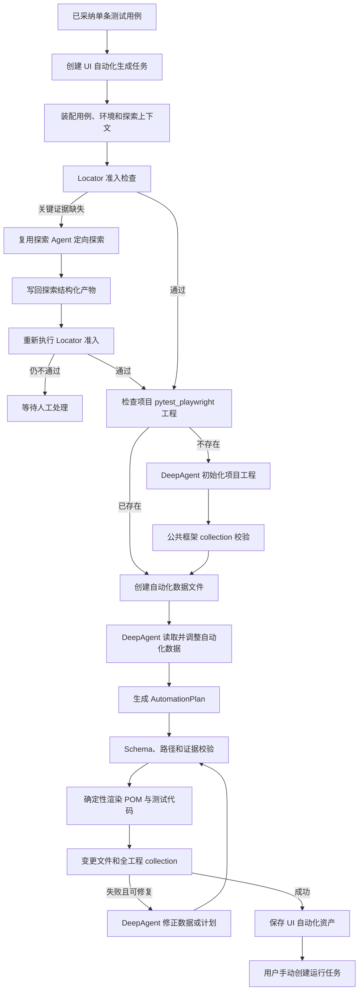

# UI 自动化单用例代码生成设计

## 1. 背景

当前系统已经具备测试用例、项目环境、站点探索、结构化探索产物、任务管理以及接口自动化代码生成能力。站点探索基于现有 Playwright CLI、探索 Agent 和结构化证据包完成；接口自动化已经采用 DeepAgents、受限文件系统、项目级 pytest 工程、测试数据与测试代码分离、增量生成、collection 校验和独立运行任务。

UI 自动化第一版需要复用这些已经验证的模式，实现从单条已采纳测试用例生成 pytest + Playwright 自动化代码。第一版不使用 Allure、不下载 pytest 项目、不生成正式报告，并将代码生成和真实执行拆分为两个独立任务。

## 2. 目标

- 支持从单条已采纳测试用例生成 UI 自动化资产。
- 复用现有 DeepAgents 框架和项目 Agent 组织方式。
- 复用现有探索 Agent、Playwright CLI 能力及结构化探索产物。
- 整个平台共用一套 pytest + Playwright 自动化工程和运行环境。
- 平台首次新增 UI 自动化用例时按需初始化共享工程。
- 后续所有业务项目和用例复用共享 fixture、公共函数和配置，并按业务项目命名空间隔离 POM、测试和数据。
- 使用结构化 `AutomationPlan` 约束代码生成。
- 使用确定性渲染器根据计划生成或更新代码。
- 测试数据和测试代码分离。
- DeepAgent 可以修改指定 UI 自动化数据文件，但不得回写原始测试用例。
- 生成任务与运行任务分离，由用户手动触发单条用例运行。
- 保存通用运行结果和浏览器原始证据，为后续报告能力提供事实源。

## 3. 非目标

- 不支持批量用例生成。
- 不支持测试集或测试套件编排。
- 不支持跨用例数据依赖。
- 不支持自动自愈。
- 不支持移动 App 自动化。
- 不使用 Allure。
- 不生成正式 HTML 报告或其他固定报告格式。
- 不提供 pytest + Playwright 项目下载。
- 不允许 Agent 绕过 `AutomationPlan` 生成任意 Python 代码。
- 不允许将 Agent 修改后的自动化测试数据回写原始测试用例。

## 4. 核心原则

1. 探索结构化产物是页面事实和 locator 的权威来源。
2. 已有探索证据满足准入时，不重复执行 Playwright CLI 探索。
3. 关键 locator 缺失时，复用现有探索 Agent 发起定向探索。
4. Agent 负责理解用例、探索事实和已有工程，输出结构化计划并协调受控工具。
5. 确定性渲染器负责根据合法计划修改指定代码文件。
6. 平台共享工程只初始化一次，后续按业务项目命名空间和用例增量更新。
7. 测试数据独立存储，允许 DeepAgent 在指定文件内规范化、参数化和补充数据。
8. 自动化数据文件是派生资产，不是原始测试用例的反向编辑入口。
9. 生成成功只代表代码和 collection 可用，不代表真实业务执行成功。
10. 真实执行必须由用户手动触发独立运行任务。

## 5. 总体架构



## 6. 平台共享工程目录

整个平台只有一套自动化工程；每个业务项目和测试用例都是共享工程中的一部分：

```text
apps/backend/data/ui_automation/pytest_playwright/
├── AGENTS.md
├── pyproject.toml
├── pytest.ini
├── conftest.py
├── config/
│   ├── __init__.py
│   └── settings.py
├── pages/
│   ├── __init__.py
│   ├── base_page.py
│   └── generated/{project_key}/
├── testcases/
│   ├── __init__.py
│   ├── conftest.py
│   └── generated/{project_key}/
├── data/
│   └── projects/{project_key}/cases/
├── utils/
│   ├── __init__.py
│   ├── data_loader.py
│   ├── waiters.py
│   ├── assertions.py
│   └── artifacts.py
└── .deepagents/
    └── skills/
        └── pytest-playwright-ui-generation/
            ├── SKILL.md
            └── references/
                ├── automation-plan.md
                ├── pom-rules.md
                └── locator-rules.md
```

目录规则：

- 后端使用唯一共享工程根目录，`project_id` 只用于计算安全的 `project_key` 命名空间。
- `FilesystemBackend` 的根目录必须绑定平台共享工程。
- Agent 不得访问工程根目录以外的文件。
- 平台首条 UI 自动化用例生成前检查共享工程是否存在且完整。
- 工程不存在时由初始化流程补齐公共框架并执行 collection。
- 工程已存在时只补齐缺失公共文件，不删除任何业务项目的已有用例和 POM。
- 每条用例的测试、数据和计划文件路径由后端确定。
- Agent 不得自行改变后端指定的输出路径。

## 7. DeepAgents 设计

### 7.1 模块结构

```text
apps/backend/app/agents/ui_automation/pytest_playwright/
├── __init__.py
├── agent.py
├── collection.py
├── plan.py
├── suite.py
└── skills/
    └── pytest-playwright-ui-generation/
        ├── SKILL.md
        └── references/
            ├── automation-plan.md
            ├── pom-rules.md
            └── locator-rules.md
```

### 7.2 Agent 创建方式

UI Agent 与接口自动化保持相同技术路线：

```python
backend = FilesystemBackend(
    root_dir=str(shared_suite_path),
    virtual_mode=True,
)

agent = create_deep_agent(
    model=model,
    backend=backend,
    tools=[
        validate_automation_plan,
        render_automation_plan,
        run_pytest_collection,
    ],
    skills=[".deepagents/skills"],
    middleware=[...],
)
```

### 7.3 Agent 允许的行为

- 检查当前项目工程目录和 `AGENTS.md`。
- 首次生成时初始化或补齐公共框架。
- 读取后端指定的测试用例数据文件。
- 修改后端指定的自动化数据文件内容。
- 对数据进行规范化、拆分、参数化和补充执行所需字段。
- 读取后端提供的探索上下文和 locator 证据。
- 读取并复用已有 Page Object、fixture 和公共函数。
- 生成或修正结构化 `AutomationPlan`。
- 调用确定性计划校验与渲染工具。
- 读取 pytest collection 错误并修正数据或计划。

### 7.4 Agent 禁止的行为

- 访问项目工程根目录以外的文件。
- 创建第二套 pytest 工程。
- 自行选择测试、数据、计划或 POM 的输出目录。
- 使用探索证据中不存在的 locator。
- 把账号、密码、Cookie、Token 或宿主机绝对路径写入代码和数据文件。
- 修改其他项目的工程。
- 删除未被本次生成任务声明的已有用例或 POM。
- 修改平台后端、渲染器或 Runner 源代码。
- 回写数据库中的原始测试用例。
- 在生成任务中执行真实业务用例。

## 8. 输入上下文

生成请求由前端提供最小标识：

```json
{
  "test_case_id": "case-001",
  "environment_id": "env-001",
  "exploration_run_id": "explore-001"
}
```

其中 `exploration_run_id` 可选。未指定时，后端选择当前项目和环境下最近一次可用于 UI 自动化的探索版本，并在生成记录中固化实际使用的版本。

后端装配以下事实：

- 已采纳测试用例当前基线版本。
- 用例前置条件、步骤、预期结果和自动化可行性。
- 环境 URL、浏览器配置和认证配置引用。
- 与用例相关的 `pages/*.yaml` 页面事实。
- 与操作路径相关的 `graph.yaml` 边。
- 相关 `blockers.yaml` 阻塞。
- locator、可访问名称、页面快照、截图和 trace 引用。
- 探索任务、页面和产物版本引用。
- 当前项目已有 POM 和公共函数索引。

后端只装配与当前用例相关的探索内容，不将整个探索目录无差别发送给模型。

## 9. Locator 准入

生成代码前必须检查：

- 页面入口存在可执行路径。
- 每个关键输入控件存在稳定 locator。
- 每个关键点击或确认目标存在稳定 locator。
- 每个结果断言目标存在稳定 locator 或 URL 规则。
- 每个 locator 均包含探索证据引用。
- 页面跳转关系能够由探索图或页面事实解释。

优先级：

1. `get_by_role` 配合可访问名称。
2. `get_by_label`。
3. `get_by_placeholder`。
4. `get_by_test_id`。
5. 稳定文本或属性定位。
6. CSS 或 XPath 仅作为最后选择，并必须保留来源证据。

关键 locator 缺失时，自动化模块调用现有探索服务创建定向探索任务。定向探索只补充页面事实和 locator 证据，不直接修改测试用例或自动化代码。探索完成后重新执行准入检查；仍不通过时生成任务进入 `waiting_manual`。

## 10. 测试数据设计

### 10.1 数据归属

- 数据库存储的原始测试用例是输入事实。
- 项目工程中的 UI 自动化数据文件是派生执行资产。
- DeepAgent 可以修改派生数据文件。
- 派生数据文件的修改不回写原始测试用例。
- 原始测试用例版本变化后，通过源哈希判断是否需要重新生成。

### 10.2 数据文件示例

```yaml
schema_version: v1
project_id: project-crm
automation_case_id: ui-case-001
source_test_case:
  id: case-001
  version: 3
  title: 正确账号密码登录成功
preconditions:
  - 用户账号有效
variables:
  username:
    source: environment
    key: UI_TEST_USERNAME
  password:
    source: environment
    key: UI_TEST_PASSWORD
steps:
  - id: step-1
    action: navigate
    target: login_page
  - id: step-2
    action: fill
    target: username_input
    value_ref: username
expected_results:
  - target: workspace_heading
    assertion: visible
```

DeepAgent 可以：

- 将自然语言测试数据转换为结构化字段。
- 增加唯一值策略、时间戳或随机后缀声明。
- 将敏感值替换为环境变量引用。
- 将复合数据拆分为多个命名字段。
- 补充执行需要但不改变业务意图的辅助数据。

DeepAgent 不可以：

- 将真实敏感值写入文件。
- 改变原用例的核心业务目标。
- 删除关键步骤或降低断言强度以使 collection 或运行通过。
- 通过修改数据掩盖 locator 或页面事实缺失。

## 11. AutomationPlan

### 11.1 模型要求

- 使用 Pydantic 定义。
- 所有模型设置 `extra="forbid"`。
- 使用固定 `schema_version`。
- 文件路径必须是项目工程内的后端指定相对路径。
- 每个 locator 必须有至少一个证据引用。
- 每个测试步骤必须映射到原始用例步骤。
- 每个断言必须映射到预期结果。
- 不支持任意 Python 表达式。

### 11.2 示例

```json
{
  "schema_version": "v1",
  "project_id": "project-crm",
  "automation_case_id": "ui-case-001",
  "source_test_case_id": "case-001",
  "source_test_case_version": 3,
  "environment_id": "env-001",
  "exploration_run_id": "explore-001",
  "page_objects": [
    {
      "page_key": "login",
      "class_name": "LoginPage",
      "file_path": "pages/generated/project_crm/login_page.py",
      "route": "/login",
      "elements": [
        {
          "key": "username_input",
          "locator": {
            "strategy": "role",
            "role": "textbox",
            "name": "请输入邮箱/手机号"
          },
          "evidence_refs": [
            "pages/page-login.yaml#elements.username"
          ]
        }
      ]
    }
  ],
  "steps": [
    {
      "source_step_id": "step-1",
      "kind": "navigate",
      "page_key": "login"
    },
    {
      "source_step_id": "step-2",
      "kind": "fill",
      "page_key": "login",
      "element_key": "username_input",
      "value_ref": "username"
    }
  ],
  "assertions": [
    {
      "source_expected_result_id": "expected-1",
      "kind": "visible",
      "page_key": "workspace",
      "element_key": "workspace_heading"
    }
  ],
  "artifacts": {
    "test_file": "testcases/generated/project_crm/test_login_success.py",
    "data_file": "data/projects/project_crm/cases/case_login_success.yaml",
    "plan_file": "data/projects/project_crm/cases/case_login_success.plan.json"
  }
}
```

### 11.3 第一版动作类型

- `navigate`
- `click`
- `fill`
- `select_option`
- `check`
- `uncheck`
- `press`
- `upload`
- `wait_visible`
- `assert_visible`
- `assert_hidden`
- `assert_text`
- `assert_url`
- `assert_value`

第一版不支持循环、条件分支、任意脚本、跨用例变量和动态代码执行。

## 12. 确定性渲染器

渲染器根据合法 `AutomationPlan` 执行以下操作：

- 初始化缺失的公共框架文件。
- 创建或增量更新 Page Object。
- 创建或更新单用例测试文件。
- 生成数据加载调用和 fixture 引用。
- 生成 Playwright 操作和断言。
- 保持统一导入顺序和命名规则。
- 只修改计划声明且后端允许的文件。

渲染器不接受任意 Python 代码片段。所有代码必须由固定动作和断言类型映射产生。

## 13. POM 合并规则

1. 同一项目、同一页面只维护一个 Page Object。
2. 页面文件优先按稳定页面标识命名，不按单条用例命名。
3. 已存在元素优先复用，不重复生成。
4. 同名元素 locator 不一致时不静默覆盖。
5. 新 locator 有更高优先级且证据更新时，记录变更来源后替换。
6. 无法自动判断的新旧 locator 冲突使任务进入 `waiting_manual`。
7. 公共页面操作放在 Page Object，不放在测试文件。
8. 跨页面通用等待和断言放在 `utils/`。
9. 业务流程不进入框架公共层。
10. 修改前保存文件快照，失败时回滚本次变更。

## 14. 并发与文件安全

- 使用共享自动化工作区锁。
- 任意时刻只允许一个 UI 自动化生成任务修改共享工程或执行全工程 collection。
- 不同业务项目的数据和代码目录相互隔离，但修改共享工程时不能并行。
- 所有后端直接写入操作使用临时文件加原子替换。
- 渲染前验证目标路径位于项目工程根目录内。
- 生成前保存本次允许修改文件的快照。
- Agent、渲染或 collection 失败时恢复快照。
- 不回滚其他任务已经完成的文件。

## 15. 生成任务

### 15.1 状态

```text
queued
locator_checking
exploration_required
exploring
initializing
planning
rendering
validating
completed
waiting_manual
failed
cancelled
```

### 15.2 成功条件

- 测试用例已采纳且版本有效。
- locator 准入通过。
- 平台共享工程存在并可被 pytest 收集。
- 自动化数据文件存在且 schema 合法。
- AutomationPlan 通过 Pydantic、路径和证据校验。
- 生成或修改的 Python 文件可以编译。
- 本次变更测试文件 collection 通过。
- 整个项目 pytest collection 通过。
- 自动化资产和来源元数据已保存。

## 16. 运行任务

用户在生成成功后手动触发单条运行任务。运行任务：

- 根据项目和环境解析 base URL。
- 读取安全存储中的认证配置或 Storage State。
- 创建隔离运行目录。
- 只执行指定自动化用例的 pytest node ID。
- 保存 stdout 和 stderr。
- 保存 Playwright trace。
- 失败时保存截图。
- 根据配置选择是否保存视频。
- 保存结构化 `result.json`。
- 对日志和运行快照中的敏感值进行脱敏。

第一版不生成 Allure，也不将运行结果绑定到特定报告页面。后续报告模块读取标准运行事实和证据文件进行派生。

## 17. 数据库存储

建议新增以下实体，命名可在实施时按现有仓储规范对齐：

### 17.1 UI 自动化生成任务

- 任务 ID。
- 项目 ID。
- 原始测试用例 ID 和版本。
- 环境 ID。
- 探索任务 ID。
- 状态。
- locator 准入结果。
- 工程路径。
- 变更文件列表。
- AutomationPlan 路径。
- 数据文件路径。
- 错误信息。
- 创建人和时间戳。

### 17.2 UI 自动化资产

- 自动化资产 ID。
- 项目 ID。
- 原始测试用例 ID 和版本。
- 状态。
- pytest node ID。
- 测试文件路径。
- 数据文件路径。
- AutomationPlan 路径。
- locator 证据摘要。
- 源哈希。
- 最近生成任务 ID。
- 创建人和时间戳。

### 17.3 UI 自动化运行任务

- 运行 ID。
- 项目 ID。
- 自动化资产 ID。
- 环境 ID。
- 状态。
- pytest node ID。
- 运行目录。
- 结果摘要。
- stdout、stderr、trace、截图和视频路径。
- 错误信息。
- 创建人和时间戳。

## 18. API 设计

路由遵循现有项目级 API 约定：

```text
POST /api/v1/projects/{project_id}/ui-automation/generation-runs
GET  /api/v1/projects/{project_id}/ui-automation/generation-runs/{run_id}
GET  /api/v1/projects/{project_id}/ui-automation/assets
GET  /api/v1/projects/{project_id}/ui-automation/assets/{asset_id}
POST /api/v1/projects/{project_id}/ui-automation/assets/{asset_id}/runs
GET  /api/v1/projects/{project_id}/ui-automation/runs/{run_id}
```

第一版生成接口只接受一个 `test_case_id`，不接受数组。

## 19. 与接口自动化的复用边界

应复用：

- DeepAgents `FilesystemBackend` 模式。
- Agent skill 目录组织方式。
- 项目工作区锁模式。
- 安全路径解析。
- 原子文件写入。
- 文件快照和失败回滚。
- 后台生成任务模式。
- pytest collection 工具模式。
- 生成任务和运行任务分离。
- 源哈希和增量更新判断。
- 敏感信息脱敏。

不应直接复用：

- requests client。
- API endpoint 和场景目录模型。
- API 鉴权 header 注入逻辑。
- API 响应断言。
- API 报告解析中的业务字段。
- 接口自动化的业务数据和测试文件。

## 20. 测试策略

### 20.1 单元测试

- AutomationPlan schema 校验。
- 非法动作类型拒绝。
- 非法路径和目录逃逸拒绝。
- locator 无证据拒绝。
- 用例步骤和计划步骤映射检查。
- 数据文件敏感值检查。
- POM 新增元素。
- POM 复用已有元素。
- locator 冲突进入人工处理。
- 文件快照和回滚。
- 源哈希与增量更新。

### 20.2 服务测试

- 首条用例触发项目工程初始化。
- 后续用例不重复初始化。
- 初始化失败不保存 ready 资产。
- locator 缺失触发定向探索。
- 定向探索失败进入 `waiting_manual`。
- Agent 修改自动化数据文件后不回写原始用例。
- collection 失败后允许 Agent 修正并重试。
- 超出 Agent 工具调用上限后任务失败并回滚。
- 所有项目的生成任务在修改共享工程时串行。

### 20.3 集成验证

- 使用一个真实已采纳用例和对应探索产物生成工程。
- 验证生成的数据、计划、POM 和测试文件。
- 执行 `python -m pytest --collect-only -q`。
- 手动触发单条运行任务。
- 验证成功结果。
- 使用一个可控失败场景验证截图、trace、stdout、stderr 和 `result.json`。

## 21. 第一版交付范围

- UI 自动化数据库表和仓储。
- UI 自动化项目级业务 API，共享同一自动化工程。
- DeepAgents UI 自动化 Agent 和 skill。
- 平台共享 pytest + Playwright 工程按需初始化。
- 单用例上下文装配。
- locator 准入检查。
- 现有探索 Agent 定向探索适配。
- 自动化数据文件生成和 Agent 修改。
- AutomationPlan schema 和校验。
- 确定性 POM 与测试代码渲染。
- 增量 POM 合并。
- collection 工具和生成验证。
- UI 自动化资产保存。
- 单条用例手动运行任务。
- 原始运行结果和浏览器证据保存。
- 针对上述能力的后端测试。

## 22. 验收标准

- 单条已采纳测试用例可以创建 UI 自动化生成任务。
- 平台不存在 pytest_playwright 工程时自动初始化，已存在时所有项目直接复用。
- 不同业务项目使用同一 pytest_playwright 工程，并通过 `project_key` 目录隔离资产。
- 生成过程使用 DeepAgents 和受限项目文件系统。
- 测试数据和代码分离。
- DeepAgent 可以修改派生自动化数据文件。
- 自动化数据修改不回写原始测试用例。
- 所有关键 locator 可以追溯到探索证据。
- locator 缺失时复用现有探索 Agent 定向探索。
- Agent 输出必须通过 AutomationPlan schema 校验。
- 代码由确定性渲染器生成或更新。
- 已有 POM 和公共函数可以被后续用例复用。
- 生成后的变更测试和全工程 collection 均通过。
- 生成失败时不留下部分修改。
- 用户可以手动触发单条用例运行。
- 运行任务保存结构化结果、日志、截图和 trace。
- 项目不引入 Allure。
- 平台不提供 pytest 项目下载。
