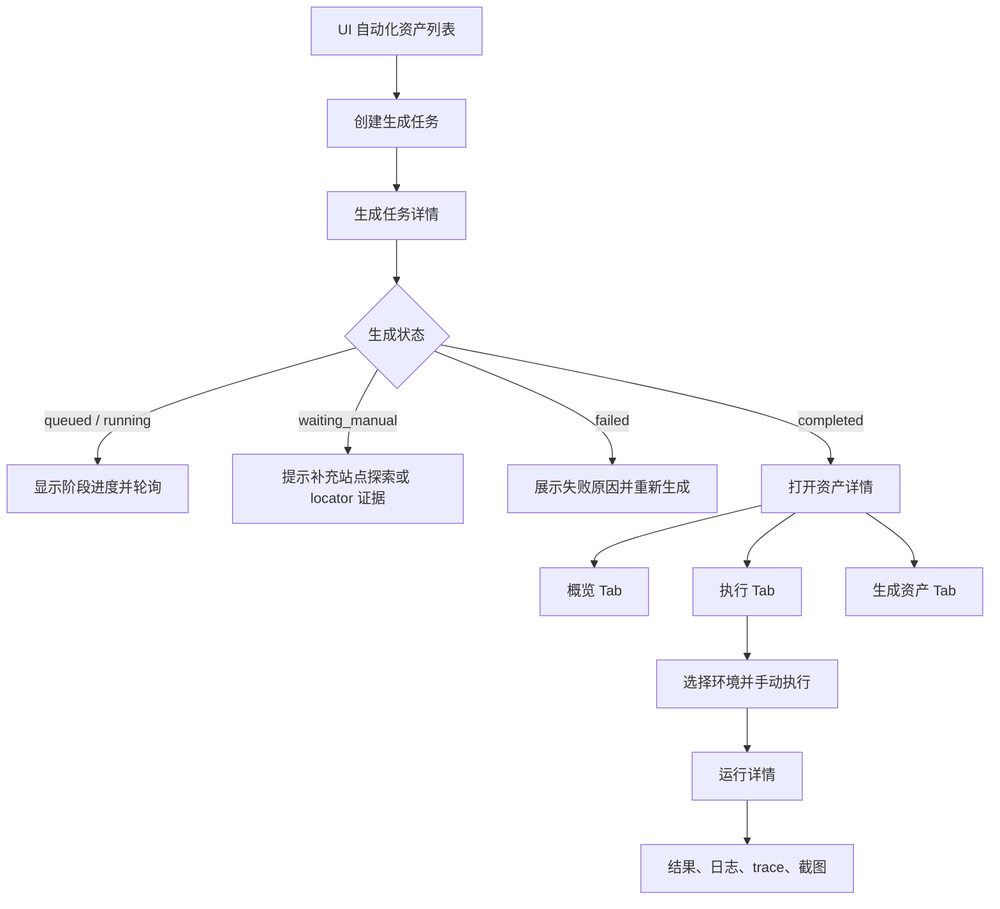

# UI 自动化生成后流程与三 Tab 详情页 Spec

## 背景

UI 自动化当前已经实现了从测试用例创建生成任务、后台生成 pytest + Playwright 资产、再由用户手动执行的基础能力。但现有前端只有资产列表和一个临时任务卡片，用户在创建之后无法稳定回答以下问题：

- 生成任务当前处于哪个阶段，为什么失败或等待人工处理？
- 生成出来的测试代码、测试数据和 `AutomationPlan` 是什么？依据了哪次站点探索？
- 这条自动化用例过去在哪些环境执行过，结果和浏览器证据是什么？
- 失败后应该重新生成、补探索，还是直接重新执行？

现有设计已经明确“生成任务”和“运行任务”分离，并保存日志、trace、截图和结构化结果。因此下一步应补齐面向单条资产的详情工作区，而不是继续在列表页堆叠任务信息。

## 目标

- 将创建后的流程明确为：生成任务 -> 可执行资产 -> 手动执行 -> 运行证据。
- 新增单条 UI 自动化资产详情页，作为创建成功后的主要落点。
- 详情页使用三个 Tab，分别承载概览、执行历史、生成资产。
- 支持用户从生成状态自然过渡到执行、查看运行详情和失败处理。
- 让前端展示内容与现有后端实体、状态和文件产物一一对应。
- 补齐资产运行历史和受控文件读取所需的后端接口。
- 保持原始测试用例只读；工程中的数据、计划和代码仍属于派生自动化资产。

## 非目标

- 第一版不引入 Allure、HTML 报告或新的报告引擎。
- 第一版不支持跨用例编排、跨用例数据依赖或批量执行。
- 第一版不提供在线编辑 Python、YAML 或 `AutomationPlan` 的能力。
- 不允许 Agent 绕过 `AutomationPlan` 直接生成任意 Python 代码。
- 不改变站点探索的事实来源和 locator 准入规则。
- 不把生成资产的修改回写到原始测试用例。

## 当前实现与问题

当前页面位于：

```text
apps/frontend/src/app/(main)/automation/ui/page.tsx
```

当前流程由列表页直接完成：

1. 选择项目、测试用例或用例集、运行环境。
2. 创建一个或多个生成任务并轮询状态。
3. 生成完成后刷新资产列表。
4. 点击执行按钮选择环境并创建运行任务。
5. 在列表页底部显示最近一次任务的简要状态。

存在以下结构性问题：

1. 没有资产详情路由，无法深链到某条自动化用例。
2. 没有生成任务历史列表，用户无法比较最近生成和历史生成。
3. 没有资产执行历史接口，前端无法展示多次运行记录。
4. 运行任务只有单条查询接口，日志、trace 和截图没有详情入口。
5. 资产接口只返回文件路径，没有受控的文件内容或变更摘要读取能力。
6. 前端将生成任务和执行任务共用一个 `run` 状态，刷新页面后上下文丢失。
7. 当前 UI 允许从用例集并发创建多条生成任务，但第一版设计边界是不支持批量生成；且页面只保留第一条任务作为主要展示对象。
8. 执行任务创建服务调用 `_serialize_execution_run` 时传入了多余的 `db` 参数，当前实现会导致创建执行任务失败：

```text
apps/backend/app/services/ui_automation/service.py:223
```

## 总体流程



生成成功只表示代码、数据、计划和 pytest collection 可用，不表示真实业务执行成功。只有运行任务返回 `passed`，才能向用户表达业务执行通过。

## 信息架构

### 全局资产列表

列表页继续负责跨项目或项目范围内的资产检索和入口导航，不承载完整任务详情。

建议保留列：

- 用例名称。
- 自动化资产状态。
- 入口路径。
- 步骤数。
- 最近运行结果。
- 最近更新时间。
- 操作：查看详情、执行。

点击用例名称或行本身进入：

```text
/projects/{project_id}/automation/ui/assets/{asset_id}
```

执行按钮仍可直接打开执行环境选择，但执行完成后应跳转到对应运行详情页。

### 资产详情页

页面标题使用原始测试用例标题，副标题显示资产 ID、项目和当前资产状态。顶部固定操作区：

- 返回列表。
- 重新生成。
- 执行。
- 刷新。

Tab 顺序固定为：

```text
概览 | 执行 | 生成资产
```

默认 Tab 规则：

- 从生成任务完成页进入：默认 `概览`。
- 从列表点击“执行”：完成环境选择后默认进入 `执行`。
- 从运行详情返回：保留 `执行` Tab。
- URL 使用 `?tab=overview|runs|assets`，支持刷新和深链。

## Tab 设计

### Tab 1：概览

职责：回答“这条自动化资产是否可用、从哪里生成、当前需要什么动作”。

内容分为四个区域。

#### 状态头部

- 当前资产状态：`ready`、`degraded`、`deprecated` 等。
- 最近生成任务状态。
- 最近一次运行结果。
- 最近更新时间。
- 主操作按钮：根据状态显示“执行”“重新生成”或“补充探索”。

#### 生成过程

生成任务使用阶段时间线展示：

```text
排队 -> locator 校验 -> 探索补充 -> 工程初始化 -> 计划生成 -> 代码渲染 -> 校验 -> 完成
```

只展示后端实际返回的阶段；没有阶段字段时，至少显示状态、错误信息和任务 ID。`waiting_manual` 必须给出明确动作，而不是只显示英文状态。

#### 来源与执行上下文

- 原始测试用例标题和 ID。
- 测试用例版本或源哈希。
- 生成环境。
- 使用的探索任务 ID / 版本。
- 入口路径和步骤数。
- locator 准入结果摘要。

原始测试用例内容只读展示，并提供返回测试用例详情的链接；不得在此页直接编辑原始用例。

#### 变更摘要

展示本次生成变更的文件清单：

- Page Object。
- 测试文件。
- 派生数据文件。
- `AutomationPlan` 文件。

文件清单只显示相对共享工程的安全路径，不显示宿主机绝对路径。

### Tab 2：执行

职责：回答“这条资产运行过什么、结果如何、下一步是否需要重跑”。

顶部显示执行统计：

- 总运行次数。
- 通过次数。
- 失败次数。
- 最近一次结果。
- 最近一次运行环境。

运行历史表至少包含：

- 运行 ID。
- 环境。
- 状态：排队中、执行中、通过、失败。
- 创建时间。
- 完成时间或耗时。
- 证据数量：日志、trace、截图。
- 操作：查看详情、重新执行。

空状态：

```text
这条自动化资产还没有运行记录。选择运行环境后开始第一次执行。
```

运行详情使用独立路由：

```text
/projects/{project_id}/automation/ui/assets/{asset_id}/runs/{run_id}
```

运行详情不再塞进列表页底部卡片，应展示：

- 状态、环境、时间、耗时、pytest node ID。
- 结构化结果摘要。
- 失败原因。
- stdout 和 stderr。
- trace 下载或查看入口。
- 截图列表和预览。
- 重新执行按钮。

### Tab 3：生成资产

职责：回答“系统到底生成了哪些可审计的自动化产物”。

使用只读文件查看器，提供文件切换：

```text
AutomationPlan | 测试数据 | 测试代码 | Page Object
```

每个文件显示：

- 相对路径。
- 来源生成任务。
- 最后更新时间。
- 只读内容。

第一版不允许在线修改。文件内容必须经过后端安全路径校验，并限制在共享 UI 自动化工程根目录内。若文件不存在或无法读取，显示明确错误并保留路径信息，不返回服务器绝对路径。

## 状态模型

### 生成任务

后端允许的生成状态：

```text
queued
locator_checking
exploration_required
exploring
initializing
planning
rendering
validating
completed
waiting_manual
failed
cancelled
```

前端映射要求：

| 状态 | 用户文案 | 主要动作 |
| --- | --- | --- |
| queued | 排队中 | 等待 |
| locator_checking | 校验页面证据 | 查看进度 |
| exploration_required | 需要补充探索 | 去补充探索 |
| exploring | 正在探索页面 | 等待 |
| initializing | 初始化自动化工程 | 等待 |
| planning | 生成自动化计划 | 等待 |
| rendering | 生成测试代码 | 等待 |
| validating | 校验自动化资产 | 等待 |
| completed | 已生成，可执行 | 查看资产 / 执行 |
| waiting_manual | 等待人工处理 | 查看原因 / 补证据 |
| failed | 生成失败 | 查看错误 / 重新生成 |
| cancelled | 已取消 | 重新生成 |

### 资产状态

资产状态和生成任务状态分离：

```text
ready       可执行
degraded    资产存在，但来源或依赖已变化
deprecated  已被新版本资产替代
```

资产状态不得直接复用运行任务的 `passed` / `failed`。`passed` 和 `failed` 属于某次运行的结果。

### 运行任务

```text
queued
running
passed
failed
cancelled
```

运行任务轮询期间，页面必须保留用户当前 Tab；完成后仅更新状态和历史记录，不强制跳转到其他页面。

## API 契约

### 现有接口保留

```text
POST /projects/{project_id}/ui-automation/generation-runs
GET  /projects/{project_id}/ui-automation/generation-runs/{run_id}
GET  /projects/{project_id}/ui-automation/assets
GET  /projects/{project_id}/ui-automation/assets/{asset_id}
POST /projects/{project_id}/ui-automation/assets/{asset_id}/runs
GET  /projects/{project_id}/ui-automation/runs/{run_id}
```

### 新增接口

```text
GET /projects/{project_id}/ui-automation/assets/{asset_id}/generation-runs
GET /projects/{project_id}/ui-automation/assets/{asset_id}/runs
GET /projects/{project_id}/ui-automation/assets/{asset_id}/files
GET /projects/{project_id}/ui-automation/assets/{asset_id}/files/{file_kind}
```

其中 `file_kind` 仅允许后端声明的枚举：

```text
plan
data
test
page_object
```

不得接受任意文件系统路径。

### 资产详情响应

`GET /assets/{asset_id}` 应继续返回现有资产字段，并增量增加：

```json
{
  "source_title": "正确账号密码登录成功",
  "source_version": 3,
  "source_hash": "...",
  "latest_generation_run": {
    "id": "uigen-...",
    "status": "completed",
    "error_message": "",
    "changed_files": []
  },
  "latest_execution_run": {
    "id": "uirun-...",
    "status": "passed",
    "environment_id": "env-..."
  },
  "locator_summary": {
    "required": 4,
    "available": 4,
    "missing": []
  }
}
```

若当前没有运行记录，`latest_execution_run` 返回 `null`，不伪造状态。

### 运行历史响应

运行历史接口返回轻量摘要，不在列表中内嵌 stdout、stderr 和大文件内容：

```json
{
  "items": [
    {
      "id": "uirun-...",
      "asset_id": "uiasset-...",
      "environment_id": "env-...",
      "status": "failed",
      "created_at": "2026-07-23T10:00:00Z",
      "finished_at": "2026-07-23T10:01:12Z",
      "duration_ms": 72000,
      "has_trace": true,
      "screenshot_count": 1,
      "error_message": "..."
    }
  ],
  "total": 1
}
```

## 创建行为调整

第一期创建弹窗只接受单条测试用例：

- 必须是已采纳测试用例，或明确允许的手工测试用例来源。
- 选择一个项目环境。
- 可选指定探索任务；不指定时由后端选择匹配环境下最近可用探索版本。

暂不在 UI 自动化创建弹窗中选择用例集并批量创建。批量生成应作为独立需求，拥有自己的批次实体、进度汇总和失败重试语义。

创建成功后的前端行为：

1. 关闭创建弹窗。
2. 跳转到生成任务详情或资产详情占位页。
3. 轮询当前生成任务。
4. 生成成功后展示“查看资产”和“执行”按钮。
5. 生成失败或等待人工时停留在概览页，并展示下一步处理动作。

## 异常与边界

### 缺少探索证据

显示：

```text
当前环境缺少可用于生成的结构化探索证据。请先完成站点探索，或选择已有探索版本。
```

动作：跳转到对应项目和环境的站点探索入口。不得自动降低 locator 要求，也不得继续生成伪造代码。

### 源测试用例已变更

通过 `source_hash` 或源版本发现资产过期时，资产状态变为 `degraded`，概览页提示重新生成。旧运行记录保留，不删除历史证据。

### 运行环境被删除

运行历史仍可查看；环境显示为“已删除环境”。重新执行必须重新选择有效环境。

### 生成或运行任务服务重启

按照现有恢复逻辑将未完成任务标记为 `failed`，错误信息明确说明服务重启中断。详情页提供重新生成或重新执行。

### 证据文件不存在

运行详情仍显示结构化结果和错误信息；trace 或截图入口显示“证据文件不可用”，不返回 500 或空白页面。

## 后端修正要求

在实现详情页前先修复执行任务创建路径：

```python
# 当前错误
return _serialize_execution_run(db, ui_automation_repo.find_execution_run(db, run_id))

# 目标
return _serialize_execution_run(ui_automation_repo.find_execution_run(db, run_id))
```

同时为执行历史增加 repository 查询方法和 API 路由，并保证结果序列化只做一次 JSON 解码。文件读取必须通过共享工程根目录下的安全路径解析。

## 前端实现边界

建议新增：

```text
apps/frontend/src/app/(main)/projects/[projectId]/automation/ui/assets/[assetId]/page.tsx
apps/frontend/src/app/(main)/projects/[projectId]/automation/ui/assets/[assetId]/runs/[runId]/page.tsx
apps/frontend/src/components/ai-testing/ui-automation/ui-automation-asset-detail.tsx
apps/frontend/src/components/ai-testing/ui-automation/ui-automation-run-detail.tsx
apps/frontend/src/components/ai-testing/ui-automation/ui-automation-file-viewer.tsx
```

可以复用接口自动化运行详情页的布局原则：顶部状态和操作、摘要信息、错误区域、日志区域、证据入口。但 UI 自动化第一版不复制接口自动化的 AI 修复能力。

## 测试要求

### 后端

- 执行任务创建接口返回 200/正确任务对象。
- 资产运行历史按创建时间倒序返回。
- 资产详情正确聚合最近生成任务和最近运行任务。
- 文件读取拒绝绝对路径、`..` 路径和不在资产声明范围内的文件。
- 缺失 trace、截图或日志文件时仍返回可渲染的运行详情。
- 生成任务各状态能够被正确序列化。

### 前端契约

- 列表行可跳转到资产详情。
- 详情页包含且只包含三个主 Tab：概览、执行、生成资产。
- `?tab=` 刷新后保持当前 Tab。
- 生成中显示进度，`waiting_manual` 和 `failed` 显示处理动作。
- 执行 Tab 显示运行历史和空状态。
- 生成资产 Tab 显示文件切换和只读错误状态。
- 运行详情显示结果、日志、trace 和截图入口。
- 执行完成后不会把用户强制切回概览 Tab。

## 分阶段实施

### 阶段 1：修正基础契约

- 修复执行任务创建序列化参数错误。
- 补充生成状态文案和 `UiAutomation*` 前端类型。
- 取消创建弹窗中的批量用例集入口，回到单条用例边界。

### 阶段 2：资产详情与运行历史

- 新增资产详情和运行历史 API。
- 新增资产详情页和三个 Tab。
- 将列表行导航到详情页。
- 将执行完成后的任务卡片替换为详情入口。

### 阶段 3：证据和生成资产查看

- 新增安全文件读取 API。
- 增加 `AutomationPlan`、数据、测试代码和 Page Object 只读查看。
- 增加 trace、截图和日志展示。

### 阶段 4：体验完善

- 增加源版本变化提示。
- 增加生成与运行任务的刷新、重试和深链恢复。
- 根据实际使用量评估是否需要分页、过滤和批次生成。

## 验收标准

- 用户创建单条 UI 自动化后，可以从生成任务进入一个稳定的资产详情页。
- 用户可以在概览 Tab 看懂生成是否成功、依据什么生成、失败后做什么。
- 用户可以在执行 Tab 查看多次运行历史，并启动或重新启动一次运行。
- 用户可以在运行详情查看结构化结果、日志、trace 和截图。
- 用户可以在生成资产 Tab 只读查看计划、数据和代码文件。
- 生成成功与真实执行通过在产品文案和状态上严格区分。
- 源用例变更、环境删除、缺少探索证据和证据文件缺失都有明确可恢复提示。
- 不引入第二套 UI 自动化工程，不修改原始测试用例，不允许任意路径读取。

