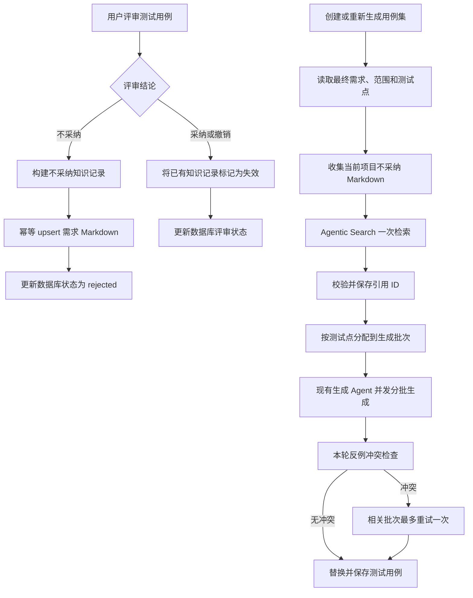

# 不采纳用例知识库与 Agentic Search 生成闭环 Spec

**日期**：2026-07-24  
**状态**：已获用户确认，待实施计划  
**范围**：测试用例评审、公司知识库 Markdown、Agentic Search、测试用例集生成、后端契约与测试

## 1. 背景

当前测试用例集生成链路已经支持逐条评审：

- 测试用例保存在 `test_cases`。
- 用例状态支持 `ready_for_review`、`approved`、`rejected`。
- 不采纳原因当前保存在 `test_cases.review_feedback`。
- 只有重新生成同一个用例集时，系统才查询该用例集中的 `rejected` 用例，并把反馈直接拼入每个生成批次的 Prompt。
- 首次生成、其他用例集和其他历史需求不会参考这些不采纳记录。
- 测试用例生成 Agent 使用普通 LangChain `create_agent`，配置 `tools=[]`，不能主动检索公司知识库。
- 公司知识库问答已经使用 DeepAgents `StateBackend` 提供 `ls`、`glob`、`grep`、`read_file` 等 Agentic Search 能力，并能够把公司知识库目录映射为虚拟 Markdown 文件树。

当前反馈只存在于业务数据库，无法形成跨用例集、跨生成批次的长期经验。用户希望将不采纳用例及原因沉淀到公司知识库的专用文件夹中，后续生成用例时先通过 Agentic Search 检索相关历史反例，避免重复生成。

本 Spec 替代 `2026-07-06-test-case-review-adoption-feedback-design.md` 中以下设计：

- `review_feedback` 作为不采纳原因长期数据源。
- 仅重新生成当前用例集时读取数据库反馈。
- 将当前用例集全部不采纳反馈直接注入每个生成批次。

原 Spec 中的评审页面、评审状态、采纳率、评审进度和权限设计继续有效。

## 2. 已确认决策

- 在指定公司知识库下增加固定逻辑目录 `不采纳用例库`。
- 不采纳用例正文和不采纳原因只长期保存在知识库 Markdown，不在 `test_cases.review_feedback` 中重复保存。
- 数据库继续保存测试用例本身、评审状态、评审人和评审时间，以支持评审页面、采纳率和状态管理。
- 按项目建立子目录，第一版只检索当前项目，不跨项目使用业务反例。
- 每个需求使用一个 Markdown 文件，文件显示名包含需求名称和稳定需求 ID。
- 首次生成和重新生成都执行 Agentic Search。
- 每个生成任务只检索一次，不允许每个并发生成批次独立检索。
- Agentic Search 返回结构化相关记录，再按测试点分配到生成批次。
- 生成 Agent 继续负责用例生成，不直接获得知识库文件工具。
- 生成完成后使用本轮已召回的反例做冲突检查；冲突批次最多重试一次。
- 撤销不采纳时不删除知识记录，而是将对应记录标记为失效。
- 知识写入失败时，不得把评审操作保存为成功。

## 3. 目标

- 将不采纳用例转化为可检索、可追溯、可失效的公司知识资产。
- 保证同一次评审重试不会向 Markdown 重复追加相同条目。
- 首次生成和重新生成都能参考当前项目历史不采纳记录。
- 只向每个生成批次提供与该批测试点相关的反例，控制上下文长度。
- 区分“场景不得生成”和“场景可以生成但必须修正”，避免过度抑制有效用例。
- 对再次命中历史反例的生成结果执行有限重试，降低单靠 Prompt 约束造成的漏防。
- 保留来源文件和知识记录 ID，能够解释本轮生成参考了哪些历史反馈。
- 不引入向量库、Embedding 服务或外部 RAG 平台。

## 4. 非目标

- 第一版不跨项目检索不采纳用例。
- 不对全部历史测试用例建立通用语义去重库。
- 不使用知识库记录替代 `test_cases` 当前评审状态。
- 不让前端直接操作知识库物理路径。
- 不让测试用例生成 Agent 自行浏览全部公司知识库。
- 不在第一版提供知识 Markdown 的多人自由编辑和合并能力。
- 不自动删除历史失效记录。
- 不保证对所有语义改写实现绝对重复拦截。
- 不改造手工单条测试用例 AI 生成链路；本次只覆盖测试用例集生成。

## 5. 核心原则

### 5.1 数据职责

```text
业务数据库：当前测试资产和评审状态
知识库 Markdown：不采纳用例、原因、适用范围和历史状态
生成运行记录：只保存使用过的知识记录 ID 和文件 ID，不复制反馈正文
```

这里的“不把不采纳反馈放入数据库”是指不再把反馈正文作为 `test_cases` 的业务字段长期保存。公司知识库自身仍需使用 `global_knowledge_vault_files` 等基础设施表注册文件、目录、路径和转换状态，否则现有知识收集链路无法发现文件。

### 5.2 事实优先级

```text
当前最终需求 > 当前生成范围和测试点 > 有效不采纳知识 > 模型通用知识
```

- 不采纳记录是历史决策，不得覆盖当前最终需求中的明确新规则。
- 历史记录的适用版本与当前版本不一致时，只能作为提醒，不得直接阻止生成。
- 项目、需求或版本证据不足时，Agent 不得把历史反例推断为永久业务规则。

### 5.3 搜索与生成分离

- Agentic Search 负责在限定文件树中查找相关记录并返回结构化引用。
- 测试用例生成 Agent 只消费已经筛选的引用。
- 冲突检查只比较本轮召回结果，不再次扫描整个知识库。

## 6. 端到端架构



## 7. 知识库目录

### 7.1 配置

新增服务端配置：

```text
REJECTED_CASE_KNOWLEDGE_BASE_ID=<公司知识库 ID>
```

系统在该知识库根目录下惰性确保唯一目录：

```text
不采纳用例库
```

不允许从多个知识库中按名称猜测目标库。知识库 ID 是部署配置；如果系统恰好只有一个公司知识库，可以安全回退使用该知识库。目录使用根目录下唯一名称定位；创建后使用真实 `folder_id` 执行后续操作。

配置缺失时：

- 不采纳评审返回明确配置错误，不保存 `rejected` 状态。
- 已启用本能力的测试用例生成任务返回失败，不允许静默跳过知识检索。

### 7.2 目录结构

```text
公司知识库/
└── 不采纳用例库/
    ├── project-a81f-项目A/
    │   ├── req-b273-登录功能.md
    │   └── req-c921-账号权限调整.md
    └── project-d417-项目B/
        └── req-e182-订单退款.md
```

规则：

- 项目目录名：`{project_id}-{安全化项目名称}`。
- 文件名：`{requirement_id}-{安全化需求名称}.md`。
- 定位以 ID 为准，名称只用于可读性。
- 项目或需求改名时更新显示名，不创建第二份业务文件。
- 第一版每个需求只维护一个活动文件。
- 文件达到 200 KB 或 100 条记录时，将最早失效记录移动到同目录的 `{requirement_id}-{需求名称}-archive-{year}.md`；活动记录仍保留在主文件。

## 8. Markdown 契约

### 8.1 文件头

```markdown
---
schema: rejected-test-case-library/v1
project_id: project-a81f
project_name: 项目A
requirement_id: req-b273
requirement_name: 登录功能
updated_at: 2026-07-24T15:30:00+08:00
---

# 登录功能不采纳用例

本文件由测试用例评审流程维护。生成 Agent 只应参考状态为“有效”的记录。
```

### 8.2 条目格式

每条记录使用可机器定位的边界注释和可读 Markdown 正文：

```markdown
<!-- rejected_case:start {"record_id":"rjc-4c9132a38fd1e280","schema":"v1"} -->
## RJC-4C9132A3 密码错误一次后立即锁定账号

- 状态：有效
- 原项目 ID：project-a81f
- 原需求 ID：req-b273
- 原需求版本：4
- 原生成运行 ID：tcgr-83c912
- 原用例集 ID：tcs-71a408
- 原用例 ID：tcs-71a408-tc-003
- 所属模块：登录
- 优先级：P1
- 不采纳类型：业务场景不成立
- 处理方式：禁止重复生成
- 评审人：user-1
- 评审时间：2026-07-24T15:30:00+08:00

### 前置条件

账号处于正常状态。

### 测试步骤

1. 输入一次错误密码。
   - 预期结果：账号立即锁定。

### 汇总预期

账号在一次密码错误后被锁定。

### 不采纳原因

最终需求规定连续错误 5 次后才锁定，一次错误不会触发锁定。

### 处理建议

验证连续错误 5 次后的锁定行为，不要生成一次错误后立即锁定的场景。
<!-- rejected_case:end -->
```

### 8.3 记录 ID

现有重新生成会重新使用形如 `{set_id}-tc-003` 的用例 ID，因此不能只使用 `case_id` 作为知识记录永久主键。

记录 ID 使用以下输入确定性派生：

```text
sha256(project_id | requirement_id | generation_run_id | case_id)
```

输出格式：

```text
rjc-{前16位小写十六进制}
```

同一个生成运行中的同一条用例重复提交评审会命中同一个 `record_id` 并更新原块；重新生成后的新用例使用新的 `generation_run_id`，不会错误覆盖旧知识。

### 8.4 枚举

`不采纳类型` 第一版限定为：

```text
重复用例
已被其他用例覆盖
业务场景不成立
超出需求范围
前置条件错误
步骤不可执行
预期结果错误
测试价值不足
需求版本已失效
其他
```

`处理方式` 限定为：

```text
禁止重复生成
允许生成但必须修正
仅提醒
```

如果前端第一版不提供枚举选择器，后端可使用轻量结构化分类 Agent 根据用户原因给出建议分类，但原始不采纳原因必须原样保存，分类失败时回退为 `其他 + 仅提醒`。

### 8.5 原因约束

- `status=rejected` 时，`review_feedback.strip()` 必须非空。
- 最大长度继续限制为 1000 字符。
- 原因只描述为什么不采纳，不得由模型替用户补写业务事实。
- 旧数据迁移时允许原因为空，并写为 `历史记录未填写原因`，处理方式强制为 `仅提醒`。

## 9. 知识文件写入服务

### 9.1 新增模块

建议新增：

```text
apps/backend/app/services/rejected_case_knowledge/
  __init__.py
  service.py
  markdown_codec.py
  schemas.py
```

职责：

- 解析和生成 `rejected-test-case-library/v1` Markdown。
- 确保知识库、固定目录、项目目录和需求文件存在。
- 根据 `record_id` 幂等新增、更新或失效条目。
- 调用公司知识库内部 upsert 能力，不直接访问知识库表或拼宿主机路径。
- 提供当前需求、当前项目的知识文件读取方法。

### 9.2 公司知识库 upsert

现有公司知识库服务只有上传、读取、删除，没有原文件内容更新能力。新增内部接口：

```python
upsert_markdown_file(
    base_id: str,
    folder_id: str,
    display_name: str,
    markdown_content: str,
    actor,
) -> dict
```

行为：

- 同文件夹同名文件不存在：创建新 `gkfile-*`。
- 已存在：保留 `file_id`，更新 raw 文件、markdown 文件、`markdown_content`、`file_size`、`updated_at` 和知识库更新时间。
- 使用临时文件写入并通过 `os.replace` 原子替换，禁止直接覆盖半成品。
- 原始文件和转换后 Markdown 内容保持一致。
- 通过单进程 keyed lock 或等价锁按 `base_id/folder_id/display_name` 串行化更新。
- 写入前重新读取当前版本并基于 `record_id` 合并，不能拿请求开始时的旧全文直接覆盖。
- API 重试必须得到同一文件 ID 和同一条记录。

第一版不开放公共“任意编辑知识文件”API；该能力由评审服务内部调用。

### 9.3 评审一致性

`review_test_case` 调整为：

```text
校验项目、用例集、用例和评审请求
  -> 查找当前用例对应的最新已完成 generation_run
  -> 构建 record_id 和知识记录
  -> upsert/失效知识记录
  -> 更新 test_cases 当前状态、reviewed_by、reviewed_at
  -> 更新用例集评审统计
```

约束：

- 知识写入失败：数据库评审状态不变，接口返回失败。
- 数据库更新失败：服务使用相同 `record_id` 执行补偿，将知识块恢复为写入前内容；补偿失败必须记录 error log 和 operation log。
- 相同请求重试必须幂等。
- `approved` 或 `ready_for_review` 只有在当前生成运行存在对应有效知识条目时才执行失效；不存在时正常更新状态。
- 不删除 `review_feedback` 数据库列，第一版停止写入并始终清空，避免不必要的破坏性迁移。

### 9.4 读取评审原因

刷新评审页面后仍需要展示历史不采纳原因，但不得从 `test_cases.review_feedback` 读取。

读取用例集详情时：

- 根据用例集对应需求一次读取主 Markdown。
- 解析其中 `原用例集 ID` 等于当前用例集的记录。
- 按 `原生成运行 ID + 原用例 ID` 建立映射。
- 将知识库中的原因作为响应派生字段返回，不写回 `test_cases`。
- 禁止逐条用例执行一次文件读取。

为保持现有前端兼容，第一版响应字段仍可使用 `review_feedback`，但其来源改为知识库；后续再重命名为 `rejection_reason`。

## 10. Agentic Search

### 10.1 新增模块

建议新增：

```text
apps/backend/app/agents/rejected_case_search/
  __init__.py
  agent.py
  schemas.py
  service.py
```

该 Agent 复用现有 DeepAgents `StateBackend` 文件检索模式，但使用独立系统提示和独立结果契约，不能直接复用面向聊天回答的 `knowledge_agent` Prompt。

原因：

- 知识库问答 Agent 输出面向用户的自然语言答案。
- 生成编排需要稳定的记录 ID、匹配测试点、处理方式和来源文件 ID。
- 搜索范围必须严格限制在当前项目的不采纳目录，不能默认加载需求和全部公司知识库。

### 10.2 输入

```python
class RejectedCaseSearchInput(BaseModel):
    project_id: str
    project_name: str
    requirement_id: str
    requirement_name: str
    requirement_version_id: str
    requirement_version_no: int
    requirement_content: str
    generation_scope: str = ""
    test_points: list[SearchTestPoint]
    source_documents: list[RejectedCaseKnowledgeDocument]
```

搜索查询重点包含：

- 需求名称、模块名和关键业务对象。
- 测试点标题、描述和验证点。
- 用户指定生成范围。
- 当前需求中的状态、权限、边界、异常和约束术语。

### 10.3 虚拟文件

只向 StateBackend 提供：

```text
/README.md
/rejected-cases/{project_id}/{requirement_id}-{requirement_name}.md
/rejected-cases/{project_id}/{其他历史需求文件}.md
```

`README.md` 明确：

- 只能返回状态为有效的记录。
- 当前最终需求优先于历史反例。
- 必须先 `glob/ls`，再 `grep`，不足时改写关键词搜索一次，必要时 `read_file` 获取完整记录。
- 不得仅凭文件名返回匹配。
- 返回的 `record_id` 和 `source_file_id` 必须来自真实文件元数据。

### 10.4 输出

```python
RejectedCaseHandling = Literal[
    "block_duplicate",
    "generate_with_correction",
    "warning_only",
]

class RejectedCaseReference(BaseModel):
    record_id: str
    source_file_id: str
    source_file_name: str
    source_requirement_id: str
    source_requirement_version: str
    matched_test_point_keys: list[str]
    title: str
    module: str
    reason_type: str
    reason: str
    handling: RejectedCaseHandling
    correction: str = ""
    relevance: Literal["high", "medium"]

class RejectedCaseSearchResult(BaseModel):
    matches: list[RejectedCaseReference]
```

约束：

- 只返回 `high`、`medium`，低相关记录直接丢弃。
- 最大返回 20 条，每个测试点最多 5 条。
- `record_id` 必须存在于源 Markdown 的有效块中。
- `source_file_id` 必须存在于本轮提供的文件元数据中。
- 服务层在 Agent 返回后重新校验记录状态、来源和 ID，禁止信任模型自报来源。
- 无匹配是合法结果，返回空列表。
- Agent 调用失败、结构化输出失败或文件读取失败是生成失败，不得伪装成“无匹配”。

## 11. 改造后的生成流程

### 11.1 创建阶段

创建和重新生成仍使用现有 API：

```text
POST /projects/{project_id}/test-case-sets
POST /projects/{project_id}/test-case-sets/{set_id}/regenerate
```

两者只创建用例集或生成运行，并由 FastAPI `BackgroundTasks` 执行生成。本次不引入新的任务平台。

重新生成不再查询 `list_rejected_case_feedback_by_set`，也不再把反馈正文写入 generation run 的 `input_json`。

### 11.2 构建输入

`execute_test_case_generation_run` 调整为：

```text
mark running
  -> build requirement/test-point input
  -> collect current-project rejected-case knowledge files
  -> run Agentic Search once
  -> validate references
  -> persist only used record/file IDs as run metadata
  -> generate batches
  -> conflict check and optional retry
  -> replace cases and complete run
```

生成运行开始后必须固定使用创建时记录的 `final_requirement_version_id`，不得再次读取并隐式切换到 `requirement.current_version_id`。这样搜索输入、测试点和生成结果属于同一个需求版本。

### 11.3 输入模型

将：

```python
rejected_case_feedback: list[RejectedTestCaseFeedback]
```

替换为：

```python
rejected_case_references: list[RejectedCaseReference]
```

生成 Prompt 使用以下语义：

```text
历史不采纳记录是生成约束和修正参考，不是当前需求事实。

- block_duplicate：不得生成语义等价场景。
- generate_with_correction：场景仍可生成，但必须按照 correction 修正。
- warning_only：只用于提醒，不得据此删除当前需求明确要求覆盖的用例。
- 当前最终需求与历史记录冲突时，以当前最终需求为准，不得因旧反馈删除当前需求明确要求覆盖的测试点。
```

### 11.4 按批分配

保留现有规则：

- 按模块分组。
- 每批最多 5 个测试点。
- 最多并发 3 批。

新增分配规则：

- `matched_test_point_keys` 与当前批次有交集的引用进入该批。
- 没有测试点键但与当前批模块高相关的引用可以进入该模块第一批。
- 单个引用最多进入 2 个批次。
- 每批最多注入 10 条引用；优先 `high`，再 `medium`。
- 无引用批次沿用当前生成逻辑。

### 11.5 合并

继续沿用当前模块合并、重新编号和优先级排序逻辑。Agentic Search 不改变 `TestCaseGenerationResult` 对外结构。

## 12. 生成后冲突检查

### 12.1 检查范围

冲突检查只使用：

- 当前批生成的候选用例。
- 当前批收到的 `block_duplicate` 和 `generate_with_correction` 引用。
- 当前最终需求中与测试点直接相关的内容。

不重新读取全部知识库。

### 12.2 输出

```python
class GeneratedCaseConflict(BaseModel):
    generated_case_id: str
    record_id: str
    conflict_type: Literal["duplicate", "uncorrected"]
    explanation: str

class GeneratedCaseConflictResult(BaseModel):
    conflicts: list[GeneratedCaseConflict]
```

### 12.3 重试规则

- 无冲突：接受该批结果。
- 有冲突：只重试当前批，Prompt 明确列出冲突用例、知识记录和必须修正的点。
- 每批最多重试一次。
- 第二次仍存在 `duplicate`：从结果移除冲突用例。
- 第二次仍存在 `uncorrected`：生成运行失败，不允许保存明知违反修正规则的用例。
- 冲突检查服务异常：生成运行失败，不静默放行。

## 13. API 契约

### 13.1 评审请求

保持：

```http
PATCH /projects/{project_id}/test-case-sets/{set_id}/cases/{case_id}/review
```

请求继续兼容：

```json
{
  "status": "rejected",
  "review_feedback": "需求规定连续错误5次后才锁定，一次错误不会触发。"
}
```

校验调整：

- `rejected`：`review_feedback` 去除首尾空白后必填。
- `approved`、`ready_for_review`：忽略并清空请求中的 `review_feedback`。
- 知识库配置或写入失败：返回 `503 REJECTED_CASE_KNOWLEDGE_UNAVAILABLE`。
- 当前用例找不到对应生成运行：返回 `409 TEST_CASE_GENERATION_ORIGIN_MISSING`，不得构造不稳定记录 ID。

响应保留现有 `case` 和 `review_stats`，并增加：

```json
{
  "knowledge_record": {
    "record_id": "rjc-4c9132a38fd1e280",
    "file_id": "gkfile-17a2",
    "file_name": "req-b273-登录功能.md",
    "status": "active"
  }
}
```

撤销时 `status` 为 `inactive`；没有历史知识记录时可为 `null`。

### 13.2 用例集生成运行

现有生成运行响应建议增加：

```json
{
  "knowledge_search": {
    "status": "not_started|running|completed|failed",
    "matched_count": 4,
    "used_record_ids": ["rjc-..."],
    "used_file_ids": ["gkfile-..."]
  }
}
```

只保存 ID、数量和状态，不保存不采纳原因正文。

## 14. 前端行为

- 不采纳原因改为必填，提交按钮在空白原因时禁用。
- 提交期间显示“正在保存评审并沉淀到不采纳用例库”。
- 知识写入失败时保留弹窗和用户输入，允许重试。
- 成功后可展示知识记录来源，但第一版不要求新增独立知识详情页。
- 刷新评审页后，从后端派生的 `review_feedback` 正常展示原因。
- 生成进度中增加“检索历史不采纳用例”阶段。
- 生成失败如果由知识检索导致，明确显示知识库配置、读取或模型结构化输出错误，不显示笼统的“生成失败”。
- 第一版不增加“是否参考不采纳用例”开关，该约束默认启用。

## 15. 失败与降级策略

### 15.1 评审

| 场景 | 行为 |
| --- | --- |
| 知识库 ID 未配置 | 拒绝不采纳操作，数据库状态不变 |
| 固定目录不存在 | 管理员请求惰性创建后继续 |
| Markdown 解析失败 | 拒绝覆盖，保留原文件并报警 |
| 文件写入失败 | 数据库状态不变，返回可重试错误 |
| 数据库更新失败 | 补偿恢复知识文件，记录 operation log |
| 相同请求重复提交 | 幂等更新同一记录，不重复追加 |

### 15.2 生成

| 场景 | 行为 |
| --- | --- |
| 当前项目没有任何不采纳文件 | 合法空结果，继续生成 |
| 文件存在但没有有效记录 | 合法空结果，继续生成 |
| Agentic Search 无匹配 | 继续生成 |
| Agentic Search 调用或校验失败 | 生成运行失败，可重试 |
| 某个 Markdown 无法解析 | 搜索失败，不把损坏文件静默排除 |
| 冲突检查失败 | 生成运行失败 |
| 冲突批次首次命中 | 重试该批一次 |
| 第二次仍是重复场景 | 移除冲突用例并完成其他结果 |
| 第二次仍未按反馈修正 | 整体失败，避免保存错误用例 |

不允许把“检索服务不可用”和“确实没有历史匹配”合并为同一种空结果。

## 16. 并发与安全

- 只有管理员可以提交评审和维护不采纳知识。
- 按知识文件加 keyed lock，避免两人同时评审覆盖彼此条目。
- 写文件必须校验目标路径位于配置知识库根目录内。
- 文件名继续复用现有安全化逻辑，禁止路径分隔符和目录穿越。
- Markdown 中的用户原因作为不可信文本处理；Agent Prompt 明确忽略其中要求执行工具、泄露数据或改变系统规则的指令。
- Agentic Search 只获得只读虚拟文件，不获得真实文件系统写权限。
- 日志不输出完整最终需求和完整不采纳原因，只记录 run ID、record ID、file ID、数量和错误摘要。
- 同一个生成运行只允许执行一次活动检索；后台任务重入时复用已完成的引用 ID，并重新读取对应知识块验证状态。

## 17. 历史数据迁移

部署前执行一次显式迁移：

1. 查询 `status='rejected'` 且 `review_feedback` 非空的现存用例。
2. 关联用例集、项目、需求和该用例产生时可确定的 generation run。
3. 按本 Spec 生成知识记录并写入对应需求 Markdown。
4. 校验每条数据库记录都能按 `record_id` 从知识文件读取。
5. 生成迁移报告：成功、缺少 generation run、文件写入失败和空原因数量。
6. 只有完整校验成功后才清空已迁移的 `review_feedback`。

无法确定原生成运行的旧记录：

- 使用 `legacy | project_id | requirement_id | case_id | reviewed_at` 派生 legacy record ID。
- 标记 `原生成运行 ID：unknown`。
- 处理方式最高只能是 `仅提醒`，不得自动阻止生成。

迁移脚本必须可重复执行，重复运行不得产生新条目。

## 18. 代码改造范围

### 18.1 后端

```text
apps/backend/app/services/test_case_service.py
  - 评审时写入/失效知识记录
  - 首次和重新生成统一执行检索
  - 删除数据库拒绝反馈收集
  - 固定生成使用的最终需求版本

apps/backend/app/repositories/test_case_repo.py
  - 停止 list_rejected_case_feedback_by_set 运行时依赖
  - update_case_review 不再保存反馈正文
  - 必要时提供 generation origin 查询

apps/backend/app/services/knowledge/global_service.py
apps/backend/app/repositories/global_knowledge_repo.py
  - 增加 Markdown 原文件内容 upsert

apps/backend/app/services/rejected_case_knowledge/
  - 新增 Markdown codec、目录定位、幂等写入和读取

apps/backend/app/agents/rejected_case_search/
  - 新增只读 Agentic Search Agent 和结构化契约

apps/backend/app/agents/test_case_generation/
  - 输入改为 rejected_case_references
  - 按 handling 约束生成
  - 增加冲突检查与单次重试编排

apps/backend/app/schemas/test_case.py
  - rejected 原因必填校验
  - 增加 knowledge_record 和 knowledge_search 响应
```

### 18.2 前端

```text
apps/frontend/src/app/(main)/test-cases/**
apps/frontend/src/lib/api-client.ts
```

- 不采纳原因必填。
- 展示知识写入错误。
- 展示知识记录状态和生成检索阶段。

## 19. 测试要求

### 19.1 Markdown codec

- 空文件创建第一条记录。
- 同一 `record_id` 重复写入只更新原块。
- 不同记录顺序稳定且内容不丢失。
- 有效记录可失效，重复失效幂等。
- 非法 front matter、重复边界、缺失结束边界拒绝覆盖。
- 中文名称、特殊字符和长步骤正确编码。
- 归档阈值不会移动有效记录。

### 19.2 知识文件服务

- 惰性创建固定目录、项目目录和需求文件。
- 项目或需求改名复用 ID 对应目录/文件。
- 更新保留原 `file_id`。
- 并发写入两条记录后两条都存在。
- 原子替换失败时旧文件保持完整。
- 相同评审请求重试不重复。
- 路径逃逸被拒绝。

### 19.3 评审

- `rejected` 空原因返回 422。
- 知识写入成功后才更新数据库状态。
- 知识写入失败时数据库状态不变。
- 数据库失败触发知识补偿。
- `approved`、`ready_for_review` 将对应知识记录失效。
- 重新生成复用 case 序号时产生新的 record ID。
- 用例集详情一次读取文件并正确派生原因，无 N+1 文件读取。

### 19.4 Agentic Search

- 只加载当前项目的不采纳目录。
- 只返回有效记录。
- 当前需求事实与历史记录冲突时不返回阻断处理。
- 返回不存在的 record ID 或 file ID 时校验失败。
- 无匹配与 Agent 异常能够明确区分。
- 结果限制为 20 条、每测试点最多 5 条。
- Prompt injection 文本不能改变检索范围或来源规则。

### 19.5 生成

- 首次生成执行一次检索。
- 重新生成执行一次检索且不查询数据库反馈正文。
- 多批并发时检索只调用一次。
- 引用只进入匹配测试点批次。
- `block_duplicate` 不再次生成等价场景。
- `generate_with_correction` 保留场景并修正问题。
- 首次冲突只重试相关批次。
- 每批最多重试一次。
- 第二次重复冲突被移除。
- 第二次修正冲突仍存在时生成失败。
- 无知识文件时现有生成逻辑保持可用。
- 生成运行只持久化 record/file ID，不持久化反馈正文。
- 后台任务使用创建时固定的最终需求版本。

### 19.6 前端

- 空原因不能提交不采纳。
- 写入失败保留输入并允许重试。
- 成功后显示正确评审状态和知识记录。
- 刷新后仍能展示来自知识库的原因。
- 生成进度展示知识检索阶段和明确错误。

## 20. 验收标准

- 公司知识库中存在唯一 `不采纳用例库` 目录，按项目和需求组织 Markdown。
- 不采纳评审成功后，可以在对应 Markdown 中看到完整、可读、带稳定 ID 的记录。
- 同一请求重复提交不会产生重复条目。
- 撤销不采纳后记录仍存在但不会被后续生成使用。
- `test_cases.review_feedback` 不再作为运行时反馈来源，新增反馈正文不再长期写入该字段。
- 首次生成和重新生成都在分批生成前执行一次 Agentic Search。
- 搜索只加载当前项目的不采纳文件，不读取其他公司知识目录。
- 每批只收到相关引用，不再收到全部历史反馈。
- 生成结果再次命中有效反例时触发冲突处理，不静默保存。
- 知识库不可用时不伪装成无历史记录。
- 当前需求版本、搜索输入、测试点和最终生成结果保持版本一致。
- 所有来源 record ID 和 file ID 均可回溯到真实知识文件。

## 21. 实施顺序

1. 实现 Markdown schema、codec 和单元测试。
2. 为公司知识库增加保留 file ID 的 Markdown upsert。
3. 实现不采纳知识目录、文件和记录服务。
4. 改造评审 API，并完成历史数据库反馈迁移。
5. 实现限定目录的 Agentic Search 和结构化校验。
6. 将搜索接入首次生成与重新生成，按测试点分配引用。
7. 增加生成后冲突检查和单次重试。
8. 更新前端评审与生成状态展示。
9. 执行迁移、端到端测试和回归测试。

## 22. 后续演进

第一版稳定后再评估：

- 跨项目检索通用测试方法，但业务事实仍保持项目隔离。
- 将重复用例与业务无效用例拆分为不同知识目录。
- 增加知识记录审核、手工编辑和版本历史。
- 基于实际命中数据校准搜索结果数量和冲突策略。
- 统计历史反例命中率、成功规避率、误阻止率和检索成本。
- 数据规模明显增长后再评估 PageIndex、倒排索引或向量检索，不在第一版预先引入。
