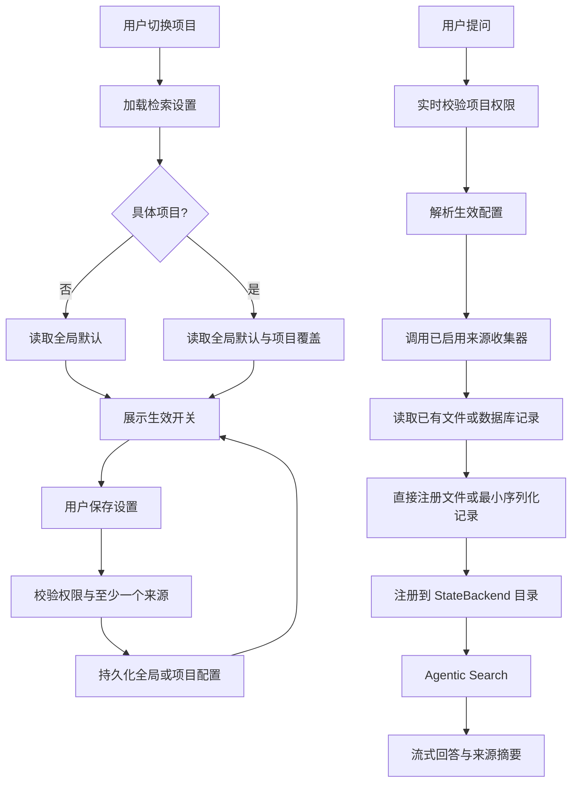

# 项目知识库检索设置页签 Spec

**日期**：2026-07-25  
**状态**：设计稿，待用户审阅  
**范围**：知识库问答检索范围配置、项目级设置、全局默认设置、受限 Agentic Search 文件树

## 1. 背景

当前知识库页面已经包含两个页签：

- `知识库问答`：查询当前项目的需求来源和公司知识库。
- `公司知识库`：浏览、上传和管理公司级 Markdown 知识。

当前问答请求由前端固定发送 `include_requirements: true`，后端通过 `KnowledgeQueryRequest` 控制需求和公司知识库两个粗粒度来源。检索 Agent 使用 DeepAgents `StateBackend` 构建虚拟只读文件树，但来源集合由后端统一收集，用户不能配置本项目是否纳入探索、测试用例和接口信息。

本功能在 `公司知识库` 后增加独立的 `检索设置` 页签。用户可以为当前项目配置默认检索来源；切换到“全部项目”时，配置全局默认来源。查询服务根据生效配置构建受限的 Agentic Search 文件树，不将未启用来源加载进本次查询上下文。

## 2. 已确认决策

- 页签顺序为：`知识库问答`、`公司知识库`、`检索设置`。
- 配置页面只显示当前项目或“全部项目”的一组开关，不展示项目列表。
- 具体项目配置可以覆盖全局默认配置。
- 未设置项目覆盖时，继承全局默认配置。
- 具体项目支持“恢复为全局设置”，删除项目覆盖值，而不是复制全局值。
- 查询时由后端解析生效配置，前端不直接决定可读取的物理文件范围。
- Agent 只获得本次查询允许来源对应的虚拟只读文件，不获得宿主机路径或写权限。
- 首版不设置来源数量、文件大小或“全部项目”查询预算；所有启用来源的可读文件完整注册到 Agentic Search 虚拟目录。
- 首版仅记录来源数量和文件大小等观测数据，不因数量或大小拒绝、截断或降级查询。
- 当前最终需求优先级高于历史测试用例和公司知识库规则。
- 本功能复用现有知识查询路由、知识 Agent、公司知识库仓储和项目上下文，不重建一套 RAG 或向量检索系统。

## 3. 目标

- 让用户可以明确控制项目知识问答使用哪些来源。
- 通过项目级覆盖支持不同项目的检索偏好，同时避免项目数量造成页面混乱。
- 保留“全部项目”场景，并为其提供明确的全局默认配置。
- 让后端只收集和挂载启用的来源，降低上下文噪声和不必要的读取成本。
- 让答案来源可追溯，明确展示本次查询实际使用的来源类型和文件。
- 在没有项目覆盖或配置接口暂时不可用时，提供安全且可解释的降级行为。

## 4. 非目标

- 不在本次功能中实现新的向量数据库、Embedding、外部 RAG 服务或全文索引。
- 不在首版引入来源数量、文件大小或全部项目范围的预算拦截。
- 不允许用户在前端输入或修改知识库物理文件路径。
- 不把“检索设置”做成每次提问临时选择器；本 Spec 管理持久化默认设置。
- 不改变公司知识库的上传、目录、版本和权限模型。
- 不在首版提供跨项目业务事实的任意混合编辑或手工合并。
- 不让用户绕过项目权限读取无权访问的需求、测试用例或接口信息。

## 5. 检索来源定义

首版提供以下五类开关。来源名称和后端标识固定，避免前后端自行解释。

| 展示名称 | 标识 | 首版读取范围 | 事实优先级 |
|---|---|---|---|
| 最终需求 | `final_requirements` | 当前项目可用的最终需求版本；按现有需求版本规则选取，明确排除工作稿和未完成版本 | 最高 |
| 探索记录 | `explorations` | 当前项目已生成且可读取的探索产物；不直接读取探索运行过程、浏览器会话或临时状态 | 高 |
| 测试用例 | `test_cases` | 当前项目状态为“已采纳”的测试用例及其结构化来源摘要；其他状态不进入检索范围 | 中 |
| 接口信息 | `api_information` | 当前项目已登记并可读取的接口资产和接口场景；不读取执行结果、失败报告或自动化代码 | 中 |
| 公司知识库 | `company_knowledge` | 用户有权限读取的公司知识库 Markdown 文件 | 通用规范 |

来源优先级不是开关优先级。来源冲突时，Agent 必须遵守：

```text
当前最终需求 > 当前探索事实 > 当前测试用例/接口信息 > 公司知识库规范 > 模型通用知识
```

公司知识库中的模板、测试规范和历史经验不能覆盖当前项目最终需求。测试用例和接口信息作为项目资产时，不能被公司知识库中的通用规则改写。

### 5.1 来源纳入边界

- `final_requirements` 只读取已形成最终版本的需求内容，工作稿、编辑中版本和未完成版本全部排除。
- `explorations` 只读取持久化的探索产物，包括现有系统定义的页面、模块、证据和报告类产物；不读取运行事件流、浏览器会话、临时截图缓存或未完成过程状态。
- `test_cases` 只读取状态为“已采纳”的测试用例。待评审、未采纳、已废弃和其他非采纳状态全部排除；不采纳经验继续由专用“不采纳用例库”承担。
- `api_information` 只读取接口资产和接口场景。接口执行结果、失败诊断、运行报告、生成代码和临时调试数据不进入该来源。
- `company_knowledge` 继续读取用户有权限访问的公司知识库 Markdown 文件。

### 5.2 空来源与禁用来源

- 关闭的来源不得被收集、写入虚拟文件树或传入 Agent。
- 开启但当前没有可用数据的来源不视为错误；后端在结果元数据中标记 `empty`。
- 开启来源读取失败时，后端记录该来源的 `failed` 状态和错误摘要，并继续尝试其他开启来源。
- 如果所有开启来源均为空或失败，查询返回可解释错误，不得伪装成“没有匹配结果”。
- 如果用户关闭所有来源，设置保存应被拒绝；至少启用一个来源。

## 6. 配置层级与生效规则

### 6.1 配置作用域

使用两个作用域：

- 全局默认作用域：`__all_projects__`，对应顶部项目选择器的“全部项目”。
- 项目作用域：具体 `project_id`。

项目设置页显示当前上下文：

- 选择“全部项目”时，标题为“全局项目检索设置”，编辑全局默认配置。
- 选择具体项目时，标题为“{项目名} 检索设置”，显示该项目的生效值以及是否继承全局。

### 6.2 生效配置

单个项目的生效值按以下优先级计算：

```text
项目覆盖值 > 全局默认值 > 系统安全默认值
```

系统安全默认值用于首次部署或全局配置缺失时：

- `final_requirements = true`
- `explorations = true`
- `test_cases = false`
- `api_information = false`
- `company_knowledge = true`

这样能延续当前需求与公司知识库的查询能力，同时避免首版默认加载体量较大的测试用例和接口资产。

### 6.3“全部项目”查询

当顶部项目为“全部项目”时：

- 查询使用全局默认配置。
- 只读取当前用户有权限访问的项目来源。
- 结果元数据必须包含 `project_id` 和 `project_name`，防止不同项目的事实混淆。
- 最终需求优先级只在同一项目内成立；跨项目出现冲突时，Agent 必须标记项目边界并要求用户指定项目，不能自行合并为一条业务规则。
- 具体项目的覆盖配置不改变“全部项目”查询的全局配置。

## 7. 前端设计

### 7.1 页签

扩展现有 `knowledgeScopes`，保持现有 `Tabs` 和项目上下文模式：

```text
知识库问答 | 公司知识库 | 检索设置
```

`检索设置` 是知识库页面内的第三个模块页签，不新增侧边导航入口。

### 7.2 设置页结构

页面包含：

1. 页面标题和当前作用域名称。
2. 一段说明：当前设置会影响知识库问答的默认检索范围。
3. 五个来源开关卡片。
4. 当前项目场景下的继承状态：`继承全局`、`已覆盖`。
5. 操作区：`保存设置`、具体项目下的`恢复为全局设置`。
6. 最近保存时间和保存人，由设置读取接口统一返回并展示；不新增独立审计页面。

每个开关卡片至少展示：

- 来源名称。
- 一句话用途说明。
- 当前开关状态。
- 当前值来自“全局默认”还是“项目覆盖”。
- 当前可用数据数量，数量读取失败时显示“暂不可用”，不阻塞开关操作。

### 7.3 交互规则

- 页面加载时先读取作用域配置，再读取来源可用性摘要；配置和摘要分开显示加载状态。
- 修改开关只改变本地草稿，不立即触发知识查询。
- 保存期间禁用开关和按钮，显示“正在保存检索设置”。
- 保存成功后刷新生效值和继承状态，并显示成功反馈。
- 保存失败时保留用户草稿，不回滚页面输入，允许重试。
- 具体项目恢复全局设置前显示确认弹窗，确认后删除覆盖配置。
- 切换项目且本页存在未保存修改时，阻止切换或要求用户确认丢弃修改；不能静默丢失。
- “全部项目”下没有项目覆盖编辑控件，页面只编辑全局默认配置。

### 7.4 权限

- 读取设置遵循当前用户的项目访问权限。
- 修改全局默认设置沿用公司知识库维护权限；无权限用户可以查看但不能保存。
- 修改具体项目设置至少需要该项目的配置或维护权限；无权限用户可以查看生效配置但不能覆盖。
- 前端按钮状态不能作为权限控制，后端必须再次校验。

## 8. 后端设计

### 8.1 配置存储

新增来源配置记录表，复用当前 SQLite 数据访问和迁移模式：

```text
knowledge_search_source_settings
- scope_key TEXT NOT NULL
- source_type TEXT NOT NULL
- enabled BOOLEAN NOT NULL
- created_by TEXT NOT NULL
- updated_by TEXT NOT NULL
- created_at TEXT NOT NULL
- updated_at TEXT NOT NULL

PRIMARY KEY (scope_key, source_type)
```

`scope_key` 使用 `__all_projects__` 表示全局默认，具体项目使用 `project_id`。`source_type` 固定使用后端注册表中的来源标识，例如 `final_requirements`、`explorations` 和 `test_cases`。这样复用现有全局项目哨兵值，并允许未来新增来源而无需改变表结构。

全局作用域保存每个已注册来源的默认值。项目作用域只保存发生覆盖的来源；项目缺少某个 `source_type` 记录时，明确表示继承全局值。因此项目可以只覆盖部分来源，且删除项目来源记录即可恢复该来源的全局继承。

项目不存在或无权访问时，不能创建项目配置。

### 8.2 接口契约

接口挂载在现有知识路由下，不新增独立模块：

```text
GET  /knowledge/search-settings
PUT  /knowledge/search-settings
GET  /projects/{project_id}/knowledge/search-settings
PUT  /projects/{project_id}/knowledge/search-settings
DELETE /projects/{project_id}/knowledge/search-settings
```

`GET /knowledge/search-settings` 和具体项目 GET 返回：

```json
{
  "scope": "global | project",
  "scope_key": "__all_projects__ | project-id",
  "project_id": "project-id-or-null",
  "sources": [
    {
      "source_type": "final_requirements",
      "enabled": true,
      "origin": "global",
      "inherited": true
    },
    {
      "source_type": "test_cases",
      "enabled": true,
      "origin": "project",
      "inherited": false
    }
  ],
  "updated_at": "2026-07-25T00:00:00Z",
  "updated_by": "user-id"
}
```

具体项目 GET 的 `sources` 是全部已注册来源的最终生效值，`origin` 与 `inherited` 标识值来自项目覆盖还是全局默认。全局 GET 的所有来源均来自全局作用域。

全局 PUT 提交所有已注册来源的 `{ source_type, enabled }` 列表。项目 PUT 提交需要保留的项目覆盖来源列表；未提交的项目来源覆盖记录由后端删除并恢复全局继承。若项目不保留任何来源覆盖，前端调用 DELETE，后端删除该项目全部覆盖记录。

请求校验：

- 全局配置以及项目配置解析后的生效值至少有一个来源为 `true`。
- 只接受后端来源注册表中已定义的 `source_type`，拒绝未知来源标识。
- 具体项目请求必须校验项目访问权限。
- 全局请求必须校验全局知识库维护权限。

### 8.3 查询请求调整

知识问答接口保留现有查询路径和流式协议。前端不再把来源开关作为事实范围直接传给查询服务；查询服务根据请求上下文解析生效配置。

现有 `include_requirements` 和 `include_company_knowledge` 字段需要兼容处理：

- 首版迁移期保留字段解析，避免旧客户端请求失败。
- 新客户端不发送这两个字段作为用户设置来源。
- 服务端以持久化检索设置为准；旧字段只能在兼容层中被转换为对应设置，不得绕过权限和配置解析。
- 后续移除旧字段前，先确认所有前端和任务调用方已迁移。

### 8.4 来源收集器

在现有 `_collect_project_sources` 和 `_collect_company_knowledge_sources` 基础上增加五个简单来源收集函数：

```text
collect_final_requirements(project_scope)
collect_explorations(project_scope)
collect_test_cases(project_scope)
collect_api_information(project_scope)
collect_company_knowledge(project_scope)
```

每个收集器复用现有 repository/service 读取边界，返回可直接注册到虚拟文件树的文本文件。查询编排根据生效开关调用对应收集器，然后将结果交给现有知识 Agent。

各收集器必须在内部执行来源状态过滤：

- 最终需求收集器排除所有工作稿和未完成版本。
- 探索收集器只读取持久化探索产物，不读取运行过程数据。
- 测试用例收集器只读取“已采纳”状态。
- 接口信息收集器只读取接口资产和接口场景。
- 公司知识库收集器继续复用当前已完成的 Markdown 文件读取逻辑。

各来源首版处理方式：

| 来源 | 处理方式 |
|---|---|
| 最终需求 | 直接读取现有最终需求 Markdown 文件并注册，不重新转换 |
| 探索产物 | 直接读取探索产物已有文本文件；Markdown、JSON、YAML 等文本格式保持原格式 |
| 已采纳测试用例 | 从数据库读取已采纳记录，按用例集或模块序列化为简单可搜索文本文件 |
| 接口资产与接口场景 | 从数据库读取接口资产和接口场景，序列化为简单可搜索文本文件 |
| 公司知识库 | 直接读取现有公司知识库 Markdown 文件并注册，不重新转换 |

测试用例和接口信息的序列化只负责保留字段名称和值，不引入复杂模板、额外摘要或二次加工。首版不增加快照、来源版本、缓存失效或后台重建机制；实际出现性能问题后，再根据观测数据做针对性优化。

### 8.5 Agentic Search 虚拟文件树

知识 Agent 继续使用现有 `StateBackend` 和 `ls`、`glob`、`grep`、`read_file` 工具。根据启用来源，只生成对应虚拟根目录：

```text
/
├── README.md
├── final-requirements/
├── explorations/
├── test-cases/
├── api-information/
└── company-knowledge/
```

未启用目录不创建；空来源可以创建目录清单但不创建业务文件，并在 `README.md` 中标记为空。

后端按照收集结果构建本次查询的 `StateBackend` 虚拟文件映射，并为每种启用来源注册对应根目录。已有 Markdown、JSON、YAML 等文本文件直接使用原始内容和扩展名；只有数据库结构化记录需要生成本次查询使用的虚拟文本文件。

`README.md` 必须记录：

- 本次查询的配置快照。
- 实际挂载的来源类型。
- 每个来源的状态和文档数量。
- 来源优先级和冲突规则。
- 全部项目查询的项目数量和项目目录规则。

`README.md` 只记录根目录、来源数量和规则，不枚举每一个文件路径。文件级项目归属通过目录结构和文件顶部的 `source_metadata` 表达。

虚拟文件内容顶部继续写入结构化 `source_metadata`，至少包括 `source_type`、`source_id`、`project_id`、`title`、`version` 或对应资产版本。Agent 不得将虚拟路径转换为宿主机真实路径。

### 8.6 Agent 初始 Prompt 与搜索策略

初始 Prompt 不得通过 `sorted(files)` 枚举全部虚拟文件路径。只提供：

- 用户问题。
- 当前启用的根目录。
- 每个来源的文件数量。
- `/README.md` 的入口说明。

示例：

```text
本次可搜索目录：
- /final-requirements/：8 个文件
- /explorations/：43 个文件
- /test-cases/：126 个文件
- /company-knowledge/：32 个文件

请先使用 glob 或 grep 定位相关内容，再读取必要文件。
```

Agent 系统提示必须约束高效搜索顺序，但不设置硬性工具调用次数：

1. 根据问题判断优先搜索的来源目录。
2. 优先使用 `glob` 或 `grep` 定位候选文件。
3. 只对候选文件调用 `read_file`。
4. 同一次查询不重复读取相同路径。
5. 跨来源冲突时按照来源优先级处理。

### 8.7 查询结果元数据

沿用现有 `ApiKnowledgeQueryResult` 结构，并扩展可选的来源摘要：

```json
{
  "search_scope": {
    "settings_scope": "global | project",
    "project_id": "project-id-or-null",
    "enabled_sources": ["final_requirements", "company_knowledge"],
    "source_statuses": {
      "final_requirements": "ready",
      "explorations": "disabled",
      "test_cases": "empty",
      "api_information": "failed",
      "company_knowledge": "ready"
    }
  },
  "sources": []
}
```

答案区域可以展示简短的“本次检索：最终需求、公司知识库”摘要；完整来源仍通过现有来源引用展示机制提供。

### 8.8 首版完整目录挂载与基础观测

首版继续采用当前公司知识库的 Agentic Search 模式：后端为每个启用来源收集完整可读文件，并注册到 `StateBackend` 虚拟目录。Agent 使用现有 `ls`、`glob`、`grep` 和 `read_file` 在大量文件中检索关键信息并整合答案。

首版不对以下内容施加拒绝、截断或降级限制：

- 单个来源的文件数量。
- 单个文件或来源的内容大小。
- 单次查询的虚拟文件总量。
- “全部项目”查询的项目数量。

后端只需记录来源类型、文件数量、虚拟目录构建耗时、Agent 工具调用次数和查询总耗时。这些数据用于判断后续是否需要缓存或快照优化，不影响本次查询结果，也不得记录完整业务正文。

## 9. 数据流



同一次查询使用配置快照。查询开始后，即使用户在另一个窗口修改设置，本次运行也不改变；下一次提问使用新配置。

## 10. 错误处理与降级

| 场景 | 行为 |
|---|---|
| 配置不存在 | 使用系统安全默认值，并可在页面提示“当前使用系统默认” |
| 项目覆盖不存在 | 返回全局生效值，所有来源标记为 `origin=global`、`inherited=true` |
| 配置保存无权限 | 返回明确的权限错误，保留前端草稿 |
| 全部来源关闭 | 拒绝保存，指出至少开启一个来源 |
| 单个来源为空 | 继续其他来源，并在来源摘要中标记 `empty` |
| 单个来源读取失败 | 继续其他来源，并返回可观测错误摘要 |
| 所有来源不可用 | 查询失败，区分“读取失败”和“没有可匹配内容” |
| 项目被删除或无权访问 | 拒绝读取和保存项目配置 |
| 全部项目跨项目冲突 | 标记项目边界，要求用户指定项目，不自动合并规则 |
| 保存期间切换项目 | 前端阻止切换或确认丢弃未保存修改 |

日志只记录作用域、配置字段变更、run ID、来源状态、数量和错误摘要，不记录完整需求正文、测试用例正文或公司知识库全文。

## 11. 测试要求

### 11.1 后端单元测试

- 全局设置首次读取返回系统安全默认值。
- 项目无覆盖时完整继承全局设置。
- 项目只覆盖一个来源时，其他来源继续继承全局。
- 删除项目覆盖后恢复全局值。
- 未知字段、全关闭配置和非法布尔值被拒绝。
- 全局设置和项目设置权限分离校验。
- 每个来源开关只触发对应收集器。
- 禁用来源不进入 `source_documents`。
- 最终需求收集器不返回工作稿或未完成版本。
- 探索收集器只返回探索产物，不返回运行事件和会话状态。
- 测试用例收集器只返回“已采纳”用例。
- 接口信息收集器只返回接口资产和接口场景，不返回执行结果、报告和代码。
- 空来源、失败来源和全部失败状态可区分。
- 全部项目查询使用全局配置并保留项目归属。

### 11.2 Agentic Search 测试

- 只启用最终需求时，虚拟树不出现其他来源目录。
- 只启用公司知识库时，Agent 不能读取项目需求。
- 多来源启用时，`README.md` 正确记录挂载来源和优先级。
- `README.md` 和初始 Prompt 不枚举全部文件路径，只展示根目录和来源数量。
- Agent 提示词要求先使用 `glob` 或 `grep`，再读取候选文件。
- 相同查询运行中不重复读取同一路径。
- 来源文件元数据使用真实来源时间和版本，不因查询重新生成时间。
- 虚拟路径不能解析到宿主机真实文件。
- `source_metadata` 包含项目、来源和版本信息。
- 当前最终需求与公司知识库冲突时，Agent 遵守最终需求。
- 全部项目结果不丢失项目 ID 和项目名称。

### 11.3 前端契约测试

- 知识库页签顺序包含 `知识库问答`、`公司知识库`、`检索设置`。
- 设置页按当前项目显示，不渲染项目列表。
- 全部项目显示全局项目设置文案。
- 具体项目显示继承状态和恢复全局操作。
- 保存中禁用控件，失败后保留草稿，成功后刷新配置。
- 全部来源关闭时阻止保存。
- 未保存修改时切换项目触发保护逻辑。
- 问答结果显示本次实际启用来源摘要。

### 11.4 回归测试

- 现有项目知识库问答在默认配置下继续可用。
- 现有公司知识库浏览、上传、文件预览和目录操作不受影响。
- 现有流式回答、会话历史和模型切换不受影响。
- 旧客户端发送 `include_requirements` 和 `include_company_knowledge` 时仍能兼容解析。

## 12. 验收标准

- 用户可以在知识库页面通过第三个“检索设置”页签配置五类检索来源。
- 具体项目的设置与其他项目隔离，页面不展示项目列表。
- “全部项目”可以编辑全局默认设置，并用于全部项目查询。
- 未配置项目自动继承全局默认；项目覆盖只影响该项目。
- 用户可以恢复项目的全局继承状态。
- 后端只将已启用来源构建到本次 Agentic Search 虚拟文件树。
- 查询时实时执行用户权限、项目范围和生效配置判断。
- 初始 Prompt 不包含全部文件路径，Agent 通过现有工具按需发现和读取文件。
- 后端记录来源文件数、虚拟树构建耗时、Agent 工具调用次数和查询总耗时。
- 各来源严格遵守已确认的纳入边界：最终需求排除工作稿、探索只读取探索产物、测试用例只读取已采纳状态、接口信息只读取接口资产和接口场景。
- 查询结果明确展示本次实际使用的来源及其状态。
- 权限、空数据、读取失败和跨项目冲突均有明确行为。
- 现有知识库问答和公司知识库管理流程不回归。

## 13. 实施边界与文件影响

预计涉及以下现有边界，具体文件以实施阶段再次核对为准：

```text
apps/frontend/src/app/(main)/knowledge/page.tsx
apps/frontend/src/lib/api-client.ts
apps/frontend/tests/knowledge-*.test.mjs

apps/backend/app/api/v1/knowledge.py
apps/backend/app/schemas/knowledge.py
apps/backend/app/services/knowledge/service.py
apps/backend/app/agents/knowledge/service.py
apps/backend/app/agents/knowledge/schemas.py
apps/backend/app/repositories/knowledge_search_source_settings_repo.py
apps/backend/app/seed/schema.py
apps/backend/tests/test_knowledge*.py
```

实施时必须复用项目现有数据库迁移、仓储和服务分层，不为本功能引入新的持久化框架。

## 14. 后续演进

首版稳定后基于实际观测数据评估：

- 是否需要增加仅用于系统保护的查询预算或惰性加载机制。
- 查询时的临时来源预览，但不改变持久化默认设置。
- 基于首版性能指标增加来源命中率、答案引用率和模型成本统计。
- 更细粒度的测试用例状态、接口资产类型和探索运行筛选。
- 跨项目只读知识规范与业务事实的进一步隔离。
