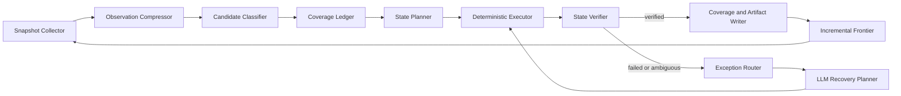

# 页面探索高覆盖混合执行与 Token 效率改造规范

**项目**：AI 测试系统页面探索  
**日期**：2026-07-29  
**状态**：待评审  
**目标范围**：Loop 探索执行链路、实时进度、报告与恢复能力  

---

## 1. 背景

当前 Loop 探索采用“每个候选元素单独请求模型决策”的执行方式。每次动作产生新页面状态后，系统又以新的 `state_key` 将整页候选重新加入 frontier。该方式可以持续推进探索，但会造成以下问题：

1. 模型为大量明确的点击、填写、筛选动作重复决策。
2. 同一个全局元素在多个筛选状态下重复入队和执行。
3. 容器元素、组合文本节点和真实操作元素同时进入队列，产生大量 `skip`。
4. `skip` 和 `finish_state` 分支没有完整步骤终态，前端进度无法准确更新。
5. 每个动作都采集和传递完整页面上下文，Token 消耗随队列长度持续增长。
6. 报告仍按旧页面产物结构统计，无法准确反映 Schema 4.0 页面产物。
7. 运行中的项目级探索产物没有主动刷新，用户无法及时看到新增结果。
8. 长时间运行容易在 frontier 完成前耗尽模型调用配额。

真实运行 `exp_0x7w65xtPTAv4HxCNvZ8zA` 提供了直接证据：

- 7 个页面状态产生 389 个 frontier 项。
- 389 个 frontier 项仅对应 101 个不同的语义动作。
- 22 次模型决策中包含 13 次 `skip` 和 1 次 `finish_state`。
- 23 个步骤发出 `step_started`，只有 7 个步骤产生终态事件。
- 运行结束前仍有 370 个 pending 项。
- 最终因模型配额 `429 rate_limit_exceeded` 中断。
- 项目页面产物已有 169 个元素，但报告错误显示 0 个元素和“未产生页面产物”。

本规范的目标不是减少业务探索，也不是将高覆盖模式改为抽样模式，而是消除重复推理、重复队列和重复上下文，让程序承担确定性执行，让模型只处理规划和异常。

---

## 2. 与现有规范的关系

本规范依赖并保留以下既有设计：

- `2026-07-29-page-exploration-artifact-and-shared-coverage-design.md`
  - 继续使用 Schema 4.0 页面产物。
  - 继续使用项目级共享覆盖记录。
  - 不重新定义 `objects`、`states`、`elements`、`collections`、`transitions`。
- `2026-05-30-site-exploration-agent-plan-backend-frontend-contract-spec.md`
  - 保留实时 plan 和 step 事件展示能力。
  - 本规范收紧步骤生命周期和事件完整性要求。

若既有规范与本规范对 Loop 执行方式存在冲突，以本规范的“状态级批量规划 + 确定性执行 + 异常兜底”为准。

---

## 3. 设计决策

采用以下混合执行架构：

> 模型负责状态级规划和异常恢复；程序负责候选分类、动作执行、状态验证、覆盖记录、事件发布和产物落盘。

标准流程：

```text
页面扫描
  → 确定性候选分类
  → 过滤已完成覆盖
  → 每个业务状态一次批量规划
  → 程序逐项执行
  → 程序逐项验证
  → 更新覆盖矩阵
  → 仅对新增状态增量入队
  → 失败或歧义时请求模型恢复
```

禁止继续使用以下模式：

```text
每取出一个元素
  → 发送完整页面候选和历史给模型
  → 模型决定单个动作
  → 动作后将整页候选重新入队
```

---

## 4. 目标

### 4.1 功能目标

1. 保持页面、业务状态、筛选值、排序值、分页、弹窗和表单动作的高覆盖。
2. 每个有业务意义的“页面 × 相关状态 × 动作变体”至少执行一次。
3. 明确动作无需模型逐步决策。
4. 每个动作必须有可验证结果。
5. 每个开始步骤必须产生唯一终态。
6. 运行中断后可从 checkpoint 恢复，不重复已完成动作。
7. 页面产物、覆盖率、实时进度和最终报告使用同一事实来源。

### 4.2 效率目标

1. 模型调用次数由“接近动作数”降低为“接近新业务状态数 + 异常数”。
2. 不再向模型发送完整 DOM、完整历史事件和已完成步骤列表。
3. 不再因原始 `state_key` 变化而重新加入全部全局动作。
4. 页面没有新增业务状态时，不生成完整重复快照。
5. 模型输出只包含结构化计划或恢复动作，不输出长篇解释。

### 4.3 用户体验目标

1. 左侧步骤状态实时、准确、可解释。
2. `skip` 必须展示原因，并被视为明确终态。
3. 探索产物在运行过程中可自动刷新。
4. 报告准确展示页面数、元素数、状态数、覆盖数、失败数和待处理数。

---

## 5. 非目标

本次改造不包括：

1. 降低用户配置的页面覆盖范围。
2. 将高覆盖探索改为代表性抽样。
3. 自动执行删除、发布、支付等破坏性操作。
4. 重新设计 Schema 4.0 页面产物。
5. 重写 Playwright browser session 或替换现有运行时。
6. 引入通用工作流编排平台。
7. 使用视觉模型替代现有 DOM 与 accessibility 快照。

---

## 6. 核心原则

### 6.1 高覆盖不等于重复执行

必须覆盖所有不同的业务状态和动作变体，但不要求在与动作无关的状态中重复执行同一全局动作。

例如：

- “零售、金融、营销”三个场景筛选必须分别执行。
- “中文、英文、法语”三个语言选项必须分别执行。
- “创建智能体”入口不需要在每种语言和场景组合下重复点击，除非该入口的可见性、权限或行为发生变化。

### 6.2 模型不执行确定性工作

以下动作默认由程序决定和执行：

- button、link、tab 点击。
- textbox、searchbox 填写。
- combobox 展开和 option 选择。
- checkbox、radio 状态切换。
- 分页、排序和筛选遍历。
- 弹窗关闭、返回和状态恢复。

模型只用于：

- 候选语义存在歧义。
- 动作风险不明确。
- 确定性执行失败。
- 出现未知弹窗、验证码或异常页面。
- 多条恢复路径需要选择。

### 6.3 环境事实优先

动作成功不能只依赖浏览器调用返回 `success=true`，必须由 URL、overlay、筛选值、元素集合、列表摘要、toast 或业务状态变化验证。

### 6.4 所有步骤必须闭环

任何已发布的 `step_started` 最终必须产生且只产生一个终态事件。

---

## 7. 目标架构



### 7.1 Snapshot Collector

复用现有 `snapshot_with_runtime_context()`，负责采集可交互元素和页面状态。

职责：

- 初次进入页面时采集完整快照。
- 轻量验证发现新业务状态后采集完整快照。
- 不负责模型决策。

### 7.2 Observation Compressor

将完整快照压缩成规划所需的最小结构。

保留：

- 页面 ID、URL、标题。
- 当前业务状态。
- 新增或变化的候选元素。
- 元素语义键、角色、动作类型、可选值和风险标签。
- 未完成覆盖项。

删除：

- 完整 DOM。
- 完整 accessibility tree。
- CSS、XPath 和坐标。
- 已完成元素列表。
- 完整 timeline。
- 重复的页面正文。
- 长篇模型决策理由。

### 7.3 Candidate Classifier

确定性分类候选元素：

```text
actionable       可直接执行
stateful         与筛选、分页、排序或 overlay 状态相关
global           页面全局入口，通常每个行为版本执行一次
container        仅包含子操作，不单独执行
assertion_only   只用于验证，不加入动作队列
risky            需要策略或人工确认
unsupported      当前无法执行
```

容器元素不得进入正常动作队列。若容器没有可识别子动作，记录为 unresolved，而不是让模型逐项 `skip`。

### 7.4 Coverage Ledger

覆盖记录是执行事实的唯一来源。

每条覆盖义务包含：

```json
{
  "page_id": "page-agentStore",
  "relevant_state": "scene=金融|language=中文|overlay=none",
  "element_key": "filter-sort",
  "action": "select",
  "variant": "发布时间",
  "scope": "stateful",
  "status": "pending"
}
```

允许状态：

```text
pending
executing
verified
skipped_non_actionable
blocked
failed
cancelled
```

`skipped_non_actionable` 只适用于已确定为容器、纯展示或不可执行元素，不允许因为 Token 成本跳过业务动作。

### 7.5 State Planner

每个新的业务状态最多进行一次正常规划调用。

输入：

- 当前业务状态。
- 当前状态下尚未完成的候选动作。
- 风险策略。
- 必要的测试数据约束。

输出：

```json
{
  "actions": [
    {
      "element_key": "scene-filter",
      "action": "select",
      "value": "金融",
      "priority": 80
    }
  ]
}
```

正常规划输出不得包含 `reason`、页面总结或重复候选描述。仅在异常恢复结果中允许返回短原因。

### 7.6 Deterministic Executor

程序根据 `action + role + value` 执行明确动作。

支持动作：

```text
click
fill
select
check
uncheck
submit
close_overlay
navigate_back
restore_state
```

执行器不得自行猜测 locator。必须使用最近完整快照中已验证的 `element_id` 或已有稳定 locator。

### 7.7 State Verifier

动作后先执行轻量验证。

轻量状态包含：

```json
{
  "url": "https://example.test/agentStore",
  "overlay": "language-selector",
  "selection": {
    "scene": "金融",
    "language": "中文"
  },
  "visible_element_keys_hash": "...",
  "content_summary_hash": "...",
  "toast": ""
}
```

验证结果：

```text
verified       观察到预期业务变化
no_effect      动作完成但未观察到变化
failed         浏览器动作失败
blocked        风险、权限、验证码或外部依赖阻塞
```

仅当发现新的业务状态、overlay 或元素集合时，才采集完整快照并扩展 frontier。

### 7.8 Exception Router

以下情况进入异常路由：

- `no_effect` 且确定性重试已用尽。
- locator 失效或目标不可见。
- 页面出现未知 overlay。
- 同名候选无法确定目标。
- 动作可能产生破坏性影响。
- 页面进入错误或认证状态。

异常模型输入只能包含：

- 失败动作。
- 错误类型。
- 当前轻量状态。
- 目标附近候选。
- 已尝试的恢复动作。

不得重新发送完整探索历史。

---

## 8. 业务状态与去重模型

### 8.1 不再使用原始 state key 作为唯一覆盖身份

原始 `state_signature` 仍用于判断页面是否发生技术变化，但不能直接作为动作覆盖身份。动态元素、列表顺序和无关文本变化可能产生新 signature，却不代表新的业务覆盖义务。

### 8.2 Relevant State

每个动作只绑定与其行为相关的状态维度。

示例：

```text
场景筛选动作：page + 当前权限
语言筛选动作：page + 当前场景 + 当前权限
列表详情动作：page + 场景 + 语言 + 排序 + 列表项类型
全局导航动作：page + 权限 + 元素行为版本
```

### 8.3 Coverage Identity

```text
page_id
  + relevant_state
  + element_key
  + action
  + variant
```

同一 coverage identity 只能处于一个生命周期中，不得重复入队。

### 8.4 新状态扩展规则

动作后只加入：

- 新出现的元素。
- 可用动作发生变化的元素。
- 新增 option 或分页项。
- 新 overlay 中的元素。
- 与当前 relevant state 绑定的新动作变体。

不得重新加入：

- 未变化的全局导航。
- 已验证的相同动作变体。
- 纯容器节点。
- 仅文本发生变化但行为未变化的元素。

---

## 9. 步骤生命周期与事件契约

### 9.1 标准生命周期

```text
step_queued
  → step_started
  → action_executed
  → action_verified
  → step_completed | step_skipped | step_failed | step_blocked | step_cancelled
```

### 9.2 事件不变量

1. 每个 `step_id` 最多有一个 `step_started`。
2. 每个已开始步骤必须有一个终态。
3. `skip` 不得直接 `continue`。
4. `finish_state` 必须关闭当前状态计划中的剩余不可执行项，并发布状态完成事件。
5. 每次 coverage 状态变化后必须持久化 checkpoint。
6. plan 更新必须基于 Coverage Ledger，而不是根据 frontier 数量推断。

### 9.3 前端展示

左侧步骤应展示：

- 当前业务状态。
- 动作目标和变体。
- 执行状态。
- 验证结果。
- 简短失败或跳过原因。

不得将完整 frontier 的数百条重复动作直接作为用户计划展示。计划总数应表示真实 coverage obligation 数量。

---

## 10. Token 使用策略

### 10.1 正常模型调用预算

正常调用上限：

```text
新业务状态数量 + 初始页面规划数量
```

异常调用预算单独统计：

```text
异常动作数量 × 每动作最大恢复次数
```

### 10.2 禁止发送的内容

- 完整 DOM。
- 完整 accessibility tree。
- 已完成 coverage 项。
- 完整 timeline events。
- 全量 frontier。
- locator 源码。
- 重复页面文本。
- 多段自然语言执行理由。

### 10.3 模型响应约束

正常规划响应只允许：

```text
element_key
action
value
priority
risk_override（可选）
```

异常恢复响应只允许额外提供：

```text
recovery_action
short_reason
retryable
```

### 10.4 模型调用降级

接近速率限制时：

1. 停止创建新的异常模型请求。
2. 继续执行已生成的确定性计划。
3. 将需要模型处理的异常标记为 `blocked`。
4. 保存完整 checkpoint。
5. 运行状态标记为 `partial`，允许稍后恢复。

不得因为模型配额耗尽而丢失已经完成的覆盖和页面产物。

---

## 11. 测试数据策略

填写动作不得在每次执行时请求模型临时生成值。

状态规划阶段一次生成或选择测试数据：

```text
searchbox      正常关键词、无结果关键词、清空恢复
textbox       合法文本
email         合法邮箱
number        正常值、最小边界、最大边界
date          合法日期
required      非空合法值
```

测试数据必须：

- 与运行绑定。
- 可重放。
- 可记录来源。
- 避免写入真实敏感数据。
- 对可能创建数据的动作提供清理策略。

---

## 12. 产物与报告

### 12.1 页面产物

继续使用 Schema 4.0 顶层结构：

```text
page
objects
states
elements
collections
transitions
quality
```

报告和质量检查必须从顶层 `elements` 统计可操作元素，不得从 `state.elements` 读取。

页面路径必须读取：

```text
page.normalized_path
```

### 12.2 覆盖摘要

每次运行必须生成：

```yaml
coverage:
  pages:
    discovered: 2
    completed: 2
  states:
    discovered: 7
    completed: 7
  actions:
    required: 112
    verified: 106
    skipped_non_actionable: 4
    blocked: 1
    failed: 1
  pending: 0
```

### 12.3 报告要求

报告必须准确展示：

- 运行最终状态。
- 页面和业务状态数量。
- required、verified、blocked、failed、pending 动作数量。
- 模型正常规划调用次数。
- 模型异常恢复调用次数。
- 确定性动作执行次数。
- 完整快照和轻量验证次数。
- Token 或输入输出字符统计（若模型接口可提供）。
- 页面产物新增、更新和复用数量。

有页面产物时不得显示“本次探索未产生页面产物”。

---

## 13. 中断与恢复

checkpoint 至少包含：

```text
当前页面和业务状态
Coverage Ledger
当前状态计划
已完成动作
待执行动作
失败和恢复次数
已创建测试数据
清理任务
模型调用计数
```

恢复时：

1. 重新打开入口或最后可恢复 URL。
2. 恢复必要的筛选、分页和 overlay 状态。
3. 校验当前页面状态。
4. 从第一个 pending coverage obligation 继续。
5. 不重新执行 verified 项。

---

## 14. 错误处理

| 错误 | 默认处理 |
|---|---|
| locator 不可用 | 重新采集一次完整快照，仍失败则异常路由 |
| 动作 no_effect | 确定性重试一次，仍失败则异常路由 |
| 未知 overlay | 完整快照后异常路由 |
| 高风险动作 | 标记 blocked，不自动执行 |
| 验证码 | 标记 blocked，等待人工或认证流程 |
| 页面崩溃 | 重建 browser session 并从 checkpoint 恢复 |
| 模型 429 | 停止新模型请求，保存 partial checkpoint |
| 用户停止 | 终止当前动作，剩余项标记 cancelled |
| 产物写入失败 | 保留 run checkpoint，运行标记 partial 或 failed |

---

## 15. 前端要求

### 15.1 实时计划

实时计划展示真实 coverage obligations，不展示技术 frontier 的重复项。

### 15.2 进度指标

至少展示：

```text
页面：2 / 2
业务状态：7 / 7
动作：106 / 112
阻塞：1
失败：1
待执行：4
```

### 15.3 产物刷新

运行状态为 `queued`、`running` 或 `stopping` 时：

- 优先通过现有实时流接收 `artifact_updated`。
- 无实时事件时，每 5 秒静默刷新项目页面列表。
- 用户正在查看的页面 YAML 发生更新时，显示刷新提示，不强制覆盖用户滚动位置。

---

## 16. 兼容与迁移

1. Schema 4.0 页面产物保持不变。
2. 现有 `LoopExplorationState` 可增加 coverage ledger 和 state plan 字段。
3. 旧 checkpoint 缺少新字段时只允许只读展示或从入口重新开始。
4. 旧 `agent_plan_updated` 事件继续支持，新增字段必须向后兼容。
5. 新终态事件前端未知时应按通用终态展示，不能忽略。
6. 数据库不保存大型 frontier 或完整快照，继续使用项目文件存储。

---

## 17. 代码影响范围

后端主要修改范围：

- `apps/backend/app/services/page_exploration/loop/service.py`
- `apps/backend/app/agents/page_exploration_loop/agent.py`
- `apps/backend/app/agents/page_exploration_loop/state/models.py`
- `apps/backend/app/agents/page_exploration_loop/state/reducer.py`
- `apps/backend/app/agents/page_exploration_loop/services/frontier.py`
- `apps/backend/app/agents/page_exploration_loop/services/verifier.py`
- `apps/backend/app/services/page_exploration/output_registry.py`
- `apps/backend/app/services/page_exploration/report_writer.py`
- `apps/backend/app/services/page_exploration/runner.py`

建议新增模块：

- `services/candidate_classifier.py`
- `services/observation_compressor.py`
- `services/deterministic_executor.py`
- `services/coverage_ledger.py`
- `services/exception_router.py`

前端主要修改范围：

- `apps/frontend/src/app/(main)/projects/[projectId]/exploration/[runId]/page.tsx`
- `apps/frontend/src/components/ai-testing/exploration-workspace.tsx`

---

## 18. 验收标准

### 18.1 覆盖正确性

- 相同配置下，优化前后独立业务状态覆盖率不得下降。
- 所有筛选值、排序值、分页状态和可执行 overlay 动作仍被覆盖。
- 不得因为 Token、队列长度或模型预算主动跳过低风险业务动作。
- 已验证动作恢复后不得重复执行。

### 18.2 步骤正确性

- `step_started` 与终态事件一一对应，闭环率 100%。
- 同一个 `step_id` 不得产生多个终态。
- `skip` 必须有明确的 `skipped_non_actionable` 或风险原因。
- 前端不再长期显示已经结束的动作处于执行中。

### 18.3 队列质量

- frontier 中相同 coverage identity 重复数为 0。
- 同一页面状态不重复加入未变化的全局动作。
- 容器元素进入正常动作队列的比例为 0。
- 实际运行的 frontier 数应接近 required coverage 数，而不是状态数乘以全页元素数。

### 18.4 模型效率

- 正常规划调用次数不高于新业务状态数加入口页面数。
- 明确点击、填写和选择动作不产生单独模型调用。
- 模型输入不包含完整 timeline 和完整 frontier。
- 与当前逐元素决策基线相比，模型调用次数至少降低 60%。

### 18.5 产物与报告

- 报告元素数与 Schema 4.0 顶层 `elements` 数量一致。
- 报告页面路径与 `page.normalized_path` 一致。
- 有页面产物时不显示“未产生页面产物”。
- 运行中项目页面列表可在 5 秒内看到新增或更新时间变化。

### 18.6 恢复能力

- 模型 429 后运行进入 `partial`，已完成产物和覆盖保持可见。
- 恢复运行时不重复已 verified 的 coverage obligation。
- 浏览器 session 异常后可从最近 checkpoint 继续。

---

## 19. 测试策略

### 19.1 单元测试

- 候选分类：actionable、container、global、stateful、risky。
- relevant state 计算。
- coverage identity 去重。
- 状态级批量计划解析。
- 确定性动作分发。
- 轻量状态验证。
- 事件生命周期闭环。
- Schema 4.0 报告统计。

### 19.2 集成测试

- 多场景、多语言、多排序完整遍历。
- 全局导航不随筛选状态重复入队。
- overlay 新状态增量入队。
- `no_effect` 进入异常恢复。
- 模型 429 保存 partial checkpoint。
- 中断后从 pending coverage 继续。
- 实时步骤和产物刷新。

### 19.3 回归测试

- 现有 Loop 单动作执行能力。
- 现有共享覆盖跳过能力。
- Schema 4.0 产物合并。
- collection representative 行为。
- 旧实时事件兼容。
- 目标探索和自主探索不受影响。

---

## 20. 分阶段交付

### Phase 1：可信状态与报告

- 修复 `skip`、`finish_state` 步骤终态。
- 修复计划刷新。
- 修复 Schema 4.0 报告统计。
- 增加运行中产物刷新。

### Phase 2：状态级批量规划

- 引入 Observation Compressor。
- 每个新业务状态一次批量规划。
- 删除逐元素长理由和完整上下文。
- 保留现有执行器作为兼容路径。

### Phase 3：确定性执行与增量 frontier

- 引入 Candidate Classifier。
- 引入 Deterministic Executor。
- 引入 Relevant State 和 Coverage Identity。
- 仅对新增业务状态增量入队。

### Phase 4：异常路由与恢复

- 引入 Exception Router。
- 增加 429 降级和 partial checkpoint。
- 增加浏览器 session 恢复。
- 完成覆盖矩阵报告和前端指标。

---

## 21. 最终结论

Loop 探索应从“模型逐元素驱动”升级为“程序执行、程序验证、模型状态级规划和异常兜底”。

该方案不减少高覆盖目标，而是将重复技术状态转换为可管理的业务覆盖义务，保证每个必要动作被执行一次、被验证一次、被记录一次。Token 节省来自减少无效模型参与和重复上下文，而不是减少探索内容。
