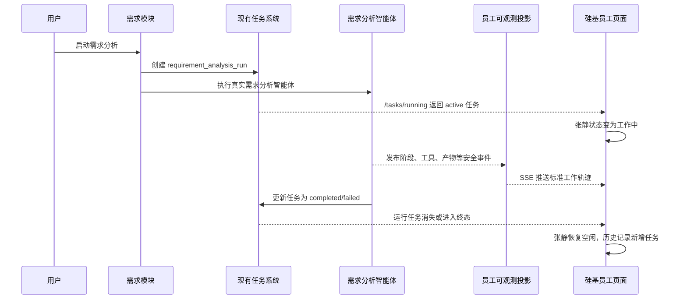

# 硅基员工真实智能体绑定与工作可观测性设计

- 日期：2026-07-29
- 状态：待评审
- 范围：`/agents` 硅基员工办公室、智能体身份绑定、运行状态、实时工作轨迹与历史记录

## 1. 背景

当前项目已经具备两部分基础能力：

1. 后端已经通过 `app.agents.capabilities` 注册当前系统中的 AI 能力，并通过 `app.agents.employee_registry` 暴露 `/agents/employees` 员工目录。
2. 任务中心已经通过 `/tasks/running` 和 `/tasks` 聚合需求分析、测试点生成、测试用例生成、接口自动化、站点探索等运行记录。

但当前 `/agents` 页面没有使用这些真实数据。`office-dashboard.tsx` 内部硬编码了员工姓名、岗位、状态、人数、任务安排和详情内容，因此目前看到的是视觉演示，不是实际智能体运行中心。

项目历史中曾经存在一版真实接线：

- 前端读取 `/agents/employees`。
- 前端轮询 `/tasks/running`。
- `agent-roster.ts` 根据 `task_source_types` 将运行任务映射到员工。
- 员工无任务时显示空闲，有任务时显示工作中。

该版本在后续办公室视觉重做中被删除。当前最合理的方向不是重新发明智能体或任务系统，而是在保留现有办公室视觉的基础上恢复真实数据接线，并补齐统一工作轨迹和历史回放能力。

## 2. 目标

1. 每个硅基员工对应项目中一个真实、已注册的智能体能力。
2. 员工拥有稳定的人格化身份，包括姓名、岗位、部门、头像、工位和视觉形象。
3. 例如需求组员工“张静”，岗位为“需求分析师”，使用女生工位和女生头像，绑定 `requirement_analysis` 智能体。
4. 员工默认状态为空闲；存在实际执行中的绑定任务时自动变为工作中。
5. 点击员工后可以查看基本信息、当前工作、并行任务、可审计工作轨迹和历史任务。
6. 运行状态和工作内容来自真实任务及智能体事件，不再使用静态假数据。
7. 页面刷新、切换项目或重新登录后，可以从后端恢复员工状态和历史。
8. 保留当前办公室房间、工位图片、人物头像和整体视觉风格。
9. 不展示模型原始隐藏推理，改为展示安全、稳定、可审计的工作轨迹。

## 3. 非目标

- 不在本次改造中重写现有智能体实现。
- 不新建另一套任务调度中心。
- 不改变各业务模块现有任务创建、停止、重试和结果页面。
- 不把硅基员工页面变成智能体配置编辑器。
- 不允许用户通过员工页面任意修改智能体提示词、模型或技能。
- 不展示系统提示词、完整模型输入、原始 chain-of-thought、密钥、Cookie 或未脱敏工具参数。
- 不伪造百分比进度、思考内容、工作时长或历史任务。
- 不用前端定时器模拟员工工作状态。

## 4. 当前实现结论

### 4.1 可以直接复用的能力

#### 智能体目录

`apps/backend/app/agents/capabilities.py` 已经定义当前 AI 能力，包括：

- 文档修改
- 需求标准化
- 需求分析
- 项目知识库查询
- 测试用例生成
- 测试点生成
- 接口自动化用例生成
- 接口自动化场景编排
- UI 自动化代码生成
- 站点探索
- 性能测试脚本计划生成
- 性能测试报告分析

`apps/backend/app/agents/employee_registry.py` 已经为每个能力配置岗位、部门、颜色和任务来源类型，并通过 `GET /agents/employees` 返回。

#### 任务状态与历史

`apps/backend/app/services/task_service.py` 已提供统一任务投影：

- `GET /tasks/running`：当前运行任务。
- `GET /tasks`：最近任务历史，支持项目、状态组、模块和关键词过滤。
- 每个任务包含 `source_type`、`source_id`、项目、模块、标题、状态、摘要、更新时间和 `detail_url`。

前端 `TaskRunningIndicator` 已使用 2 秒轮询验证这套接口可以承担实时状态刷新。

#### 领域级实时信息

部分模块已经有更详细的运行信息：

- 站点探索提供 SSE 事件流和运行快照。
- 知识库问答已有 `thinking_delta`、内容流和引用信息。
- UI 自动化提供运行日志和实时视图。
- 接口自动化提供生成运行、执行日志、修复诊断和结果详情。
- 需求分析、测试点、测试用例和性能测试均有各自的运行记录或结果表。

这些领域接口应继续作为业务事实源，硅基员工只做统一投影，不复制业务结果。

### 4.2 当前缺口

1. 当前办公室前端完全使用硬编码员工和假任务。
2. `/agents/employees` 只有岗位元数据，没有真实姓名、头像、性别化工位、工位编号等展示配置。
3. 员工注册表声明的部分 `task_source_types` 尚未被 `task_service` 完整聚合，主要包括 UI 自动化与性能测试相关运行。
4. `document_editor` 和 `knowledge_query` 等直接调用型智能体缺少统一、持久化的运行生命周期，因此无法稳定显示“正在工作”。
5. `/tasks` 当前不能按一个或多个 `source_type` 精确过滤，员工历史若只在前端过滤会产生分页不完整问题。
6. 各业务模块的运行事件结构不同，无法直接在员工详情中统一展示。
7. 当前任务历史只保留最近 10 天的任务中心投影，不等同于长期员工履历。
8. `operation_log_service.record_agent_run` 已定义但尚未被实际智能体调用。

## 5. 方案对比

### 方案 A：仅恢复旧版前端聚合

前端同时请求 `/agents/employees`、`/tasks/running` 和 `/tasks`，使用 `task_source_types` 在浏览器中完成员工状态和任务映射。

优点：

- 改动最小。
- 可以最快让办公室状态变成真实数据。
- 能直接复用历史版本中的 `agent-roster.ts` 思路。

缺点：

- 历史分页在前端过滤后不准确。
- 多个页面可能重复状态映射逻辑。
- 无法统一各智能体的实时工作步骤。
- 直接调用型智能体仍然不可观测。

结论：适合作为第一阶段恢复方案，不适合作为最终架构。

### 方案 B：重建统一 Agent Runtime

所有智能体都改为通过新的统一运行时启动、持久化、推流和结束。

优点：

- 理论上拥有最统一的数据结构和控制能力。

缺点：

- 会侵入需求、接口、UI、探索、性能等现有稳定链路。
- 容易形成与任务中心并行的第二套调度体系。
- 改造范围大，回归风险高。
- 不符合优先复用现有架构的原则。

结论：不采用。

### 方案 C：现有任务事实源 + 统一员工可观测投影

保留现有智能体和业务运行表，由员工注册表声明绑定关系；任务中心继续提供运行生命周期；新增轻量、只读的员工状态投影和标准化活动事件，用于统一实时轨迹与历史展示。

优点：

- 不改变现有任务执行入口。
- 可以渐进覆盖不同类型的智能体。
- 状态、历史、实时轨迹均有明确事实来源。
- 前端不需要理解每个业务模块的内部表结构。
- 可以保留现有业务详情页作为最终结果入口。

缺点：

- 需要增加适配层和标准化事件契约。
- 不同智能体的可观测粒度在过渡期会不同。

结论：推荐采用。实施时先完成方案 A 的真实状态恢复，再逐步落地方案 C 的统一可观测能力。

## 6. 核心设计原则

### 6.1 一个员工绑定一个能力

员工是智能体能力的人格化展示，不是另一份智能体定义。

稳定绑定关系：

```text
employee_id -> capability_id -> task_source_types -> existing agent/service
```

其中：

- `employee_id` 使用稳定业务标识，建议与 `capability_id` 保持一致。
- 姓名、头像、性别化形象只属于展示配置。
- 提示词、模型、技能和工具继续由对应智能体包维护。
- 改员工姓名或头像不会改变任务绑定。

### 6.2 任务系统仍是运行事实源

员工页面不直接启动后台 worker，也不维护自己的任务状态机。

状态优先从以下来源计算：

1. `/tasks/running` 中与员工绑定的运行任务。
2. 对尚未进入任务中心的直接调用型智能体，使用轻量 `agent_activity_run` 记录补齐开始和结束时间。
3. 领域运行表和事件只补充工作轨迹，不覆盖任务生命周期事实。

### 6.3 展示可审计工作轨迹，不展示隐藏推理

“思考过程”在产品中统一命名为“工作轨迹”。可展示：

- 任务已接收。
- 正在读取需求文档。
- 已识别 8 个业务模块。
- 正在调用接口定义检索工具。
- 已生成测试点草稿。
- 校验发现 2 个问题，正在重试。
- 已产出报告或脚本。
- 任务完成或失败原因。

禁止展示：

- 模型原始隐藏推理。
- 系统提示词和内部安全规则。
- 完整未脱敏请求、响应、Cookie、Token 和账号密码。
- 仅为了动画效果生成的伪思考文本。

## 7. 员工目录模型

### 7.1 后端注册表扩展

扩展 `AgentEmployeeMetadata`，使其同时承担稳定身份目录和展示配置，但不保存运行状态。

建议字段：

```python
@dataclass(frozen=True)
class AgentEmployeeMetadata:
    display_name: str
    role: str
    department_id: str
    department_name: str
    accent_color: str
    avatar_asset: str
    workstation_variant: str
    seat_code: str
    seat_index: int
    task_source_types: tuple[str, ...] = ()
    observability_mode: str = "task"
```

字段约束：

- `display_name`：真实展示姓名，例如“张静”。
- `role`：岗位名称，例如“需求分析师”。
- `department_id`：稳定机器标识，例如 `requirement`。
- `department_name`：中文部门名，例如“需求工程组”。
- `avatar_asset`：前端静态资源键或受控资源路径。
- `workstation_variant`：例如 `female-cream`、`male-gray`，只控制视觉。
- `seat_code`：例如 `REQ-01`。
- `seat_index`：部门内稳定排序。
- `task_source_types`：现有任务来源绑定。
- `observability_mode`：`task`、`direct` 或 `hybrid`。

### 7.2 张静示例

```text
员工姓名：张静
岗位：需求分析师
部门：需求工程组
头像：女生头像资源
工位：female-cream
智能体：requirement_analysis
任务来源：requirement_analysis_run、requirement_finalization_run
默认状态：空闲
运行状态：任一绑定任务处于 active 状态时为工作中
```

### 7.3 接口兼容

继续复用 `GET /agents/employees`，不新建第二套员工目录接口。

返回结构新增明确字段：

```json
{
  "id": "requirement_analysis",
  "display_name": "张静",
  "role": "需求分析师",
  "capability_name": "需求分析",
  "description": "...",
  "department_id": "requirement",
  "department_name": "需求工程组",
  "accent_color": "#e85d4a",
  "avatar_asset": "female-requirement-analyst",
  "workstation_variant": "female-cream",
  "seat_code": "REQ-01",
  "seat_index": 0,
  "task_source_types": [
    "requirement_analysis_run",
    "requirement_finalization_run"
  ],
  "registered": true
}
```

当前 `name` 字段语义不明确。迁移期保留，前端改用 `display_name` 和 `role`；待所有调用方迁移后再决定是否废弃。

## 8. 员工状态投影

### 8.1 状态与健康分离

员工主状态只包含：

- `idle`：没有绑定的 active 任务。
- `working`：至少存在一个绑定的 active 任务。

异常不作为长期员工状态，而作为独立健康信号：

- `normal`：没有近期失败。
- `warning`：最近任务失败、部分事件缺失或运行超时。
- `error`：当前运行已明确失败但尚未完成前端状态收敛。

这样可以满足“默认空闲、运行时工作中”，同时避免某次历史失败让员工永久显示异常。

### 8.2 Active 判定

统一复用 `task_service.is_active_task_status`，不在前端重复维护每种业务状态。

示例：

- `queued`、`running`、`stopping`：工作中。
- `needs_clarification`：不属于工作中，详情显示“等待人工澄清”。
- `completed`、`failed`、`cancelled`：不属于工作中。
- 站点探索 `pending`：不显示工作中。

### 8.3 多任务规则

一个员工可能同时绑定多个任务：

- 状态仍为工作中。
- `current_task` 取最近更新的 active 任务。
- 其余任务显示为“并行任务”。
- 员工卡片显示并行数量，例如 `工作中 · 3 个任务`。
- 不为每个并行任务复制一个员工。

### 8.4 项目范围

页面遵循现有项目上下文：

- 全部项目范围：显示当前用户可见项目中的全部员工任务。
- 单项目范围：只计算当前项目任务。
- 切换项目后立即重新加载，不沿用上一个项目的状态。
- 后端继续执行现有权限过滤，前端不能看到无权访问项目的任务标题和事件。

## 9. 任务中心补齐

### 9.1 补齐任务来源覆盖

员工注册表中的每个 `task_source_type` 必须满足以下之一：

1. 已被 `task_service` 聚合。
2. 明确声明为直接调用型，并由 `agent_activity_run` 记录。
3. 暂不参与状态投影，并在注册校验中明确标记原因。

优先补齐：

- `ui_automation_generation_run`
- `ui_automation_run`
- `performance_script_generation_run`
- `performance_test_run`
- `performance_analysis_run`

增加注册表契约测试，禁止出现“注册了任务来源，但任务中心无法识别”的静默失配。

### 9.2 历史查询过滤

扩展现有 `GET /tasks`，增加可重复或逗号分隔的 `source_type` 过滤，不新增平行历史接口。

示例语义：

```text
GET /tasks?project_id=...&source_type=requirement_analysis_run&source_type=requirement_finalization_run&page=1&page_size=20
```

用途：

- 员工详情按绑定来源精确查询历史。
- 后端分页发生在过滤之后，保证历史列表完整。
- 任务中心现有调用保持兼容。

### 9.3 历史保留

第一阶段沿用任务中心现有 10 天保留规则，并在 UI 明确显示“最近 10 天”。

若产品需要长期员工履历，第二阶段将标准化活动记录独立保留 90 天或按系统设置配置；不应通过无限延长所有业务任务查询来实现。

## 10. 统一工作轨迹

### 10.1 标准事件契约

新增统一的只读可观测事件模型 `AgentActivityEvent`：

```text
event_id
employee_id
capability_id
project_id
source_type
source_id
sequence
event_type
title
summary
detail
artifact_url
created_at
visibility
```

推荐 `event_type`：

- `run_accepted`
- `phase_started`
- `progress_updated`
- `tool_started`
- `tool_completed`
- `artifact_created`
- `waiting_for_human`
- `warning`
- `retrying`
- `run_completed`
- `run_failed`

`summary` 必须是用户可读、可公开展示的工作说明；`detail` 只允许保存已脱敏结构化信息。

### 10.2 数据来源适配

不要求所有智能体立即改造成同一种框架。每类任务通过适配器投影为标准事件：

- 站点探索：复用现有 SSE 和 timeline projection。
- 知识问答：将检索、引用、回答阶段投影为事件；不直接复制原始隐藏推理。
- 需求分析：从运行生命周期、阶段结果和澄清状态生成事件。
- 测试点/测试用例生成：从 queued、running、校验、完成和失败阶段生成事件。
- API 自动化：从计划、代码生成、执行、修复和验证阶段生成事件。
- UI 自动化：从生成、执行日志和产物生成事件。
- 性能测试：从脚本生成、压测运行、指标采集和 AI 分析生成事件。

适配器只负责转换和脱敏，不改变领域数据。

### 10.3 直接调用型智能体

`document_editor`、`knowledge_query` 等没有持久任务表的调用需要轻量运行记录：

```text
agent_activity_runs
- id
- capability_id
- project_id
- actor_id
- title
- status
- started_at
- finished_at
- summary
- detail_url
```

它不是任务调度表，只用于：

- 记录调用开始与结束。
- 支持员工工作中状态。
- 关联标准活动事件。
- 提供刷新后的历史恢复。

调用入口使用统一上下文管理器或装饰器记录生命周期，避免每个 service 手工复制成功/失败处理。

### 10.4 实时传输

第一阶段继续使用 2 秒轮询 `/tasks/running` 更新办公室状态。

第二阶段新增员工活动 SSE，只传标准化事件：

```text
GET /agents/employees/{employee_id}/activity/stream?project_id=...
```

要求：

- 首帧返回当前运行快照。
- 后续事件按 `sequence` 递增。
- 支持断线重连和有限回放。
- 终态后发送 `run_completed` 或 `run_failed` 并关闭流。
- 无细粒度事件时降级为任务状态事件，不伪造中间步骤。

该 SSE 是展示投影，不替代领域模块现有 SSE。

## 11. 前端交互设计

### 11.1 办公室总览

保留当前办公室房间布局和图片资源，替换以下硬编码内容：

- `EMPLOYEES`
- `METRICS`
- 静态房间占用人数
- 静态员工状态
- 静态今日工作安排

页面加载：

1. 请求 `/agents/employees` 获取员工目录。
2. 请求 `/tasks/running` 获取当前项目范围任务。
3. 根据员工绑定关系生成真实工位状态。
4. 每 2 秒刷新运行任务；员工目录低频刷新或只在进入页面时加载。
5. 收到现有 `AI_TASK_STARTED_EVENT` 时立即刷新，不等待下一个轮询周期。

指标实时计算：

- 员工总数：已注册员工数量。
- 工作中：状态为 `working` 的员工数量。
- 空闲：状态为 `idle` 的员工数量。
- 需关注：存在近期失败或超时健康信号的员工数量。

### 11.2 工位表现

张静示例：

- 需求工程组固定工位。
- 使用 `female-cream` 工位和配置的女生头像。
- 空闲时不显示运行名牌或显示低对比“空闲”。
- 需求分析任务开始后，工位显示绿色运行状态与当前任务简称。
- 有并行任务时显示数量角标。
- 最近失败不覆盖空闲状态，通过红色提醒图标展示。

### 11.3 右侧员工详情

详情面板调整为四个页签：

#### 基本信息

- 姓名
- 岗位
- 所属部门
- 工位
- 绑定智能体能力
- 能力说明
- 注册状态
- 可观测级别

#### 当前工作

- 当前主任务
- 所属项目
- 状态
- 开始时间
- 最近更新时间
- 并行任务
- 打开原业务详情页

无运行任务时显示“当前空闲，等待任务”，不显示假日程。

#### 工作轨迹

- 按时间顺序展示标准事件。
- 当前阶段高亮。
- 工具调用展示工具名称和脱敏摘要。
- 产物事件提供安全链接。
- 错误展示可读原因和重试信息。
- 没有细粒度事件时展示任务接收、状态变化和完成结果。

#### 历史记录

- 默认显示最近 10 天。
- 支持分页。
- 支持按状态筛选。
- 每条显示项目、任务标题、结果、开始/结束时间和耗时。
- 点击后优先进入原业务详情页；若已不存在，则显示只读活动摘要。

### 11.4 空状态和降级

- 员工目录加载失败：保留办公室框架，显示“员工目录加载失败”和重试按钮。
- 任务接口失败：员工状态显示“状态未知”，不得全部误判为空闲。
- 活动流断开：保留最后快照并显示“实时连接已断开，正在重连”。
- 某智能体未接入细粒度事件：显示“当前仅支持任务状态追踪”。
- 无项目权限：不展示任务标题、摘要和详情链接。

## 12. 后端架构

### 12.1 模块职责

建议新增或调整以下职责：

```text
app/agents/employee_registry.py
  员工身份、展示配置、能力和任务来源绑定

app/services/task_service.py
  任务生命周期事实、运行任务和历史任务查询

app/services/agent_observability/
  employee_projection.py
  event_models.py
  event_store.py
  event_redaction.py
  adapters/

app/api/v1/agents.py
  员工目录、员工活动查询和 SSE 投影
```

`agent_observability` 不调用模型、不调度任务、不修改业务结果。

### 12.2 统一投影对象

后端可提供员工概览投影，避免前端重复复杂状态规则：

```text
AgentEmployeeOverview
- employee metadata
- state
- health
- current_task
- active_task_count
- last_activity_at
```

第一阶段前端可基于现有两个接口计算；第二阶段将规则收口到后端，保持单一状态定义。

### 12.3 安全与脱敏

所有活动事件写入或返回前执行统一脱敏：

- 删除密码、Token、API Key、Cookie、Authorization。
- URL 查询参数按现有日志规则脱敏。
- 工具参数只保留白名单字段。
- 文档内容只返回标题、章节名和统计摘要，不默认返回全文。
- 模型输入输出只保留经过业务 service 明确生成的可展示摘要。
- 事件查询继续执行项目权限校验。

## 13. 前端架构

### 13.1 数据与视觉分离

恢复类似历史 `agent-roster.ts` 的投影层，但不恢复旧 PixiJS 办公室：

```text
employee catalog + task snapshot -> office view model -> current visual dashboard
```

建议文件：

```text
components/ai-testing/silicon-office/
  office-dashboard.tsx
  employee-projection.ts
  employee-detail-panel.tsx
  employee-activity-timeline.tsx
  employee-history-list.tsx
  types.ts
```

当前办公室 CSS 和房间图片继续复用。

### 13.2 状态管理

首版使用组件内 hooks 即可，不新增全局 store：

- 员工目录：页面进入时加载，10 分钟或手动刷新。
- 运行任务：2 秒轮询。
- 历史记录：打开员工详情或切换历史页签时按需加载。
- 活动 SSE：只为当前选中且正在工作的员工建立连接。
- 切换员工时关闭旧连接，避免同时维护全部员工流。

### 13.3 复用现有客户端能力

- 继续使用 `apiRequest` 和认证 store。
- 继续使用项目上下文 store。
- 继续监听 `AI_TASK_STARTED_EVENT`。
- 继续使用 `formatDateTime`。
- 继续使用任务 `detail_url` 进入原业务页面。

## 14. 状态时序

以张静执行需求分析为例：



## 15. 数据一致性规则

1. 员工状态以任务事实为准，活动事件不能单独把员工变为工作中。
2. 活动事件必须关联 `source_type + source_id` 或直接调用运行 ID。
3. 同一运行的事件 `sequence` 单调递增。
4. 终态任务不得继续产生普通 progress 事件；迟到事件只记录不恢复工作中状态。
5. 任务已完成但事件流未关闭时，前端以任务终态收敛并关闭连接。
6. 事件缺失时允许降级，不允许生成虚假工作步骤。
7. 员工注册表和任务来源覆盖关系在应用启动测试中校验。

## 16. 分阶段实施

### 阶段 1：真实员工与真实状态

目标：去掉当前页面假数据，恢复真实绑定。

- 扩展员工注册表身份和视觉字段。
- 配置张静与 `requirement_analysis` 的绑定。
- 恢复前端员工目录和 `/tasks/running` 接线。
- 将当前办公室视觉改为数据驱动。
- 动态计算人数、房间占用和状态指标。
- 当前工作展示真实任务及 `detail_url`。
- 保留 2 秒轮询和 `AI_TASK_STARTED_EVENT`。

交付后即可满足：真实员工、默认空闲、运行时工作中、点击查看当前工作。

### 阶段 2：真实历史记录

- 补齐 UI 自动化和性能任务来源聚合。
- 为 `/tasks` 增加 `source_type` 过滤。
- 员工详情增加历史页签、分页和状态筛选。
- 明确最近 10 天保留范围。
- 增加注册表与任务来源覆盖契约测试。

### 阶段 3：统一实时工作轨迹

- 定义 `AgentActivityEvent`。
- 建立事件存储、脱敏和查询服务。
- 优先接入需求分析、站点探索、API 自动化三个高价值智能体。
- 为选中员工增加活动 SSE。
- 其他智能体在没有细粒度事件时继续显示任务生命周期。

### 阶段 4：直接调用型智能体可观测化

- 增加轻量 `agent_activity_runs`。
- 接入文档编辑和知识问答。
- 使用统一上下文管理器记录开始、完成和失败。
- 将安全检索阶段、引用和产物投影为活动事件。

### 阶段 5：长期履历与运营指标

- 根据产品需求配置 90 天或更长活动保留。
- 增加任务成功率、平均耗时和近期工作量。
- 指标只基于真实记录，不生成“今日专注”等模拟数据。

## 17. 验收标准

### 17.1 张静场景

1. `/agents/employees` 返回张静，岗位为需求分析师。
2. 张静使用指定女生头像和 `female-cream` 工位。
3. 没有需求分析任务时显示空闲。
4. 启动需求分析后不超过一个轮询周期显示工作中。
5. 详情显示真实项目、任务标题、状态和更新时间。
6. 任务完成后张静恢复空闲。
7. 已完成任务出现在历史记录中并可打开原需求详情。
8. 接入活动事件后，详情实时显示需求读取、分析阶段、澄清、产物和完成结果。

### 17.2 通用场景

1. 页面不再包含硬编码员工状态和假日程。
2. 所有员工均来自后端注册表。
3. 所有工作中状态均可追溯到真实 active 任务。
4. 项目切换后员工状态正确隔离。
5. 并行任务不会造成员工重复或状态抖动。
6. 任务接口失败时显示状态未知，不误报空闲。
7. 活动事件不包含敏感字段或隐藏推理。
8. 无细粒度事件的智能体可以正常降级展示任务生命周期。

## 18. 测试方案

### 后端单元测试

- 员工注册表字段完整性。
- `requirement_analysis -> 张静` 稳定绑定。
- 头像、工位和部门配置合法性。
- 注册表任务来源全部可识别。
- source type 过滤和分页正确性。
- active 状态到 `idle/working` 投影。
- 多任务主任务选择规则。
- 项目权限隔离。
- 活动事件序列、终态和脱敏。

### 前端组件测试

- 真实目录加载与错误降级。
- `/tasks/running` 到员工状态映射。
- 指标和房间占用动态计算。
- 张静女生头像与工位资源绑定。
- 当前任务、并行任务、历史记录展示。
- 切换员工时 SSE 正确关闭和重连。
- 任务失败不导致永久异常状态。

### 集成测试

- 启动需求分析，验证张静从空闲变为工作中。
- 运行完成，验证张静恢复空闲并产生历史记录。
- 同时启动两个需求任务，验证并行任务数量。
- 切换项目，验证任务和历史不可串项目。
- 模拟 SSE 断线，验证快照保留和重连提示。

### 浏览器验证

- `/agents` 桌面和窄屏布局。
- 房间弹窗、工位点击和详情页签。
- 头像、工位、状态色和文本一致。
- 浏览器控制台无新增错误。
- 网络请求没有重复轮询或残留 SSE。

## 19. 风险与控制

### 任务来源覆盖不完整

控制：增加注册表契约测试；未接入来源必须显式标记，不允许静默空闲。

### 不同智能体事件粒度差异

控制：支持生命周期级降级，不伪造统一粒度。

### 活动事件泄露敏感信息

控制：后端白名单字段、统一脱敏、项目权限和安全测试。

### 轮询压力

控制：沿用已有 2 秒任务轮询；活动 SSE 只连接当前选中员工，不为所有员工建立连接。

### 历史重复存储

控制：任务表仍是任务事实源；标准事件只保存时间线和安全摘要，不复制完整业务产物。

### 视觉配置与能力绑定耦合

控制：能力 ID 保持稳定，姓名、头像和工位作为独立展示字段。

## 20. 推荐结论

采用“现有任务事实源 + 统一员工可观测投影”的方案。

第一步先恢复项目历史中已经验证过的真实接线方式，让当前办公室立即从静态演示变为真实员工状态面板；随后通过标准化活动事件补齐实时工作轨迹，最后覆盖没有持久任务表的直接调用型智能体。

该方案能够最大限度复用现有智能体、任务中心、项目权限、业务详情页和前端轮询机制，同时避免重建 Agent Runtime 或制造第二套任务系统。
