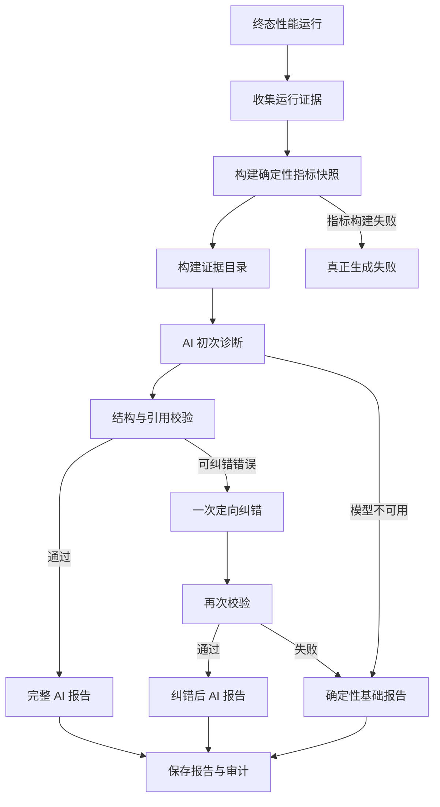

# 性能分析报告生成韧性修复设计

## 1. 背景

2026-07-30 16:40:41，性能运行 `perfrun-ae1e7113092811a9` 完成后自动创建分析会话 `perfanalysis-ae3a71a4856cb008`。

本次压测数据本身完整且通过目标：

- 请求总数：248；
- 失败数：0；
- 失败率：0%；
- 数据质量：`complete`；
- 确定性结论：`pass`。

2026-07-30 16:41:29，AI 返回的结构化诊断在 `finding.evidence_refs` 中引用了不存在的证据 ID：

```text
evidence_index:failure_analysis
```

后端在生成报告快照时执行引用完整性校验，并抛出：

```text
ValueError: 性能诊断引用了未知证据：evidence_index:failure_analysis
```

该异常最终将整个分析会话标记为 `failed`，报告中心显示“生成失败”。

问题不在 Locust 压测执行、统计数据质量或确定性指标计算，而在 AI 增强诊断输出未满足证据引用契约后，系统缺少纠错与降级能力。

本文档是对 `2026-07-23-performance-ai-analysis-design.md` 的韧性增强设计，不改变既有的证据可信度原则、人工审批边界和修复安全机制。

## 2. 问题定义

当前报告生成链路为：

```text
收集证据
  → 计算指标快照
  → 调用诊断 Agent
  → 校验结构化诊断引用
  → 生成报告快照
  → 保存完整报告
```

当前实现存在以下缺口：

1. Pydantic 结构校验只能验证字段类型，不能验证引用对象是否真实存在。
2. 证据引用语义校验发生在模型调用结束后，失败后没有定向纠错机制。
3. AI 增强步骤失败会导致已经具备完整确定性指标的报告整体失败。
4. `ValueError` 被转换成通用错误，前端无法区分数据失败、模型失败和引用失败。
5. 模型名称、提示词版本和脱敏后的无效输出只在成功路径保存，失败路径缺少审计信息。
6. 提示词同时要求模型分析 `failure_analysis` 字段并引用 `evidence_index`，模型可能把字段路径误认为证据 ID。
7. 当 `failure_analysis=[]` 时，不存在任何 `failure:*` 证据 ID，但模型没有收到足够明确的空集合约束。

## 3. 设计目标

1. 保留严格的证据引用完整性校验，禁止无证据结论进入正式报告。
2. 对模型结构错误和引用错误执行最多一次定向纠错。
3. 当确定性指标已经成功生成时，AI 异常不得导致整份报告不可用。
4. AI 失败后生成可信、只读、无根因臆测的确定性基础报告。
5. 明确区分完整 AI 报告、纠错后 AI 报告、确定性基础报告和真正生成失败。
6. 保存每次 AI 尝试的脱敏审计信息，支持问题定位和模型质量评估。
7. 将模型调用、校验、纠错和降级封装在单一深层模块中。
8. 不改变现有性能指标计算器的事实来源和判定权威。
9. 不增加无限重试，不因报告生成消耗不可控的模型成本和等待时间。

## 4. 非目标

1. 不放宽或删除未知证据、未知 finding 的引用校验。
2. 不静默删除模型返回的非法引用后继续展示原结论。
3. 不根据字符串相似度自动猜测非法引用对应的合法证据。
4. 不让模型重新计算请求数、失败率、分位响应时间或性能目标结果。
5. 不因 AI 失败自动生成配置修改、脚本修改或平台源码修改。
6. 不在审计记录中保存 API Key、Authorization Header 或未脱敏业务数据。
7. 不修改 Locust Runner、压测状态机和原始产物生成逻辑。
8. 本次不引入多模型投票、并行模型调用或无限制模型切换。

## 5. 核心设计原则

### 5.1 确定性事实优先

以下内容只能来自确定性计算器：

- 数据质量；
- 请求数、失败数和失败率；
- RPS；
- 平均响应时间和分位响应时间；
- 目标通过情况；
- 运行有效性；
- 阶段负载结果；
- 可否声明稳定容量；
- 已观察到的失败分类。

AI 只能解释事实、组织结论、提出有证据支撑的假设和建议。

### 5.2 严格校验，不静默修补

非法引用表示模型结论无法建立可信证据链。系统不得通过删除引用、替换为空数组或模糊匹配等方式让结果表面通过。

### 5.3 AI 增强失败不等于报告失败

当指标快照已经成功生成时，系统必须至少交付确定性基础报告。只有指标快照、运行证据或报告持久化本身失败时，才将报告标记为真正失败。

### 5.4 有界恢复

模型输出不符合契约时最多执行一次纠错。第二次仍失败后立即降级，不进入循环。

### 5.5 可观测但不泄密

记录尝试次数、模型、提示词版本、错误类型和非法引用；不保存密钥和未脱敏请求内容。

## 6. 方案对比与决策

### 6.1 方案 A：仅加强提示词

优点：

- 修改范围小；
- 不增加模型调用次数。

缺点：

- 不能保证模型永远遵守引用契约；
- 无法处理模型服务异常；
- 报告仍可能整体失败。

结论：不采用为完整方案，仅作为第一层预防措施。

### 6.2 方案 B：提示词加一次纠错重试

优点：

- 能恢复大部分结构和引用错误；
- 保持严格校验。

缺点：

- 第二次仍失败时报告不可用；
- 429、超时和模型配置错误无法恢复；
- 缺少确定性降级结果。

结论：不单独采用，作为推荐方案中的恢复层。

### 6.3 方案 C：契约校验、一次纠错、确定性降级与审计

优点：

- 保持报告可信度；
- AI 偶发错误不再拖垮基础报告；
- 对用户、运维和开发均提供明确状态；
- 可量化模型输出质量和纠错成功率。

缺点：

- 增加协调模块、状态字段和测试范围；
- 部分失败场景最多增加一次模型调用。

结论：采用方案 C。

## 7. 总体架构



职责边界：

- `analysis_service`：分析会话生命周期和持久化编排；
- `diagnosis_orchestrator`：模型调用、验证、纠错和降级决策；
- `diagnosis.service`：单次模型调用适配器；
- `metric_snapshot_service`：确定性指标与报告快照计算；
- `diagnosis_validation`：结构化诊断引用完整性校验；
- `fallback_report_service`：无 AI 根因推断的基础报告生成。

## 8. 深层诊断协调模块

新增：

```text
apps/backend/app/services/performance_testing/diagnosis_orchestrator.py
```

对外仅暴露：

```python
def generate_validated_diagnosis(
    evidence: dict[str, Any],
    metric_snapshot: dict[str, Any],
) -> DiagnosisGenerationResult:
    ...
```

返回模型：

```python
class DiagnosisGenerationResult(BaseModel):
    diagnosis: PerformanceDiagnosis | None
    model_name: str = ""
    generation_mode: Literal[
        "ai_primary",
        "ai_repaired",
        "deterministic_fallback",
    ]
    attempts: list[DiagnosisAttempt]
    warnings: list[GenerationWarning]
```

尝试记录：

```python
class DiagnosisAttempt(BaseModel):
    attempt: int
    attempt_type: Literal["primary", "semantic_repair"]
    status: Literal[
        "completed",
        "invalid_schema",
        "invalid_references",
        "provider_error",
    ]
    model_name: str = ""
    prompt_version: str
    error_code: str = ""
    invalid_evidence_refs: list[str] = []
    invalid_finding_refs: list[str] = []
    started_at: str
    finished_at: str
```

该模块内部可以包含多个私有函数，但调用方不需要了解模型重试或降级细节。

## 9. 证据目录契约

### 9.1 目录结构

从 `metric_snapshot.evidence_index` 生成面向模型的精简证据目录：

```json
{
  "allowed_evidence_ids": [
    "metric:request_count",
    "metric:failure_count",
    "metric:failure_rate",
    "metric:requests_per_second",
    "metric:average_response_time_ms",
    "metric:p50_response_time_ms",
    "metric:p95_response_time_ms",
    "metric:p99_response_time_ms",
    "objective:failure_rate",
    "objective:average_response_time_ms",
    "quality:summary",
    "validity:summary",
    "capacity:summary",
    "latency:summary",
    "stage:1"
  ],
  "empty_sections": [
    "failure_analysis"
  ]
}
```

### 9.2 模型约束

提示词必须明确：

1. `evidence_refs` 只能逐字复制 `allowed_evidence_ids` 中的值。
2. `failure_analysis`、`latency_analysis` 等是字段名称，不是证据 ID。
3. `empty_sections` 中的字段不可作为证据引用。
4. 禁止生成 `evidence_index:*`、`metric_snapshot:*` 或 JSONPath 风格引用。
5. 描述“没有失败请求”时引用 `metric:failure_count` 和 `metric:failure_rate`。
6. recommendation 的 `finding_refs` 只能引用当前响应中已有 finding 的 `id`。
7. 如果没有足够合法证据，减少 finding，而不是创造引用。

### 9.3 提示词版本

诊断提示词升级为：

```text
v3-evidence-contract
```

提示词版本必须在第一次模型调用前保存，失败路径也必须可查询。

## 10. 引用完整性校验

### 10.1 校验结果

将当前遇错即抛出的普通 `ValueError` 改为结构化校验结果：

```python
class DiagnosisValidationResult(BaseModel):
    valid: bool
    unknown_evidence_refs: list[str]
    unknown_finding_refs: list[str]
```

校验规则：

- `finding.evidence_refs - allowed_evidence_ids` 必须为空；
- `recommendation.finding_refs - diagnosis.finding_ids` 必须为空；
- 所有非法引用一次性收集并返回；
- 空引用列表允许存在，由业务规则决定该 finding 是否可接受；
- 校验器不修改输入诊断。

### 10.2 专用异常

协调模块需要异常流程时，使用专用异常：

```python
class DiagnosisReferenceError(ValueError):
    validation: DiagnosisValidationResult
```

禁止继续使用无法分类的普通 `ValueError` 作为领域错误。

### 10.3 校验位置

校验在每次模型响应完成后、报告快照生成前执行。

`build_report_snapshot()` 保留最后一道防御性校验，防止其他调用方绕过协调模块。

## 11. 定向纠错

### 11.1 触发条件

以下情况允许执行一次纠错：

- 结构化响应不满足 `PerformanceDiagnosis` Schema；
- finding 引用了未知 evidence ID；
- recommendation 引用了未知 finding ID。

以下情况不进行第二次模型调用：

- 429 频率限制；
- 网络超时；
- API Key 或模型配置错误；
- 模型服务 5xx；
- 用户取消或服务关闭；
- 指标快照生成失败。

### 11.2 纠错输入

纠错请求只包含：

- 上一次脱敏后的结构化诊断；
- 校验错误列表；
- 合法 evidence ID；
- 合法 finding ID；
- 必要的确定性指标摘要；
- 原提示词中的安全与事实约束。

不得再次发送全部原始 Locust 事件、环境认证信息或未脱敏业务请求。

### 11.3 纠错指令

```text
上一次 PerformanceDiagnosis 未通过引用完整性校验。

非法 evidence_refs：
- evidence_index:failure_analysis

允许引用的 evidence_id：
- metric:failure_count
- metric:failure_rate
- ...

要求：
1. 返回完整 PerformanceDiagnosis。
2. 只修正非法引用及受其影响的结论。
3. 不修改确定性指标和 verdict。
4. 不增加输入中不存在的证据。
5. 没有合法证据时删除对应 finding 或降低为 missing_evidence。
```

### 11.4 次数与超时

- 初次调用最多一次；
- 纠错调用最多一次；
- 不允许递归纠错；
- 纠错调用使用与初次调用相同的模型配置；
- 两次调用分别记录耗时和结果。

## 12. 确定性基础报告

### 12.1 触发条件

满足以下条件时生成基础报告：

1. `metric_snapshot` 已成功生成；
2. AI 初次调用不可用，或纠错后仍未通过校验；
3. 报告快照仍可由确定性指标完整构建。

### 12.2 可展示内容

基础报告允许展示：

- 运行完成情况；
- 数据质量和缺失证据；
- 请求数、失败数和失败率；
- RPS；
- 平均响应时间、P50、P95 和 P99；
- 性能目标结果；
- 阶段负载表现；
- 已观察稳定吞吐；
- 是否具备容量上限判断条件；
- 确定性失败分类；
- AI 增强不可用的原因。

### 12.3 禁止展示内容

基础报告不得生成：

- 未经证实的根因；
- CPU、数据库、应用代码或下游服务瓶颈判断；
- 配置、脚本或源码自动修改建议；
- 虚构的调用链、日志和部署状态；
- 不存在的 evidence ID；
- 可执行的自动修复提案。

### 12.4 基础结论模板

通过场景：

```text
本次压测正常完成，共执行 {request_count} 个请求，失败率为 {failure_rate}。
已配置的性能目标通过。当前运行仅能证明已测试负载范围内的表现；
若缺少多阶段负载或资源指标，不能据此判断系统容量上限或服务端瓶颈。
```

未通过场景：

```text
本次压测已完成，但存在未通过的性能目标。报告展示确定性指标和失败分类；
由于 AI 深度诊断不可用，当前不提供未经证实的根因和自动修复建议。
```

### 12.5 报告快照扩展

```json
{
  "generation_mode": "deterministic_fallback",
  "ai_analysis_available": false,
  "generation_warnings": [
    {
      "code": "AI_DIAGNOSIS_INVALID_REFERENCES",
      "message": "AI 深度诊断未通过证据引用校验，当前展示基础性能报告。"
    }
  ]
}
```

## 13. 状态设计

### 13.1 生成模式

新增 `generation_mode`：

| 值 | 含义 |
|---|---|
| `ai_primary` | 第一次 AI 诊断通过校验 |
| `ai_repaired` | 一次纠错后通过校验 |
| `deterministic_fallback` | AI 不可用，已生成基础报告 |

### 13.2 会话状态

| 场景 | `status` | `analysis_status` | `analysis_stage` | `repair_status` |
|---|---|---|---|---|
| 首次 AI 成功 | `waiting_approval` | `completed` | `report_ready` | 按提案计算 |
| 纠错后成功 | `waiting_approval` | `completed` | `report_ready` | 按提案计算 |
| 基础报告 | `waiting_approval` | `completed` | `report_ready` | `not_applicable` |
| 指标或持久化失败 | `failed` | `failed` | `failed` | `not_applicable` |

基础报告沿用 `waiting_approval` 是为了兼容现有详情查询和报告中心链路，但前端不展示审批按钮，只展示“关闭”和“重新分析”。

后续如果状态模型重构，可将报告完成状态和修复审批状态彻底拆开；本次不扩大范围。

### 13.3 真正失败边界

只有以下情况标记生成失败：

- 找不到性能运行；
- 无可分析证据；
- 指标快照计算失败；
- 数据库写入失败；
- 报告快照确定性构建失败；
- 进程级不可恢复错误。

模型 429、超时、结构错误和引用错误不再直接导致报告失败。

## 14. 数据模型

### 14.1 `performance_analysis_sessions` 扩展

新增字段：

| 字段 | 类型 | 默认值 | 说明 |
|---|---|---|---|
| `generation_mode` | TEXT | `''` | AI 首次、AI 纠错或确定性降级 |
| `analysis_attempts_json` | TEXT | `'[]'` | 脱敏后的模型尝试审计记录 |

继续复用：

- `model_name`：保存实际调用模型；
- `prompt_version`：保存首次诊断提示词版本；
- `metric_snapshot_json`：确定性事实快照；
- `report_snapshot_json`：最终可展示报告；
- `error_message`：只保存真正失败错误，不用于完成态警告。

### 14.2 序列化字段

分析详情 API 增加：

```json
{
  "generation_mode": "ai_repaired",
  "analysis_attempts": [],
  "generation_warnings": []
}
```

报告中心列表至少返回：

```json
{
  "generation_mode": "deterministic_fallback",
  "generation_status": "degraded"
}
```

### 14.3 兼容策略

历史记录 `generation_mode=''` 时：

- `analysis_status=completed` 推断为 `ai_primary`；
- `analysis_status=failed` 保持失败；
- 不回填历史尝试记录；
- 前端不得因缺少新字段报错。

## 15. 后端执行流程

`execute_analysis()` 调整为：

```python
evidence = collect_performance_evidence(project_id, run_id)
metric_snapshot = build_metric_snapshot(evidence)
persist_metric_snapshot(metric_snapshot)

generation = generate_validated_diagnosis(evidence, metric_snapshot)

if generation.diagnosis is not None:
    report_snapshot = build_report_snapshot(
        metric_snapshot,
        generation.diagnosis,
        generation_mode=generation.generation_mode,
        warnings=generation.warnings,
    )
else:
    report_snapshot = build_fallback_report_snapshot(
        metric_snapshot,
        generation_mode="deterministic_fallback",
        warnings=generation.warnings,
    )

persist_completed_analysis(
    report_snapshot=report_snapshot,
    generation_mode=generation.generation_mode,
    attempts=generation.attempts,
)
```

`analysis_service` 不捕获并吞掉领域错误细节；错误分类由协调模块完成，顶层只处理真正不可恢复异常。

## 16. 错误分类

| 错误码 | 是否纠错 | 是否降级 | 用户状态 |
|---|---:|---:|---|
| `AI_DIAGNOSIS_SCHEMA_INVALID` | 是 | 是 | 基础报告 |
| `AI_DIAGNOSIS_INVALID_REFERENCES` | 是 | 是 | 基础报告 |
| `AI_DIAGNOSIS_UNKNOWN_FINDING` | 是 | 是 | 基础报告 |
| `AI_PROVIDER_RATE_LIMITED` | 否 | 是 | 基础报告 |
| `AI_PROVIDER_TIMEOUT` | 否 | 是 | 基础报告 |
| `AI_PROVIDER_UNAVAILABLE` | 否 | 是 | 基础报告 |
| `AI_MODEL_CONFIGURATION_INVALID` | 否 | 是 | 基础报告 |
| `PERFORMANCE_METRIC_SNAPSHOT_FAILED` | 否 | 否 | 生成失败 |
| `PERFORMANCE_REPORT_PERSIST_FAILED` | 否 | 否 | 生成失败 |

用户可见消息不得仅展示异常类名。

示例：

```text
AI 深度诊断返回了无效证据引用，系统已生成基础性能报告。
```

## 17. 前端设计

### 17.1 报告中心

生成状态展示：

| `generation_mode` | 文案 | 颜色 |
|---|---|---|
| `ai_primary` | 生成成功 | 绿色 |
| `ai_repaired` | 生成成功 | 绿色 |
| `deterministic_fallback` | 基础报告 | 橙色 |
| 真正失败 | 生成失败 | 红色 |

“基础报告”悬浮提示：

```text
确定性性能指标已生成，AI 深度诊断暂不可用。
```

### 17.2 报告详情

基础报告顶部展示非阻断提示：

```text
当前为基础性能报告
压测指标和目标结论完整；AI 根因分析及修复建议未生成。
[重新分析]
```

基础报告隐藏：

- AI 根因卡片；
- AI 修改建议；
- 应用修改按钮；
- 自动重新压测入口。

仍然展示：

- 概览；
- 目标结果；
- 趋势图；
- 阶段分析；
- 数据质量；
- 缺失证据；
- Locust 原始报告入口。

### 17.3 无障碍与文案

- 不只依赖颜色区分成功、基础报告和失败；
- 状态标签必须包含明确文本；
- “基础报告”不能使用“失败”图标；
- 重试操作说明可能再次调用模型。

## 18. 日志与审计

### 18.1 日志事件

新增：

```text
performance_analysis_primary_started
performance_analysis_primary_completed
performance_analysis_primary_invalid
performance_analysis_repair_started
performance_analysis_repair_completed
performance_analysis_repair_invalid
performance_analysis_fallback_generated
performance_analysis_failed
```

### 18.2 日志字段

每条事件至少包含：

- `analysis_id`；
- `project_id`；
- `run_id`；
- `attempt`；
- `generation_mode`；
- `model_name`；
- `prompt_version`；
- `error_code`；
- `invalid_evidence_refs`；
- `invalid_finding_refs`；
- `duration_ms`。

### 18.3 指标

建议增加：

- AI 初次诊断成功率；
- 引用校验失败率；
- 纠错成功率；
- 确定性降级率；
- 各模型非法引用率；
- 平均分析耗时；
- 平均模型调用次数。

## 19. 安全与隐私

1. 证据目录只包含脱敏后的 evidence ID 和确定性值。
2. 纠错请求不得包含 API Key、Cookie、Authorization 或运行时密钥。
3. `analysis_attempts_json` 不保存完整原始提示词。
4. 模型无效输出只保存结构化、脱敏后的必要字段。
5. 日志不得打印模型供应商配置对象或数据库完整行。
6. 任何配置查询必须显式选择非敏感字段，禁止对凭据表使用 `SELECT *`。
7. 基础报告不得泄露被证据收集器标记为敏感的原始值。

## 20. 测试策略

### 20.1 单元测试

证据目录：

1. evidence ID 与指标快照一致。
2. `failure_analysis=[]` 时不生成 `failure:*` ID。
3. 空分析字段进入 `empty_sections`。

引用校验：

1. 合法 evidence 引用通过。
2. 未知 evidence 引用返回完整错误列表。
3. 未知 finding 引用返回完整错误列表。
4. 校验器不修改原诊断对象。

降级报告：

1. 通过场景生成正确基础结论。
2. 未通过场景只展示确定性失败信息。
3. 不生成根因和修复提案。
4. 保留目标结果、趋势和数据质量。

### 20.2 服务测试

1. 初次 AI 诊断合法，`generation_mode=ai_primary`。
2. 初次引用非法，纠错后合法，`generation_mode=ai_repaired`。
3. 两次引用均非法，生成 `deterministic_fallback`。
4. 初次结构错误，纠错成功。
5. recommendation 引用未知 finding，触发纠错。
6. 429 时不进行纠错调用，直接生成基础报告。
7. 超时时直接生成基础报告。
8. 模型配置错误时生成基础报告并记录可操作警告。
9. 指标快照失败时仍标记真正失败。
10. 尝试记录不包含密钥和认证头。

### 20.3 API 与仓储测试

1. 新字段正确保存和序列化。
2. 历史记录缺少新字段时兼容。
3. 基础报告返回 `analysis_status=completed`。
4. 基础报告 `repair_status=not_applicable`。
5. 失败记录仍保留原有错误语义。

### 20.4 前端契约测试

1. `ai_primary` 显示“生成成功”。
2. `ai_repaired` 显示“生成成功”。
3. `deterministic_fallback` 显示“基础报告”。
4. 基础报告不展示审批和应用按钮。
5. 基础报告可以重新分析。
6. 历史响应缺少 `generation_mode` 时不崩溃。

### 20.5 回归样本

使用 `perfanalysis-ae3a71a4856cb008` 的指标快照建立脱敏回归夹具：

- 合法 evidence ID 中不存在 `evidence_index:failure_analysis`；
- AI 首次返回该非法引用时触发纠错；
- 纠错失败时仍生成包含 248 请求、0 失败和 `pass` 结论的基础报告；
- 报告中心不再显示“生成失败”。

## 21. 实施拆分

### 第一阶段：领域错误与校验结果

1. 引入 `DiagnosisValidationResult`。
2. 引入 `DiagnosisReferenceError`。
3. 保留 `build_report_snapshot()` 的防御性校验。
4. 补充引用完整性测试。

### 第二阶段：协调模块与证据契约

1. 新增 `diagnosis_orchestrator`。
2. 构建精简证据目录。
3. 升级提示词到 `v3-evidence-contract`。
4. 保存首次尝试信息。

### 第三阶段：一次纠错

1. 实现定向纠错请求。
2. 限制最大调用次数为两次。
3. 保存纠错尝试和结果。
4. 增加纠错成功与失败测试。

### 第四阶段：确定性降级

1. 新增基础报告生成器。
2. 调整完成态与失败边界。
3. 增加 `generation_mode` 和警告。
4. 确保基础报告无修复提案。

### 第五阶段：前端与可观测性

1. 报告中心增加“基础报告”状态。
2. 报告详情增加降级提示。
3. 增加结构化日志和尝试审计。
4. 增加模型质量指标。

## 22. 发布策略

1. 数据库字段先以兼容方式增加，旧代码忽略新字段不受影响。
2. 后端先支持 `generation_mode` 和基础报告，前端对未知值按历史逻辑处理。
3. 前端随后增加“基础报告”展示。
4. 纠错功能通过配置开关逐步启用：

```text
PERFORMANCE_ANALYSIS_SEMANTIC_REPAIR_ENABLED=true
```

5. 初期监控纠错率、降级率、分析耗时和模型调用成本。
6. 如果纠错导致明显延迟或模型成本异常，可关闭纠错，但保留确定性降级。

## 23. 验收标准

1. 本次非法引用场景不再导致整份报告失败。
2. 非法 evidence 或 finding 引用不能进入正式报告。
3. 模型引用错误时最多执行一次定向纠错。
4. 纠错失败后生成确定性基础报告。
5. 模型 429、超时和服务异常时仍可查看基础报告。
6. 基础报告中的指标、目标和 verdict 与 `metric_snapshot` 完全一致。
7. 基础报告不包含未经证实的根因和自动修改建议。
8. 报告中心能区分生成成功、基础报告和真正生成失败。
9. 分析详情能查看脱敏后的尝试状态和可操作警告。
10. 历史分析记录保持兼容。
11. 日志和数据库中不出现 API Key、Authorization Header 或未脱敏凭据。
12. 新增后端、仓储和前端契约测试全部通过。

## 24. 最终决策

采用“严格契约校验 + 一次定向纠错 + 确定性基础报告 + 脱敏审计”的分层韧性方案。

系统中的职责保持明确：

- 确定性计算器负责事实；
- AI 负责解释和建议；
- 引用校验器负责可信度；
- 诊断协调模块负责恢复策略；
- 基础报告生成器负责最低可用性；
- 报告中心负责向用户准确表达生成质量。

该方案解决的不只是单次 `evidence_index:failure_analysis` 引用错误，而是建立一条能长期容纳模型不确定性、同时保持报告可信与可用的生产级生成链路。
