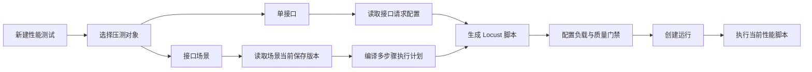

# 接口场景性能测试设计

**日期**：2026-08-03  
**状态**：待评审  
**范围**：在现有性能测试中支持选择接口场景并生成 Locust 多步骤脚本。

## 1. 背景

当前性能测试创建页只能选择单个接口。项目已有接口场景能力，场景由多个接口步骤组成，并支持请求覆盖、变量绑定、响应提取、断言、等待、条件和赋值。

现有性能测试已经具备以下能力：

- 性能测试定义和负载配置。
- Locust 脚本生成与校验。
- 当前脚本单记录保存。
- Headless Locust 运行。
- 运行目录中的脚本和报告文件。
- 实时统计、失败记录和性能分析报告。

本设计只补齐“接口场景到 Locust 多步骤执行”的缺口，不重新设计接口场景，也不引入独立的性能场景编排器。

## 2. 设计目标

1. 用户可以选择单接口或接口场景作为压测对象。
2. 用户选择接口场景时，系统直接读取该场景当前保存版本。
3. 不提供发布操作、版本选择、Hash 校验和脚本过期检测。
4. 场景步骤能够在一个虚拟用户内按顺序执行。
5. 每个虚拟用户拥有独立的变量、步骤输出和数据游标。
6. 场景执行可以复用现有接口场景的绑定、提取和断言语义。
7. 保留现有单接口性能测试行为和运行链路。

## 3. 非目标

本次不实现：

- 接口场景的发布工作流。
- 性能测试的场景版本选择。
- 场景版本 Hash 对比和过期检测。
- 性能脚本版本历史。
- 每虚拟用户一次性 setup、每轮 main、停止时 cleanup 的生命周期配置。
- 多场景权重、用户画像和分布式压测。
- 新的脚本编辑器或新的性能测试执行引擎。

接口场景后续发生修改时，已有性能脚本不会自动变化。用户需要新内容时，手动重新生成性能脚本即可。这是本次明确接受的简化行为。

## 4. 核心用户流程



### 4.1 选择单接口

保持当前流程不变：

- 选择项目。
- 选择环境。
- 选择接口。
- 预览请求配置。
- 配置负载、数据和质量门禁。
- 生成 Locust 脚本。

### 4.2 选择接口场景

用户选择项目后，可以切换到“接口场景”资产选择器。选择器复用现有接口场景列表和详情数据，不新增场景资产接口。

列表显示：

- 场景名称。
- 当前版本号，仅用于展示。
- 步骤数量。
- 默认环境。
- 场景说明。

未保存过任何版本的场景不可选择，并提示“请先保存场景”。这里的判断是是否存在当前可运行版本，不是发布状态判断。

选择场景后，后端读取该场景当前保存快照，执行兼容性校验，并返回：

- 当前版本号。
- 启用步骤数量。
- 请求步骤数量。
- 步骤摘要。
- 校验错误。
- 校验警告。

## 5. 领域模型

### 5.1 性能测试目标

现有 `performance_tests` 增加场景目标：

```text
target_type: endpoint | scenario
endpoint_id: nullable
scenario_id: nullable
```

约束：

```text
target_type=endpoint  -> endpoint_id 必填，scenario_id 为空
target_type=scenario  -> scenario_id 必填，endpoint_id 为空
```

性能测试定义不保存场景版本号、不保存场景 Hash，也不保存完整场景快照。

### 5.2 当前场景版本

接口场景当前可运行版本继续使用现有场景保存机制：

- 用户点击“保存版本”后生成当前可运行版本。
- 当前场景快照由后端保存。
- 性能测试生成脚本时读取当前快照。

数据库内部已有的 `published_snapshot_json` 和 `published_hash` 字段继续作为当前快照存储使用，但不再对用户表达“发布”概念，也不新增发布 API。

### 5.3 性能脚本计划

单接口和接口场景共用 Locust 脚本生成链路。

单接口计划保留当前单请求结构；场景计划增加多步骤结构：

```json
{
  "test_id": "perftest-xxx",
  "target_type": "scenario",
  "scenario_id": "apiscn-xxx",
  "scenario_name": "登录后查询订单",
  "steps": [
    {
      "id": "step-login",
      "name": "登录",
      "step_type": "api_request",
      "request": {},
      "bindings": [],
      "extractors": [],
      "assertions": [],
      "on_failure": "stop"
    }
  ],
  "load": {},
  "data": {},
  "success_rules": []
}
```

不引入新的脚本版本表。当前性能脚本继续按现有单记录方式覆盖保存。

## 6. 场景编译

增加一个场景编译模块，负责将当前场景快照转换为 Locust 执行计划：

```text
当前接口场景快照
        +
当前运行环境
        +
性能测试配置
        ↓
Locust 多步骤执行计划
```

编译模块负责：

- 按步骤顺序编译启用步骤。
- 解析接口快照中的方法、路径和请求结构。
- 应用请求覆盖配置。
- 编译变量绑定。
- 编译响应提取器。
- 编译响应断言。
- 编译等待步骤。
- 编译条件步骤和赋值步骤。
- 注入环境变量和受保护 Header。
- 生成稳定的 Locust 请求名称。

编译模块不得调用模型，不得猜测接口、字段、变量或断言。无法确定的内容必须返回明确校验错误。

## 7. Locust 执行语义

一个虚拟用户每次任务执行完整接口场景：

```text
创建本轮执行上下文
→ 执行第一个步骤
→ 提取步骤输出
→ 绑定到后续步骤
→ 执行后续步骤
→ 汇总本轮场景结果
→ 按用户等待时间进入下一轮
```

每个虚拟用户必须独立维护：

- 场景变量。
- 步骤输出。
- 数据行游标。
- 请求序号。
- 本轮执行状态。

不能在虚拟用户之间共享 Token、业务 ID、提取结果或数据游标。

### 7.1 请求步骤

请求步骤执行：

1. 解析 Path、Query、Header 和 Body。
2. 应用当前虚拟用户上下文中的变量。
3. 注入环境运行时 Header。
4. 发送 HTTP 或受约束的 SSE 请求。
5. 执行响应提取。
6. 执行断言。
7. 将输出写入当前虚拟用户上下文。

### 7.2 等待步骤

接口场景中的 `wait` 步骤只影响当前场景事务，不产生 HTTP 请求指标。

性能测试自身的 `wait_time_min_seconds` 和 `wait_time_max_seconds` 只发生在完整场景执行结束后，不套用到每个步骤之间。

### 7.3 失败策略

- `stop`：停止当前场景迭代并标记失败。
- `continue`：继续执行后续步骤，但本轮场景仍标记失败。
- `always_run`：前序失败后仍执行该步骤。

## 8. 场景兼容性校验

生成脚本前必须进行服务端校验。

阻止生成的情况：

- 场景没有当前保存版本。
- 场景没有启用的请求步骤。
- 请求步骤引用的接口不存在。
- 必填参数缺少可确定来源。
- 环境变量或 Secret 缺失。
- 绑定引用不存在的步骤输出。
- 断言类型不受支持。
- SSE 请求没有最大流式时长。
- 条件或赋值配置格式非法。
- 存在无法确定的请求参数。

错误应包含场景步骤 ID 和字段路径，便于前端定位问题。

## 9. 指标与报告

接口场景需要同时记录场景级和步骤级指标。

### 9.1 场景级指标

- 场景迭代次数。
- 场景成功次数。
- 场景失败次数。
- 场景失败率。
- 场景平均耗时。
- 场景 P50、P95、P99。
- 场景吞吐量，即 iterations/s。

场景级指标用于质量门禁。

### 9.2 步骤级指标

- 每个接口请求数。
- 每个接口失败率。
- 每个接口平均响应时间。
- 每个接口 P50、P95、P99。
- 每个接口失败原因。

步骤级指标用于瓶颈定位。

请求名称采用稳定前缀：

```text
SCENARIO 登录后查询订单
01 POST /login
02 POST /orders
03 GET /orders/{id}
```

场景吞吐量和 HTTP 请求吞吐量必须分开，不能把多个步骤的请求数当成业务场景次数。

## 10. 质量门禁

单接口目标继续使用现有接口聚合指标。

接口场景默认使用场景事务指标：

- 最大场景失败率。
- 最大场景平均耗时。
- 最大场景 P95。
- 最低场景吞吐量。
- 最少场景迭代次数。

步骤级目标作为后续可选能力，不影响第一版场景压测主流程。

## 11. 现有模块改造范围

### 后端

- `apps/backend/app/seed/schema.py`
  - 扩展 `performance_tests.target_type`。
  - 增加 `scenario_id` 外键。
- `apps/backend/app/schemas/performance_test.py`
  - 允许 `target_type=scenario`。
  - 允许 `scenario_id`。
  - 保持 endpoint/scenario 互斥校验。
- `apps/backend/app/repositories/performance_test_repo.py`
  - 保存和序列化 `scenario_id`。
  - 列表查询场景名称和当前版本信息。
- `apps/backend/app/services/performance_testing/service.py`
  - 读取接口场景当前保存快照。
  - 统一构造接口目标和场景目标。
  - 执行场景生成前校验。
- `apps/backend/app/agents/performance_testing/script_generation/schemas.py`
  - 支持多步骤 Locust Plan。
- `apps/backend/app/services/performance_testing/script_renderer.py`
  - 保留单接口渲染。
  - 增加场景步骤循环渲染。
- `apps/backend/tests/`
  - 增加场景目标创建、脚本生成、绑定提取、失败策略和场景指标测试。

### 前端

- `apps/frontend/src/components/ai-testing/performance-testing/performance-test-form.tsx`
  - 增加单接口/接口场景目标切换。
  - 复用接口场景列表和详情查询。
  - 展示当前版本和步骤摘要。
  - 不增加版本选择器。
- `apps/frontend/src/lib/api-client.ts`
  - 扩展性能测试目标类型和场景字段。
  - 复用现有接口场景数据类型。
- `apps/frontend/src/components/ai-testing/performance-testing/locust-statistics-table.tsx`
  - 支持场景级和步骤级统计展示。
- `apps/frontend/src/components/ai-testing/performance-testing/performance-run-detail.tsx`
  - 显示场景事务指标和步骤明细。

## 12. 实施顺序

1. 扩展性能测试目标模型，支持 `scenario_id`。
2. 增加当前场景快照读取和服务端兼容性校验。
3. 增加多步骤 Locust Plan 和 renderer。
4. 接入性能测试创建页的接口场景选择。
5. 增加场景事务统计和质量门禁。
6. 运行后端、前端和 Locust 相关回归测试。

## 13. 验收标准

- 性能测试可以选择单接口或接口场景。
- 接口场景只使用当前保存版本。
- 页面不出现发布按钮和版本选择器。
- 场景修改后不会自动修改已经生成的脚本。
- 用户手动重新生成脚本后，脚本使用当时的当前版本。
- 一个虚拟用户执行完整场景，而不是只执行单个接口。
- 场景变量和步骤输出在虚拟用户之间隔离。
- 场景等待、绑定、提取、断言和失败策略生效。
- 报告同时展示场景事务指标和接口步骤指标。
- 单接口性能测试现有流程和结果不受影响。

