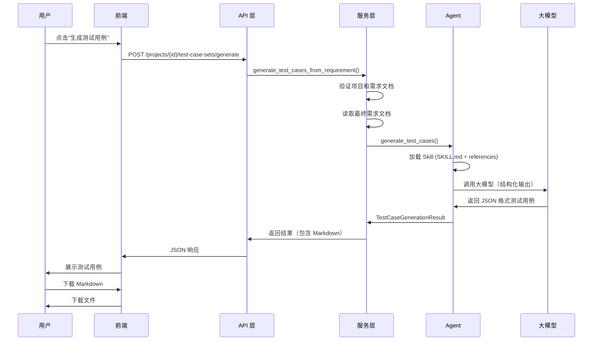

# 测试用例生成功能 - 完整设计方案

## 📋 功能概述

本功能实现了从最终需求文档自动生成完整测试用例集的能力，包括前后端完整实现。

## 🏗️ 架构设计

### 后端架构

```
apps/backend/app/agents/test_case_generation/
├── __init__.py                 # 模块导出
├── agent.py                    # Agent 定义（使用 LangChain）
├── middleware.py               # Skill 中间件（动态加载 SKILL.md）
├── schemas.py                  # 数据结构（Pydantic Models）
├── service.py                  # 服务层（业务逻辑）
├── README.md                   # 文档
└── skills/
    └── test-case-generation/
        ├── SKILL.md            # Agent Skill 定义（生成策略）
        └── references/
            └── examples.md     # 测试用例示例参考
```

**参考的需求分析结构**：
- 使用相同的 Middleware 模式加载 Skill
- 使用结构化输出（ToolStrategy）
- 服务层分离业务逻辑
- Schemas 定义清晰的输入输出

### 前端架构

```
apps/frontend/src/
├── components/ai-testing/
│   ├── test-case-generation-form.tsx       # 生成表单组件
│   └── test-case-generation-result.tsx     # 结果展示组件
└── app/(main)/projects/[projectId]/requirements/[requirementId]/
    └── generate-test-cases/page.tsx        # 生成页面
```

## 🔧 核心功能实现

### 1. 后端数据结构 (schemas.py)

定义了完整的输入输出结构：

**输入**：`TestCaseGenerationInput`
- requirement_name: 需求名称
- requirement_content: 最终需求内容
- generation_scope: 生成范围（可选）
- include_company_knowledge: 是否包含公司知识库

**输出**：`TestCaseGenerationResult`
- summary: 测试用例集概述
- total_count: 测试用例总数
- modules: 按模块组织的测试用例列表
  - TestCaseModule
    - module_name: 模块名称
    - test_cases: 测试用例列表
      - TestCase (id, module, title, priority, type, precondition, steps, expected_result, test_data, notes)

**特色功能**：
- 自动生成 Markdown 格式（to_markdown 方法）
- 支持 6 种测试类型：功能、异常、边界、性能、安全、兼容
- 4 级优先级：P0-P3

### 2. Agent 实现 (agent.py)

```python
def test_case_generation_agent(model, load_references=True, base_prompt=None):
    skill_middleware = SkillMiddleware(
        skill_path=Path(__file__).parent / "skills" / "test-case-generation",
        load_references=load_references,
    )
    
    return create_agent(
        model=model,
        tools=[],
        system_prompt=base_prompt or "你是测试用例生成专家。",
        middleware=[skill_middleware],
        response_format=ToolStrategy(TestCaseGenerationResult),
    )
```

**核心特性**：
- 使用 Middleware 动态加载 Skill
- 结构化输出确保返回格式正确
- 无需额外工具，纯文本生成

### 3. Skill 定义 (SKILL.md)

包含完整的测试用例生成方法论：

**工作流程**：
1. 完整阅读需求文档
2. 识别测试模块
3. 为每个模块生成测试用例
4. 编写测试用例
5. 优先级判断

**系统化方法**：
- **六维扫描法**：触发条件、边界约束、异常恢复、状态时序、权限隔离、数据生命周期
- **场景组合法**：等价类划分、因果图法、状态迁移法、场景串联法

**质量标准**：
- 覆盖度检查（每个功能模块都有测试用例）
- 可执行性检查（步骤清晰具体）
- 优先级检查（P0 覆盖所有核心流程）
- 结构检查（按模块清晰分组）

### 4. 服务层 (service.py)

```python
async def generate_test_cases(input_data: TestCaseGenerationInput) -> TestCaseGenerationResult:
    # 1. 验证输入
    # 2. 构建输入内容
    # 3. 调用 Agent
    # 4. 提取并验证结构化输出
    # 5. 返回结果
```

**扩展的服务层方法**：
```python
async def generate_test_cases_from_requirement(
    project_id: str,
    payload: TestCaseGenerationRequest,
    actor
) -> dict:
    # 1. 验证项目和需求文档
    # 2. 检查是否有最终需求
    # 3. 读取最终需求文档
    # 4. 调用 Agent 生成
    # 5. 返回结果（包含 Markdown）
```

### 5. API 接口

**新增接口**：
```
POST /api/v1/projects/{project_id}/test-case-sets/generate
```

**请求体**：
```json
{
  "requirement_doc_id": "req-abc123",
  "generation_scope": "只生成登录模块和订单模块的测试用例",
  "include_company_knowledge": false
}
```

**响应**：
```json
{
  "summary": "本测试用例集覆盖了用户管理系统的核心功能...",
  "total_count": 25,
  "modules": [
    {
      "module_name": "登录模块",
      "test_cases": [...]
    }
  ],
  "markdown": "# 测试用例集\n\n..."
}
```

### 6. 前端组件

#### TestCaseGenerationForm 组件

**功能**：
- 需求文档选择（通过 props 传入）
- 生成范围输入（可选）
- 公司知识库选项
- 异步生成调用
- 错误处理和提示

**使用示例**：
```tsx
<TestCaseGenerationForm
  projectId="proj-123"
  requirementDocId="req-456"
  requirementDocTitle="用户管理系统"
  onSuccess={(result) => {
    console.log(`生成了 ${result.total_count} 个测试用例`);
  }}
/>
```

#### TestCaseGenerationResult 组件

**功能**：
- 按模块展示测试用例
- 可折叠的模块和测试用例
- 优先级和类型标签
- 完整的测试用例信息展示
- Markdown 导出功能

**特色**：
- 使用 Collapsible 组件实现折叠
- 优先级颜色标识（P0-红色、P1-默认、P2-次要、P3-轮廓）
- 支持下载为 Markdown 文件

## 🔄 完整流程



## 📊 数据流

```
最终需求文档 (Markdown)
    ↓
TestCaseGenerationInput
    ↓
Agent (加载 SKILL.md)
    ↓
LLM 生成
    ↓
TestCaseGenerationResult (结构化)
    ↓
API 响应 (JSON + Markdown)
    ↓
前端展示 (React Components)
```

## 🎯 关键特性

### 1. 参考需求分析的架构模式

✅ **相同的目录结构**
- agent.py, service.py, schemas.py, middleware.py
- skills/ 目录存放 SKILL.md

✅ **相同的技术栈**
- LangChain create_agent
- Skill Middleware 模式
- ToolStrategy 结构化输出
- Pydantic Models

✅ **相同的代码风格**
- 异步函数 (async/await)
- 类型注解
- 文档字符串

### 2. 完整的前后端联调

✅ **后端**
- API 路由已更新
- Schemas 已扩展
- Service 层已实现
- Agent 已注册到 capabilities

✅ **前端**
- 表单组件已创建
- 结果展示组件已创建
- 示例页面已创建
- API 调用已实现

### 3. 系统化的测试用例生成

✅ **覆盖 6 种测试类型**
- 功能测试、异常测试、边界测试
- 性能测试、安全测试、兼容测试

✅ **4 级优先级**
- P0（核心功能）、P1（重要功能）
- P2（一般功能）、P3（优化建议）

✅ **结构化输出**
- 按模块组织
- ID 自动编号（tc-001, tc-002...）
- 包含完整信息（步骤、预期、数据、备注）

## 📝 使用文档

### 后端使用

```python
# 直接调用服务层
from app.agents.test_case_generation import generate_test_cases
from app.agents.test_case_generation.schemas import TestCaseGenerationInput

input_data = TestCaseGenerationInput(
    requirement_name="用户管理系统",
    requirement_content=final_requirement_content,
    generation_scope="",
    include_company_knowledge=False,
)

result = await generate_test_cases(input_data)
print(result.to_markdown())
```

### 前端使用

```tsx
// 在需求详情页添加"生成测试用例"按钮
import { TestCaseGenerationForm } from "@/components/ai-testing/test-case-generation-form";

<TestCaseGenerationForm
  projectId={projectId}
  requirementDocId={requirementDocId}
  requirementDocTitle={requirementDocTitle}
  onSuccess={(result) => {
    // 处理生成结果
    setTestCases(result);
  }}
/>
```

### API 调用

```bash
curl -X POST \
  http://localhost:8000/api/v1/projects/proj-123/test-case-sets/generate \
  -H "Content-Type: application/json" \
  -d '{
    "requirement_doc_id": "req-456",
    "generation_scope": "",
    "include_company_knowledge": false
  }'
```

## ✅ 验证清单

### 代码完整性
- [x] 后端 Agent 模块创建完成
- [x] Schemas 定义完成
- [x] Service 层实现完成
- [x] Middleware 实现完成
- [x] SKILL.md 编写完成
- [x] API 路由更新完成
- [x] 前端组件创建完成
- [x] Python 语法验证通过

### 功能完整性
- [x] 支持从最终需求生成测试用例
- [x] 支持 6 种测试类型
- [x] 支持 4 级优先级
- [x] 支持按模块组织
- [x] 支持生成范围指定
- [x] 支持 Markdown 导出
- [x] 前后端数据结构对齐

### 架构一致性
- [x] 目录结构与需求分析一致
- [x] 使用 Middleware 模式
- [x] 使用结构化输出
- [x] 代码风格一致
- [x] 异步调用模式

## 🚀 部署说明

### 1. 后端部署

```bash
# 无需额外依赖，已使用现有的 LangChain 和 Pydantic

# 重启后端服务
cd apps/backend
python -m uvicorn app.main:app --reload
```

### 2. 前端部署

```bash
# 无需额外依赖，使用现有的 UI 组件库

# 重启前端服务
cd apps/frontend
npm run dev
```

### 3. 配置模型

在系统设置中为 `test_case_generation` 能力分配模型：
- 推荐使用 Claude Opus 或 GPT-4 以获得最佳质量
- 也支持 Claude Sonnet 以平衡速度和质量

## 📈 扩展方向

### 短期优化
1. 增加更多测试用例示例到 references/
2. 支持自定义测试用例模板
3. 添加测试用例验证和评分

### 中期扩展
1. 支持导出为 Excel、TestRail 格式
2. 支持测试用例的在线编辑
3. 集成测试执行记录
4. 测试覆盖率分析

### 长期规划
1. 与 CI/CD 集成
2. 自动化测试执行
3. 测试结果可视化
4. 基于历史数据优化生成策略

## 📚 相关文档

- [需求分析 Agent](../requirement_analysis/README.md)
- [Agent 开发指南](../README.md)
- [API 文档](../../api/v1/test_cases.py)

## 🤝 贡献

本功能参考了需求分析的成熟架构，保持了代码风格和模式的一致性。如有改进建议，请提交 Issue 或 PR。
